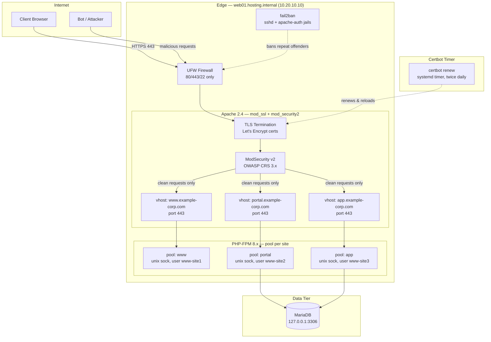
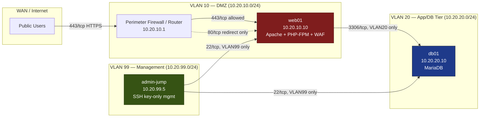

# Project 02 — Secure Web Hosting Platform

## Overview

A regional web hosting provider needs to host three customer-facing sites (a marketing site, a customer portal, and a PHP-based application) on a single Debian/Ubuntu VM while meeting baseline PCI-DSS/CIS web-tier expectations: TLS everywhere, a Web Application Firewall in front of every vhost, brute-force lockout on auth endpoints, and hardened HTTP response headers. This project builds that stack end-to-end — Apache name-based virtual hosts, Let's Encrypt-issued certificates with auto-renewal, PHP-FPM running each site as an isolated pool, ModSecurity with the OWASP Core Rule Set (CRS) as the WAF layer, and fail2ban watching both SSH and Apache auth logs.

It integrates and extends [Readme](../Apache-Web-Server/Readme.md), [Multiple-Web-Sites-with-SSL](../Apache-Web-Server/Multiple-Web-Sites-with-SSL.md), and [PHP-and-Mysql-Installation-and-Configuration](../Apache-Web-Server/PHP-and-Mysql-Installation-and-Configuration.md) into one production-shaped build rather than treating each as an isolated lab.

> [!NOTE]
> **Goal**
> Stand up a single Apache host serving three TLS-terminated, WAF-protected virtual hosts with PHP-FPM process isolation per site, automated certificate renewal, and fail2ban-enforced rate limiting — hardened to a CIS Apache Benchmark posture.

## Architecture



## Network Diagram



## Prerequisites

| Host / Role | Hostname | IP / VLAN | OS | Resources | Notes |
|---|---|---|---|---|---|
| Web/WAF edge | web01 | 10.20.10.10 (VLAN 10 – DMZ) | Debian 12 / Ubuntu 22.04 LTS | 2 vCPU, 4 GB RAM, 40 GB SSD | Apache 2.4, PHP-FPM 8.x, ModSecurity v2, fail2ban |
| Database | db01 | 10.20.20.10 (VLAN 20 – App/DB) | Debian 12 | 2 vCPU, 4 GB RAM, 60 GB SSD | MariaDB 10.11, bound to VLAN20 only |
| Management jump host | admin-jump | 10.20.99.5 (VLAN 99 – Mgmt) | Debian 12 | 1 vCPU, 2 GB RAM | SSH key-only source for VLAN10/20 admin access |
| DNS records | — | public A/AAAA | — | — | `www`, `portal`, `app`.example-corp.com → web01 public IP |
| Domain registrar/DNS access | — | — | — | — | Required for Let's Encrypt HTTP-01 challenge validation |
| Perimeter firewall | fw01 | 10.20.10.1 | — | — | NATs 80/443 to web01; blocks all other inbound |

## Configuration

### 1. Base OS hardening (UFW + SSH baseline)

```bash
# UFW: default-deny inbound, allow only what's needed
sudo ufw default deny incoming
sudo ufw default allow outgoing
sudo ufw allow from 10.20.99.0/24 to any port 22 proto tcp comment 'mgmt VLAN SSH only'
sudo ufw allow 80/tcp comment 'HTTP - redirect to HTTPS'
sudo ufw allow 443/tcp comment 'HTTPS'
sudo ufw enable
```

### 2. Apache — name-based TLS vhosts

`/etc/apache2/sites-available/portal.example-corp.com.conf`

```apache
<VirtualHost *:80>
    ServerName portal.example-corp.com
    Redirect permanent / https://portal.example-corp.com/
</VirtualHost>

<VirtualHost *:443>
    ServerName portal.example-corp.com
    DocumentRoot /var/www/portal/public

    SSLEngine on
    SSLCertificateFile      /etc/letsencrypt/live/portal.example-corp.com/fullchain.pem
    SSLCertificateKeyFile   /etc/letsencrypt/live/portal.example-corp.com/privkey.pem
    SSLProtocol             -all +TLSv1.2 +TLSv1.3
    SSLCipherSuite          ECDHE-ECDSA-AES128-GCM-SHA256:ECDHE-RSA-AES128-GCM-SHA256:ECDHE-ECDSA-AES256-GCM-SHA384
    SSLHonorCipherOrder     off

    <FilesMatch \.php$>
        SetHandler "proxy:unix:/run/php/php-fpm-portal.sock|fcgi://localhost"
    </FilesMatch>

    <Directory /var/www/portal/public>
        Options -Indexes -MultiViews
        AllowOverride None
        Require all granted
    </Directory>

    ErrorLog  ${APACHE_LOG_DIR}/portal_error.log
    CustomLog ${APACHE_LOG_DIR}/portal_access.log combined
</VirtualHost>
```

### 3. Hardened response headers (shared across all vhosts)

`/etc/apache2/conf-available/security-headers.conf`

```apache
Header always set X-Content-Type-Options "nosniff"
Header always set X-Frame-Options "SAMEORIGIN"
Header always set Referrer-Policy "strict-origin-when-cross-origin"
Header always set Strict-Transport-Security "max-age=63072000; includeSubDomains; preload"
Header always set Content-Security-Policy "default-src 'self'; object-src 'none'; frame-ancestors 'self'"
Header always set Permissions-Policy "geolocation=(), microphone=(), camera=()"
ServerTokens Prod
ServerSignature Off
```

### 4. PHP-FPM — one isolated pool per site

`/etc/php/8.2/fpm/pool.d/portal.conf`

```ini
[portal]
user  = www-site2
group = www-site2
listen = /run/php/php-fpm-portal.sock
listen.owner = www-data
listen.group = www-data
listen.mode  = 0660

pm = dynamic
pm.max_children = 10
pm.start_servers = 2
pm.min_spare_servers = 2
pm.max_spare_servers = 4

php_admin_value[open_basedir] = /var/www/portal:/tmp
php_admin_value[disable_functions] = exec,passthru,shell_exec,system,proc_open,popen
php_admin_flag[expose_php] = off
```

### 5. ModSecurity + OWASP CRS

`/etc/modsecurity/modsecurity.conf` (key directives)

```apache
SecRuleEngine On
SecRequestBodyAccess On
SecRequestBodyLimit 13107200
SecResponseBodyAccess Off
SecAuditEngine RelevantOnly
SecAuditLogParts ABIJDEFHZ
SecAuditLog /var/log/apache2/modsec_audit.log
```

`/etc/modsecurity/crs/crs-setup.conf` excerpt

```apache
SecAction \
  "id:900110,\
  phase:1,\
  pass,\
  t:none,\
  setvar:tx.inbound_anomaly_score_threshold=5,\
  setvar:tx.outbound_anomaly_score_threshold=4"

SecAction "id:900000,phase:1,pass,t:none,setvar:tx.paranoia_level=1"
```

### 6. fail2ban — SSH + Apache auth jails

`/etc/fail2ban/jail.local`

```ini
[DEFAULT]
bantime  = 1h
findtime = 10m
maxretry = 5
banaction = ufw

[sshd]
enabled = true
port    = 22

[apache-auth]
enabled  = true
port     = http,https
logpath  = /var/log/apache2/*error.log
maxretry = 6

[apache-modsecurity]
enabled  = true
port     = http,https
filter   = apache-modsecurity
logpath  = /var/log/apache2/modsec_audit.log
maxretry = 3
bantime  = 24h
```

### 7. Certbot renewal timer (verify, don't reinvent)

```bash
systemctl list-timers | grep certbot
# certbot.timer is installed by the package; confirm the deploy hook reloads Apache
cat /etc/letsencrypt/renewal-hooks/deploy/reload-apache.sh
```

```bash
#!/bin/bash
systemctl reload apache2
```

## Security Controls

| Control | CIS / NIST Reference | Applied in this build |
|---|---|---|
| TLS-only transport, weak protocols disabled | CIS Apache HTTP Server Benchmark §1.7; NIST SP 800-52 Rev.2 | `SSLProtocol -all +TLSv1.2 +TLSv1.3`, HSTS with preload on every vhost |
| Server info/version disclosure suppressed | CIS Apache Benchmark §1.5 | `ServerTokens Prod`, `ServerSignature Off`, `expose_php = off` |
| Directory listing / dangerous methods disabled | CIS Apache Benchmark §2.x | `Options -Indexes -MultiViews`, `AllowOverride None` per vhost |
| Web Application Firewall with managed ruleset | NIST SP 800-53 SC-7, CIS Control 13 | ModSecurity v2 + OWASP CRS, paranoia level 1, anomaly scoring blocking mode |
| Least-privilege process isolation per application | CIS Control 4; PCI-DSS 6.4 | Dedicated PHP-FPM pool + system user per site, `open_basedir`, `disable_functions` |
| Network segmentation between web and DB tiers | CIS Control 12; NIST SP 800-53 SC-7 | VLAN10 (DMZ) → VLAN20 (DB) restricted to 3306/tcp only, no direct WAN route to db01 |
| Brute-force / credential-stuffing mitigation | CIS Control 4.4; PCI-DSS 8.1.6 | fail2ban `sshd`, `apache-auth`, `apache-modsecurity` jails, UFW ban action |
| Default-deny host firewall | CIS Control 4.5 | UFW default-deny inbound, mgmt SSH restricted to VLAN99 source |
| Automated, unattended certificate renewal | PCI-DSS 4.1; CIS Control 3 | `certbot.timer` twice-daily renewal with Apache reload deploy hook |
| Security-relevant response headers | OWASP Secure Headers Project; NIST SP 800-53 SC-8 | CSP, X-Frame-Options, X-Content-Type-Options, Referrer-Policy on all vhosts |

## Deployment Steps

1. Provision `web01` and `db01` per the [Prerequisites](#prerequisites) table; join both to the correct VLANs and confirm the perimeter firewall NATs only 80/443 to `web01`.
2. Harden the base OS: apply the UFW ruleset in [Configuration](#configuration) step 1, disable password SSH auth, and confirm `admin-jump` is the only permitted SSH source.
3. Install the stack: `apt install apache2 libapache2-mod-security2 libapache2-mod-fcgid php8.2-fpm mariadb-server certbot python3-certbot-apache fail2ban`.
4. Enable required Apache modules: `a2enmod ssl headers rewrite proxy_fcgi setenvif security2`.
5. Create per-site system users and PHP-FPM pools (`www-site1`, `www-site2`, `www-site3`) using the pool template in [Configuration](#configuration) step 4; reload PHP-FPM.
6. Create the three vhost files under `/etc/apache2/sites-available/`, matching the `portal.example-corp.com.conf` pattern for `www` and `app`; enable each with `a2ensite`.
7. Enable the shared security-headers config: `a2enconf security-headers` and reload Apache.
8. Issue Let's Encrypt certificates for all three FQDNs: `certbot --apache -d www.example-corp.com -d portal.example-corp.com -d app.example-corp.com` and verify the deploy hook exists.
9. Deploy the OWASP CRS: clone/extract into `/etc/modsecurity/crs/`, symlink `crs-setup.conf`, include it plus `rules/*.conf` from `security2.conf`, then set `SecRuleEngine On`.
10. Configure and enable fail2ban jails from [Configuration](#configuration) step 6; `systemctl enable --now fail2ban`.
11. Restrict MariaDB on `db01` to listen on `10.20.20.10` only, create least-privilege application DB users per site, and confirm VLAN10→VLAN20:3306 is the only path.
12. Run `apache2ctl configtest`, then `systemctl restart apache2 php8.2-fpm mariadb`.
13. Run the full [Validation](#validation) checklist before handing the platform to customers.

> [!NOTE]
> **📸 Screenshot**
> _Capture: browser padlock/certificate details for `portal.example-corp.com` showing the valid Let's Encrypt chain, alongside the response headers panel in DevTools showing HSTS/CSP present._

## Validation

1. Confirm all three vhosts serve valid TLS and redirect HTTP → HTTPS.

```text
$ curl -sI http://portal.example-corp.com | head -1
HTTP/1.1 301 Moved Permanently

$ curl -sI https://portal.example-corp.com | grep -E 'HTTP|Strict-Transport|Content-Security'
HTTP/2 200
strict-transport-security: max-age=63072000; includeSubDomains; preload
content-security-policy: default-src 'self'; object-src 'none'; frame-ancestors 'self'
```

2. Confirm ModSecurity blocks an obvious SQLi probe.

```text
$ curl -s -o /dev/null -w "%{http_code}\n" "https://portal.example-corp.com/?id=1' OR '1'='1"
403
```

3. Confirm PHP-FPM pool isolation — each site's worker runs as its own user.

```text
$ ps -eo user,cmd | grep php-fpm | grep pool
www-site1  php-fpm: pool www
www-site2  php-fpm: pool portal
www-site3  php-fpm: pool app
```

4. Confirm fail2ban is actively monitoring and can ban.

```text
$ sudo fail2ban-client status
Status
|- Number of jail: 3
`- Jail list: sshd, apache-auth, apache-modsecurity

$ sudo fail2ban-client status apache-auth
Status for the jail: apache-auth
|- Currently failed: 0
`- Total banned:      0
```

5. Confirm certbot renewal is scheduled and dry-run succeeds.

```text
$ sudo certbot renew --dry-run
Congratulations, all simulated renewals succeeded
```

6. Confirm `db01` is unreachable from outside VLAN10/VLAN20.

```text
$ nmap -p 3306 <db01-ip> --source-port 53 (from an external host)
3306/tcp filtered mysql
```

## Future Improvements

- Move ModSecurity to `SecRuleEngine DetectionOnly` behind a staging vhost before promoting new CRS versions to blocking mode.
- Add a caching/reverse-proxy layer (e.g., Varnish or Apache `mod_cache`) in front of the marketing site to absorb traffic spikes.
- Centralize `modsec_audit.log` and Apache access logs into a SIEM (e.g., Wazuh/ELK) for correlated alerting instead of per-host fail2ban only.
- Replace per-VM MariaDB with a managed/replicated cluster (Galera) for the DB tier to remove the single point of failure.
- Automate the whole build with Ansible (vhost, pool, and jail templates) so onboarding a fourth customer site is a single playbook run.
- Add HTTP/2 server push tuning and OCSP stapling (`SSLUseStapling on`) to shave TLS handshake latency.

## References

- Apache HTTP Server Documentation — `mod_ssl`, `mod_security2`, `mod_proxy_fcgi`
- CIS Apache HTTP Server 2.4 Benchmark
- OWASP ModSecurity Core Rule Set (CRS) documentation
- Let's Encrypt / Certbot documentation — `certbot --apache` plugin
- fail2ban official documentation — jail and filter configuration
- OWASP Secure Headers Project
- NIST SP 800-52 Rev. 2 — Guidelines for TLS Implementations
- NIST SP 800-53 Rev. 5 — SC-7 (Boundary Protection), SC-8 (Transmission Confidentiality)

## Related Notes

- [Readme](../Apache-Web-Server/Readme.md) — Apache module index this build extends
- [Multiple-Web-Sites-with-SSL](../Apache-Web-Server/Multiple-Web-Sites-with-SSL.md) — name-based TLS vhost pattern used for all three sites
- [PHP-and-Mysql-Installation-and-Configuration](../Apache-Web-Server/PHP-and-Mysql-Installation-and-Configuration.md) — PHP/MariaDB base setup referenced for PHP-FPM pools
- [Binding with Type (SSL/TLS)](../Apache-Web-Server/Binding-with-Type(SSL-TLS).md) — TLS binding fundamentals applied here
- [Linux Administration & Server Hardening](../Readme.md) — course hub and map of content
