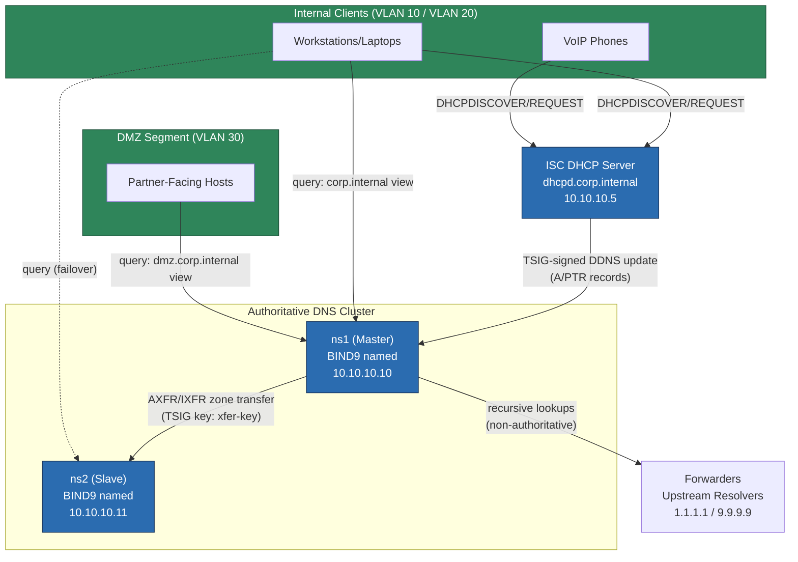
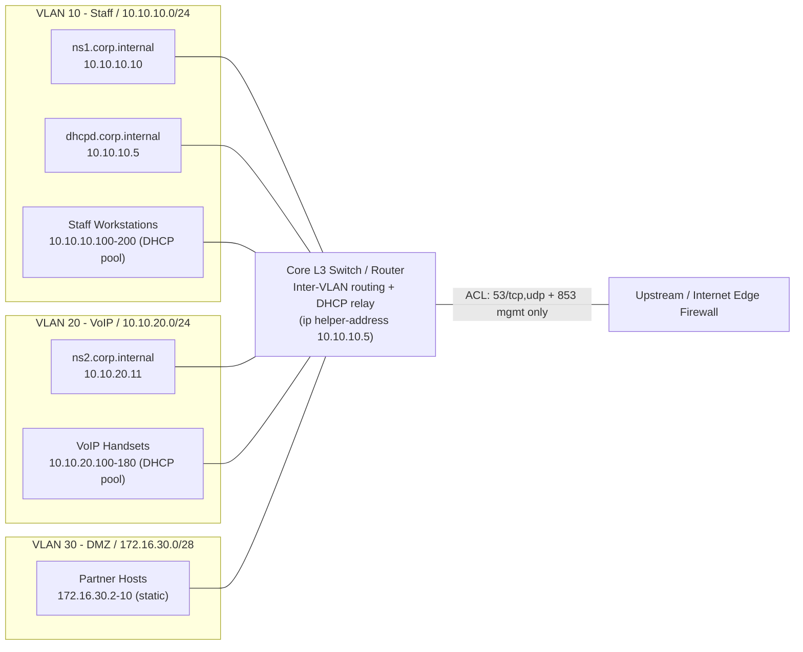

# Project 03 — DNS & DHCP Infrastructure

## Overview

A mid-size enterprise (3 sites, ~800 hosts) needs authoritative, redundant internal DNS that resolves differently for internal clients versus a DMZ-facing partner network (split-horizon), plus DHCP that automatically registers leased hostnames into DNS via **dynamic updates (DDNS)** so helpdesk never has to hand-edit zone files again. Goal: eliminate the single-point-of-failure caching-only nameserver currently running on a departmental Ubuntu box, and replace it with a hardened **primary/secondary BIND9** pair fed by **ISC DHCP** leases, secured with TSIG keys end-to-end.

This build integrates [Domain Name System (DNS)](../Domain-Name-System-DNS/Readme.md) and [Dynamic Host Configuration Protocol (DHCP)](../Dynamic-Host-Configuration-Protocol-DHCP/Readme.md) module content into one production-shaped deployment.

> [!NOTE]
> **Scope**
> Two BIND9 authoritative nameservers (master/slave, zone transfer over TSIG), one ISC DHCP server issuing leases to two VLANs and pushing DDNS updates into the internal view, and split-horizon views separating `corp.internal` (staff) from `dmz.corp.internal` (partner-facing, restricted).

## Architecture



## Network Diagram



## Prerequisites

| Host | Role | OS / Package | IP Address | vCPU / RAM | Notes |
|---|---|---|---|---|---|
| ns1.corp.internal | BIND9 Master (authoritative) | Debian 12, `bind9` 9.18 | 10.10.10.10 | 2 vCPU / 2 GB | Holds writable zone files, receives DDNS |
| ns2.corp.internal | BIND9 Slave (authoritative) | Debian 12, `bind9` 9.18 | 10.10.20.11 | 2 vCPU / 2 GB | Read-only via AXFR/IXFR, secondary VLAN for resilience |
| dhcpd.corp.internal | ISC DHCP Server | Debian 12, `isc-dhcp-server` 4.4 | 10.10.10.5 | 1 vCPU / 1 GB | Two subnets, DDNS updates to ns1 |
| core-sw01 | L3 core switch/router | Vendor-agnostic (Cisco IOS-style ACL/relay shown) | 10.10.10.1 / 10.10.20.1 / 172.16.30.1 | — | `ip helper-address` DHCP relay per VLAN |
| Zone: corp.internal | Internal view zone | — | — | — | Served only to VLAN 10/20 clients |
| Zone: dmz.corp.internal | DMZ view zone | — | — | — | Served only to VLAN 30 partner hosts |

## Configuration

### 1. BIND9 Master (`ns1`) — global options and TSIG keys

`/etc/bind/named.conf.options`
```conf
options {
    directory "/var/cache/bind";
    recursion yes;
    allow-recursion { internal-nets; };
    listen-on { 10.10.10.10; };
    listen-on-v6 { none; };
    dnssec-validation auto;
    forwarders { 1.1.1.1; 9.9.9.9; };
    version "not disclosed";
    allow-transfer { none; };          // default deny; overridden per-zone
    rate-limit { responses-per-second 15; };
};

acl internal-nets { 10.10.10.0/24; 10.10.20.0/24; };
acl dmz-nets      { 172.16.30.0/28; };
```

`/etc/bind/named.conf.local` — TSIG keys shared with DHCP and slave
```conf
key "dhcp-ddns-key" {
    algorithm hmac-sha256;
    secret "5xJ2mQvT8pL1nR9wZ6oK4bH7cE3sYaF0uD8gV2iN9qM=";
};

key "xfer-key" {
    algorithm hmac-sha256;
    secret "9pQ3nL7vR2mK5wT8oJ4bH1cE6sYaF0uD3gV9iN2qM7xZ=";
};

controls {
    inet 127.0.0.1 allow { 127.0.0.1; } keys { rndc-key; };
};
```

### 2. Split-horizon views

`/etc/bind/named.conf.local` (continued) — internal vs DMZ views
```conf
view "internal" {
    match-clients { internal-nets; };
    recursion yes;

    zone "corp.internal" {
        type master;
        file "/var/lib/bind/db.corp.internal";
        allow-update { key "dhcp-ddns-key"; };
        allow-transfer { key "xfer-key"; 10.10.20.11; };
        also-notify { 10.10.20.11 key "xfer-key"; };
    };

    zone "10.10.10.in-addr.arpa" {
        type master;
        file "/var/lib/bind/db.10.10.10";
        allow-update { key "dhcp-ddns-key"; };
        allow-transfer { key "xfer-key"; };
    };
};

view "dmz" {
    match-clients { dmz-nets; };
    recursion no;                       // DMZ never recurses through us

    zone "dmz.corp.internal" {
        type master;
        file "/var/lib/bind/db.dmz.corp.internal";
        allow-update { none; };         // static, no DDNS in DMZ
        allow-transfer { key "xfer-key"; };
    };
};
```

### 3. Forward zone file with dynamic-update journal

`/var/lib/bind/db.corp.internal`
```conf
$TTL 3600
@   IN  SOA ns1.corp.internal. hostmaster.corp.internal. (
                2026072201 ; serial (yyyymmddnn)
                3600       ; refresh
                900        ; retry
                604800     ; expire
                3600 )     ; negative cache TTL

    IN  NS  ns1.corp.internal.
    IN  NS  ns2.corp.internal.

ns1     IN  A   10.10.10.10
ns2     IN  A   10.10.20.11
dhcpd   IN  A   10.10.10.5
; DDNS-registered client A/PTR records land below this line via nsupdate
```

### 4. BIND9 Slave (`ns2`) — minimal zone stanza

`/etc/bind/named.conf.local`
```conf
zone "corp.internal" {
    type slave;
    masters { 10.10.10.10 key "xfer-key"; };
    file "/var/cache/bind/db.corp.internal.slave";
};

zone "10.10.10.in-addr.arpa" {
    type slave;
    masters { 10.10.10.10 key "xfer-key"; };
    file "/var/cache/bind/db.10.10.10.slave";
};
```

### 5. ISC DHCP Server — dual-subnet with DDNS

`/etc/dhcp/dhcpd.conf`
```conf
authoritative;
ddns-update-style interim;
ddns-updates on;
update-static-leases on;
ignore client-updates;

key "dhcp-ddns-key" {
    algorithm hmac-sha256;
    secret "5xJ2mQvT8pL1nR9wZ6oK4bH7cE3sYaF0uD8gV2iN9qM=";
}

zone corp.internal. {
    primary 10.10.10.10;
    key "dhcp-ddns-key";
}
zone 10.10.10.in-addr.arpa. {
    primary 10.10.10.10;
    key "dhcp-ddns-key";
}

subnet 10.10.10.0 netmask 255.255.255.0 {
    range 10.10.10.100 10.10.10.200;
    option routers 10.10.10.1;
    option domain-name-servers 10.10.10.10, 10.10.20.11;
    option domain-name "corp.internal";
    ddns-domainname "corp.internal.";
    default-lease-time 43200;
    max-lease-time 86400;
}

subnet 10.10.20.0 netmask 255.255.255.0 {
    range 10.10.20.100 10.10.20.180;
    option routers 10.10.20.1;
    option domain-name-servers 10.10.10.10, 10.10.20.11;
    option domain-name "corp.internal";
    ddns-domainname "corp.internal.";
    default-lease-time 43200;
    max-lease-time 86400;
    class "voip-phones" {
        match if substring(option vendor-class-identifier,0,4) = "Poly";
    }
}
```

`/etc/default/isc-dhcp-server` — bind DHCP only to trusted interfaces
```bash
INTERFACESv4="eth1"
INTERFACESv6=""
```

## Security Controls

| Control | CIS / NIST Reference | How Applied in This Build |
|---|---|---|
| Restrict zone transfers | CIS BIND9 Benchmark §3.2 | `allow-transfer` limited to `xfer-key` + slave IP only; global default `allow-transfer { none; }` |
| Authenticate dynamic updates | NIST SP 800-81 §4.3 | All DDNS from DHCP signed with `dhcp-ddns-key` (HMAC-SHA256 TSIG); no unauthenticated `allow-update` |
| Split-horizon isolation | CIS Network Segmentation | Separate `view` blocks so DMZ clients never see internal `corp.internal` records |
| Disable open recursion | CIS BIND9 Benchmark §2.1 | `recursion no` in `dmz` view; `allow-recursion { internal-nets; }` in `internal` view |
| Hide version string | CIS BIND9 Benchmark §2.4 | `version "not disclosed";` prevents `dig ns1.corp.internal version.bind chaos txt` fingerprinting |
| Rate-limit responses (anti-amplification) | NIST SP 800-81 §5.2 | `rate-limit { responses-per-second 15; }` mitigates DNS reflection/amplification abuse |
| Restrict `rndc` control channel | CIS BIND9 Benchmark §3.4 | `controls` bound to `127.0.0.1` only, keyed with `rndc-key` |
| Least-privilege DHCP interface binding | CIS Level 1 — Network Services | `INTERFACESv4="eth1"` prevents `dhcpd` from listening on management/WAN NICs |
| Lease/registration audit trail | NIST SP 800-53 AU-2 | `named` query/update logging + `dhcpd.leases` retained for forensic correlation |
| DNSSEC validation on recursive path | CIS BIND9 Benchmark §2.6 | `dnssec-validation auto;` validates upstream forwarder responses |

## Deployment Steps

1. Provision `ns1`, `ns2`, and `dhcpd` hosts per the Prerequisites table; assign static IPs on their respective VLANs.
2. On `ns1` and `ns2`: `apt install bind9 bind9utils bind9-doc dnsutils`.
3. Generate the shared TSIG keys once and copy identical `key` stanzas to `ns1`, `ns2`, and `dhcpd`:
   ```bash
   tsig-keygen -a hmac-sha256 dhcp-ddns-key
   tsig-keygen -a hmac-sha256 xfer-key
   ```
4. Deploy `named.conf.options` and `named.conf.local` (views, keys, zones) to `ns1` as shown in Configuration §1–3.
5. Create `/var/lib/bind/db.corp.internal`, `db.10.10.10`, and `db.dmz.corp.internal`; set ownership `chown bind:bind /var/lib/bind/*` so the daemon can write DDNS journal files.
6. `named-checkconf` and `named-checkzone corp.internal /var/lib/bind/db.corp.internal` on `ns1`; fix any syntax errors before proceeding.
7. `systemctl enable --now bind9` on `ns1`.
8. Deploy the slave stanza (Configuration §4) to `ns2`, then `systemctl enable --now bind9`; confirm it pulls a zone transfer (see Validation §2).
9. On `dhcpd`: `apt install isc-dhcp-server`, deploy `dhcpd.conf` and `/etc/default/isc-dhcp-server` (Configuration §5).
10. Configure `ip helper-address 10.10.10.5` on the core switch for VLAN 10 and VLAN 20 SVIs so broadcast DHCPDISCOVER reaches the server across subnets.
11. `dhcpd -t -cf /etc/dhcp/dhcpd.conf` to test-parse the config, then `systemctl enable --now isc-dhcp-server`.
12. Open firewall/ACLs: UDP+TCP 53 between clients and both nameservers; UDP 67/68 (or relay unicast 67) between switch and `dhcpd`; TCP 953/`rndc` restricted to localhost only.
13. Release/renew a test client lease and confirm the resulting hostname resolves via DDNS (Validation §4).

> [!NOTE]
> **📸 Screenshot**
> _Capture: `dig @10.10.10.10 corp.internal AXFR -y hmac-sha256:xfer-key:<secret>` output showing a successful zone transfer alongside `journalctl -u bind9` confirming a DDNS update was accepted._

## Validation

1. Confirm BIND9 is authoritative and answering on the master:
   ```text
   $ dig @10.10.10.10 corp.internal SOA +short
   ns1.corp.internal. hostmaster.corp.internal. 2026072201 3600 900 604800 3600
   ```
2. Confirm the slave replicated the zone (serial numbers match):
   ```text
   $ dig @10.10.20.11 corp.internal SOA +short
   ns1.corp.internal. hostmaster.corp.internal. 2026072201 3600 900 604800 3600
   ```
3. Confirm split-horizon: DMZ view does not leak internal records:
   ```text
   $ dig @10.10.10.10 -b 172.16.30.2 ns1.corp.internal A +short
   ;; connection refused / NXDOMAIN (dmz view has no corp.internal zone)
   ```
4. Renew a DHCP lease and confirm the hostname was dynamically registered:
   ```text
   $ dig @10.10.10.10 ws-laptop42.corp.internal A +short
   10.10.10.143
   $ dig @10.10.10.10 -x 10.10.10.143 +short
   ws-laptop42.corp.internal.
   ```
5. Confirm zone-transfer ACL rejects an unauthorized host:
   ```text
   $ dig @10.10.10.10 corp.internal AXFR
   ; Transfer failed. (REFUSED)
   ```
6. Confirm rDNS delegation matches the DHCP-assigned range:
   ```text
   $ dig @10.10.10.10 -x 10.10.10.100 +short
   ws-lobby-kiosk.corp.internal.
   ```

## Future Improvements

- Add a **tertiary hidden master** or move to `catalog zones` (BIND9 9.11+) so zone provisioning across `ns1`/`ns2` no longer requires manual per-zone stanza edits.
- Enable **DNSSEC signing** on `corp.internal` (`dnssec-policy`) so internal resolvers can validate authoritative answers, not just recursive forwarder responses.
- Integrate **DHCP failover peer** (`failover peer` clause) between a second `dhcpd` instance for HA, matching the DNS master/slave redundancy already in place.
- Ship `named` and `dhcpd` logs to a central SIEM and alert on `rate-limit` drops or repeated `REFUSED` transfer attempts as an early indicator of reconnaissance.
- Migrate static TSIG secrets to a secrets manager (e.g., HashiCorp Vault) with periodic automated rotation instead of hand-copied keys.

## References

- ISC BIND 9 Administrator Reference Manual — https://bind9.readthedocs.io/
- ISC DHCP 4.4 Administrator's Guide — https://source.isc.org/docs/
- RFC 2136 — Dynamic Updates in the Domain Name System (DNS UPDATE)
- RFC 3007 — Secure Domain Name System Dynamic Update
- CIS BIND9 Benchmark (relevant §2, §3 controls referenced above)
- NIST SP 800-81-2 — Secure Domain Name System (DNS) Deployment Guide

## Related Notes

- [Domain Name System (DNS)](../Domain-Name-System-DNS/Readme.md)
- [Master-Nameserver](../Domain-Name-System-DNS/Master-Nameserver.md)
- [Slave-DNS-Server](../Domain-Name-System-DNS/Slave-DNS-Server.md)
- [Forwarders-Nameserver](../Domain-Name-System-DNS/Forwarders-Nameserver.md)
- [Dynamic Host Configuration Protocol (DHCP)](../Dynamic-Host-Configuration-Protocol-DHCP/Readme.md)
- [DHCP-Server](../Dynamic-Host-Configuration-Protocol-DHCP/DHCP-Server.md)
- [Reserve-IP-Address](../Dynamic-Host-Configuration-Protocol-DHCP/Reserve-IP-Address.md)
- [Linux Administration & Server Hardening](../Readme.md) — course hub and map of content
