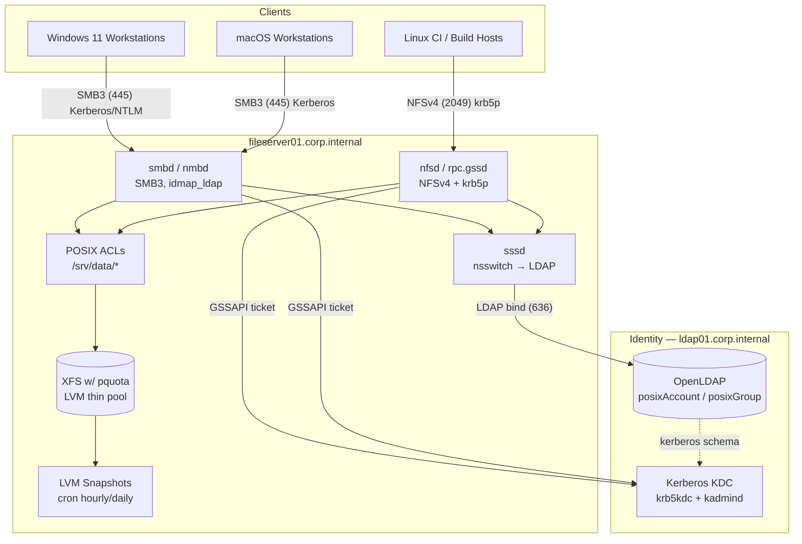
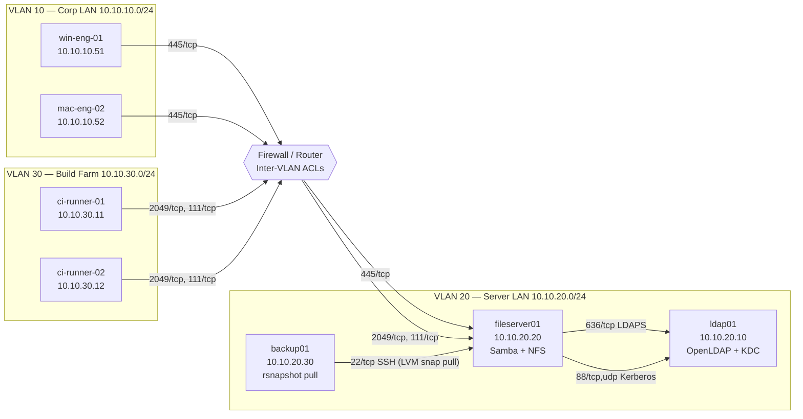

# Project 04 — Secure File Server

## Overview

A regional engineering office needs a **single, centrally-authenticated file server** that serves two very different client populations from one pool of storage: Windows/macOS workstations (via SMB) and Linux build/CI hosts (via NFSv4). Both protocols must authenticate against the same directory instead of maintaining separate local UNIX and Windows accounts, per-department storage must be capped with quotas, and accidental deletions must be recoverable without pulling from off-site backup.

This build integrates [LDAP Server](../LDAP-Server/Readme.md) as the single identity source, [Samba SMB/CIFS Server](../Samba-SMB-CIFS-Server/Readme.md) for Windows/macOS shares, and [NFS Server](../NFS-Server/Readme.md) for Linux exports — with Kerberos protecting NFSv4 in transit, POSIX ACLs enforcing department-level access on both protocols, XFS project quotas capping usage, and LVM snapshots providing self-service recovery.

> [!NOTE]
> **Design goal**
> One identity, one ACL model, two protocols. A user's group membership in LDAP is the *only* thing that determines what they can touch on the wire, whether they mount over `cifs` or `nfs4`.

## Architecture



## Network Diagram



## Prerequisites

| Host | Role | IP / VLAN | OS / Resources |
|---|---|---|---|
| `ldap01.corp.internal` | OpenLDAP directory + Kerberos KDC (`krb5kdc`, `kadmind`) | 10.10.20.10 / VLAN 20 | Rocky Linux 9, 2 vCPU, 4 GB RAM, 20 GB disk |
| `fileserver01.corp.internal` | Samba + NFSv4 file server | 10.10.20.20 / VLAN 20 | Rocky Linux 9, 4 vCPU, 8 GB RAM, LVM thin pool 2 TB (`vg_data/lv_data`, XFS) |
| `backup01.corp.internal` | Off-box LVM snapshot / rsnapshot pull target | 10.10.20.30 / VLAN 20 | Rocky Linux 9, 2 vCPU, 4 GB RAM, 4 TB disk |
| `win-eng-*` | Windows 11 engineering workstations | 10.10.10.0/24 / VLAN 10 | Domain-joined-equivalent via `net ads` / krb5 SSO |
| `mac-eng-*` | macOS engineering workstations | 10.10.10.0/24 / VLAN 10 | Kerberos SSO via `krb5.conf` |
| `ci-runner-*` | Linux build/CI hosts, NFSv4 clients | 10.10.30.0/24 / VLAN 30 | Rocky Linux 9, `nfs-utils`, `sssd` |
| DNS | Forward/reverse zones for `corp.internal` | — | Required for Kerberos SPN resolution |
| NTP | Chrony synced across all hosts (±5 min for Kerberos) | — | Required, Kerberos fails hard on clock skew |

## Configuration

### 1. LDAP — base identity (on `ldap01`)

```ldif
# /root/base-ou.ldif
dn: ou=People,dc=corp,dc=internal
objectClass: organizationalUnit
ou: People

dn: ou=Groups,dc=corp,dc=internal
objectClass: organizationalUnit
ou: Groups

dn: cn=engineering,ou=Groups,dc=corp,dc=internal
objectClass: posixGroup
cn: engineering
gidNumber: 5000
memberUid: jsmith
memberUid: agupta

dn: uid=jsmith,ou=People,dc=corp,dc=internal
objectClass: inetOrgPerson
objectClass: posixAccount
objectClass: shadowAccount
uid: jsmith
cn: John Smith
sn: Smith
uidNumber: 10001
gidNumber: 5000
homeDirectory: /home/jsmith
loginShell: /bin/bash
userPassword: {SASL}jsmith@CORP.INTERNAL
```

### 2. Kerberos KDC (on `ldap01`)

```ini
# /etc/krb5.conf
[libdefaults]
    default_realm = CORP.INTERNAL
    dns_lookup_realm = false
    dns_lookup_kdc = false
    ticket_lifetime = 24h
    renew_lifetime = 7d
    forwardable = true

[realms]
    CORP.INTERNAL = {
        kdc = ldap01.corp.internal
        admin_server = ldap01.corp.internal
    }

[domain_realm]
    .corp.internal = CORP.INTERNAL
```

```bash
# Create service principals for NFS and Samba
kadmin.local -q "addprinc -randkey nfs/fileserver01.corp.internal"
kadmin.local -q "addprinc -randkey cifs/fileserver01.corp.internal"
kadmin.local -q "ktadd -k /etc/krb5.keytab nfs/fileserver01.corp.internal"
kadmin.local -q "ktadd -k /etc/krb5.keytab cifs/fileserver01.corp.internal"
scp /etc/krb5.keytab root@fileserver01:/etc/krb5.keytab
```

### 3. SSSD — LDAP + Kerberos glue (on `fileserver01`)

```ini
# /etc/sssd/sssd.conf
[sssd]
services = nss, pam
domains = corp.internal

[domain/corp.internal]
id_provider = ldap
auth_provider = krb5
ldap_uri = ldaps://ldap01.corp.internal
ldap_search_base = dc=corp,dc=internal
ldap_id_use_start_tls = true
ldap_tls_cacert = /etc/pki/tls/certs/ldap-ca.crt
krb5_realm = CORP.INTERNAL
krb5_server = ldap01.corp.internal
cache_credentials = true
enumerate = false
```

### 4. NFS server — export with Kerberos privacy (on `fileserver01`)

```conf
# /etc/exports
/srv/data/engineering  10.10.30.0/24(rw,sync,sec=krb5p,root_squash,no_subtree_check)
```

```ini
# /etc/nfs.conf (relevant excerpt)
[nfsd]
vers3=n
vers4=y
vers4.0=y
vers4.1=y
vers4.2=y
```

### 5. Samba — LDAP-backed SMB share (on `fileserver01`)

```ini
# /etc/samba/smb.conf
[global]
    workgroup = CORP
    security = ADS
    realm = CORP.INTERNAL
    idmap config * : backend = tdb
    idmap config * : range = 3000-7999
    idmap config CORP : backend = ldap
    idmap config CORP : ldap_url = ldaps://ldap01.corp.internal
    idmap config CORP : ldap_base_dn = ou=People,dc=corp,dc=internal
    idmap config CORP : range = 10000-999999
    vfs objects = acl_xattr
    map acl inherit = yes
    store dos attributes = yes

[engineering]
    path = /srv/data/engineering
    valid users = @engineering
    read only = no
    inherit acls = yes
    inherit permissions = yes
```

### 6. XFS project quotas (on `fileserver01`)

```bash
# /etc/projects and /etc/projid
echo "100:/srv/data/engineering" >> /etc/projects
echo "engineering:100" >> /etc/projid

xfs_quota -x -c 'project -s engineering' /srv/data
xfs_quota -x -c 'limit -p bhard=500g engineering' /srv/data
```

### 7. LVM snapshot rotation (on `fileserver01`, via cron)

```bash
# /usr/local/sbin/snap-rotate.sh
#!/usr/bin/env bash
set -euo pipefail
LV=vg_data/lv_data
TS=$(date +%Y%m%d-%H%M)
lvcreate -L 20G -s -n "snap_${TS}" "/dev/${LV}"
# retain last 24 hourly + 7 daily snapshots
lvs --noheadings -o lv_name vg_data | grep '^snap_' | sort | head -n -24 \
    | xargs -r -I{} lvremove -f "vg_data/{}"
```

```conf
# crontab -e (root)
0 * * * *  /usr/local/sbin/snap-rotate.sh >> /var/log/snap-rotate.log 2>&1
```

## Security Controls

| Control | CIS / NIST Reference | Applied In This Build |
|---|---|---|
| Centralized identity, no local passwd/shadow accounts for shared storage | CIS Distribution Independent Linux v2.0 §5.4 | `sssd` sourced entirely from LDAP; `nss_ldap` disabled, `sssd` enforced in `nsswitch.conf` |
| Kerberos mutual authentication for NFS in transit | NIST SP 800-53 SC-8, SC-13 | `sec=krb5p` on all exports — full GSSAPI encryption, not just integrity (`krb5i`) |
| SMB signing + encryption enforced | CIS Microsoft/Samba Benchmark §2.3.10 | `server signing = mandatory`, `smb encrypt = required` in `smb.conf` |
| LDAP transport encrypted | CIS §5.4.2 | `ldaps://` + StartTLS only; plaintext `ldap://` 389 blocked at firewall |
| Least privilege on shares (group-scoped ACLs) | CIS §6.1, NIST AC-3 | POSIX ACLs + `valid users = @engineering`; no `guest ok`, no `everyone` grants |
| Root privilege containment on NFS | CIS §5.x (NFS hardening) | `root_squash` on every export; no `no_root_squash` anywhere |
| Storage exhaustion / DoS prevention | NIST SP 800-53 SC-5 | XFS project quotas per department (`xfs_quota`, hard cap 500 GB) |
| Recoverability / accidental-deletion resilience | NIST SP 800-53 CP-9 | Hourly LVM snapshots, 24×hourly + 7×daily retention, pulled off-box nightly by `backup01` |
| Clock sync for Kerberos ticket validity | CIS §2.1.1 (chrony) | `chronyd` synced on all three hosts, alerts if skew > 300s |
| Service account key protection | NIST SP 800-53 IA-5 | `krb5.keytab` mode `0600`, owned `root:root`, distributed over SSH only |
| Audit of file access | CIS §4.1 (auditd) | `auditctl -w /srv/data -p wa -k fileserver_writes` on `fileserver01` |

## Deployment Steps

1. **Provision hosts** — build `ldap01`, `fileserver01`, `backup01` on their VLANs per the Prerequisites table; confirm DNS forward/reverse records and `chronyd` sync (`chronyc tracking`) before proceeding.
2. **Stand up OpenLDAP** on `ldap01` following [LDAP Server](../LDAP-Server/Readme.md); import `base-ou.ldif`, enable `ldaps` (636) and StartTLS.
3. **Stand up the Kerberos KDC** on `ldap01` (co-located): `kdb5_util create -s`, then create `nfs/` and `cifs/` service principals and export the shared keytab as shown in Configuration §2.
4. **Copy `/etc/krb5.keytab` and `/etc/krb5.conf`** to `fileserver01`; verify with `klist -k /etc/krb5.keytab`.
5. **Install and configure SSSD** on `fileserver01` (Configuration §3); run `authselect select sssd with-mkhomedir --force` and confirm `getent passwd jsmith` resolves via LDAP.
6. **Create the storage volume** — `vgcreate vg_data /dev/sdb`, `lvcreate --type thin-pool -L 1.8T -n pool vg_data`, `lvcreate -T vg_data/pool -V 1.5T -n lv_data`, `mkfs.xfs -pquota /dev/vg_data/lv_data`, mount at `/srv/data` with `pquota` in `/etc/fstab`.
7. **Apply project quotas** (Configuration §6) and create `/srv/data/engineering` owned `root:engineering` mode `2770`.
8. **Set POSIX ACLs**: `setfacl -R -m g:engineering:rwx,d:g:engineering:rwx /srv/data/engineering`.
9. **Deploy NFS** per [NFS Server](../NFS-Server/Readme.md); write `/etc/exports` with `sec=krb5p` (Configuration §4), then `exportfs -rav` and enable `nfs-server`, `rpc-gssd`.
10. **Deploy Samba** per [Samba SMB/CIFS Server](../Samba-SMB-CIFS-Server/Readme.md); join the Kerberos realm via `net ads join -U administrator`, apply `smb.conf` (Configuration §5), `systemctl enable --now smb nmb winbind`.
11. **Install the snapshot cron job** (Configuration §7) on `fileserver01`; verify first run creates `snap_YYYYMMDD-HHMM`.
12. **Configure `backup01`** to pull nightly via `rsnapshot` over SSH key auth against the latest LVM snapshot mount, never against the live volume.
13. **Enable auditd watch** on `/srv/data` and confirm events land in `/var/log/audit/audit.log`.
14. **Test cross-protocol access**: mount the SMB share from a Windows client and the NFSv4 export from a CI runner as the same LDAP user; confirm identical file ownership and ACL enforcement on both.

> [!NOTE]
> **📸 Screenshot**
> _Capture: `klist` output on a Linux CI runner showing a valid `nfs/fileserver01.corp.internal@CORP.INTERNAL` service ticket, alongside `wireshark` confirming the NFS traffic is `rpcsec_gss` encrypted (no plaintext file data visible)._

## Validation

1. **LDAP resolves the user on the file server:**

```text
$ getent passwd jsmith
jsmith:*:10001:5000:John Smith:/home/jsmith:/bin/bash
```

2. **Kerberos ticket obtained and keytab valid:**

```text
$ klist -k /etc/krb5.keytab
Keytab name: FILE:/etc/krb5.keytab
KVNO Principal
---- --------------------------------------------------------------------
   2 nfs/fileserver01.corp.internal@CORP.INTERNAL
   2 cifs/fileserver01.corp.internal@CORP.INTERNAL
```

3. **NFSv4 export is using krb5p (encrypted):**

```text
$ showmount -e fileserver01
Export list for fileserver01:
/srv/data/engineering 10.10.30.0/24

$ mount | grep engineering
fileserver01:/srv/data/engineering on /mnt/eng type nfs4 (rw,sec=krb5p,vers=4.2)
```

4. **SMB share requires signed/encrypted session, no anonymous access:**

```text
$ smbclient -L //fileserver01 -U jsmith%
session setup failed: NT_STATUS_LOGON_FAILURE

$ smbclient -L //fileserver01 -U jsmith -k
        Sharename       Type      Comment
        ---------       ----      -------
        engineering     Disk
```

5. **ACL enforced identically across both protocols** (same UID/GID surfaced):

```text
$ getfacl /srv/data/engineering
# file: srv/data/engineering
# owner: root
# group: engineering
user::rwx
group::rwx
group:engineering:rwx
mask::rwx
default:group:engineering:rwx
```

6. **Quota is enforced:**

```text
$ xfs_quota -x -c 'report -p' /srv/data
Project ID       Used       Soft       Hard    Warn/Grace
---------- ----------------------------------
engineering    412000     512000     524288      00 [--------]
```

7. **Snapshot rotation is running and bounded:**

```text
$ lvs vg_data | grep snap_ | wc -l
24
```

## Future Improvements

- Migrate OpenLDAP to a multi-master replicated pair (`syncrepl`) to remove the single point of identity failure.
- Add `fail2ban` jails for `smbd` and `sshd` on `fileserver01` to throttle credential-stuffing attempts.
- Move from LVM snapshots to ZFS or Btrfs send/receive for more efficient incremental off-box replication.
- Integrate FreeIPA in place of raw OpenLDAP + MIT Kerberos to unify identity, DNS, and PKI management under one console.
- Add Samba `vfs_full_audit` for share-level audit logging distinct from filesystem-level `auditd`.

## References

- Red Hat Enterprise Linux 9 — *Managing file systems* and *Configuring and using network file services* (RHEL Documentation)
- CIS Distribution Independent Linux Benchmark v2.0
- NIST SP 800-53 Rev. 5 — SC-8, SC-13, AC-3, CP-9, IA-5
- `man 5 exports`, `man 8 xfs_quota`, `man 5 smb.conf`, `man 5 sssd.conf`
- MIT Kerberos Documentation — *Application Servers*

## Related Notes

- [LDAP Server](../LDAP-Server/Readme.md)
- [Samba SMB/CIFS Server](../Samba-SMB-CIFS-Server/Readme.md)
- [NFS Server](../NFS-Server/Readme.md)
- [Linux Administration & Server Hardening](../Readme.md) — course hub and map of content
