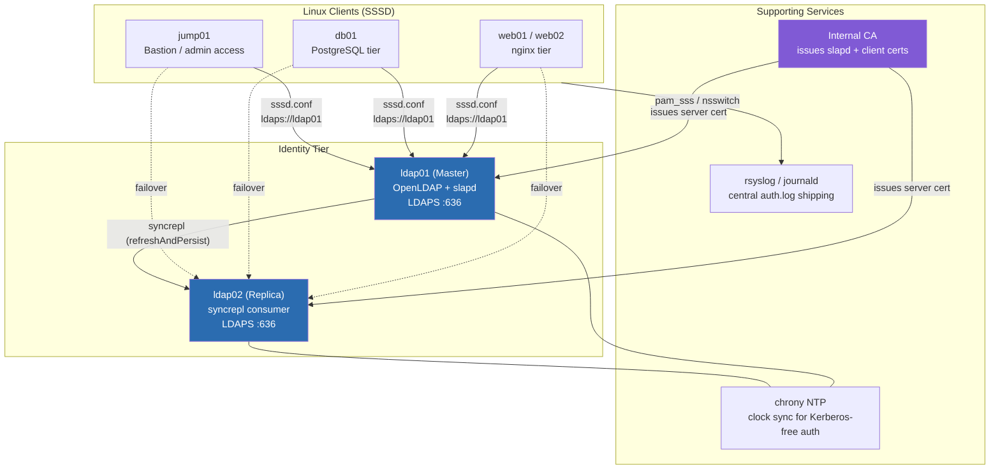
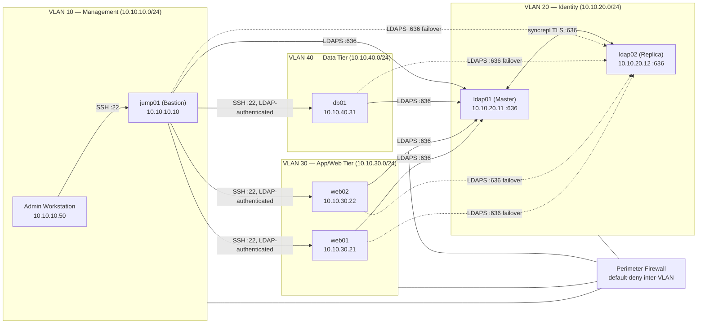

# Project 05 — Central Authentication

## Overview

A 60-host mixed estate (web tier, DB tier, jump hosts, admin workstations) is running local `/etc/passwd` accounts on every server. Onboarding/offboarding requires touching every box by hand, sudo rights drift out of sync, and there is no central audit trail for "who can become root where." The business goal: replace local accounts with a single **OpenLDAP** directory, join every Linux client via **SSSD**, encrypt all directory traffic with **LDAPS**, centralize `sudo` authorization as LDAP objects (`sudoRole`), and enforce a corporate password policy (`ppolicy`) from one place — so a single disable in the directory locks a user out everywhere within the SSSD cache TTL.

This project integrates [Readme](../LDAP-Server/Readme.md) for the directory service itself and [Readme](../Users-Groups-and-Permissions/Readme.md) for the local account/group/sudoers model that SSSD now overrides on each client.

> [!NOTE]
> **Scenario**
> Corp IT is consolidating three business units onto one identity source ahead of an SOC 2 audit. Auditors specifically flagged "no centralized authentication" and "no evidence of sudo access review" as findings. This build closes both gaps.

## Architecture



## Network Diagram



## Prerequisites

| Host | Role | IP / VLAN | OS | Resources | Notes |
|---|---|---|---|---|---|
| `ldap01` | OpenLDAP master (`slapd`) | 10.10.20.11 / VLAN 20 | Debian 12 | 2 vCPU / 4 GB / 40 GB | Holds writable directory, `sudoRole` OU, `ppolicy` |
| `ldap02` | OpenLDAP replica (syncrepl consumer) | 10.10.20.12 / VLAN 20 | Debian 12 | 2 vCPU / 4 GB / 40 GB | Read-only consumer, LDAPS failover target |
| `jump01` | Bastion / SSSD client | 10.10.10.10 / VLAN 10 | Debian 12 | 2 vCPU / 2 GB / 20 GB | Only host with direct SSH from admin workstation |
| `web01`, `web02` | App tier / SSSD clients | 10.10.30.21-22 / VLAN 30 | Debian 12 | 2 vCPU / 4 GB / 40 GB | nginx service accounts stay local |
| `db01` | Data tier / SSSD client | 10.10.40.31 / VLAN 40 | Debian 12 | 4 vCPU / 8 GB / 80 GB | Only DBA group gets sudo via LDAP |
| Internal CA | PKI issuer | 10.10.20.5 / VLAN 20 | — | — | Issues `slapd` server cert + client trust bundle |
| Firewall | Perimeter / inter-VLAN ACLs | — | — | — | Default-deny; explicit allow TCP 636, 22 |

**Software**: `slapd`, `ldap-utils`, `sssd`, `sssd-ldap`, `sssd-tools`, `libnss-sss`, `libpam-sss`, `sudo-ldap`, `openssl`, `chrony`.

## Configuration

### 1. OpenLDAP master — TLS-enabled `slapd`

```bash
# ldap01 — install and generate the slapd TLS material
apt update && apt install -y slapd ldap-utils gnutls-bin ssl-cert
dpkg-reconfigure slapd   # base DN: dc=corp,dc=internal

# Server key + CSR (signed by the internal CA out-of-band)
openssl req -newkey rsa:4096 -nodes \
  -keyout /etc/ldap/ldap01.key \
  -out /etc/ldap/ldap01.csr \
  -subj "/CN=ldap01.corp.internal/O=Corp IT"

# After the CA returns ldap01.crt + ca.crt:
chown openldap:openldap /etc/ldap/ldap01.key /etc/ldap/ldap01.crt /etc/ldap/ca.crt
chmod 640 /etc/ldap/ldap01.key
```

```ini
# /etc/ldap/tls-config.ldif — applied with: ldapmodify -Y EXTERNAL -H ldapi:/// -f tls-config.ldif
dn: cn=config
changetype: modify
replace: olcTLSCACertificateFile
olcTLSCACertificateFile: /etc/ldap/ca.crt
-
replace: olcTLSCertificateFile
olcTLSCertificateFile: /etc/ldap/ldap01.crt
-
replace: olcTLSCertificateKeyFile
olcTLSCertificateKeyFile: /etc/ldap/ldap01.key
-
replace: olcTLSVerifyClient
olcTLSVerifyClient: never
```

```conf
# /etc/default/slapd — listen on LDAPS only, disable plaintext ldap://
SLAPD_SERVICES="ldaps:/// ldapi:///"
```

### 2. Password policy overlay (`ppolicy`)

```ini
# ppolicy-overlay.ldif — enable the overlay + attach default policy
dn: olcOverlay=ppolicy,olcDatabase={1}mdb,cn=config
objectClass: olcOverlayConfig
objectClass: olcPPolicyConfig
olcOverlay: ppolicy
olcPPolicyDefault: cn=default,ou=policies,dc=corp,dc=internal
olcPPolicyHashCleartext: TRUE

dn: cn=default,ou=policies,dc=corp,dc=internal
objectClass: pwdPolicy
objectClass: person
cn: default
sn: default
pwdAttribute: userPassword
pwdMinLength: 14
pwdMaxAge: 7776000
pwdExpireWarning: 604800
pwdInHistory: 5
pwdMaxFailure: 5
pwdLockout: TRUE
pwdLockoutDuration: 900
pwdFailureCountInterval: 900
pwdMustChange: TRUE
pwdAllowUserChange: TRUE
```

### 3. sudo rules as LDAP objects (`sudoRole`)

```ini
# sudo-schema.ldif — apply sudo schema once: ldapadd -Y EXTERNAL -H ldapi:/// -f /usr/share/doc/sudo-ldap/schema.OpenLDAP
dn: ou=SUDOers,dc=corp,dc=internal
objectClass: organizationalUnit
ou: SUDOers

dn: cn=dba_fullaccess,ou=SUDOers,dc=corp,dc=internal
objectClass: top
objectClass: sudoRole
cn: dba_fullaccess
sudoUser: %dba-team
sudoHost: db01.corp.internal
sudoCommand: ALL
sudoOption: !authenticate
sudoOption: log_input
sudoOption: log_output

dn: cn=webops_restart,ou=SUDOers,dc=corp,dc=internal
objectClass: top
objectClass: sudoRole
cn: webops_restart
sudoUser: %webops-team
sudoHost: web01.corp.internal,web02.corp.internal
sudoCommand: /usr/sbin/systemctl restart nginx
sudoCommand: /usr/sbin/systemctl reload nginx
sudoOption: !authenticate
```

### 4. SSSD client (every client host: `jump01`, `web01/02`, `db01`)

```ini
# /etc/sssd/sssd.conf — mode 0600, owner root
[sssd]
services = nss, pam, sudo
domains = corp.internal

[domain/corp.internal]
id_provider = ldap
auth_provider = ldap
sudo_provider = ldap
chpass_provider = ldap
ldap_uri = ldaps://ldap01.corp.internal, ldaps://ldap02.corp.internal
ldap_search_base = dc=corp,dc=internal
ldap_sudo_search_base = ou=SUDOers,dc=corp,dc=internal
ldap_tls_reqcert = demand
ldap_tls_cacert = /etc/ssl/certs/corp-ca.crt
cache_credentials = True
enumerate = False
entry_cache_timeout = 600
ldap_id_use_start_tls = False
access_provider = ldap
ldap_access_filter = (memberOf=cn=vpn-users,ou=groups,dc=corp,dc=internal)
```

```bash
# Client bootstrap
apt install -y sssd sssd-ldap sssd-tools libnss-sss libpam-sss sudo-ldap
authselect select sssd --force
chmod 600 /etc/sssd/sssd.conf
systemctl enable --now sssd
```

```conf
# /etc/nsswitch.conf (relevant lines)
passwd:         files sss
group:          files sss
shadow:         files sss
sudoers:        files sss
```

## Security Controls

| Control | CIS / NIST Reference | Implementation in this build |
|---|---|---|
| Encrypt directory traffic in transit | CIS Debian 12 §5.1, NIST SP 800-53 SC-8 | `slapd` bound to `ldaps:///` only, plaintext `ldap://` disabled in `/etc/default/slapd` |
| Enforce strong password policy centrally | CIS §5.4, NIST IA-5 | `ppolicy` overlay: 14-char min, 5-generation history, lockout after 5 failures |
| Least-privilege sudo, centrally reviewable | CIS §5.6, NIST AC-6 | `sudoRole` objects scoped per group/host, `log_input`/`log_output` on privileged role |
| Client-side directory bind restricted | CIS §5.1.2, NIST IA-2 | `ldap_tls_reqcert = demand`; clients reject servers not signed by internal CA |
| Access restricted to authorized group only | CIS §5.1, NIST AC-3 | `access_provider = ldap` + `ldap_access_filter` on `vpn-users` group membership |
| Offline/cached-credential exposure minimized | NIST IA-5(1) | `cache_credentials = True` with `entry_cache_timeout = 600`; disable propagates within 10 min |
| Directory availability (no SPOF) | CIS §6 (general resilience), NIST CP-10 | `syncrepl refreshAndPersist` replica (`ldap02`), client `ldap_uri` lists both hosts |
| Config file permissions | CIS §6.1 | `/etc/sssd/sssd.conf` mode `0600` root:root; `slapd` key mode `0640` openldap:openldap |
| No anonymous directory reads | CIS §5.1.4, NIST AC-6 | `olcDisallows: bind_anon`; anonymous bind disabled on `cn=config` and `dc=corp,dc=internal` |

## Deployment Steps

1. Provision `ldap01`, `ldap02`, `jump01`, `web01`, `web02`, `db01` per the Prerequisites table; join all six to VLANs 10/20/30/40 with firewall rules allowing only TCP 636 (LDAPS) and TCP 22 (SSH) across tiers.
2. On `ldap01`: install `slapd`/`ldap-utils`, run `dpkg-reconfigure slapd` with base DN `dc=corp,dc=internal`, generate the key/CSR, and get it signed by the internal CA — see [Ldap-Server-Setup](../LDAP-Server/Ldap-Server-Setup.md).
3. Apply the TLS config LDIF (`tls-config.ldif`) via `ldapmodify -Y EXTERNAL -H ldapi:///`, then set `SLAPD_SERVICES="ldaps:/// ldapi:///"` in `/etc/default/slapd` and restart — cross-reference [LDAP-over-TLS](../LDAP-Server/LDAP-over-TLS.md).
4. Load the base OU structure (`ou=People`, `ou=groups`, `ou=policies`, `ou=SUDOers`) and import initial user/group entries, following the directory design in [LDAP-Directory-Structure](../LDAP-Server/LDAP-Directory-Structure.md) and [LDIF-Files-and-Schema](../LDAP-Server/LDIF-Files-and-Schema.md).
5. Enable the `ppolicy` overlay and load `cn=default,ou=policies,dc=corp,dc=internal` from `ppolicy-overlay.ldif`.
6. Load the `sudo` schema (`/usr/share/doc/sudo-ldap/schema.OpenLDAP`) and import `sudo-schema.ldif` to create `dba_fullaccess` and `webops_restart` roles.
7. Provision `ldap02` as a syncrepl consumer of `ldap01` (`refreshAndPersist`), issue it its own CA-signed cert, and confirm inbound replication.
8. Restrict anonymous access and require authenticated binds — see [LDAP-Security-Hardening](../LDAP-Server/LDAP-Security-Hardening.md) and [LDAP-Authentication](../LDAP-Server/LDAP-Authentication.md).
9. On each client (`jump01`, `web01`, `web02`, `db01`): install `sssd`, `sssd-ldap`, `sudo-ldap`, `libnss-sss`, `libpam-sss`; deploy `sssd.conf`; distribute the internal CA bundle to `/etc/ssl/certs/corp-ca.crt`.
10. Run `authselect select sssd --force` to rewire PAM/NSS to SSSD, replacing the local-only stack described in [Readme](../Users-Groups-and-Permissions/Readme.md).
11. Set `/etc/sssd/sssd.conf` to `0600 root:root`, then `systemctl enable --now sssd` on every client — see [LDAP-Client-Configuration](../LDAP-Server/LDAP-Client-Configuration.md).
12. Confirm `nsswitch.conf` on each client lists `sss` after `files` for `passwd`, `group`, `shadow`, and `sudoers`.
13. Decommission any remaining local UNIX accounts that now have an LDAP-backed equivalent, keeping only break-glass local root/emergency accounts.

> [!NOTE]
> **📸 Screenshot**
> _Capture: `getent passwd <ldap-user>` and `id <ldap-user>` output on `web01` showing the account resolving through SSSD, alongside `sudo -l` showing the LDAP-sourced sudo rule._

## Validation

1. Confirm `slapd` is listening only on LDAPS, not plaintext LDAP:

```text
$ ss -tlnp | grep slapd
LISTEN 0 128 10.10.20.11:636  0.0.0.0:*  users:(("slapd",pid=812,fd=9))
LISTEN 0 128 0.0.0.0:636      0.0.0.0:*  users:(("slapd",pid=812,fd=11))
```

2. Verify the certificate chain from a client:

```text
$ openssl s_client -connect ldap01.corp.internal:636 -CAfile /etc/ssl/certs/corp-ca.crt </dev/null 2>&1 | grep -E "Verify return|subject"
depth=0 CN = ldap01.corp.internal, O = Corp IT
Verify return code: 0 (ok)
```

3. Resolve an LDAP user via NSS on a client:

```text
$ getent passwd jdoe
jdoe:*:15003:15100:Jane Doe:/home/jdoe:/bin/bash
```

4. Confirm `sudo` rules are sourced from LDAP, not local `sudoers`:

```text
$ sudo -l -U jdoe
User jdoe may run the following commands on db01:
    (root) NOPASSWD: ALL
Sudoers entry:
    RunAsUsers: root
    Options: !authenticate, log_input, log_output
    Commands:
        ALL
```

5. Confirm password policy lockout after 5 failed binds:

```text
$ ldapwhoami -x -D "uid=jdoe,ou=People,dc=corp,dc=internal" -W
[5 wrong attempts]
ldap_bind: Constraint violation (19)
    additional info: Account locked
```

6. Confirm replica stays in sync:

```text
$ ldapsearch -x -H ldaps://ldap02.corp.internal -b "dc=corp,dc=internal" "(uid=jdoe)" uid
dn: uid=jdoe,ou=People,dc=corp,dc=internal
uid: jdoe
```

## Future Improvements

- Migrate `auth_provider`/`chpass_provider` from `ldap` to `krb5` (add a Kerberos KDC) so credentials never traverse the network even under TLS, enabling SSO across services beyond PAM/NSS.
- Add a third replica in a separate physical rack/AZ and put `ldap_uri` behind a VIP or SRV-record discovery instead of a static two-host list.
- Automate LDIF-based sudo role and user provisioning through a CI pipeline (Ansible `community.general.ldap_entry`) with peer review before merge, giving the SOC 2 auditors a Git-based change trail.
- Add `pwdCheckModule` (`cracklib` via `ppolicy`) to reject dictionary passwords, not just enforce length/age.
- Ship `slapd` and SSSD PAM logs to a central SIEM with alerting on repeated `Constraint violation` (lockout) events.

## References

- OpenLDAP Administrator's Guide — TLS and `ppolicy` overlay chapters (`man slapo-ppolicy`)
- `man sssd-ldap`, `man sssd.conf`, `man sudoers.ldap`
- CIS Debian Linux 12 Benchmark v1.0 — Sections 5.1 (Access/Authentication), 5.4 (User Accounts), 5.6 (`sudo`)
- NIST SP 800-53 Rev. 5 — SC-8 (Transmission Confidentiality), IA-5 (Authenticator Management), AC-6 (Least Privilege)
- RFC 4513 — LDAP Authentication Methods and Security Mechanisms

## Related Notes

- [Readme](../LDAP-Server/Readme.md)
- [Ldap-Server-Setup](../LDAP-Server/Ldap-Server-Setup.md)
- [LDAP-over-TLS](../LDAP-Server/LDAP-over-TLS.md)
- [LDAP-Client-Configuration](../LDAP-Server/LDAP-Client-Configuration.md)
- [LDAP-Security-Hardening](../LDAP-Server/LDAP-Security-Hardening.md)
- [LDAP-Authentication](../LDAP-Server/LDAP-Authentication.md)
- [Readme](../Users-Groups-and-Permissions/Readme.md)
- [Linux Administration & Server Hardening](../Readme.md) — course hub and map of content
