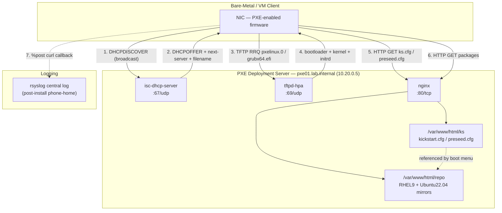
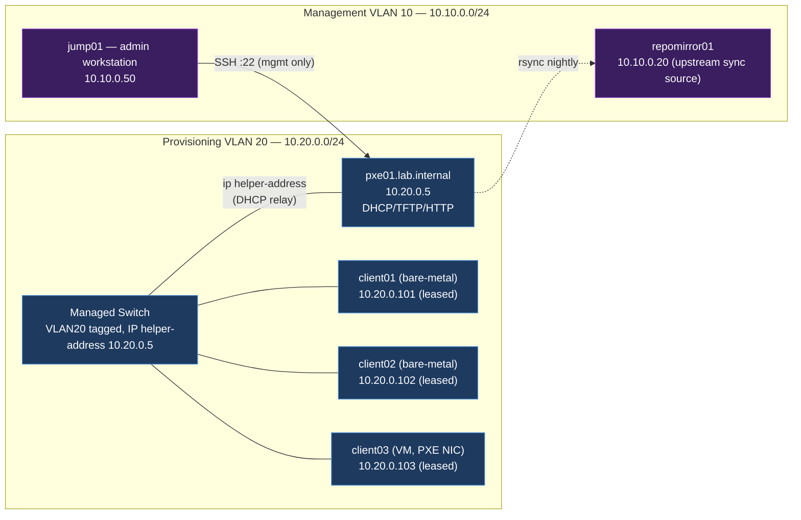

# Project 06 — PXE Deployment Environment

## Overview

A mid-size hosting provider is racking a new batch of 40 bare-metal servers per quarter and re-imaging existing fleet nodes after hardware refresh cycles. Manual installs (walk a USB stick to the rack, click through an installer) take ~45 minutes per host and produce configuration drift because engineers occasionally deviate from the "gold" partition/package baseline. The goal of this project is a **network-boot deployment environment** that turns any bare-metal or VM host into a fully hardened, CIS-baselined install in under 15 minutes with zero manual interaction, using DHCP for network bootstrap, TFTP to serve the bootloader/kernel, and HTTP to serve the installer tree plus a Kickstart (RHEL/Rocky) and Preseed (Debian/Ubuntu) automation file.

This build integrates [Readme](../TFTP-and-PXE-Boot-Server/Readme.md) for the boot chain and [Readme](../Dynamic-Host-Configuration-Protocol-DHCP/Readme.md) for network bootstrap and next-server handoff.

> [!NOTE]
> **Business driver**
> Eliminate manual OS installs for a 200+ node fleet, enforce a CIS-hardened baseline at first boot, and cut mean-time-to-provision from 45 minutes to under 15 — with a fully auditable, version-controlled install tree.

## Architecture



## Network Diagram



Physical/logical separation: the provisioning VLAN (20) carries **no default route to the internet** — only `pxe01` bridges to the management VLAN for repo sync — so a compromised or rogue PXE client cannot reach anything but the boot server itself.

## Prerequisites

| Host | Role | IP / VLAN | OS | Resources | Notes |
|---|---|---|---|---|---|
| pxe01.lab.internal | DHCP + TFTP + HTTP boot server | 10.20.0.5 / VLAN20 | Rocky Linux 9 | 2 vCPU, 4 GB RAM, 120 GB disk | Static IP, disk sized for two distro trees |
| repomirror01 | Upstream package mirror | 10.10.0.20 / VLAN10 | Rocky Linux 9 | 2 vCPU, 4 GB RAM, 500 GB disk | Nightly `reposync` source for pxe01 |
| jump01 | Admin workstation | 10.10.0.50 / VLAN10 | Kali/Debian | n/a | SSH access to pxe01 only |
| Managed switch | L2/L3 switch, VLAN20 gateway | 10.20.0.1 / VLAN20 | vendor OS | n/a | `ip helper-address 10.20.0.5` on VLAN20 SVI |
| client01–client40 | Fleet hosts to be imaged | DHCP-leased 10.20.0.101–140 | target: Rocky 9 / Ubuntu 22.04 | bare-metal, PXE-capable NIC | Boot order: NIC first |

## Configuration

### 1. DHCP — network bootstrap and next-server handoff

`/etc/dhcp/dhcpd.conf` on `pxe01`:

```conf
authoritative;
default-lease-time 600;
max-lease-time 7200;
option domain-name "lab.internal";
option domain-name-servers 10.10.0.10;

subnet 10.20.0.0 netmask 255.255.255.0 {
    range 10.20.0.101 10.20.0.200;
    option routers 10.20.0.1;
    option broadcast-address 10.20.0.255;

    # PXE handoff
    next-server 10.20.0.5;

    # Architecture-aware boot filename (UEFI vs legacy BIOS)
    if exists user-class and option user-class = "iPXE" {
        filename "http://10.20.0.5/boot.ipxe";
    } elsif option arch = 00:07 or option arch = 00:09 {
        filename "grubx64.efi";
    } else {
        filename "pxelinux.0";
    }
}

# Static reservation example for a repeatable test host
host client01 {
    hardware ethernet 52:54:00:aa:bb:01;
    fixed-address 10.20.0.101;
}
```

```bash
# lock down the DHCP daemon to the provisioning interface only
sudo sed -i 's/^INTERFACESv4=.*/INTERFACESv4="eth1"/' /etc/sysconfig/dhcpd
sudo systemctl enable --now dhcpd
```

### 2. TFTP — bootloader and kernel delivery

`/etc/xinetd.d/tftp` (tftpd-hpa on Rocky uses systemd socket instead, shown below):

```ini
[Unit]
Description=Tftp Server (PXE boot)
Requires=tftp.socket

[Service]
ExecStart=/usr/sbin/in.tftpd -s /var/lib/tftpboot --secure --create
StandardInput=socket
```

```bash
sudo mkdir -p /var/lib/tftpboot/{pxelinux.cfg,rhel9,ubuntu2204}
sudo dnf install -y syslinux-tftpboot tftp-server grub2-efi-x64 shim-x64
sudo cp /usr/share/syslinux/{pxelinux.0,menu.c32,ldlinux.c32} /var/lib/tftpboot/
sudo cp /boot/efi/EFI/rocky/{grubx64.efi,shimx64.efi} /var/lib/tftpboot/
sudo firewall-cmd --permanent --zone=internal --add-service=tftp
sudo firewall-cmd --reload
sudo systemctl enable --now tftp.socket
```

`/var/lib/tftpboot/pxelinux.cfg/default` (BIOS legacy menu):

```conf
DEFAULT menu.c32
PROMPT 0
TIMEOUT 100

MENU TITLE PXE Deployment — Fleet Provisioning

LABEL rocky9-auto
    MENU LABEL Rocky Linux 9 — Automated (Kickstart, hardened)
    KERNEL rhel9/vmlinuz
    APPEND initrd=rhel9/initrd.img inst.repo=http://10.20.0.5/repo/rhel9 inst.ks=http://10.20.0.5/ks/rocky9-hardened.cfg ip=dhcp net.ifnames=0

LABEL ubuntu2204-auto
    MENU LABEL Ubuntu 22.04 — Automated (Preseed, hardened)
    KERNEL ubuntu2204/linux
    APPEND initrd=ubuntu2204/initrd.gz auto=true priority=critical url=http://10.20.0.5/ks/ubuntu2204-preseed.cfg netcfg/choose_interface=auto

LABEL local
    MENU LABEL Boot from local disk
    LOCALBOOT 0
```

### 3. HTTP — install tree and automation files

`/etc/nginx/conf.d/pxe.conf`:

```conf
server {
    listen 10.20.0.5:80;
    server_name pxe01.lab.internal;

    root /var/www/html;
    autoindex on;

    location /repo/ {
        # RHEL9/Ubuntu install trees synced nightly from repomirror01
    }

    location /ks/ {
        # kickstart / preseed files — read-only to clients
        default_type text/plain;
    }

    # Deny anything else, keep boot server minimal
    location / {
        deny all;
    }

    access_log /var/log/nginx/pxe-access.log;
}
```

```bash
sudo dnf install -y nginx
sudo mkdir -p /var/www/html/{repo/rhel9,repo/ubuntu2204,ks}
sudo firewall-cmd --permanent --zone=internal --add-service=http
sudo firewall-cmd --reload
sudo systemctl enable --now nginx
```

### 4. Kickstart — Rocky Linux 9 hardened baseline

`/var/www/html/ks/rocky9-hardened.cfg`:

```conf
#version=RHEL9
text
reboot
url --url="http://10.20.0.5/repo/rhel9"

lang en_US.UTF-8
keyboard us
timezone UTC --utc
rootpw --lock
selinux --enforcing
firewall --enabled --service=ssh

authselect select sssd

# LUKS-encrypted disk with a hardened partition layout
clearpart --all --initlabel
autopart --type=lvm --encrypted --passphrase=CHANGE_ME_VIA_ANSIBLE_VAULT

network --bootproto=dhcp --device=eth0 --onboot=yes

%packages
@core
chrony
aide
audit
openssh-server
-telnet
-rsh
%end

%post --log=/root/ks-post.log
# CIS baseline touch points
sed -i 's/^#PermitRootLogin.*/PermitRootLogin no/' /etc/ssh/sshd_config
sed -i 's/^#PasswordAuthentication.*/PasswordAuthentication no/' /etc/ssh/sshd_config
systemctl enable auditd chronyd sshd
useradd -m -G wheel deployadmin
echo "deployadmin ALL=(ALL) NOPASSWD:ALL" > /etc/sudoers.d/deployadmin

# phone-home to central syslog once provisioning completes
curl -s -X POST http://10.10.0.10:9000/provisioned -d "host=$(hostname)&status=ok"
%end
```

### 5. Preseed — Ubuntu 22.04 hardened baseline

`/var/www/html/ks/ubuntu2204-preseed.cfg`:

```conf
d-i debian-installer/locale string en_US.UTF-8
d-i keyboard-configuration/xkb-keymap select us

d-i netcfg/choose_interface select auto
d-i netcfg/get_hostname string unassigned-hostname

d-i partman-auto/method string crypto
d-i partman-auto-lvm/guided_size string max
d-i partman-crypto/passphrase password CHANGE_ME_VIA_ANSIBLE_VAULT
d-i partman-crypto/passphrase-again password CHANGE_ME_VIA_ANSIBLE_VAULT
d-i partman-partitioning/confirm_write_new_label boolean true
d-i partman/choose_partition select finish
d-i partman/confirm boolean true

d-i passwd/root-login boolean false
d-i passwd/user-fullname string Deploy Admin
d-i passwd/username string deployadmin
d-i passwd/user-password-crypted password CHANGE_ME_HASH
d-i user-setup/allow-password-weak boolean false

tasksel tasksel/first multiselect standard, ssh-server
d-i pkgsel/include string chrony auditd unattended-upgrades

d-i preseed/late_command string \
    in-target sed -i 's/^#PermitRootLogin.*/PermitRootLogin no/' /etc/ssh/sshd_config; \
    in-target systemctl enable auditd chrony; \
    in-target curl -s -X POST http://10.10.0.10:9000/provisioned -d "host=$(hostname)&status=ok"

d-i grub-installer/bootdev string default
d-i finish-install/reboot_in_progress note
```

> [!NOTE]
> **📸 Screenshot**
> _Capture: the PXE boot menu (`pxelinux.cfg/default`) rendering on a client console during network boot, showing the Rocky 9 and Ubuntu 22.04 automated entries._

## Security Controls

| Control | CIS / NIST Reference | Applied in this build |
|---|---|---|
| Disable unauthenticated TFTP write | CIS Distribution Independent Linux 1.1 (network daemon hardening) | `in.tftpd --secure` chroots to `/var/lib/tftpboot`; no `--create` on production, read-only export |
| Restrict DHCP scope to provisioning VLAN | NIST SP 800-53 SC-7 (boundary protection) | `INTERFACESv4="eth1"` binds dhcpd to VLAN20 NIC only; no listener on management VLAN |
| Full-disk encryption at install time | CIS RHEL9 Benchmark 1.1.1 (encrypt partitions) | Kickstart `autopart --encrypted`; Preseed `partman-auto/method crypto` |
| No direct root login post-install | CIS RHEL9 6.2.x / CIS Ubuntu 5.2.x | `rootpw --lock`; `PermitRootLogin no` set in `%post` / `late_command` |
| Disable weak/unused network daemons | CIS RHEL9 2.1–2.2 | `-telnet -rsh` excluded from `%packages`; only `openssh-server` installed |
| Enforce SELinux / secure boot posture | CIS RHEL9 1.6.x | `selinux --enforcing` in kickstart; SecureBoot-signed `shimx64.efi`/`grubx64.efi` served via TFTP |
| Audit logging enabled at first boot | CIS RHEL9 4.1 / NIST AU-2 | `auditd` installed and `systemctl enable auditd` in post-install |
| Segment provisioning traffic from internet | NIST SP 800-53 SC-7(5) (deny by default) | VLAN20 has no default route out; only `pxe01` bridges to VLAN10 for repo sync |
| Restrict HTTP boot-tree access | CIS 2.2.x (web service hardening) | `nginx` `location /` denies all except `/repo/` and `/ks/`; no directory write access |
| Least-privilege admin account | CIS 5.4.x (account provisioning) | `deployadmin` created via sudoers drop-in instead of shared root credentials |

## Deployment Steps

1. Provision `pxe01` (Rocky Linux 9, minimal install) on VLAN20 with a static IP `10.20.0.5/24`.
2. Install and configure `isc-dhcp-server`; apply `/etc/dhcp/dhcpd.conf` above; restrict the listener to the provisioning NIC.
3. Install `tftp-server` + `syslinux-tftpboot`; populate `/var/lib/tftpboot/` with `pxelinux.0`, `grubx64.efi`, `shimx64.efi`, and per-distro kernel/initrd pairs extracted from each ISO (`isoinfo -x /images/pxeboot/vmlinuz ...`).
4. Install `nginx`; mirror the Rocky 9 and Ubuntu 22.04 install trees under `/var/www/html/repo/` via `reposync`/`rsync` from `repomirror01` (nightly cron).
5. Write and vault the Kickstart (`rocky9-hardened.cfg`) and Preseed (`ubuntu2204-preseed.cfg`) files under `/var/www/html/ks/`, injecting real LUKS passphrases and password hashes from Ansible Vault at deploy time rather than committing plaintext.
6. Author the PXE boot menu (`pxelinux.cfg/default`) with named labels for each automated build, plus a `local` fallback to avoid re-imaging loops on reboot.
7. On the managed switch, configure `ip helper-address 10.20.0.5` on the VLAN20 SVI so DHCP broadcasts relay correctly if clients sit on a separate broadcast domain.
8. Open firewall ports on `pxe01`: `67/udp` (DHCP), `69/udp` (TFTP), `80/tcp` (HTTP) — scoped to the `internal` firewalld zone bound to the VLAN20 interface only.
9. Rack a test host (`client01`), set NIC as first boot device in firmware, and power on.
10. Watch the PXE menu render, select the automated entry (or let `TIMEOUT` auto-select), and confirm the kickstart/preseed pulls packages from `http://10.20.0.5/repo/...` without prompts.
11. Confirm the post-install `%post`/`late_command` callback lands in the central syslog receiver on `10.10.0.10:9000`.
12. Repeat for the full batch using DHCP reservations (`host client01 { ... }`) where MAC-to-hostname mapping matters for asset tracking.

## Validation

1. Confirm DHCP is leasing correctly on the provisioning VLAN:

```text
$ sudo dhcpd -t -cf /etc/dhcp/dhcpd.conf
Internet Systems Consortium DHCP Server 4.4.x
Config file: /etc/dhcp/dhcpd.conf
Database file: /var/lib/dhcpd/dhcpd.leases
No errors or warnings.
```

2. Confirm TFTP is serving the bootloader:

```text
$ tftp 10.20.0.5 -c get pxelinux.0
Transfer successful: 26765 bytes in 1 second
```

3. Confirm HTTP install tree and kickstart file are reachable and read-only:

```text
$ curl -sI http://10.20.0.5/ks/rocky9-hardened.cfg | head -1
HTTP/1.1 200 OK
$ curl -sI -X PUT http://10.20.0.5/ks/rocky9-hardened.cfg
HTTP/1.1 403 Forbidden
```

4. Watch a full unattended install complete and phone home:

```text
$ tail -f /var/log/pxe-provisioned.log
2026-07-22T09:14:02Z host=client01 status=ok
2026-07-22T09:15:41Z host=client02 status=ok
```

5. Verify the resulting host meets the hardened baseline (spot-check via `oscap` or manual SSH):

```text
$ ssh deployadmin@10.20.0.101 "grep -E '^(PermitRootLogin|PasswordAuthentication)' /etc/ssh/sshd_config"
PermitRootLogin no
PasswordAuthentication no
```

6. Confirm root login is locked:

```text
$ ssh root@10.20.0.101
Permission denied (publickey,password).
```

## Future Improvements

- Replace static `pxelinux.cfg/default` menu with `iPXE` chainloading and a dynamic menu generated from an inventory database (MAC → build profile).
- Add `OpenSCAP` post-install remediation scan (`oscap xccdf eval --profile cis`) run automatically via the `%post`/`late_command` hooks, with results shipped to a central compliance dashboard.
- Integrate HashiCorp Vault (or Ansible Vault + AWX) so kickstart/preseed secrets are injected per-host at request time instead of templated in a static file.
- Add TLS to the HTTP boot tree (`https://pxe01.lab.internal/repo/`) with a private CA, since UEFI HTTP Boot supports HTTPS natively on modern firmware.
- Extend DHCP failover (two `pxe0x` nodes in a `failover peer` pool) to remove the single point of failure during a large fleet re-image window.

## References

- Red Hat Enterprise Linux 9 — Automatically Installing RHEL, Kickstart reference guide
- CIS Rocky Linux 9 Benchmark v1.0.0 — sections 1 (Initial Setup), 2 (Services), 5 (Access, Authentication)
- CIS Ubuntu Linux 22.04 LTS Benchmark v1.0.0
- Debian Installer Preseed documentation — `wiki.debian.org/DebianInstaller/Preseed`
- NIST SP 800-53 Rev. 5 — SC-7 (Boundary Protection), AU-2 (Audit Events)
- ISC DHCP Server Administrator's Guide

## Related Notes

- [Readme](../TFTP-and-PXE-Boot-Server/Readme.md)
- [Readme](../Dynamic-Host-Configuration-Protocol-DHCP/Readme.md)
- [Linux Administration & Server Hardening](../Readme.md) — course hub and map of content
