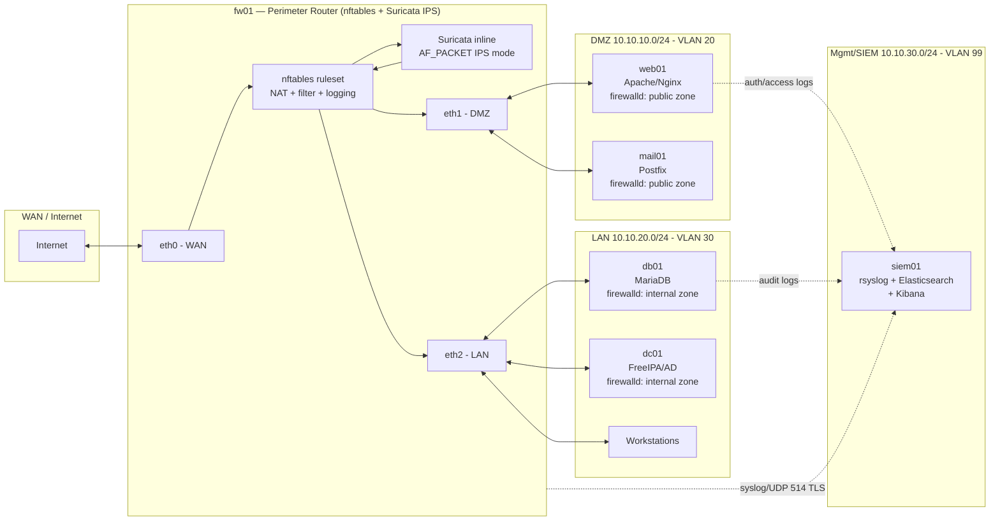
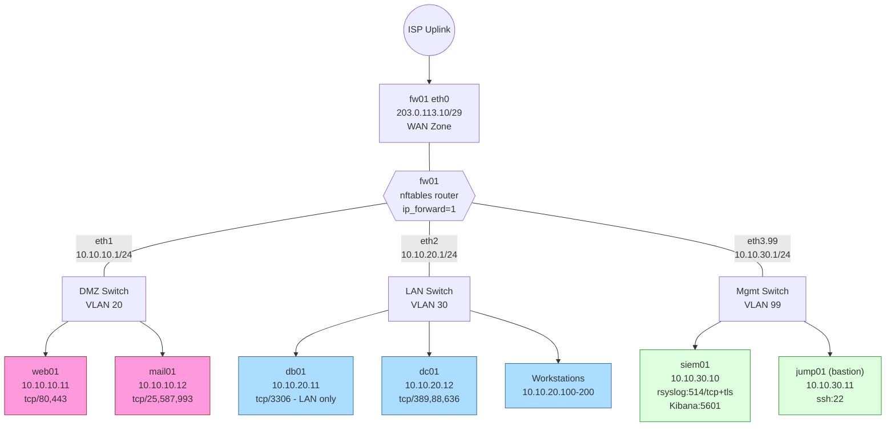

# Project 07 — Enterprise Firewall & Segmentation

## Overview

A mid-size company's flat network (all servers on one broadcast domain, no perimeter filtering) failed a PCI-DSS readiness assessment: the assessor flagged unrestricted east-west traffic, no DMZ isolation for internet-facing services, no IDS visibility, and no centralized firewall logging. This project builds a production-shaped remediation: an `nftables`-based Linux perimeter/router segmenting **WAN / DMZ / LAN** zones, `firewalld` zone policy on individual hosts for defense-in-depth, DNAT port-forwarding to publish DMZ services, Suricata IDS/IPS inline on the perimeter, and centralized log shipping to a SIEM (rsyslog → Elasticsearch, alternatively Wazuh/Graylog) for correlation and alerting.

This integrates firewall theory and monitoring practice from [Readme](../Security-Firewall-and-Monitoring/Readme.md), and reuses hardening baselines established in earlier projects. See also [Firewalld](../Security-Firewall-and-Monitoring/Firewalld.md) and [Firewalld](../Security-Firewall-and-Monitoring/Firewalld.md) if present in your vault.

> [!NOTE]
> **Goal**
> Deploy a segmented, logged, and inspected network edge where every packet crossing a trust boundary is (a) explicitly permitted by policy, (b) inspected by IDS, and (c) logged to a tamper-resistant SIEM — meeting CIS Level 1 firewall benchmarks and PCI-DSS Requirement 1 (network segmentation).

## Architecture



## Network Diagram



## Prerequisites

| Host | Role | Interface / Zone | IP Address | OS / Resources |
|---|---|---|---|---|
| fw01 | Perimeter router, NAT, IDS/IPS | eth0=WAN, eth1=DMZ, eth2=LAN, eth3.99=Mgmt | 203.0.113.10 (WAN), 10.10.10.1, 10.10.20.1, 10.10.30.1 | RHEL 9 / Rocky 9, 4 vCPU, 8 GB RAM, 4 NICs |
| web01 | DMZ web server (Apache/Nginx) | DMZ / firewalld `public` | 10.10.10.11 | RHEL 9, 2 vCPU, 4 GB RAM |
| mail01 | DMZ mail relay (Postfix) | DMZ / firewalld `public` | 10.10.10.12 | RHEL 9, 2 vCPU, 4 GB RAM |
| db01 | LAN database (MariaDB) | LAN / firewalld `internal` | 10.10.20.11 | RHEL 9, 4 vCPU, 8 GB RAM |
| dc01 | LAN directory (FreeIPA/AD) | LAN / firewalld `internal` | 10.10.20.12 | RHEL 9, 2 vCPU, 4 GB RAM |
| siem01 | Log aggregation (rsyslog + Elastic + Kibana) | Mgmt / firewalld `trusted` | 10.10.30.10 | RHEL 9, 4 vCPU, 16 GB RAM, 200 GB disk |
| jump01 | SSH bastion for admin access | Mgmt / firewalld `trusted` | 10.10.30.11 | RHEL 9, 2 vCPU, 2 GB RAM |
| ISP Uplink | Public IP block | WAN | 203.0.113.8/29 | Provider-supplied |

## Configuration

### 1. Enable IP forwarding on fw01

```bash
# /etc/sysctl.d/99-router.conf
net.ipv4.ip_forward = 1
net.ipv6.conf.all.forwarding = 0
net.ipv4.conf.all.rp_filter = 1
net.ipv4.conf.all.accept_redirects = 0
net.ipv4.conf.all.send_redirects = 0
net.ipv4.conf.all.log_martians = 1
```

```bash
sysctl --system
```

### 2. nftables perimeter ruleset (fw01)

```conf
# /etc/nftables/ruleset.nft
table inet filter {
    define WAN_IF = "eth0"
    define DMZ_IF = "eth1"
    define LAN_IF = "eth2"
    define MGMT_IF = "eth3.99"
    define DMZ_NET = 10.10.10.0/24
    define LAN_NET = 10.10.20.0/24
    define MGMT_NET = 10.10.30.0/24

    chain input {
        type filter hook input priority 0; policy drop;
        ct state established,related accept
        ct state invalid drop
        iif "lo" accept
        icmp type echo-request limit rate 5/second accept
        iifname $MGMT_IF tcp dport 22 accept
        iifname $WAN_IF tcp dport 22 log prefix "SSH-WAN-DROP: " drop
        log prefix "INPUT-DROP: " drop
    }

    chain forward {
        type filter hook forward priority 0; policy drop;
        ct state established,related accept
        ct state invalid drop

        # WAN -> DMZ: only published services (DNAT targets)
        iifname $WAN_IF oifname $DMZ_IF ip daddr 10.10.10.11 tcp dport { 80, 443 } accept
        iifname $WAN_IF oifname $DMZ_IF ip daddr 10.10.10.12 tcp dport { 25, 587 } accept

        # DMZ -> LAN: explicitly denied (no pivot from compromised DMZ host)
        iifname $DMZ_IF oifname $LAN_IF drop

        # LAN -> DMZ: management/content push only
        iifname $LAN_IF oifname $DMZ_IF tcp dport 22 accept

        # LAN -> WAN: general egress
        iifname $LAN_IF oifname $WAN_IF accept

        # DMZ -> WAN: egress for updates/DNS only
        iifname $DMZ_IF oifname $WAN_IF tcp dport { 53, 80, 443 } accept
        iifname $DMZ_IF oifname $WAN_IF udp dport 53 accept

        # Mgmt -> anywhere (SIEM collects, jump01 administers)
        iifname $MGMT_IF accept

        log prefix "FORWARD-DROP: " drop
    }

    chain output {
        type filter hook output priority 0; policy accept;
    }
}

table ip nat {
    chain prerouting {
        type nat hook prerouting priority -100;
        iifname "eth0" tcp dport 80 dnat to 10.10.10.11:80
        iifname "eth0" tcp dport 443 dnat to 10.10.10.11:443
        iifname "eth0" tcp dport 25 dnat to 10.10.10.12:25
        iifname "eth0" tcp dport 587 dnat to 10.10.10.12:587
    }
    chain postrouting {
        type nat hook postrouting priority 100;
        oifname "eth0" masquerade
    }
}
```

```bash
nft -f /etc/nftables/ruleset.nft
systemctl enable --now nftables
```

### 3. firewalld zone policy on hosts (defense-in-depth behind fw01)

```bash
# web01 — DMZ host, public zone, only web ports + SSH from LAN mgmt
firewall-cmd --permanent --zone=public --add-service=http
firewall-cmd --permanent --zone=public --add-service=https
firewall-cmd --permanent --zone=public --remove-service=ssh
firewall-cmd --permanent --zone=public --add-rich-rule='rule family="ipv4" source address="10.10.20.0/24" service name="ssh" accept'
firewall-cmd --reload
```

```bash
# db01 — LAN host, internal zone, MySQL restricted to web01 only
firewall-cmd --permanent --zone=internal --remove-service=mysql
firewall-cmd --permanent --zone=internal --add-rich-rule='rule family="ipv4" source address="10.10.10.11/32" port port="3306" protocol="tcp" accept'
firewall-cmd --permanent --zone=internal --set-target=DROP
firewall-cmd --reload
```

### 4. Suricata inline IPS on fw01 (NFQUEUE mode)

```yaml
# /etc/suricata/suricata.yaml (excerpt)
af-packet:
  - interface: eth1
    cluster-id: 99
    cluster-type: cluster_flow
    defrag: yes

vars:
  address-groups:
    DMZ_NET: "[10.10.10.0/24]"
    LAN_NET: "[10.10.20.0/24]"
    EXTERNAL_NET: "!$DMZ_NET,!$LAN_NET"

outputs:
  - eve-log:
      enabled: yes
      filetype: syslog
      identity: "suricata-fw01"
      facility: local5
      types:
        - alert
        - dns
        - tls
```

```conf
# nftables queue redirect for inline IPS (insert before final accept in forward chain)
iifname "eth1" oifname "eth2" queue num 0-1 bypass
```

```bash
systemctl enable --now suricata
suricata-update   # pull ET Open ruleset
```

### 5. Centralized logging — rsyslog TLS shipping to siem01

```conf
# /etc/rsyslog.d/10-siem-forward.conf (on fw01, web01, mail01, db01, dc01)
$DefaultNetstreamDriver gtls
$DefaultNetstreamDriverCAFile /etc/pki/rsyslog/ca.pem
$ActionSendStreamDriverAuthMode x509/name
$ActionSendStreamDriverPermittedPeer *.internal.corp
$ActionSendStreamDriverMode 1

local5.*                       @@(o)10.10.30.10:6514   # Suricata alerts
*.*;auth,authpriv.none         @@(o)10.10.30.10:6514   # all other syslog
```

```conf
# /etc/rsyslog.d/00-listen.conf (on siem01)
module(load="imtcp" StreamDriver.Name="gtls" StreamDriver.Mode="1" StreamDriver.AuthMode="x509/name")
input(type="imtcp" port="6514")
```

## Security Controls

| Control | CIS / NIST Reference | Implementation in This Build |
|---|---|---|
| Default-deny inbound policy | CIS Distros L1 §3.4.2 / NIST SP 800-41 §4.1 | nftables `input`/`forward` chains set `policy drop`; every accept is explicit |
| Network segmentation into zones | PCI-DSS Req 1.2 / NIST SP 800-41 §5.1 | DMZ (10.10.10.0/24), LAN (10.10.20.0/24), Mgmt (10.10.30.0/24) on separate VLANs/NICs |
| No direct DMZ→LAN pivot | PCI-DSS Req 1.3.4 | Explicit `drop` rule for `iifname DMZ_IF oifname LAN_IF` in forward chain |
| Stateful connection tracking | CIS L1 §3.4.1 | `ct state established,related accept`; `ct state invalid drop` |
| Anti-spoofing / martian logging | NIST SP 800-41 §4.2.2 | `rp_filter=1`, `log_martians=1` sysctl on fw01 |
| Host-level defense in depth | CIS RHEL9 §3.4 (firewalld) | Per-host firewalld zones (`public` on DMZ, `internal` on LAN) independent of perimeter |
| Least-privilege service exposure | CIS L1 §3.4.3 | DNAT publishes only 80/443/25/587; firewalld rich rules scope MySQL to web01 only |
| Inline intrusion prevention | NIST SP 800-94 | Suricata AF_PACKET/NFQUEUE inline on DMZ-facing interface, ET Open ruleset |
| Centralized, tamper-evident logging | CIS L1 §4.2 / PCI-DSS Req 10.5 | rsyslog TLS (x.509 mutual auth) forwarding to siem01, no local-only logs |
| Log retention & correlation | PCI-DSS Req 10.7 | Elasticsearch ILM policy (90-day hot, 1-year cold) + Kibana alerting rules |
| Rule change auditability | CIS L1 §4.1 | nftables ruleset stored in git, applied via `nft -f`; `auditd` watches `/etc/nftables/` |

## Deployment Steps

1. Rack/provision `fw01` with 4 NICs (or 3 NICs + one 802.1Q trunk sub-interface for Mgmt VLAN 99); assign static IPs per the Prerequisites table.
2. Enable IP forwarding and anti-spoofing sysctls on `fw01`; apply `/etc/sysctl.d/99-router.conf` and run `sysctl --system`.
3. Author and load the nftables ruleset (`/etc/nftables/ruleset.nft`) on `fw01`; enable the `nftables` service for persistence across reboot.
4. Deploy `web01` and `mail01` into the DMZ subnet; install and configure `firewalld` with the `public` zone rules shown above.
5. Deploy `db01` and `dc01` into the LAN subnet; configure `firewalld` `internal` zone with rich rules restricting MySQL to `web01` only.
6. Configure DNAT prerouting rules on `fw01` to publish `web01:80/443` and `mail01:25/587` to the WAN IP.
7. Install Suricata on `fw01`, configure AF_PACKET/NFQUEUE inline mode on the DMZ interface, run `suricata-update`, and enable the service.
8. Provision `siem01` with Elasticsearch + Kibana; generate an internal CA and issue TLS certs for rsyslog mutual auth.
9. Configure rsyslog TLS forwarding (`omfwd` with `gtls`) on `fw01`, `web01`, `mail01`, `db01`, `dc01` pointing to `siem01:6514`; configure the `imtcp` TLS listener on `siem01`.
10. Build Kibana index patterns and dashboards for `suricata-alerts-*` and `syslog-*`; create alert rules for repeated `input`/`forward` DROP log lines (possible port scan) and Suricata `alert` events.
11. Test end-to-end: from an external host, curl `https://<WAN_IP>`; confirm it reaches `web01` and is logged in Kibana with the correct DNAT'd source.
12. Freeze the ruleset into version control (`/etc/nftables/ruleset.nft` in a git repo on `fw01`) and document the change-control process for future rule additions.

## Validation

1. Confirm default-deny policy is active:
   ```text
   # nft list ruleset | grep 'policy drop'
       chain input {
           type filter hook input priority 0; policy drop;
       chain forward {
           type filter hook forward priority 0; policy drop;
   ```

2. Confirm DMZ cannot reach LAN (run from web01):
   ```text
   $ curl -m 3 http://10.10.20.11:3306
   curl: (28) Connection timed out after 3001 milliseconds
   ```

3. Confirm published DMZ service is reachable from WAN:
   ```text
   $ curl -sI https://203.0.113.10 | head -1
   HTTP/1.1 200 OK
   ```

4. Confirm db01 accepts MySQL only from web01, not from a random LAN host:
   ```text
   [web01]$ mysql -h 10.10.20.11 -u appuser -p -e "SELECT 1;"
   +---+
   | 1 |
   +---+
   [ws-victim]$ mysql -h 10.10.20.11 -u appuser -p -e "SELECT 1;"
   ERROR 2003 (HY000): Can't connect to MySQL server on '10.10.20.11' (111)
   ```

5. Confirm Suricata is inspecting DMZ traffic and generating alerts:
   ```text
   # tail -f /var/log/suricata/fast.log
   07/22/2026-10:14:02.881 [**] [1:2013028:5] ET SCAN Possible Nmap User-Agent Observed [**] [Classification: Web Application Attack] [Priority: 3] {TCP} 198.51.100.7:44212 -> 10.10.10.11:80
   ```

6. Confirm logs are arriving centrally and TLS is enforced:
   ```text
   [siem01]$ curl -s -u elastic:*** localhost:9200/_cat/indices/suricata-alerts-* | head
   green open suricata-alerts-2026.07.22 ... 1842 docs
   [siem01]$ ss -tn state established '( dport = :6514 )'
   State  Recv-Q  Send-Q  Local Address:Port     Peer Address:Port
   ESTAB  0       0       10.10.30.10:6514       10.10.10.1:51422
   ```

> [!NOTE]
> **📸 Screenshot**
> _Capture: Kibana dashboard showing correlated Suricata alerts and nftables FORWARD-DROP log entries for the same source IP, timestamped within seconds of each other._

## Future Improvements

- Add a redundant `fw02` in active/passive HA using `keepalived` + `conntrackd` state sync to eliminate the single point of failure.
- Migrate Suricata rule management to a signed, version-controlled ruleset pipeline (CI-tested before deployment).
- Integrate the SIEM with a SOAR playbook to auto-block source IPs that trigger repeated Suricata high-severity alerts (dynamic nftables set update via `nft add element`).
- Replace static `firewalld` rich rules with a centrally managed policy (Ansible role) to prevent host-level drift from the intended segmentation model.
- Add NetFlow/IPFIX export from `fw01` to the SIEM for traffic-volume anomaly detection beyond signature-based IDS.
- Implement 802.1X port authentication on LAN switches to prevent rogue device attachment to VLAN 30.

## References

- Red Hat Enterprise Linux 9 — Securing Networks (nftables) documentation
- CIS Red Hat Enterprise Linux 9 Benchmark, §3.4 (Firewall Configuration)
- NIST SP 800-41 Rev. 1 — Guidelines on Firewalls and Firewall Policy
- NIST SP 800-94 — Guide to Intrusion Detection and Prevention Systems
- PCI-DSS v4.0 Requirement 1 (Network Security Controls) and Requirement 10 (Logging and Monitoring)
- Suricata official documentation — Inline IPS Mode (AF_PACKET / NFQUEUE)
- `man 8 nft`, `man 5 firewalld.richlanguage`, `man 5 rsyslog.conf`

## Related Notes

- [Readme](../Security-Firewall-and-Monitoring/Readme.md)
- [Firewalld](../Security-Firewall-and-Monitoring/Firewalld.md)
- [Firewalld](../Security-Firewall-and-Monitoring/Firewalld.md)
- [Linux Administration & Server Hardening](../Readme.md) — course hub and map of content
