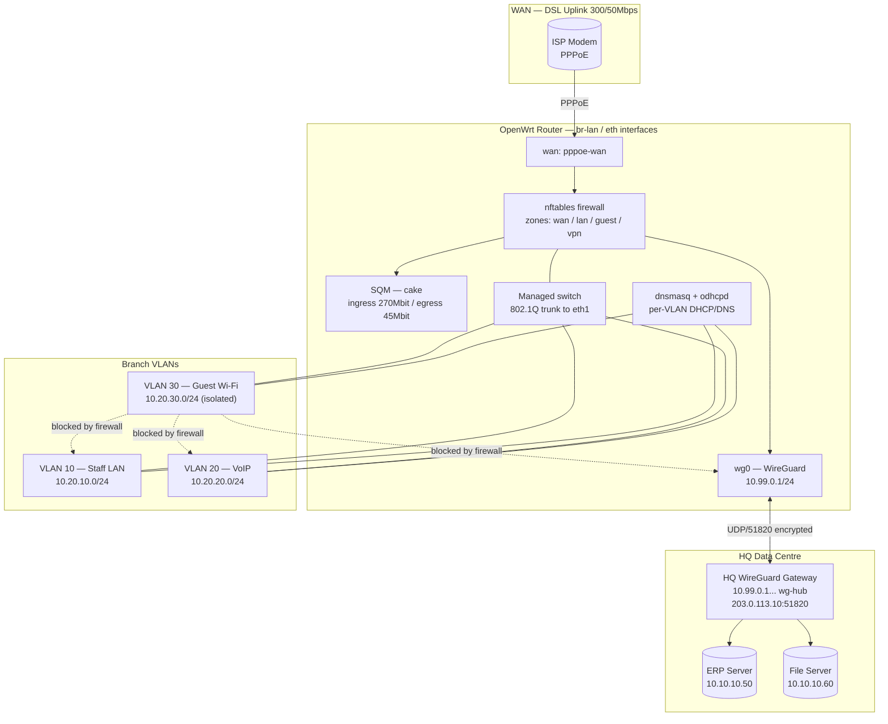
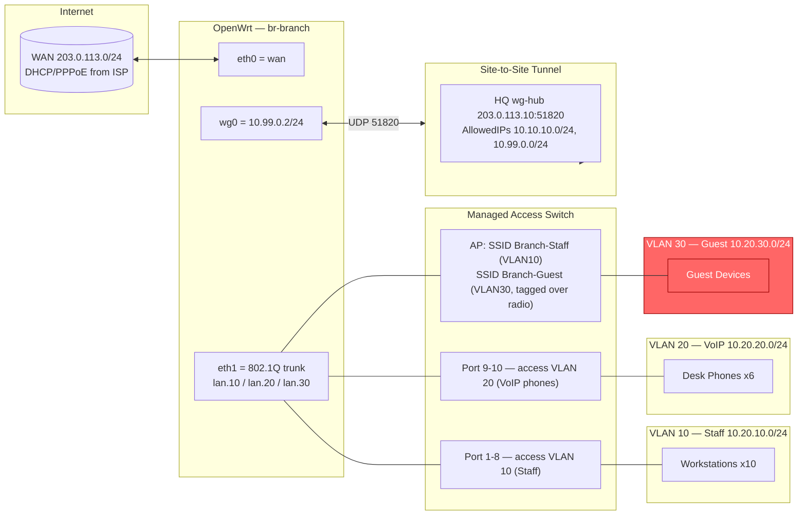

# Project 08 — OpenWrt Branch Office

## Overview

A regional distributor is opening a 12-user branch office and needs a single low-cost appliance to replace an unmanaged consumer router. The branch requires: segmented staff/VoIP/guest traffic, an isolated guest Wi-Fi that cannot reach internal VLANs or the site-to-site tunnel, an always-on encrypted link back to HQ so branch staff can reach the ERP and file server over private addressing, and fair-queuing QoS so a single large upload (backup, video call) does not starve VoIP or interactive traffic on the branch's asymmetric fibre/DSL uplink. This project builds that appliance on [Readme](../Router-and-Firewall-OS-OpenWrt/Readme.md), using the same firewall-zone model documented in Readme and the same WireGuard mechanics as Readme, re-implemented on OpenWrt's UCI configuration system.

> [!NOTE]
> **Scenario**
> Branch office, single OpenWrt appliance (Turris/Banana Pi/x86 box, 3+ physical/switch ports), WAN uplink 300/50 Mbps DSL, WireGuard tunnel to HQ over the public Internet, no on-site IT staff — configuration must be fully declarative and survive a factory-reset-and-restore.

## Architecture



## Network Diagram



## Prerequisites

| Host / Role | Interface | IP / VLAN | Notes |
|---|---|---|---|
| OpenWrt appliance | `eth0` (wan) | DHCP/PPPoE from ISP | 512MB+ RAM, 2+ NICs, `usteer`/`firewall4` capable build (23.05+) |
| OpenWrt appliance | `eth1` (trunk) | 802.1Q trunk | Carries VLAN 10, 20, 30 to switch |
| Staff LAN | `br-lan.10` | 10.20.10.0/24, GW `.1` | Workstations, printers |
| VoIP LAN | `br-lan.20` | 10.20.20.0/24, GW `.1` | Desk phones, DSCP EF prioritised |
| Guest Wi-Fi | `br-lan.30` | 10.20.30.0/24, GW `.1` | Isolated, client-to-client blocked, no VPN route |
| WireGuard tunnel | `wg0` | 10.99.0.2/24 | Branch side, peer = HQ hub |
| HQ WireGuard hub | n/a (remote) | 203.0.113.10:51820, tunnel IP 10.99.0.1/24 | Advertises 10.10.10.0/24 (ERP/File) |
| Managed switch | trunk port | 802.1Q tagged 10,20,30 | Any switch supporting VLAN tagging |
| WAN uplink | — | 300/50 Mbps DSL/fibre | SQM bandwidth set to ~90% of measured throughput |
| Admin workstation | — | 10.20.10.5 (VLAN 10 only) | LuCI/SSH management access |

## Configuration

### 1. Network — VLANs and bridge (`/etc/config/network`)

```conf
config interface 'loopback'
    option device 'lo'
    option proto 'static'
    option ipaddr '127.0.0.1'
    option netmask '255.0.0.0'

config device
    option name 'br-lan'
    option type 'bridge'
    list ports 'eth1'

config bridge-vlan
    option device 'br-lan'
    option vlan '10'
    list ports 'eth1:t'

config bridge-vlan
    option device 'br-lan'
    option vlan '20'
    list ports 'eth1:t'

config bridge-vlan
    option device 'br-lan'
    option vlan '30'
    list ports 'eth1:t'

config interface 'wan'
    option device 'eth0'
    option proto 'pppoe'
    option username 'branch01@isp.example'
    option password 'REPLACE_WITH_SECRET'
    option ipv6 'auto'

config interface 'lan_staff'
    option device 'br-lan.10'
    option proto 'static'
    option ipaddr '10.20.10.1'
    option netmask '255.255.255.0'

config interface 'lan_voip'
    option device 'br-lan.20'
    option proto 'static'
    option ipaddr '10.20.20.1'
    option netmask '255.255.255.0'

config interface 'lan_guest'
    option device 'br-lan.30'
    option proto 'static'
    option ipaddr '10.20.30.1'
    option netmask '255.255.255.0'

config interface 'wg0'
    option proto 'wireguard'
    option private_key 'BRANCH_WG_PRIVATE_KEY'
    list addresses '10.99.0.2/24'

config wireguard_wg0
    option description 'HQ hub'
    option public_key 'HQ_WG_PUBLIC_KEY'
    option endpoint_host '203.0.113.10'
    option endpoint_port '51820'
    list allowed_ips '10.99.0.0/24'
    list allowed_ips '10.10.10.0/24'
    option persistent_keepalive '25'
    option route_allowed_ips '1'
```

### 2. Wireless — staff and isolated guest SSIDs (`/etc/config/wireless`)

```conf
config wifi-iface 'wifinet_staff'
    option device 'radio0'
    option network 'lan_staff'
    option mode 'ap'
    option ssid 'Branch-Staff'
    option encryption 'sae'
    option key 'REPLACE_WITH_WPA3_PASSPHRASE'
    option isolate '0'

config wifi-iface 'wifinet_guest'
    option device 'radio0'
    option network 'lan_guest'
    option mode 'ap'
    option ssid 'Branch-Guest'
    option encryption 'psk2'
    option key 'REPLACE_WITH_GUEST_PASSPHRASE'
    option isolate '1'
```

### 3. DHCP / DNS per VLAN (`/etc/config/dhcp`)

```conf
config dhcp 'lan_staff'
    option interface 'lan_staff'
    option start '100'
    option limit '100'
    option leasetime '12h'
    option dhcpv4 'server'

config dhcp 'lan_voip'
    option interface 'lan_voip'
    option start '10'
    option limit '40'
    option leasetime '4h'
    list dhcp_option '66,10.20.20.5'

config dhcp 'lan_guest'
    option interface 'lan_guest'
    option start '50'
    option limit '150'
    option leasetime '1h'
    option dhcpv4 'server'
```

### 4. Firewall zones and forwarding (`/etc/config/firewall`)

```conf
config zone
    option name 'guest'
    list network 'lan_guest'
    option input 'REJECT'
    option output 'ACCEPT'
    option forward 'REJECT'

config zone
    option name 'vpn'
    list network 'wg0'
    option input 'REJECT'
    option output 'ACCEPT'
    option forward 'REJECT'

# Staff + VoIP may reach the VPN (and HQ); guest never can
config forwarding
    option src 'lan'
    option dest 'vpn'

config forwarding
    option src 'lan'
    option dest 'wan'

config forwarding
    option src 'guest'
    option dest 'wan'

# explicit guest isolation — no rule to lan or vpn zones (default-deny forward covers it)
config rule
    option name 'Allow-Guest-DNS-DHCP-only'
    option src 'guest'
    option proto 'udp'
    option dest_port '53 67 68'
    option target 'ACCEPT'
```

### 5. SQM — smart queue management (`/etc/config/sqm`)

```conf
config queue 'wan_sqm'
    option interface 'pppoe-wan'
    option enabled '1'
    option download '270000'
    option upload '45000'
    option qdisc 'cake'
    option script 'piece_of_cake.qos'
    option linklayer 'ethernet'
    option overhead '34'
```

> [!NOTE]
> **📸 Screenshot**
> _Capture: LuCI → Network → SQM status page showing cake queue active with the wg0 and VLAN interface list, alongside Network → Firewall → Zone Overview showing guest with no forwarding to lan/vpn._

## Security Controls

| Control | CIS / NIST Reference | Applied in this build |
|---|---|---|
| Network segmentation by VLAN | CIS Controls v8 §12.2 | Staff/VoIP/Guest on separate 802.1Q VLANs and firewall zones, not just SSIDs |
| Guest network isolation | CIS Controls v8 §12.4, NIST SP 800-53 SC-7 | `isolate '1'` on guest radio + `guest` zone has no `forwarding` rule to `lan`/`vpn` zones |
| Default-deny inter-zone forwarding | NIST SP 800-53 AC-4 | OpenWrt firewall4/nftables default `forward REJECT`; only explicit `config forwarding` rules permitted |
| Encrypted site-to-site transport | NIST SP 800-53 SC-8, SC-12 | WireGuard wg0, Curve25519 keys, `persistent_keepalive` for NAT traversal, no cleartext HQ traffic |
| Least-privilege VPN routing | NIST SP 800-53 AC-6 | `AllowedIPs` scoped to `10.99.0.0/24` + `10.10.10.0/24` only — no default-route (`0.0.0.0/0`) tunneled |
| WPA3-SAE on staff Wi-Fi | CIS Wireless Benchmark 2.1 | `encryption 'sae'` on `wifinet_staff`; guest kept on WPA2-PSK for legacy device compatibility |
| No unauthenticated management on WAN | CIS Controls v8 §4.4 | `input 'REJECT'` on `wan` zone; LuCI/SSH bound to `lan`/`vpn` zones only |
| Fair-queue QoS anti-DoS/anti-starvation | NIST SP 800-53 SC-5 (availability) | `cake` qdisc via SQM prevents one host/flow from saturating the DSL link and starving VoIP |
| DHCP/DNS restricted on guest zone | CIS Controls v8 §12.2 | Guest zone `rule` only opens UDP 53/67/68; all other guest traffic must transit `wan` forwarding, never `lan`/`vpn` |
| Config as versioned backup | NIST SP 800-53 CM-2, CP-9 | `sysupgrade -b` archive stored off-box after every change (see Deployment Steps) |

## Deployment Steps

1. Flash OpenWrt 23.05+ to the appliance and complete first boot over the default `192.168.1.1` LAN.
2. SSH in and set the root password: `passwd`.
3. Install required packages: `opkg update && opkg install wireguard-tools kmod-wireguard luci-app-wireguard luci-app-sqm kmod-sched-cake luci-proto-wireguard`.
4. Replace `/etc/config/network` with the VLAN/bridge/WireGuard config above; adjust `eth0`/`eth1` names to match hardware (`ubus call system board` to confirm).
5. Generate the branch WireGuard keypair: `wg genkey | tee /etc/wireguard/branch.key | wg pubkey > /etc/wireguard/branch.pub`; paste the private key into the `wg0` interface and send the public key to the HQ administrator to add as a peer on `wg-hub`.
6. Replace `/etc/config/wireless`, `/etc/config/dhcp`, `/etc/config/firewall`, and `/etc/config/sqm` with the sections above; substitute all `REPLACE_WITH_*` placeholders with real secrets from a password manager (never leave defaults).
7. Apply and restart networking: `uci commit && /etc/init.d/network restart && /etc/init.d/firewall restart && /etc/init.d/sqm restart`.
8. Confirm the WireGuard handshake: `wg show wg0` — expect a non-zero `latest handshake`.
9. On the HQ hub, add the branch as a peer with `AllowedIPs = 10.99.0.2/32` and confirm the branch subnet route (`10.20.10.0/24` etc., if HQ needs reverse access) is added to HQ's routing table.
10. Pair the AP radio (`radio0`) SSIDs to `lan_staff` and `lan_guest` networks per the wireless config; verify guest devices receive a `10.20.30.x` lease and staff devices receive `10.20.10.x`.
11. Physically wire the managed switch trunk port to `eth1`, tag VLANs 10/20/30, and set desk-phone/workstation access ports to their respective untagged VLAN.
12. Take a configuration backup and store it off-box: `sysupgrade -b /tmp/branch01-$(date +%F).tar.gz` then copy via `scp` to the HQ config repository.
13. Schedule a LuCI/SSH-only management access review and disable the default `admin`/blank LuCI login before handing the site to branch staff.

## Validation

1. Confirm VLAN separation from a staff host — guest subnet must be unreachable.
```text
$ ping -c2 10.20.30.50
PING 10.20.30.50: Destination Host Unreachable
```

2. Confirm guest cannot reach the WireGuard tunnel or HQ subnet.
```text
$ ping -c2 10.10.10.50    # from a guest-VLAN device
PING 10.10.10.50: Destination Host Unreachable
```

3. Confirm the WireGuard handshake and tunneled traffic to HQ.
```text
$ wg show wg0
interface: wg0
  public key: BRANCH_PUBLIC_KEY...
  private key: (hidden)
  listening port: 51820

peer: HQ_WG_PUBLIC_KEY...
  endpoint: 203.0.113.10:51820
  allowed ips: 10.99.0.0/24, 10.10.10.0/24
  latest handshake: 42 seconds ago
  transfer: 812.4 KiB received, 1.05 MiB sent
```

4. Confirm staff can reach the HQ ERP server over the tunnel.
```text
$ curl -sI http://10.10.10.50:8080/ | head -1
HTTP/1.1 200 OK
```

5. Confirm SQM/cake is active and shaping the WAN link.
```text
$ tc -s qdisc show dev pppoe-wan
qdisc cake 8001: root refcnt 2 bandwidth 45Mbit diffserv4 triple-isolate
 Sent 128934112 bytes 91204 pkt (dropped 0, overlimits 4021 requeues 0)
```

6. Confirm nftables default-deny is in force between guest and lan/vpn zones.
```text
$ nft list ruleset | grep -A2 'chain forward'
chain forward {
    type filter hook forward priority 0; policy drop;
    ...
}
```

## Future Improvements

- Add a second WAN (LTE failover) with `mwan3` for uplink redundancy.
- Migrate VoIP VLAN to 802.1p/DSCP-aware switch ports for end-to-end QoS marking, not just router-side cake prioritisation.
- Add `usteer`-based band steering once a second AP is deployed for larger branch offices.
- Push WireGuard key rotation to an Ansible playbook run quarterly from HQ.
- Enable `banIP`/`https-dns-proxy` for branch-side DNS filtering and threat-intel blocklists.
- Replace static PSK guest Wi-Fi with a captive portal (`luci-app-nodogsplash`) for audit-logged guest access.

## References

- OpenWrt Wiki — WireGuard site-to-site setup: https://openwrt.org/docs/guide-user/services/vpn/wireguard/start
- OpenWrt Wiki — VLANs and Switch configuration (DSA): https://openwrt.org/docs/guide-user/network/vlan/switch_configuration
- OpenWrt Wiki — SQM Queue Discipline configuration: https://openwrt.org/docs/guide-user/network/traffic-shaping/sqm
- CIS Controls v8 — Network Infrastructure Management: https://www.cisecurity.org/controls/network-infrastructure-management
- NIST SP 800-53 Rev.5 — SC-7 Boundary Protection, SC-8 Transmission Confidentiality: https://csrc.nist.gov/pubs/sp/800/53/r5/upd1/final
- WireGuard — Protocol & Cryptography Whitepaper: https://www.wireguard.com/papers/wireguard.pdf

## Related Notes

- [Readme](../Router-and-Firewall-OS-OpenWrt/Readme.md)
- Readme
- Readme
- Readme
- [Linux Administration & Server Hardening](../Readme.md) — course hub and map of content
