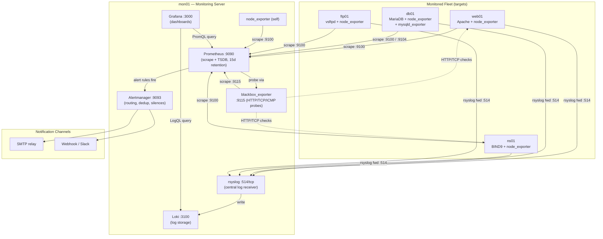
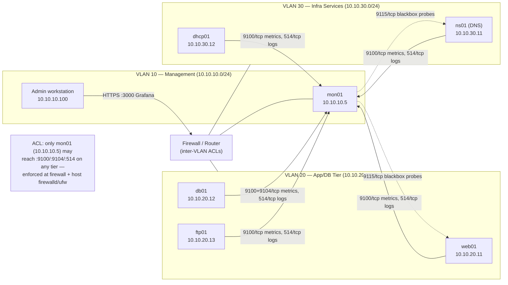

# Project 09 — Central Monitoring Server

## Overview

A mid-size enterprise runs ~40 Linux hosts (web tier, DB tier, DNS/DHCP infra, jump hosts) with **no centralized visibility** — outages are discovered by users, not alerts, and post-incident log review means SSHing into each box individually. This project builds a **single monitoring/observability server** that scrapes metrics from every host via [Node Exporter](../Monitoring/Metrics-with-Prometheus.md) and [Blackbox Exporter](../Monitoring/Metrics-with-Prometheus.md), visualizes them in Grafana, fires alerts through Alertmanager (email + webhook), and centralizes syslog via rsyslog forwarding into Loki so logs and metrics live in one pane of glass.

Goal: stand up Prometheus + Grafana + Alertmanager + exporters + Loki/rsyslog on one hardened Debian/RHEL host, onboard a representative fleet (web, DB, DNS servers built in earlier modules), and prove end-to-end detection — an intentionally stopped service triggers an alert within the scrape interval, and its log line is queryable in Grafana within seconds.

This integrates [Readme](../Monitoring/Readme.md), plus the [Apache](../Apache-Web-Server/Readme.md), MariaDB, and [DNS](../Domain-Name-System-DNS/Readme.md) modules as monitored targets.

> [!NOTE]
> **Production framing**
> This mirrors a Red Hat / CNCF-style "day-2 operations" reference build: Prometheus for metrics, Alertmanager for routing/dedup, Grafana for dashboards, and a log pipeline that doesn't require a heavyweight ELK stack.

## Architecture



## Network Diagram



## Prerequisites

| Host | Role | IP / VLAN | OS | Resources |
|---|---|---|---|---|
| `mon01` | Prometheus, Grafana, Alertmanager, Loki, rsyslog server | 10.10.10.5 / VLAN 10 (Mgmt) | Debian 12 | 4 vCPU, 8 GB RAM, 100 GB disk (TSDB + Loki chunks) |
| `web01` | Apache target ([Readme](../Apache-Web-Server/Readme.md)) | 10.10.20.11 / VLAN 20 | Debian 12 | 2 vCPU, 2 GB RAM |
| `db01` | MariaDB target (Readme) | 10.10.20.12 / VLAN 20 | Debian 12 | 2 vCPU, 4 GB RAM |
| `ftp01` | vsftpd target ([Readme](../FTP-Server-VSFTPD/Readme.md)) | 10.10.20.13 / VLAN 20 | Debian 12 | 2 vCPU, 2 GB RAM |
| `ns01` | BIND9 DNS target ([Readme](../Domain-Name-System-DNS/Readme.md)) | 10.10.30.11 / VLAN 30 | Debian 12 | 2 vCPU, 2 GB RAM |
| Admin workstation | Grafana access, SSH admin | 10.10.10.100 / VLAN 10 | Any | Browser + SSH client |

Software versions used in this build: Prometheus 2.53.x, Alertmanager 0.27.x, Grafana 10.4.x, node_exporter 1.8.x, blackbox_exporter 0.25.x, mysqld_exporter 0.15.x, Loki 2.9.x + Promtail 2.9.x, rsyslog 8.x (default on Debian 12).

## Configuration

### Prometheus server (`mon01`)

`/etc/prometheus/prometheus.yml`:

```yaml
global:
  scrape_interval: 15s
  evaluation_interval: 15s
  external_labels:
    cluster: "prod-linux-fleet"
    monitor: "mon01"

alerting:
  alertmanagers:
    - static_configs:
        - targets: ["localhost:9093"]

rule_files:
  - "/etc/prometheus/rules/*.rules.yml"

scrape_configs:
  - job_name: "node_exporter"
    static_configs:
      - targets:
          - "10.10.10.5:9100"   # mon01 (self)
          - "10.10.20.11:9100"  # web01
          - "10.10.20.12:9100"  # db01
          - "10.10.20.13:9100"  # ftp01
          - "10.10.30.11:9100"  # ns01
        labels: {}

  - job_name: "mysqld_exporter"
    static_configs:
      - targets: ["10.10.20.12:9104"]

  - job_name: "blackbox_http"
    metrics_path: /probe
    params:
      module: [http_2xx]
    static_configs:
      - targets:
          - "http://10.10.20.11/"
    relabel_configs:
      - source_labels: [__address__]
        target_label: __param_target
      - source_labels: [__param_target]
        target_label: instance
      - target_label: __address__
        replacement: 10.10.10.5:9115

  - job_name: "blackbox_dns"
    metrics_path: /probe
    params:
      module: [dns_udp]
    static_configs:
      - targets:
          - "10.10.30.11"
    relabel_configs:
      - source_labels: [__address__]
        target_label: __param_target
      - source_labels: [__param_target]
        target_label: instance
      - target_label: __address__
        replacement: 10.10.10.5:9115
```

`/etc/prometheus/rules/node.rules.yml`:

```yaml
groups:
  - name: node-alerts
    rules:
      - alert: InstanceDown
        expr: up == 0
        for: 1m
        labels:
          severity: critical
        annotations:
          summary: "{{ $labels.instance }} is down"
          description: "{{ $labels.job }} on {{ $labels.instance }} has been unreachable for over 1 minute."

      - alert: HighDiskUsage
        expr: (node_filesystem_avail_bytes{mountpoint="/"} / node_filesystem_size_bytes{mountpoint="/"}) * 100 < 10
        for: 5m
        labels:
          severity: warning
        annotations:
          summary: "Low disk space on {{ $labels.instance }}"
          description: "Root filesystem has less than 10% free space."

      - alert: HighCPULoad
        expr: 100 - (avg by(instance) (rate(node_cpu_seconds_total{mode="idle"}[5m])) * 100) > 90
        for: 10m
        labels:
          severity: warning
        annotations:
          summary: "High CPU load on {{ $labels.instance }}"
```

### Node exporter (every target host, e.g. `web01`)

```bash
useradd --no-create-home --shell /usr/sbin/nologin node_exporter
tar xzf node_exporter-1.8.2.linux-amd64.tar.gz
install -m 755 node_exporter-1.8.2.linux-amd64/node_exporter /usr/local/bin/
```

`/etc/systemd/system/node_exporter.service`:

```ini
[Unit]
Description=Prometheus Node Exporter
After=network-online.target

[Service]
User=node_exporter
Group=node_exporter
Type=simple
ExecStart=/usr/local/bin/node_exporter --web.listen-address=127.0.0.1:9100 --web.listen-address=10.10.20.11:9100
NoNewPrivileges=yes
ProtectSystem=strict
ProtectHome=yes

[Install]
WantedBy=multi-user.target
```

### Alertmanager (`mon01`)

`/etc/alertmanager/alertmanager.yml`:

```yaml
global:
  smtp_smarthost: "smtp-relay.internal:587"
  smtp_from: "alertmanager@internal.lab"

route:
  receiver: "default-email"
  group_by: ["alertname", "instance"]
  group_wait: 30s
  group_interval: 5m
  repeat_interval: 4h
  routes:
    - match:
        severity: critical
      receiver: "oncall-webhook"
      continue: true

receivers:
  - name: "default-email"
    email_configs:
      - to: "sysadmins@internal.lab"
        send_resolved: true
  - name: "oncall-webhook"
    webhook_configs:
      - url: "http://127.0.0.1:5001/alert"
        send_resolved: true
```

### rsyslog forwarding (each target, e.g. `web01`)

`/etc/rsyslog.d/90-forward-mon01.conf`:

```ini
# Forward all logs to central monitoring server over TCP (RFC 5424)
*.* @@10.10.10.5:514
$ActionQueueType LinkedList
$ActionQueueFileName fwdMon01
$ActionResumeRetryCount -1
$ActionQueueSaveOnShutdown on
```

### rsyslog central receiver (`mon01`) → Loki

`/etc/rsyslog.d/10-central-receiver.conf`:

```ini
module(load="imtcp")
input(type="imtcp" port="514")

# Write to a per-host log file; promtail tails these into Loki
template(name="PerHostLogs" type="string"
  string="/var/log/central/%HOSTNAME%/%PROGRAMNAME%.log")

*.* action(type="omfile" dynaFile="PerHostLogs")
```

`/etc/promtail/config.yml`:

```yaml
server:
  http_listen_port: 9080

clients:
  - url: http://127.0.0.1:3100/loki/api/v1/push

scrape_configs:
  - job_name: central_syslog
    static_configs:
      - targets: [localhost]
        labels:
          job: syslog
          __path__: /var/log/central/**/*.log
```

## Security Controls

| Control | CIS / NIST Reference | Applied in this build |
|---|---|---|
| Least-privilege service accounts | CIS Debian 12 §5.x (no login shells for daemons) | `node_exporter`, `prometheus`, `grafana` run as dedicated `nologin` system users, not root |
| Network segmentation | NIST 800-53 SC-7 (Boundary Protection) | Firewall ACL restricts :9100/:9104/:9115/:514 to source `10.10.10.5` only |
| Encrypted transport for dashboards | CIS Benchmark §2.2 (encrypt admin interfaces) | Grafana reverse-proxied behind Nginx with TLS (see [Binding-with-Type(SSL-TLS)](../Apache-Web-Server/Binding-with-Type(SSL-TLS).md) pattern applied to Nginx/Grafana) |
| No anonymous Grafana access | CIS Grafana Hardening §1 | `auth.anonymous.enabled = false`, org role default = `Viewer` |
| Alertmanager/Prometheus not internet-facing | NIST 800-53 SC-7 | Bound to management VLAN only; no public listener |
| Log integrity / centralization | CIS §4.2 (Configure Logging), NIST AU-4 | rsyslog TCP forwarding with disk-assisted queue (no log loss on link failure) |
| systemd sandboxing | CIS §1.1 hardening pattern | `NoNewPrivileges=yes`, `ProtectSystem=strict`, `ProtectHome=yes` on exporter units |
| Alert on unauthorized service stop | NIST SI-4 (System Monitoring) | `InstanceDown` + service-specific `up{job=...}` alerts wired to Alertmanager |
| Credential hygiene for exporters | CIS §16 (Access, Authentication) | `mysqld_exporter` uses a dedicated MySQL user with `PROCESS, REPLICATION CLIENT` only, no `ALL PRIVILEGES` |
| Retention & storage limits | NIST AU-11 (Audit record retention) | Prometheus `--storage.tsdb.retention.time=15d`; Loki retention configured at 30d via compactor |

> [!NOTE]
> **📸 Screenshot**
> _Capture: the Grafana "Fleet Overview" dashboard showing all 5 targets `up`, plus the Loki log panel with a live-tailed syslog stream from `web01`._

## Deployment Steps

1. Provision `mon01` (Debian 12, 8 GB RAM, 100 GB disk) on VLAN 10 and apply baseline OS hardening (see Readme).
2. Create system users: `useradd --no-create-home --shell /usr/sbin/nologin prometheus grafana` (Grafana installs its own via package).
3. Install Prometheus, Alertmanager binaries under `/usr/local/bin`, deploy `prometheus.yml` and rule files as shown above, create systemd units, `systemctl enable --now prometheus alertmanager`.
4. Install Grafana from the official APT repo, `systemctl enable --now grafana-server`, and disable anonymous access in `/etc/grafana/grafana.ini`.
5. Install Loki + Promtail on `mon01`; configure Promtail to tail `/var/log/central/**/*.log` as shown above.
6. Deploy `node_exporter` to `web01`, `db01`, `ftp01`, `ns01` following the systemd unit above; open firewall rule to allow `mon01` only on :9100.
7. Deploy `mysqld_exporter` on `db01`; create a scoped MySQL monitoring user: `CREATE USER 'exporter'@'10.10.10.5' IDENTIFIED BY '<strong-pass>'; GRANT PROCESS, REPLICATION CLIENT ON *.* TO 'exporter'@'10.10.10.5';`
8. Install `blackbox_exporter` on `mon01`; configure `http_2xx` and `dns_udp` probe modules in `/etc/blackbox_exporter/config.yml`.
9. Push `90-forward-mon01.conf` rsyslog config to every target host, restart `rsyslog`, and enable the `imtcp` receiver on `mon01`.
10. In Grafana, add Prometheus (`http://localhost:9090`) and Loki (`http://localhost:3100`) as data sources.
11. Import/build the "Fleet Overview" dashboard: node CPU/mem/disk panels, blackbox probe success panel, and a Loki log panel filtered by `{job="syslog"}`.
12. Configure Alertmanager email + webhook receivers, then reload: `curl -X POST http://localhost:9090/-/reload` and `systemctl reload alertmanager`.
13. Restrict inbound ports at the perimeter firewall so only `10.10.10.5` may reach 9100/9104/9115/514 on any monitored VLAN.
14. Put Grafana behind an Nginx TLS reverse proxy on `mon01` before exposing it to the admin workstation.

## Validation

1. Confirm all Prometheus targets are healthy:

```text
$ curl -s http://10.10.10.5:9090/api/v1/targets | jq -r '.data.activeTargets[] | "\(.labels.instance) \(.health)"'
10.10.10.5:9100 up
10.10.20.11:9100 up
10.10.20.12:9100 up
10.10.20.13:9100 up
10.10.30.11:9100 up
10.10.20.12:9104 up
```

2. Trigger an alert by stopping Apache on `web01`, then check Alertmanager within 90s:

```text
$ curl -s http://10.10.10.5:9093/api/v2/alerts | jq -r '.[].labels.alertname'
InstanceDown
```

3. Confirm blackbox HTTP probe detects the outage:

```text
$ curl -s 'http://10.10.10.5:9090/api/v1/query?query=probe_success{instance="http://10.10.20.11/"}' | jq '.data.result[0].value[1]'
"0"
```

4. Verify centralized logs are flowing into Loki:

```text
$ curl -s -G 'http://10.10.10.5:3100/loki/api/v1/query_range' \
    --data-urlencode 'query={job="syslog"} |= "web01"' | jq '.data.result | length'
1
```

5. Confirm alert email/webhook was delivered (check mail queue or webhook receiver log):

```text
$ journalctl -u alertmanager --since "5 min ago" | grep -i "notify"
level=info msg="Notify success" receiver=default-email
```

6. Restart Apache on `web01` and confirm the alert auto-resolves within the next evaluation cycle:

```text
$ curl -s http://10.10.10.5:9093/api/v2/alerts | jq -r '.[].labels.alertname'
(no output — alert list empty)
```

## Future Improvements

- Migrate Prometheus to a Thanos or Mimir remote-write backend for long-term (>90d) retention and HA.
- Add Alertmanager high availability (2-node cluster with gossip) to remove the single point of failure.
- Replace static `static_configs` targets with file-based service discovery or Consul SD for dynamic fleet growth.
- Add SNMP exporter for network switches/firewalls to bring infra devices into the same dashboards.
- Enforce mTLS between exporters and Prometheus instead of relying solely on network ACLs.
- Add Grafana OAuth/SSO integration (tie into an LDAP/AD source) instead of local accounts.

## References

- Prometheus documentation — https://prometheus.io/docs/
- Grafana documentation — https://grafana.com/docs/
- Alertmanager configuration reference — https://prometheus.io/docs/alerting/latest/configuration/
- Grafana Loki documentation — https://grafana.com/docs/loki/latest/
- CIS Debian Linux 12 Benchmark
- NIST SP 800-53 Rev. 5 (SC-7, AU-4, AU-11, SI-4)
- rsyslog high-performance TCP forwarding docs — https://www.rsyslog.com/doc/

## Related Notes

- [Readme](../Monitoring/Readme.md)
- [Readme](../Apache-Web-Server/Readme.md)
- Readme
- [Readme](../Domain-Name-System-DNS/Readme.md)
- [Readme](../FTP-Server-VSFTPD/Readme.md)
- Readme
- [Linux Administration & Server Hardening](../Readme.md) — course hub and map of content
