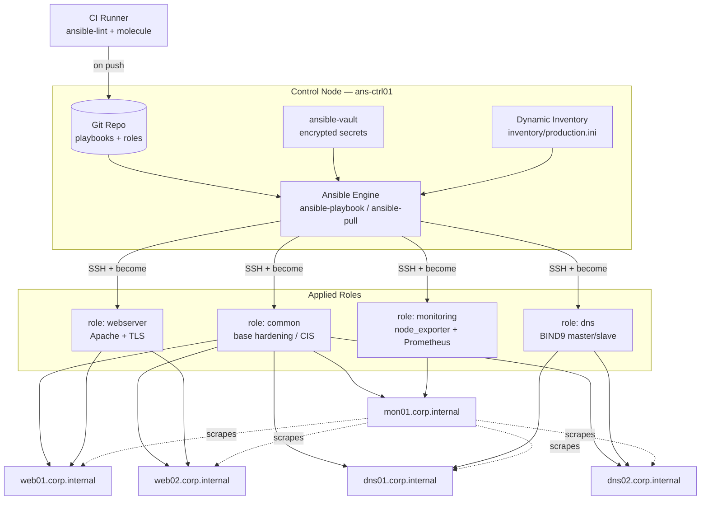
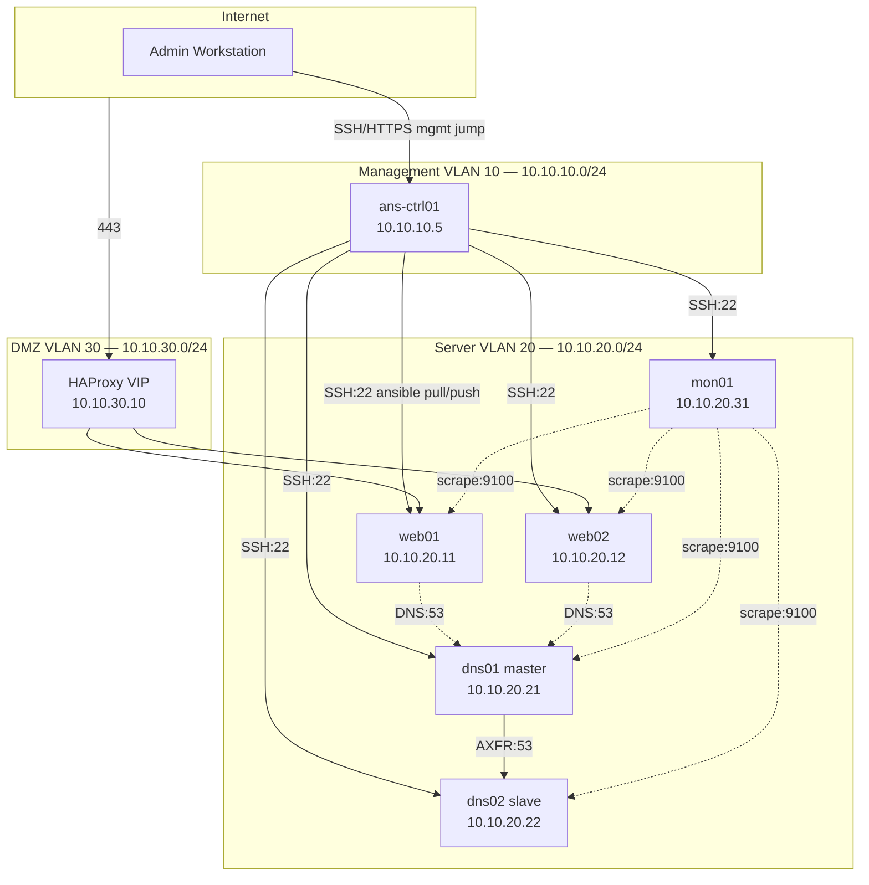

# Project 10 — Infrastructure Automation

## Overview

A mid-size hosting provider runs its estate — web tier, DNS, monitoring, and the base OS — as a patchwork of manually configured hosts. Every rebuild drifts from the last: forgotten `sysctl` flags, inconsistent SSH ciphers, DNS zones edited by hand on one server and copied sloppily to the next. An audit finding ("no evidence of consistent hardening across hosts") forces the issue.

The goal of this capstone is to replace hand-configuration with a single **Ansible control node** that owns the entire estate as code: a CIS-aligned hardening role applied to every host, a web role, a DNS role, and a monitoring role, all idempotent and tracked in Git. Re-running the playbook against any host — new or existing — converges it to the same known-good state, and every change to infrastructure is a reviewable commit rather than an SSH session nobody remembers.

This project integrates [Readme](../Automation/Readme.md), the [Apache Web Server](../Apache-Web-Server/Apache-Directory-Listing-and-Access-Control.md) module, and the [DNS](../Domain-Name-System-DNS/Master-Nameserver.md) module.

> [!NOTE]
> **Why this matters**
> Configuration drift is the silent cause of most "works on one server, not the other" incidents. Idempotent, version-controlled automation turns server configuration from a one-time act into a continuously enforced, auditable policy — the same discipline CIS Benchmarks and NIST 800-53 (CM-2, CM-6) expect from a managed estate.

## Architecture



## Network Diagram



## Prerequisites

| Host | Role | IP | OS | Resources | Notes |
|---|---|---|---|---|---|
| ans-ctrl01 | Ansible control node | 10.10.10.5 | Debian 12 | 2 vCPU / 4 GB / 40 GB | Holds Git repo, vault password, SSH CA |
| web01 | Apache web (primary) | 10.10.20.11 | RHEL 9 | 2 vCPU / 4 GB | Managed node, TLS via Let's Encrypt |
| web02 | Apache web (secondary) | 10.10.20.12 | RHEL 9 | 2 vCPU / 4 GB | Managed node |
| dns01 | BIND9 master | 10.10.20.21 | Debian 12 | 1 vCPU / 2 GB | Authoritative for corp.internal |
| dns02 | BIND9 slave | 10.10.20.22 | Debian 12 | 1 vCPU / 2 GB | AXFR from dns01 |
| mon01 | Prometheus + Grafana | 10.10.20.31 | Debian 12 | 2 vCPU / 4 GB | Scrapes node_exporter fleet-wide |
| lb01 (VIP) | HAProxy front | 10.10.30.10 | RHEL 9 | 2 vCPU / 4 GB | DMZ-facing, not Ansible-managed in this scope |

Software prerequisites on `ans-ctrl01`: `ansible-core >= 2.16`, `ansible-lint`, `python3-passlib` (for `password_hash` filter), `git`, SSH key pair distributed to all managed nodes, `ansible-vault` password file (`0600`, outside the repo).

## Configuration

### Inventory

```ini
# inventory/production.ini
[web]
web01 ansible_host=10.10.20.11
web02 ansible_host=10.10.20.12

[dns]
dns01 ansible_host=10.10.20.21 dns_role=master
dns02 ansible_host=10.10.20.22 dns_role=slave

[monitoring]
mon01 ansible_host=10.10.20.31

[all:vars]
ansible_user=svc_ansible
ansible_become=true
ansible_become_method=sudo
ansible_ssh_private_key_file=~/.ssh/ans_ctrl_ed25519
ansible_python_interpreter=/usr/bin/python3
```

### ansible.cfg

```ini
# ansible.cfg
[defaults]
inventory       = inventory/production.ini
roles_path      = roles
retry_files_enabled = False
host_key_checking  = True
vault_password_file = ~/.vault_pass.txt
stdout_callback = yaml
forks           = 10

[privilege_escalation]
become        = True
become_method = sudo
become_ask_pass = False
```

### Site playbook

```yaml
# site.yml
- name: Apply baseline hardening to every host
  hosts: all
  roles:
    - common

- name: Configure web tier
  hosts: web
  roles:
    - webserver

- name: Configure DNS tier
  hosts: dns
  roles:
    - dns

- name: Configure monitoring
  hosts: monitoring
  roles:
    - monitoring
```

### role: common (CIS baseline, excerpt)

```yaml
# roles/common/tasks/main.yml
- name: Enforce password aging policy (CIS 5.4.1.1)
  ansible.builtin.lineinfile:
    path: /etc/login.defs
    regexp: '^PASS_MAX_DAYS'
    line: 'PASS_MAX_DAYS   90'

- name: Disable root SSH login (CIS 5.2.10)
  ansible.builtin.lineinfile:
    path: /etc/ssh/sshd_config
    regexp: '^#?PermitRootLogin'
    line: 'PermitRootLogin no'
  notify: restart sshd

- name: Enforce SSH protocol and ciphers
  ansible.builtin.blockinfile:
    path: /etc/ssh/sshd_config
    marker: "# {mark} ANSIBLE HARDENING BLOCK"
    block: |
      Protocol 2
      Ciphers chacha20-poly1305@openssh.com,aes256-gcm@openssh.com
      MACs hmac-sha2-512-etm@openssh.com
  notify: restart sshd

- name: Enable and start firewalld
  ansible.builtin.service:
    name: firewalld
    state: started
    enabled: true

- name: Set kernel network hardening sysctls (CIS 3.2/3.3)
  ansible.posix.sysctl:
    name: "{{ item.key }}"
    value: "{{ item.value }}"
    sysctl_set: true
    reload: true
  loop:
    - { key: 'net.ipv4.conf.all.accept_redirects', value: '0' }
    - { key: 'net.ipv4.conf.all.send_redirects',   value: '0' }
    - { key: 'net.ipv4.tcp_syncookies',            value: '1' }

- name: Install auditd
  ansible.builtin.package:
    name: audit
    state: present

- name: Deploy CIS audit rules
  ansible.builtin.copy:
    src: audit.rules
    dest: /etc/audit/rules.d/hardening.rules
    mode: '0640'
  notify: restart auditd
```

### role: webserver (excerpt)

```yaml
# roles/webserver/tasks/main.yml
- name: Install Apache
  ansible.builtin.package:
    name: httpd
    state: present

- name: Deploy hardened Apache security config
  ansible.builtin.template:
    src: security.conf.j2
    dest: /etc/httpd/conf.d/security.conf
    mode: '0644'
  notify: reload apache

- name: Disable directory listing (Apache-Directory-Listing-and-Access-Control)
  ansible.builtin.lineinfile:
    path: /etc/httpd/conf/httpd.conf
    regexp: '^Options'
    line: 'Options -Indexes +FollowSymLinks'
  notify: reload apache

- name: Ensure Apache enabled and running
  ansible.builtin.service:
    name: httpd
    state: started
    enabled: true
```

### role: dns (excerpt)

```yaml
# roles/dns/tasks/main.yml
- name: Install BIND9
  ansible.builtin.package:
    name: bind9
    state: present

- name: Deploy zone file (master only)
  ansible.builtin.template:
    src: db.corp.internal.j2
    dest: /etc/bind/db.corp.internal
    mode: '0644'
  when: dns_role == 'master'
  notify: reload bind9

- name: Deploy named.conf.options with allow-transfer
  ansible.builtin.template:
    src: named.conf.options.j2
    dest: /etc/bind/named.conf.options
    mode: '0644'
  notify: reload bind9
```

### role: monitoring — node_exporter deployed fleet-wide

```bash
# roles/monitoring/tasks/node_exporter.yml (referenced from common as a handler target)
ansible-playbook site.yml --tags node_exporter --check --diff
```

### Secrets — ansible-vault

```bash
# Encrypt the DNS TSIG key and Grafana admin password
ansible-vault encrypt group_vars/all/vault.yml
ansible-vault view group_vars/all/vault.yml
```

## Security Controls

| Control | CIS / NIST Reference | Applied In This Build |
|---|---|---|
| No plaintext root SSH login | CIS 5.2.10 / NIST AC-6 | `common` role sets `PermitRootLogin no`, enforced on every host on every run |
| Strong SSH ciphers/MACs only | CIS 5.2.13-14 / NIST SC-13 | `common` role blockinfile pins `chacha20-poly1305`, `aes256-gcm`, `hmac-sha2-512-etm` |
| Password aging enforced | CIS 5.4.1.1 / NIST IA-5 | `PASS_MAX_DAYS 90` templated in `/etc/login.defs` |
| Host-based firewall enabled | CIS 3.4 / NIST SC-7 | `firewalld` enabled+started by `common`; per-role tasks open only required ports |
| Auditd logging of privileged actions | CIS 4.1 / NIST AU-2 | `audit` package + custom rules file deployed and loaded on every host |
| No directory listing on web root | CIS Apache Benchmark 3.x / NIST SC-13 | `webserver` role sets `Options -Indexes`, ties into [Apache-Directory-Listing-and-Access-Control](../Apache-Web-Server/Apache-Directory-Listing-and-Access-Control.md) |
| Zone transfers restricted to known slaves | CIS BIND recommendations / NIST SC-8 | `named.conf.options.j2` templates `allow-transfer { <dns02 IP>; };` |
| Secrets never stored in plaintext | NIST SC-28 | All credentials/TSIG keys live in `ansible-vault`-encrypted `vault.yml`, never committed unencrypted |
| Config drift detection | NIST CM-2/CM-6 | Nightly `--check --diff` cron run against `site.yml`; any diff alerts via monitoring role |
| Change traceability | NIST CM-3 | All roles/playbooks version-controlled in Git; every apply is a commit + CI lint gate |

## Deployment Steps

1. Provision `ans-ctrl01` and generate the control-node SSH keypair: `ssh-keygen -t ed25519 -f ~/.ssh/ans_ctrl_ed25519 -C "ansible-control"`.
2. Distribute the public key to the `svc_ansible` account on every managed host (`ssh-copy-id -i ~/.ssh/ans_ctrl_ed25519.pub svc_ansible@<host>`).
3. Clone the infrastructure repo onto the control node: `git clone git@corp.internal:infra/ansible-estate.git && cd ansible-estate`.
4. Install collections and roles dependencies: `ansible-galaxy collection install -r requirements.yml`.
5. Create `~/.vault_pass.txt` (mode `0600`) with the vault password and confirm `ansible.cfg` points to it.
6. Verify connectivity to the whole inventory: `ansible all -m ping`.
7. Lint before every apply: `ansible-lint site.yml`.
8. Dry-run the full estate: `ansible-playbook site.yml --check --diff`.
9. Apply the baseline hardening role first, in isolation: `ansible-playbook site.yml --tags common --limit all`.
10. Apply the remaining roles: `ansible-playbook site.yml --limit web,dns,monitoring`.
11. Confirm BIND slave zone transfer succeeded on `dns02`: `rndc retransfer corp.internal`.
12. Register `mon01` as the Prometheus scrape target for all `node_exporter` endpoints and reload: `ansible-playbook site.yml --tags monitoring`.
13. Schedule a nightly drift-check cron on the control node: `0 2 * * * ansible-playbook /opt/ansible-estate/site.yml --check --diff | mail -s "Drift Report" secops@corp.internal`.
14. Commit the initial converged state to Git and tag it: `git tag -a v1.0-baseline -m "Initial converged estate"`.

## Validation

1. Confirm every host reports reachable and reports the correct hostname:

```text
$ ansible all -m setup -a 'filter=ansible_hostname'
web01 | SUCCESS => { "ansible_facts": { "ansible_hostname": "web01" } }
web02 | SUCCESS => { "ansible_facts": { "ansible_hostname": "web02" } }
dns01 | SUCCESS => { "ansible_facts": { "ansible_hostname": "dns01" } }
```

2. Re-run the full playbook and confirm idempotency (zero changed tasks on the second run):

```text
$ ansible-playbook site.yml
PLAY RECAP *********************************************************
web01  : ok=18  changed=0  unreachable=0  failed=0
web02  : ok=18  changed=0  unreachable=0  failed=0
dns01  : ok=14  changed=0  unreachable=0  failed=0
```

3. Verify SSH root login is refused on a managed node:

```text
$ ssh root@web01
Permission denied (publickey,password).
```

4. Verify DNS zone transfer between master and slave succeeded:

```text
$ dig @10.10.20.22 corp.internal AXFR | tail -3
corp.internal.  86400 IN NS dns02.corp.internal.
;; Query time: 12 msec
;; XFR size: 9 records
```

5. Confirm Prometheus is scraping all `node_exporter` targets healthily:

```text
$ curl -s http://10.10.20.31:9090/api/v1/targets | jq -r '.data.activeTargets[].health'
up
up
up
up
up
```

> [!NOTE]
> **📸 Screenshot**
> _Capture: the `ansible-playbook site.yml` PLAY RECAP output showing `changed=0` across all hosts on a re-run, proving idempotency._

## Future Improvements

- Migrate from static `inventory/production.ini` to a dynamic inventory plugin (e.g. `ansible.builtin.yaml` backed by a CMDB or cloud provider inventory plugin).
- Add Molecule test scenarios per role, run in CI on every pull request before merge.
- Introduce `ansible-pull` on a systemd timer for hosts that cannot accept inbound SSH from the control node (pull model for edge nodes).
- Wrap `ansible-vault` in an external secrets backend (HashiCorp Vault lookup plugin) instead of a static vault password file.
- Add a `handlers`-driven blue/green apply for the web role so `httpd` reloads never interrupt in-flight connections behind the HAProxy VIP.
- Extend the monitoring role with Alertmanager rules tied to the drift-check cron so failed `--check` diffs page on-call automatically.

## References

- Ansible Documentation — https://docs.ansible.com/
- CIS Benchmarks — https://www.cisecurity.org/cis-benchmarks
- NIST SP 800-53 Rev. 5 — https://csrc.nist.gov/pubs/sp/800/53/r5/upd1/final
- Ansible Vault documentation — https://docs.ansible.com/ansible/latest/vault_guide/index.html
- BIND 9 Administrator Reference Manual — https://bind9.readthedocs.io/

## Related Notes

- [Readme](../Automation/Readme.md)
- [Apache-Directory-Listing-and-Access-Control](../Apache-Web-Server/Apache-Directory-Listing-and-Access-Control.md)
- [Master-Nameserver](../Domain-Name-System-DNS/Master-Nameserver.md)
- [Slave-DNS-Server](../Domain-Name-System-DNS/Slave-DNS-Server.md)
- [Linux Administration & Server Hardening](../Readme.md) — course hub and map of content
