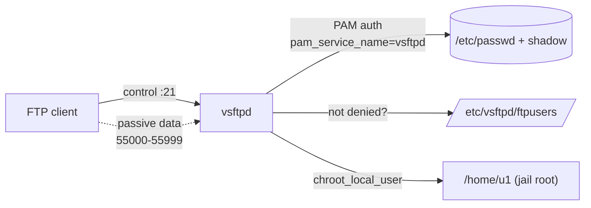

# Access User Home Directory on FTP Server using vsftpd

## Overview

This note walks through configuring a **`vsftpd`** FTP server so that local system users (for example `u1` and `u2`) authenticate with their own credentials and are confined to — and land in — their own home directories. This is the classic "shell users over FTP" pattern: each account logs in, is `chroot`-jailed to `/home/<user>`, and can read/write only its own files.

> [!WARNING]
> **Plaintext protocol**
> Standard FTP transmits credentials and data **in cleartext**. Use it only on trusted/isolated networks. For anything internet-facing, prefer **SFTP** (over SSH) or add TLS — see [TLS-Encryption-on-FTP](TLS-Encryption-on-FTP.md).

## Concepts

| Term | Meaning |
|---|---|
| Local user | A real account in `/etc/passwd` with a password and (usually) a shell. |
| `chroot` jail | Restricts a logged-in user's filesystem view to a single directory subtree. |
| Home directory | The per-user landing directory (`/home/<user>`) the FTP session is rooted at. |
| Passive mode | Data channel where the **server** opens a high port and the client connects to it — required behind NAT/firewalls. |

## Architecture



## Configuration

The end-to-end procedure is: create the accounts, edit `vsftpd.conf`, handle SELinux, fix home-directory ownership, open the firewall, then restart and test.

### Create Local Users

Create two local user accounts (`u1` and `u2`). These users will be used to test FTP access.

```bash
useradd u1
```

```bash
useradd u2
```

Set passwords for the new users:

```bash
passwd u1
```

```bash
passwd u2
```

> [!NOTE]
> Each user must have a valid password to authenticate via FTP.

### Edit the vsftpd Configuration File

Open the main configuration file:

```bash
vim /etc/vsftpd/vsftpd.conf
```

Example configuration confining local users to their home directories:

```ini
# Disallow anonymous logins
anonymous_enable=NO

# Enable local user login
local_enable=YES

# Allow FTP write commands (upload, delete, etc.)
write_enable=YES

# Set default permissions for uploaded files
local_umask=022

# Display directory-specific messages if any
dirmessage_enable=YES

# Enable logging of uploads/downloads
xferlog_enable=YES

# Ensure data connections use port 20
connect_from_port_20=YES

# Use standard FTP xferlog format
xferlog_std_format=YES

# Chroot local users into their home directories
chroot_local_user=YES

# Allow writeable chroot (otherwise vsftpd may reject writeable home dirs)
allow_writeable_chroot=YES

# Enable passive mode with defined port range
pasv_enable=YES
pasv_min_port=55000
pasv_max_port=55999

# PAM authentication service
pam_service_name=vsftpd

# Enable user list
userlist_enable=YES

# Enable IPv6 listener (disable `listen=YES` if this is enabled)
listen=NO
listen_ipv6=YES
```

Save and exit the file after editing.

#### Key Directives

| Directive | Purpose |
|---|---|
| `anonymous_enable=NO` | Refuse anonymous logins — only real accounts allowed. |
| `local_enable=YES` | Permit local system users to authenticate. |
| `write_enable=YES` | Allow uploads, deletes, renames and directory creation. |
| `chroot_local_user=YES` | Jail every local user inside their home directory. |
| `allow_writeable_chroot=YES` | Required when the chroot root itself is writable (prevents the `500 OOPS` refusal). |
| `pasv_min_port` / `pasv_max_port` | The passive data-channel port range the firewall must open. |
| `pam_service_name=vsftpd` | PAM stack used to validate credentials. |

> [!WARNING]
> **Writable chroot trade-off**
> Without `allow_writeable_chroot=YES`, `vsftpd` refuses to start a session whose chroot root is writable (a CVE-2011-driven safety default). Enabling it restores functionality but slightly relaxes that protection — an acceptable trade-off on trusted hosts, but review it against your security policy.

### Check or Configure SELinux (If Applicable)

View the current SELinux mode:

```bash
cat /etc/sysconfig/selinux
```

Example output:

```ini
# SELinux status
SELINUX=disabled
SELINUXTYPE=targeted
```

If SELinux is **enforcing**, enable the `ftp_home_dir` boolean so users can reach their home directories:

```bash
setsebool -P ftp_home_dir 1
```

### Set Up Proper Home Directory Permissions

Ensure that user directories exist and have correct ownership and permissions:

```bash
mkdir -p /home/u1 /home/u2
```

```bash
chown u1:u1 /home/u1
```

```bash
chown u2:u2 /home/u2
```

```bash
chmod 755 /home/u1 /home/u2
```

> [!TIP]
> Use `chmod 700` if you want each user's home directory to be private to that user.

### Configure the Firewall

Open **port 21**, used by FTP control connections:

```bash
firewall-cmd --permanent --add-service=ftp
```

If you're running a firewall (like `firewalld`), also allow the passive port range:

```bash
firewall-cmd --permanent --add-port=55000-55999/tcp
```

```bash
firewall-cmd --reload
```

> [!NOTE]
> This ensures FTP passive mode works properly, especially behind NAT.

### Optional: Add a Banner Message

Add a custom banner to display to users on login by appending this line to `/etc/vsftpd/vsftpd.conf`:

```ini
ftpd_banner=Welcome to the Armour FTP server.
```

### Restart the vsftpd Service

Apply configuration changes by restarting the `vsftpd` service:

```bash
systemctl restart vsftpd.service
```

Check that the service is active:

```bash
systemctl status vsftpd.service
```

Enable it at boot:

```bash
systemctl enable vsftpd.service
```

## Examples

### Test FTP Login

Test the FTP server using a client such as the command-line `ftp` tool:

```bash
ftp 192.168.1.50
```

Example login:

```text
Name (192.168.1.50:u1): u1
Password: 123
```

If the connection is successful, you will be placed in `/home/u1` with access to read/write files (based on permissions).

> [!NOTE]
> **📸 Screenshot**
> _Capture: Terminal showing a successful vsftpd login for user u1, landing in /home/u1 with a 230 Login successful response_

## Best Practices

- Keep `chroot_local_user=YES` so an authenticated user cannot browse the wider filesystem.
- Grant home directories `755` by default, or `700` where per-user privacy matters.
- Add only the accounts that need FTP; deny everything else via `/etc/vsftpd/user_list` (see [Login-with-Selected-Users-on-vsftpd](Login-with-Selected-Users-on-vsftpd.md)).
- Restrict the passive port range at the firewall to exactly `55000-55999` — no wider.

## Security Considerations

- Prefer **SFTP** or **FTPS** ([TLS-Encryption-on-FTP](TLS-Encryption-on-FTP.md)) over plain FTP — cleartext credentials are trivially sniffable.
- Keep `chroot_local_user=YES` so an authenticated user cannot escape their home directory.
- Restrict the passive port range to exactly what is configured (`55000-55999`) at the firewall — no wider.
- Confining local users to their home directories aligns with the least-privilege principle in **CIS Benchmark** and **NIST SP 800-123** guidance for server services.

## Troubleshooting

### FTP Login Fails

- Check authentication logs:

```bash
journalctl -xe | grep vsftpd
```

- Ensure the user is not listed in `/etc/vsftpd/ftpusers` (users in this file are denied FTP access).

### Directory Listing Fails

- Passive ports might be blocked by a firewall.
- Ensure proper permissions on home directories.
- Ensure SELinux (if enabled) is not preventing access.

## References

- [vsftpd.conf man page](https://linux.die.net/man/5/vsftpd.conf)
- Logs: `/var/log/vsftpd.log`, `/var/log/xferlog`, `/var/log/secure`

## Related

- [Linux Administration & Server Hardening](../Readme.md) — Linux administration & server hardening hub.
- [FTP-Path-Configuration-in-vsftpd](FTP-Path-Configuration-in-vsftpd.md) — sets a shared served path / chroot for all users.
- [Anonymous-FTP-Access-Configuration](Anonymous-FTP-Access-Configuration.md) — anonymous-access companion configuration.
- [Allow-Root-Login-on-vsftpd](Allow-Root-Login-on-vsftpd.md) — privileged (root) login configuration.
- [Login-with-Selected-Users-on-vsftpd](Login-with-Selected-Users-on-vsftpd.md) — restrict FTP to an allow-list of users.
- [TLS-Encryption-on-FTP](TLS-Encryption-on-FTP.md) — secure FTP with TLS (FTPS).
- [FTP-Client-Usage](FTP-Client-Usage.md) — connect and transfer files after configuring.
- FTP-Enumeration — offensive FTP enumeration perspective.
