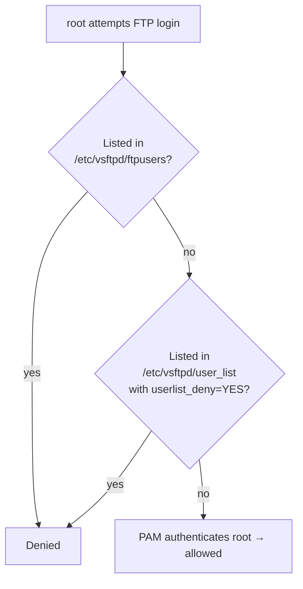

# Allow Root Login on vsftpd

## Overview

By default, `vsftpd` denies FTP access to privileged accounts such as `root` for security reasons. In certain **controlled** environments (labs, throwaway VMs, isolated test benches) you may need to enable root FTP login. This note documents exactly which deny-lists to edit and how to test the result.

> [!WARNING]
> **Do not do this in production**
> Allowing `root` to log in over FTP is a **major security risk** and should **never** be done on a production or internet-facing server. FTP sends the password in cleartext, so a sniffed session hands an attacker full root. Proceed only in isolated, secure environments — and prefer SSH/SFTP everywhere else.

## Concepts — the two deny-lists

`vsftpd` keeps two independent files that can block an account before authentication even completes:

| File | Behaviour | Notes |
|---|---|---|
| `/etc/vsftpd/ftpusers` | Users listed here are **always denied**, regardless of shell/password. | Enforced via PAM (`pam_service_name=vsftpd`). |
| `/etc/vsftpd/user_list` | Meaning depends on `userlist_deny`. With `userlist_deny=YES` (default) listed users are denied **without a password prompt**; with `userlist_deny=NO` only listed users are allowed. | Checked in addition to `ftpusers`. |

To let `root` in, `root` must be removed/commented in **both** files.



## Configuration

### Edit the /etc/vsftpd/ftpusers File

- This file lists users who are **always denied** FTP access, even if they have a valid shell and password. You must **remove or comment out** the `root` entry.

```bash
vim /etc/vsftpd/ftpusers
```

> Original example (root is blocked):

```text
# Users that are not allowed to login via ftp
root
bin
daemon
adm
lp
sync
shutdown
halt
mail
news
uucp
operator
games
nobody
```

> Updated version (root is allowed):

```text
# Users that are not allowed to login via ftp
#root
bin
daemon
adm
lp
sync
shutdown
halt
mail
news
uucp
operator
games
nobody
```

### Edit the /etc/vsftpd/user_list File

- This file also lists users who are denied access **by default** (unless configured otherwise via `userlist_deny` setting). You must **comment out `root`** here as well.

```bash
vim /etc/vsftpd/user_list
```

> Original:

```text
# vsftpd userlist
# If userlist_deny=NO, only allow users in this file
# If userlist_deny=YES (default), never allow users in this file, and
# do not even prompt for a password.
# Note that the default vsftpd pam config also checks /etc/vsftpd/ftpusers
root
bin
daemon
adm
lp
sync
shutdown
halt
mail
news
uucp
operator
games
nobody
```

> Updated version:

```text
# vsftpd userlist
# If userlist_deny=NO, only allow users in this file
# If userlist_deny=YES (default), never allow users in this file, and
# do not even prompt for a password.
# Note that the default vsftpd pam config also checks /etc/vsftpd/ftpusers
#root
bin
daemon
adm
lp
sync
shutdown
halt
mail
news
uucp
operator
games
nobody
```

> [!NOTE]
> `vsftpd.conf` user-access settings do not need modification if `local_enable=YES` is already set.

### Restart the vsftpd Service

- After making changes, restart the `vsftpd` service to apply them:

```bash
systemctl restart vsftpd.service
```

- Check its status:

```bash
systemctl status vsftpd.service
```

### Verify root Shell and Password

- Make sure that the root account has a valid login shell and password:

```bash
grep root /etc/passwd
```

> Expected output:

```text
root:x:0:0:root:/root:/bin/bash
```

- To set (or reset) the root password:

```bash
passwd root
```

## Examples — Test Root FTP Login

- You can now attempt to log in via FTP using `root`:

```bash
ftp 192.168.1.50
```

> Credentials:

```text
Username: root
Password: [your root password]
```

> [!NOTE]
> **📸 Screenshot**
> _Capture: Terminal showing an FTP session logging in as root against 192.168.1.50 with a 230 Login successful banner_

## Best Practices

- Use SSH/SFTP instead of FTP.
- Use virtual users with limited access if FTP is required.
- Re-add `root` to both deny-lists as soon as testing is complete.

## Security Considerations

- A cleartext root login is one packet capture away from a full host compromise; keep this off any shared or routed network.
- Both `ftpusers` and `user_list` shipping `root` by default aligns with **CIS Benchmark** guidance to disable direct privileged remote logins — reverting these edits restores that control.
- If root FTP is genuinely required, front it with TLS ([TLS-Encryption-on-FTP](TLS-Encryption-on-FTP.md)) at minimum, and firewall the control/passive ports to a single admin host.

## Troubleshooting

| Symptom | Likely cause | Fix |
|---|---|---|
| Login refused with no password prompt | `root` still in `user_list` with `userlist_deny=YES` | Comment out `root` in `/etc/vsftpd/user_list`. |
| Password prompt then `530 Login incorrect` | `root` still in `ftpusers`, or wrong password | Comment out `root` in `/etc/vsftpd/ftpusers`; reset with `passwd root`. |
| Works then breaks after reboot | Service not enabled / config reverted | `systemctl enable vsftpd.service` and re-check both deny-lists. |

## References

- [vsftpd.conf man page](https://linux.die.net/man/5/vsftpd.conf)
- CIS Benchmark guidance on disabling direct privileged remote logins.
- Files: `/etc/vsftpd/ftpusers`, `/etc/vsftpd/user_list`, `/etc/pam.d/vsftpd`.

## Related

- [Linux Administration & Server Hardening](../Readme.md) — Linux administration & server hardening hub.
- [Anonymous-FTP-Access-Configuration](Anonymous-FTP-Access-Configuration.md) — other login/access policy.
- [Access-User-Home-Directory-on-FTP-Server-using-vsftpd](Access-User-Home-Directory-on-FTP-Server-using-vsftpd.md) — user home access config.
- [Login-with-Selected-Users-on-vsftpd](Login-with-Selected-Users-on-vsftpd.md) — restrict FTP to an allow-list of users.
- [TLS-Encryption-on-FTP](TLS-Encryption-on-FTP.md) — secure FTP with TLS.
- [FTP-Client-Usage](FTP-Client-Usage.md) — connect/test after configuring.
- FTP-Enumeration — weak/root logins are an enum/attack finding.
