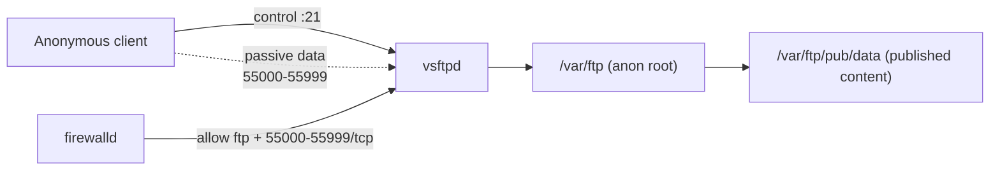

# Anonymous FTP Access Configuration

## Overview

This guide walks through installing, configuring, and enabling **anonymous access** on an FTP server using `vsftpd` on a Red Hat-based system (RHEL/CentOS/Fedora). It also covers firewall setup with `firewalld` and the SELinux booleans that anonymous FTP typically needs.

> [!WARNING]
> **Anonymous FTP is high-exposure**
> Anonymous access means *anyone* can connect without credentials, and anonymous **write** turns the server into an open drop-box that attackers routinely abuse for malware staging and warez. Only enable it deliberately, expose the minimum content, and never mix it with writable world-readable directories on an internet-facing host.

## Architecture



## Installation

### Check for Existing FTP Packages

- Check if any FTP-related packages are already installed:

```bash
rpm -qa | grep ftp
```

### Install vsftpd and ftp Client

- Install the FTP server and client if they aren't already installed:

```bash
yum install vsftpd ftp
```

- Verify installation:

```bash
rpm -qa | grep ftp
```

### Inspecting vsftpd Package Details

- Check detailed package information:

```bash
rpm -qi vsftpd
```

- List installed files:

```bash
rpm -ql vsftpd
```

- Check configuration files:

```bash
rpm -qc vsftpd
```

- Display documentation files:

```bash
rpm -qd vsftpd
```

## Configuration

### Configure vsftpd

- Edit the main configuration file:

```bash
vim /etc/vsftpd/vsftpd.conf
```

> This configuration enables:

- Anonymous and local user login
- Upload and directory creation for anonymous users
- Passive mode (required for many FTP clients)

> Example configuration:

```ini
anonymous_enable=YES
local_enable=YES
write_enable=YES
local_umask=022
anon_upload_enable=YES
anon_mkdir_write_enable=YES
dirmessage_enable=YES
xferlog_enable=YES
connect_from_port_20=YES
xferlog_std_format=YES
listen=NO
listen_ipv6=YES
pam_service_name=vsftpd
userlist_enable=YES
pasv_min_port=55000
pasv_max_port=55999
pasv_enable=YES
```

### Manage vsftpd Service

- Check if the service is running:

```bash
systemctl status vsftpd.service
```

- Start the service:

```bash
systemctl start vsftpd.service
```

- Restart the service (e.g., after configuration changes):

```bash
systemctl restart vsftpd.service
```

- Enable the service at boot:

```bash
systemctl enable vsftpd.service
```

### Verify FTP Listening Ports

- Check if the FTP service is listening on the correct ports:

```bash
netstat -nltup | grep ftp
```

### Set Up Anonymous Content

- Navigate to the default FTP root:

```bash
cd /var/ftp/
```

```bash
mkdir /var/ftp/pub/data
```

```bash
chown -Rv nobody:nobody /var/ftp/pub/data
```

```bash
chmod -Rv 777 /var/ftp/pub/data
```

- Copy content for anonymous access:

```bash
cp -vr /var/www/html/site* /var/ftp/pub/data
```

> [!WARNING]
> **`777` is for testing only**
> `chmod 777` makes the directory world-writable. It is fine on an isolated lab box to prove uploads work, but on any real server tighten it to the least privilege that still functions and keep uploads out of any directory that is also served/executable.

### Check Open Files Used by FTP

- Verify FTP-related open files and sockets:

```bash
lsof | grep ftp
```

## Configuring firewalld for FTP Access

By default, `firewalld` is the firewall management tool on many modern Linux distributions (like CentOS 7+, RHEL 7+, Fedora, etc.). To support **FTP**, especially **passive FTP**, you need to allow the appropriate ports.

### Start and Enable `firewalld`

- Ensure the service is running:

```bash
systemctl start firewalld
```

```bash
systemctl enable firewalld
```

- Check its status:

```bash
systemctl status firewalld
```

### Allow FTP Service

- This opens **port 21**, used by FTP control connections.

```bash
firewall-cmd --permanent --add-service=ftp
```

### Allow Passive FTP Ports

- If passive mode is configured in `/etc/vsftpd/vsftpd.conf` (e.g., `55000-55999`), you must allow this range explicitly.

```bash
firewall-cmd --permanent --add-port=55000-55999/tcp
```

### Reload `firewalld` to Apply Changes

```bash
firewall-cmd --reload
```

### Verify Rules

- List all allowed services and ports:

```bash
firewall-cmd --list-all
```

### Optional: Allow Access Only in Specific Zones

- If you're using a specific zone (e.g., `public`, `internal`), specify it like this:

```bash
firewall-cmd --zone=public --permanent --add-service=ftp
```

```bash
firewall-cmd --zone=public --permanent --add-port=55000-55999/tcp
```

```bash
firewall-cmd --reload
```

## SELinux Consideration (If Enforcing)

- If SELinux is enabled, you may also need to allow FTP passive mode with these:

```bash
setsebool -P ftp_home_dir=1
setsebool -P allow_ftpd_full_access=1
```

> You can confirm settings with:

```bash
getsebool -a | grep ftp
```

## Summary of Required Ports

|Service|Protocol|Port(s)|Description|
|---|---|---|---|
|FTP|TCP|21|Control connection|
|FTP-PASV|TCP|55000-55999|Passive data connections|

## vsftpd Configuration Options Explained

|**Directive**|**Description**|
|---|---|
|`anonymous_enable=YES`|Allows anonymous users to log in to the FTP server using the username `anonymous`.|
|`local_enable=YES`|Enables login for local system users (accounts available on the server).|
|`write_enable=YES`|Allows commands that modify the filesystem, such as file uploads, deletions, and directory creation.|
|`local_umask=022`|Sets the default permission mask for local users. Files are created with `644` and directories with `755`.|
|`anon_upload_enable=YES`|Permits anonymous users to upload files (requires the upload directory to have correct write permissions).|
|`anon_mkdir_write_enable=YES`|Allows anonymous users to create new directories.|
|`dirmessage_enable=YES`|Displays the contents of a `.message` file to users upon entering a directory. Useful for showing directory-specific notices.|
|`xferlog_enable=YES`|Enables logging of all file upload and download activities.|
|`connect_from_port_20=YES`|Ensures active mode data connections are made from the standard FTP data port (20).|
|`xferlog_std_format=YES`|Uses the standard FTP xferlog format for log files, making them compatible with other log analyzers.|
|`listen=NO`|Disables listening on IPv4 sockets. Used when IPv6 is enabled.|
|`listen_ipv6=YES`|Enables listening on IPv6 sockets (and IPv4 if supported).|
|`pam_service_name=vsftpd`|Specifies the PAM (Pluggable Authentication Module) service used for user authentication.|
|`userlist_enable=YES`|Enables use of `/etc/vsftpd.user_list` to allow or deny access to specified users.|
|`pasv_min_port=55000`|Sets the lower limit of the passive mode data connection port range.|
|`pasv_max_port=55999`|Sets the upper limit of the passive mode data connection port range.|
|`pasv_enable=YES`|Enables passive mode FTP, allowing clients behind NAT/firewalls to connect more easily.|

## Best Practices

- If you're running SELinux, make sure to set proper booleans like `allow_ftpd_anon_write` using `setsebool`.
- Ensure the `/var/ftp/pub` directory has correct permissions for anonymous uploads (e.g., `chmod 777` for testing).
- Use an FTP client like `FileZilla` or the `ftp` command-line client to verify anonymous access.

## Security Considerations

- Keep `anon_upload_enable` / `anon_mkdir_write_enable` **off** unless a controlled drop-box is genuinely required; anonymous write is the single most abused FTP misconfiguration.
- Never place the anonymous root inside a web-served or executable path — an uploaded webshell should never be reachable over HTTP.
- Constrain the passive range at the firewall to exactly `55000-55999`; do not open the wider ephemeral range.
- Anonymous FTP is a classic reconnaissance win for attackers — assume everything under `/var/ftp/pub` is public and log transfers (`xferlog_enable=YES`).

## Troubleshooting

| Symptom | Likely cause | Fix |
|---|---|---|
| Can connect but directory listing hangs | Passive ports blocked | Open `55000-55999/tcp` in `firewalld` and reload. |
| `553 Could not create file` on upload | Wrong ownership/permissions or SELinux | `chown nobody:nobody` the upload dir; set `allow_ftpd_anon_write`. |
| Service won't start after edit | Both `listen` and `listen_ipv6` enabled, or syntax error | Enable only one listener; check `journalctl -xe`. |

## References

- [vsftpd.conf man page](https://linux.die.net/man/5/vsftpd.conf)
- Logs: `/var/log/vsftpd.log`, `/var/log/xferlog`, `/var/log/secure`

## Related

- [Linux Administration & Server Hardening](../Readme.md) — Linux administration & server hardening hub.
- [Allow-Root-Login-on-vsftpd](Allow-Root-Login-on-vsftpd.md) — other login policy.
- [FTP-Path-Configuration-in-vsftpd](FTP-Path-Configuration-in-vsftpd.md) — path/chroot for local users.
- [Access-User-Home-Directory-on-FTP-Server-using-vsftpd](Access-User-Home-Directory-on-FTP-Server-using-vsftpd.md) — per-user home access config.
- [Login-with-Selected-Users-on-vsftpd](Login-with-Selected-Users-on-vsftpd.md) — restrict FTP to an allow-list of users.
- [TLS-Encryption-on-FTP](TLS-Encryption-on-FTP.md) — secure FTP with TLS.
- [FTP-Client-Usage](FTP-Client-Usage.md) — test anonymous access.
- FTP-Enumeration — anonymous FTP is a classic enum win.
