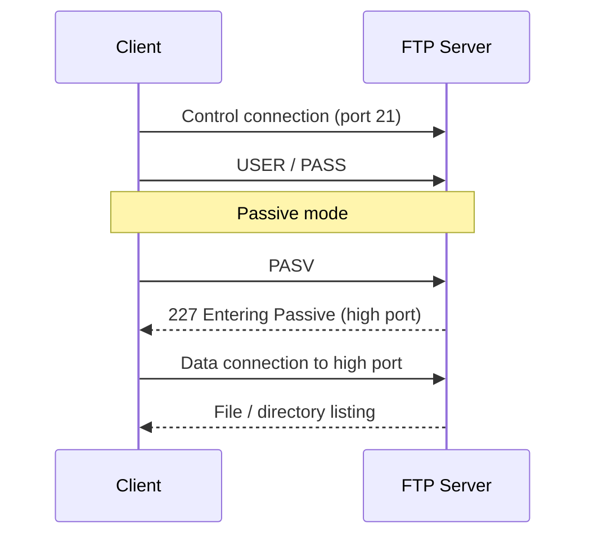

# FTP Client Usage

## Overview

This guide provides a step-by-step walkthrough of using the `ftp` command-line client to connect to an FTP server, transfer files, switch transfer modes, and manage remote files. The same command vocabulary applies whether you are administering your own `vsftpd` server or enumerating a target during a penetration test.

> [!NOTE]
> The classic `ftp` binary is an interactive client: you connect once, then issue subcommands (`ls`, `get`, `put`, `binary`, …) at the `ftp>` prompt until you `bye`.

## Concepts — Active vs Passive Mode

FTP uses two channels: a **control** channel (port 21) for commands and a separate **data** channel for file/directory transfers. Who opens the data channel decides the mode:

| Mode | Data channel opened by | Works behind client NAT? | Command |
|---|---|---|---|
| Active | Server connects back to the client | Often blocked by client firewall | (default on some clients) |
| Passive | Client connects out to a server high port | Yes — firewall-friendly | `passive` |



## Connect to an FTP Server

- To begin an FTP session, use the following command:

```bash
ftp 192.168.1.35
```

### Login Credentials

- When prompted, enter a valid username and password. For anonymous access, try one of the following usernames:

```bash
ftp
```

```bash
anonymous
```

```bash
anon
```

- Use an email-style string as the password:

```bash
Username: ftp
Password: a@a.com
```

> [!NOTE]
> **📸 Screenshot**
> _Capture: Terminal showing the ftp client connecting to 192.168.1.35, an anonymous username prompt, and a 230 Login successful response_

## Commands

### Available FTP Commands

- List All FTP Commands, Displays a list of all FTP commands supported by the client.

```bash
?
```

- View Current Remote Directory, Shows the present working directory on the remote FTP server.

```bash
pwd
```

- List Files and Directories, Displays the contents of the current directory on the remote server.

```bash
ls
```

### Downloading Files From FTP Server

- Download a Single File — downloads `about.html` from the server to your local machine.

```bash
get about.html
```

- Download Multiple Specific Files, Fetches the listed files from the server.

```bash
mget contact.html index.html products.html
```

- Download with Wildcard Patterns — downloads all `.css` or `.conf` files in the current directory.

```bash
mget *.css
```

```bash
mget *.conf
```

### Uploading Files to Server

- Before uploading, switch to binary mode to prevent file corruption:

```bash
binary
```

- Upload a Single File, Sends the specified file to the FTP server.

```bash
put chisel
```

- Upload Multiple Files, Transfers multiple files or matches based on pattern.

```bash
mput tuned.log.1 tuned.log hello.py
```

```bash
mput *.log
```

### Switching Transfer Modes

- Switch to ASCII mode, Used for transferring plain text files.

```bash
ascii
```

> Response:

```text
200 Switching to ASCII mode.
```

- Switch to Binary Mode, Recommended for all non-text files (images, archives, executables, etc.).

```bash
binary
```

> Response:

```text
200 Switching to Binary mode.
```

### Deleting Remote Files

- Delete a Single File, Removes the specified file from the FTP server.

```bash
delete nc64.exe
```

- Delete Multiple Files, Deletes multiple files in one go.

```bash
mdelete ScreamingFrogSEOSpider-21.3.exe httrack-3.49.2.exe httrack_x64.3.49.2.exe
```

### Ending the ftp session

- Ends the FTP session and closes the connection to the server.

```bash
bye
```

or

```bash
quit
```

## Command Reference

| Command | Action |
|---|---|
| `?` / `help` | List supported client commands. |
| `pwd` | Show remote working directory. |
| `ls` / `dir` | List remote directory contents. |
| `cd` | Change remote directory. |
| `get` / `mget` | Download one / multiple (wildcard) files. |
| `put` / `mput` | Upload one / multiple (wildcard) files. |
| `ascii` / `binary` | Switch transfer type (text vs raw bytes). |
| `delete` / `mdelete` | Remove one / multiple remote files. |
| `passive` | Toggle passive data mode. |
| `bye` / `quit` | Close the session. |

## Best Practices

- Always use **binary** mode for non-text files to avoid corruption.
- Use **wildcards** (e.g., `*.conf`) with `mget`/`mput`/`mdelete` for batch operations.
- Ensure directory permissions allow uploads/downloads on the server side.
- Log out with `bye` or `quit` to end the session.

## Security Considerations

- Plain FTP sends credentials and file data in **cleartext**; on untrusted networks anyone on-path can capture them. Prefer **SFTP**/`scp` or FTPS ([TLS-Encryption-on-FTP](TLS-Encryption-on-FTP.md)).
- Wildcard `mdelete`/`mput` operations are irreversible — double-check the pattern before confirming.
- During a pentest, anonymous read access and writable directories are reportable findings; note them rather than modifying target data.

## Troubleshooting

| Symptom | Likely cause | Fix |
|---|---|---|
| `ls` hangs / times out | Active mode blocked by firewall | Enter `passive` before listing. |
| Downloaded binary is corrupt | Transferred in ASCII mode | Run `binary`, then re-download. |
| `530 Login incorrect` | Bad credentials or account denied | Verify username/password; check server deny-lists. |

## References

- [ftp(1) man page](https://man7.org/linux/man-pages/man1/ftp.1.html)
- [vsftpd.conf man page](https://linux.die.net/man/5/vsftpd.conf)

## Related

- [Linux Administration & Server Hardening](../Readme.md) — Linux administration & server hardening hub.
- [Anonymous-FTP-Access-Configuration](Anonymous-FTP-Access-Configuration.md) — server side this connects to.
- [FTP-Path-Configuration-in-vsftpd](FTP-Path-Configuration-in-vsftpd.md) — path served to the client.
- [Access-User-Home-Directory-on-FTP-Server-using-vsftpd](Access-User-Home-Directory-on-FTP-Server-using-vsftpd.md) — per-user home access config.
- [TLS-Encryption-on-FTP](TLS-Encryption-on-FTP.md) — secure the transport with TLS.
- FTP-Enumeration — client commands during FTP enum.
