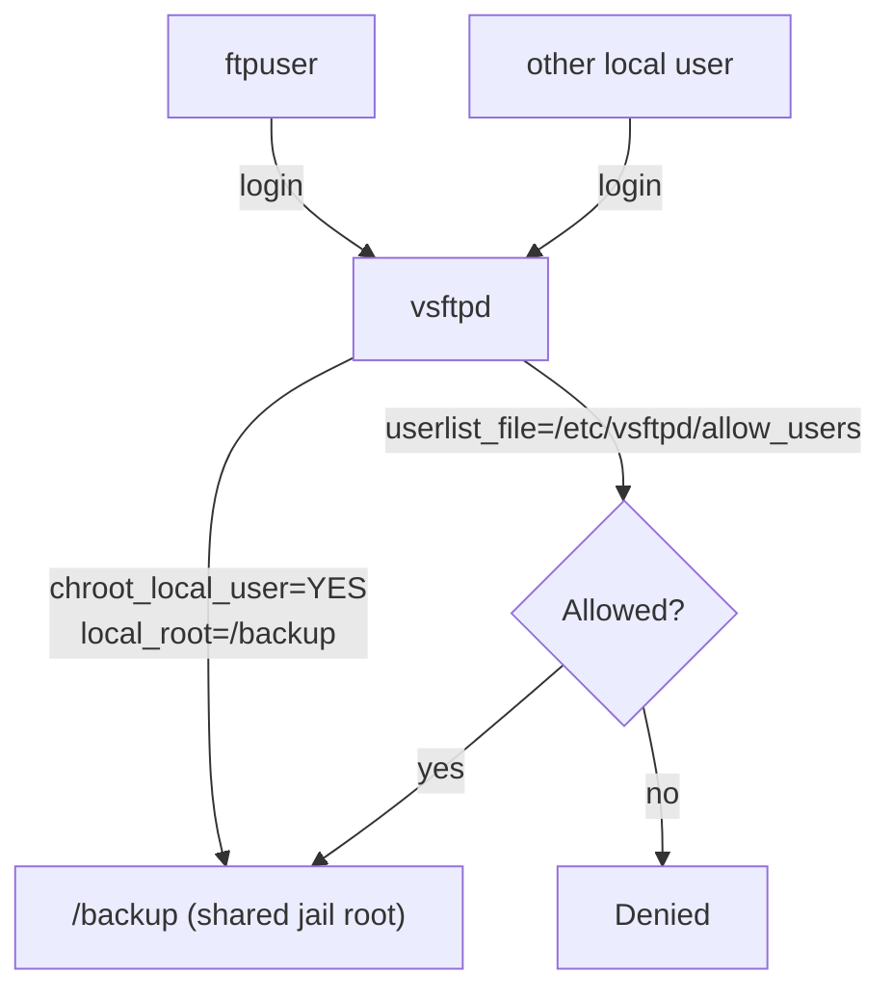

# FTP Path Configuration in vsftpd

## Overview

This note walks through setting a **custom FTP root directory** (for example `/backup`) that all local FTP users land in when they log in via `vsftpd`. This is achieved with the `local_root` directive combined with a per-user chroot jail, so every authenticated user is confined to the same shared path rather than their individual `/home/<user>` directory.

> [!IMPORTANT]
> `local_root=/backup` makes **all local FTP users land in `/backup`**, not their own home directories. If you need per-user isolation instead, use per-user config files (`user_config_dir`) — see the Notes section.

## Architecture



## Configuration

### Create and Set Permissions on the FTP Directory

- Create a shared directory for FTP users:

```bash
mkdir /backup/
```

- Set permissive permissions to allow access:

```bash
chmod -R 1777 /backup/
```

> `1777` ensures all users can write but only delete their own files, similar to `/tmp`. Adjust permissions based on your security policy.

> [!WARNING]
> **Sticky-bit, still shared**
> The sticky bit (`1` in `1777`) stops users deleting each other's files, but the directory is still world-writable and shared. Anyone with an account can read every file placed there. Tighten to the least-privilege mode your workflow allows, and never point `local_root` at a sensitive path.

### Configure vsftpd to Use the Custom Directory

- Edit the configuration file:

```bash
vim /etc/vsftpd/vsftpd.conf
```

> Make sure the following options are present or updated:

```ini
# Disallow anonymous logins
anonymous_enable=NO

# Enable local users to log in
local_enable=YES

# Allow FTP write commands (upload, delete, rename, etc.)
write_enable=YES

# Set default permissions for uploaded files
local_umask=022

# Show directory welcome messages
dirmessage_enable=YES

# Log uploads/downloads
xferlog_enable=YES
xferlog_std_format=YES

# Use port 20 for data connections
connect_from_port_20=YES

# Customize FTP banner
ftpd_banner=Welcome to ARMOUR FTP service.

# Chroot users to their home directory (or specified path)
chroot_local_user=YES

# Allow writable chroot directories
allow_writeable_chroot=YES

# Set the custom root directory for all users
local_root=/backup

# Passive mode settings (adjust as needed)
pasv_enable=YES
pasv_min_port=55000
pasv_max_port=55999

# Use PAM for authentication
pam_service_name=vsftpd

# Use host-based access control (via /etc/hosts.allow and /etc/hosts.deny)
tcp_wrappers=YES

# Listen on IPv6 (set `listen=YES` instead for IPv4)
listen=NO
listen_ipv6=YES

# Optional: Restrict access to a list of allowed users
userlist_enable=YES
userlist_deny=NO
userlist_file=/etc/vsftpd/allow_users
```

### Key directives

| Directive | Purpose |
|---|---|
| `local_root=/backup` | Directory every local user is placed in on login. |
| `chroot_local_user=YES` | Jails users so they cannot escape `local_root`. |
| `allow_writeable_chroot=YES` | Permits the writable `/backup` chroot root (avoids the `500 OOPS` refusal). |
| `userlist_enable=YES` + `userlist_deny=NO` | Turns `userlist_file` into an **allow-list** — only listed users may connect. |
| `userlist_file=/etc/vsftpd/allow_users` | The allow-list consulted when `userlist_deny=NO`. |
| `tcp_wrappers=YES` | Adds host-based access control via `/etc/hosts.allow` and `/etc/hosts.deny`. |

### Restart the FTP Service

- Apply the new settings:

```bash
systemctl restart vsftpd.service
```

## Examples — Testing

- Create a local user (if not already existing):

```bash
adduser ftpuser
```

- Add the user to the allowed list (if using `userlist_enable`):

```bash
echo "ftpuser" >> /etc/vsftpd/allow_users
```

- Try connecting via FTP:

```bash
ftp <your-server-ip>
```

> [!NOTE]
> **📸 Screenshot**
> _Capture: Terminal showing ftpuser logging in via FTP and landing directly in /backup instead of a home directory_

## Best Practices

- If using `chroot_local_user=YES`, make sure users do not have write permission to their chroot directory unless `allow_writeable_chroot=YES` is set.
- Keep the allow-list (`/etc/vsftpd/allow_users`) authoritative — add only the accounts that need FTP.
- Layer host-based restrictions with `tcp_wrappers=YES` and `/etc/hosts.allow` / `/etc/hosts.deny`.

## Security Considerations

- A shared `local_root` means users can read each other's uploads — do not use it for confidential data; prefer per-user directories for isolation.
- Combine the allow-list with TLS ([TLS-Encryption-on-FTP](TLS-Encryption-on-FTP.md)) so credentials to the shared area are not sent in cleartext.
- Confine the passive port range (`55000-55999`) at the firewall and expose only what is needed.

## Troubleshooting

| Symptom | Likely cause | Fix |
|---|---|---|
| `500 OOPS: vsftpd: refusing to run with writable root inside chroot()` | Writable chroot without opt-in | Add `allow_writeable_chroot=YES`. |
| User can log in but not upload | `write_enable=NO` or permissions on `/backup` | Set `write_enable=YES`; verify `/backup` is `1777`. |
| Valid user refused login | Not in `/etc/vsftpd/allow_users` while `userlist_deny=NO` | Append the username to the allow-list. |

## References

- DigitalOcean guide for vsftpd user directory setup: [https://www.digitalocean.com/community/tutorials/how-to-set-up-vsftpd-for-a-user-s-directory-on-ubuntu-16-04](https://www.digitalocean.com/community/tutorials/how-to-set-up-vsftpd-for-a-user-s-directory-on-ubuntu-16-04)
- [vsftpd.conf man page](https://linux.die.net/man/5/vsftpd.conf)

## Notes

- `local_root=/backup` makes **all FTP users land in `/backup`**, not their own `/home/username` directories. Use per-user configuration (`user_config_dir`) or scripts if you need individual directories.

## Related

- [Linux Administration & Server Hardening](../Readme.md) — Linux administration & server hardening hub.
- [Access-User-Home-Directory-on-FTP-Server-using-vsftpd](Access-User-Home-Directory-on-FTP-Server-using-vsftpd.md) — home-dir access this contrasts with.
- [Anonymous-FTP-Access-Configuration](Anonymous-FTP-Access-Configuration.md) — anonymous path configuration.
- [Allow-Root-Login-on-vsftpd](Allow-Root-Login-on-vsftpd.md) — privileged login policy.
- [Login-with-Selected-Users-on-vsftpd](Login-with-Selected-Users-on-vsftpd.md) — restrict FTP to an allow-list of users.
- [TLS-Encryption-on-FTP](TLS-Encryption-on-FTP.md) — secure FTP with TLS.
- [FTP-Client-Usage](FTP-Client-Usage.md) — verify served paths from a client.
- FTP-Enumeration — exposed paths during FTP enum.
