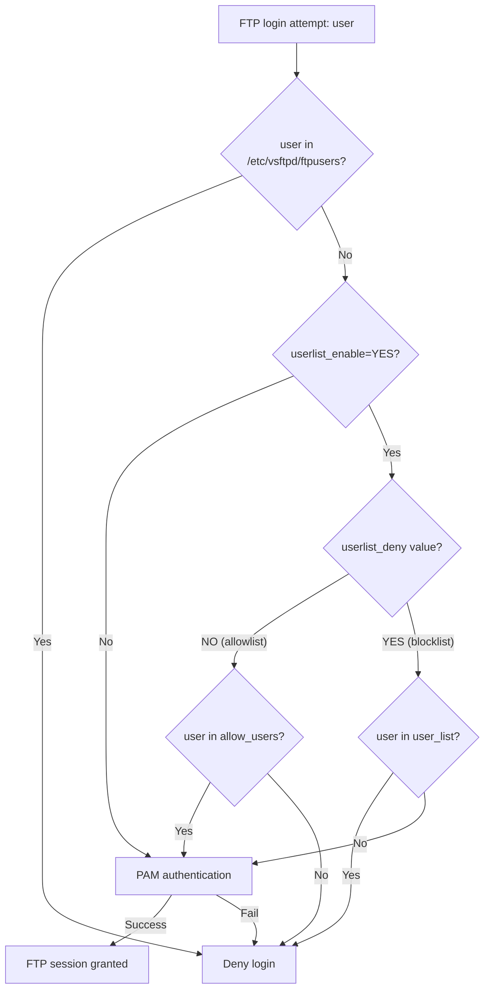

# Login with Selected Users on vsftpd

## Overview

By default, **vsftpd** permits any valid local (PAM) account to authenticate over FTP. On a hardened server this is rarely desirable — you want an explicit *allow-list* so that only a handful of named accounts can log in, and every other system user is denied by policy.

vsftpd implements this with the `userlist` mechanism. A single directive, `userlist_deny`, flips the semantics of the user list between a **blocklist** (the default) and an **allowlist**. This note walks through configuring an allowlist so that only the users you name can reach the FTP service.

> [!IMPORTANT]
> The `userlist` file is only one of *three* account gates vsftpd consults. Even a user on your allowlist is still rejected if they appear in `/etc/vsftpd/ftpusers` or `/etc/vsftpd/user_list`. See [Troubleshooting](#troubleshooting).

## Concepts

vsftpd evaluates each login against several files. Understanding which list is authoritative — and how `userlist_deny` inverts the meaning of the user list — is the whole trick.

| Directive / File | Purpose | Effect |
| --- | --- | --- |
| `userlist_enable=YES` | Turns the `userlist_file` gate on | Required for allow/deny lists to take effect |
| `userlist_deny=NO` | Treat the list as an **allowlist** | **Only** users in the file may log in |
| `userlist_deny=YES` (default) | Treat the list as a **blocklist** | Users in the file are **blocked** |
| `userlist_file=/etc/vsftpd/allow_users` | Path to the list vsftpd reads | Points at your custom allow-list |
| `/etc/vsftpd/ftpusers` | PAM-level deny file | Listed users are *always* denied |
| `/etc/vsftpd/user_list` | Default vsftpd user list | Listed users denied (when `userlist_deny=YES`) |

> [!NOTE]
> `userlist_deny=NO` combined with `userlist_enable=YES` is the canonical allowlist pattern. Read it as: *"deny everyone except the names in this file."*

## Architecture

The flow below shows how a login request is filtered through each gate before vsftpd grants a session.



## Configuration

### Create the Allowed Users File

Edit or create the file that will hold your allowlist:

```bash
vim /etc/vsftpd/allow_users
```

Add one username per line — only these accounts will be allowed to log in via FTP:

```text
infosec
armour
u1
```

### Configure `vsftpd.conf`

Edit the main configuration file:

```bash
vim /etc/vsftpd/vsftpd.conf
```

Ensure the following lines are present or updated correctly:

```ini
# Enable local users to log in
local_enable=YES

# Enable write commands like STOR
write_enable=YES

# Allow passive FTP range
pasv_enable=YES
pasv_min_port=55000
pasv_max_port=55999

# Custom FTP login banner
ftpd_banner=Welcome to ARMOUR FTP service.

# Restrict access to only specified users
userlist_enable=YES
userlist_deny=NO
userlist_file=/etc/vsftpd/allow_users

# Allow chroot with write access if needed
allow_writeable_chroot=YES

# PAM authentication service
pam_service_name=vsftpd

# Use TCP Wrappers for host-based access control
tcp_wrappers=YES

# Enable IPv6 (vsftpd runs in standalone mode if listen=YES)
listen=NO
listen_ipv6=YES
```

The key lines for restricting access to selected users are:

```ini
userlist_enable=YES
userlist_deny=NO
userlist_file=/etc/vsftpd/allow_users
```

- `userlist_deny=NO`: means **only** users in the list are allowed.
- If `userlist_deny=YES` (default), the users in the list are **blocked** instead.

> [!TIP]
> Keep the passive port range (`pasv_min_port` / `pasv_max_port`) narrow and open exactly that range on your firewall. A predictable, minimal range simplifies both firewalling and troubleshooting of passive-mode transfers.

## Commands

Apply the configuration by restarting the service:

```bash
systemctl restart vsftpd.service
```

| Command | Purpose |
| --- | --- |
| `systemctl restart vsftpd.service` | Apply configuration changes |
| `systemctl status vsftpd.service` | Confirm the service is active |
| `ftp <your-server-ip>` | Test an interactive login |
| `journalctl -u vsftpd -f` | Follow live service logs while testing |

## Examples

### Verify the Allowlist

Log in using an FTP client:

```bash
ftp <your-server-ip>
```

Try logging in as one of the allowed users (e.g., `u1`) and verify access. Any other users should receive a login denial.

> [!NOTE]
> **📸 Screenshot**
> _Capture: Terminal FTP session where user u1 authenticates successfully with a 230 login OK response, and a second attempt by a non-allowlisted user is rejected with a 530 login incorrect response_

## Best Practices

- **Prefer an allowlist over a blocklist.** `userlist_deny=NO` fails closed — new system accounts cannot log in until you deliberately add them.
- **Keep the allowlist short and reviewed.** Treat `/etc/vsftpd/allow_users` as a security control: audit it periodically and remove departed users.
- **Layer TCP Wrappers or firewall rules** on top of the user allowlist to restrict *where* logins may originate, not just *who*.
- **Migrate to FTPS.** Plain FTP transmits credentials in cleartext; pair this allowlist with TLS — see [TLS-Encryption-on-FTP](TLS-Encryption-on-FTP.md).

## Security Considerations

> [!WARNING]
> FTP without TLS sends usernames, passwords, and data unencrypted over the network. An attacker on the path can sniff credentials trivially. Restricting *who* can log in does not protect the credentials in transit — always enable TLS ([TLS-Encryption-on-FTP](TLS-Encryption-on-FTP.md)) for any non-trivial deployment.

- The allowlist limits the authentication surface but does not replace strong passwords or account lockout policy.
- Ensure the vsftpd banner (`ftpd_banner`) does not leak version or host details useful to an attacker performing recon — see FTP-Enumeration.
- Consider disabling anonymous access entirely on a user-restricted server (`anonymous_enable=NO`).

## Troubleshooting

An allowlisted user still being denied is almost always caused by one of the *other* deny lists overriding your allowlist.

> [!IMPORTANT]
> - Make sure `ftpusers` and `user_list` files **do not block** your allowed users.
> - If a user appears in `/etc/vsftpd/ftpusers` or `/etc/vsftpd/user_list`, they will be blocked even if they are listed in `allow_users`.
> - To avoid this, comment out or remove those users from those two files.

| Symptom | Likely cause | Fix |
| --- | --- | --- |
| Allowlisted user gets `530 Login incorrect` | User also listed in `/etc/vsftpd/ftpusers` | Remove/comment the user from `ftpusers` |
| All logins denied after enabling list | `userlist_deny=YES` still set | Set `userlist_deny=NO` for allowlist mode |
| Passive transfers hang | `pasv_*` port range blocked at firewall | Open `55000-55999/tcp` |
| Changes not taking effect | Service not restarted | `systemctl restart vsftpd.service` |

## References

- vsftpd manual page: `man 5 vsftpd.conf`
- CIS Benchmarks — FTP service hardening guidance
- vsftpd upstream documentation: <https://security.appspot.com/vsftpd.html>

## Related

- [Anonymous-FTP-Access-Configuration](Anonymous-FTP-Access-Configuration.md) — sibling vsftpd access-mode note
- [Access-User-Home-Directory-on-FTP-Server-using-vsftpd](Access-User-Home-Directory-on-FTP-Server-using-vsftpd.md) — related vsftpd user/home config
- [TLS-Encryption-on-FTP](TLS-Encryption-on-FTP.md) — secure the same FTP service
- [FTP-Client-Usage](FTP-Client-Usage.md) — connecting and transferring files as a client
- FTP-Enumeration — attacker-side recon of FTP logins
- [Linux Administration & Server Hardening](../Readme.md) — Linux administration & server hardening hub
