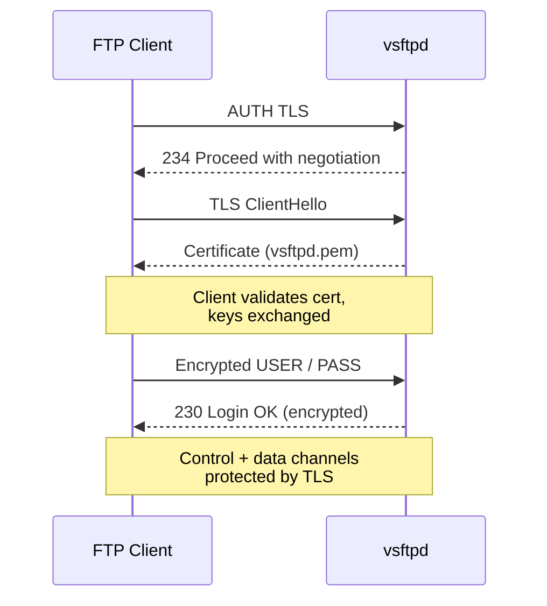

# TLS Encryption on FTP

## Overview

Plain FTP is a cleartext protocol: usernames, passwords, and file contents all cross the network unencrypted. **FTPS** (FTP over TLS) wraps the control and data channels in TLS, protecting credentials and payloads from passive sniffing and tampering.

This note covers generating a self-signed X.509 certificate and private key, applying the correct filesystem permissions, and wiring them into **vsftpd** so that the same FTP service you already run is upgraded to encrypted FTPS.

> [!WARNING]
> Never expose an FTP service that accepts local-user logins without TLS. Credentials sent in cleartext can be captured by anyone on the path. Enabling `ssl_enable=YES` is the minimum bar for a production-facing server.

## Concepts

FTPS relies on a certificate/key pair that vsftpd presents to clients during the TLS handshake.

| Component | Path | Role |
| --- | --- | --- |
| Private key | `/etc/ssl/private/vsftpd.key` | Secret half of the RSA pair; must be root-only readable |
| Certificate | `/etc/ssl/certs/vsftpd.pem` | Public certificate presented to clients |
| `ssl_enable` | `vsftpd.conf` | Master switch that turns on TLS |
| `rsa_cert_file` | `vsftpd.conf` | Tells vsftpd where the certificate lives |
| `rsa_private_key_file` | `vsftpd.conf` | Tells vsftpd where the private key lives |

> [!NOTE]
> A **self-signed** certificate encrypts traffic but is not trusted by clients out of the box — users will see a trust warning. For an internet-facing service, replace it with a certificate from a trusted CA (e.g. Let's Encrypt); the vsftpd directives remain identical.

## Architecture

The TLS handshake sequence below shows how the key and certificate are used to establish an encrypted FTPS session.



## Configuration

### Create the Required Directories (if missing)

```bash
mkdir -p /etc/ssl/private
```

```bash
mkdir -p /etc/ssl/certs
```

### Generate the Self-Signed TLS Certificate and Key

```bash
openssl req -x509 -nodes -days 365 \
  -newkey rsa:2048 \
  -keyout /etc/ssl/private/vsftpd.key \
  -out /etc/ssl/certs/vsftpd.pem
```

> [!NOTE]
> You'll be prompted for details like Country, Org, etc. You can leave them blank or fill them in.

The `openssl` flags used above:

| Flag | Meaning |
| --- | --- |
| `req -x509` | Produce a self-signed certificate rather than a signing request |
| `-nodes` | Do not encrypt the private key (no passphrase prompt on service start) |
| `-days 365` | Certificate validity period of one year |
| `-newkey rsa:2048` | Generate a fresh 2048-bit RSA key |
| `-keyout` | Output path for the private key |
| `-out` | Output path for the certificate |

### Set the Correct File Permissions

```bash
chmod 600 /etc/ssl/private/vsftpd.key
```

```bash
chmod 644 /etc/ssl/certs/vsftpd.pem
```

> [!IMPORTANT]
> The private key must be readable only by root (`600`). A world-readable key defeats the entire purpose of TLS — anyone who can read it can impersonate your server or decrypt captured sessions.

### Enable TLS in `vsftpd.conf`

Once that's done, make sure the following lines are in your `/etc/vsftpd/vsftpd.conf`:

```bash
vim /etc/vsftpd/vsftpd.conf
```

```ini
# ==========================
# TLS CONFIGURATION
# ==========================

ssl_enable=YES
rsa_cert_file=/etc/ssl/certs/vsftpd.pem
rsa_private_key_file=/etc/ssl/private/vsftpd.key

```

## Commands

Then restart the FTP service:

```bash
systemctl restart vsftpd.service
```

| Command | Purpose |
| --- | --- |
| `openssl req -x509 -nodes -days 365 ...` | Generate the self-signed cert and key |
| `chmod 600 /etc/ssl/private/vsftpd.key` | Lock the private key to root only |
| `systemctl restart vsftpd.service` | Reload vsftpd with TLS enabled |
| `openssl s_client -connect <ip>:21 -starttls ftp` | Verify the TLS handshake from a client |

## Examples

### Verify FTPS Is Active

After restarting, confirm vsftpd advertises TLS and presents your certificate:

```bash
openssl s_client -connect <your-server-ip>:21 -starttls ftp
```

A successful handshake prints the certificate chain and negotiated cipher, confirming the control channel is now encrypted.

> [!NOTE]
> **📸 Screenshot**
> _Capture: FTP client connect log showing an AUTH TLS command accepted with a 234 response, followed by the server certificate details and an encrypted 230 login confirmation_

## Best Practices

- **Force encryption for logins and data.** Add `force_local_logins_ssl=YES` and `force_local_data_ssl=YES` so cleartext sessions are refused, not merely optional.
- **Use TLS 1.2+ only.** Disable legacy protocols (`ssl_tlsv1=NO`, `ssl_sslv2=NO`, `ssl_sslv3=NO`) to avoid downgrade attacks — align with NIST SP 800-52 guidance.
- **Rotate certificates before expiry.** A one-year (`-days 365`) self-signed cert must be regenerated annually; automate renewal for CA-issued certs.
- **Prefer a CA-signed certificate** for any internet-facing host so clients validate trust without warnings.
- **Consider SFTP (SSH) instead** where possible — it is simpler to firewall (single port) and avoids FTPS's passive-port complexity.

## Security Considerations

- A self-signed certificate provides confidentiality but not authenticity — clients cannot verify they are talking to the intended server, leaving room for MITM if trust is not pinned.
- Keep `/etc/ssl/private/` mode `700` and the key file `600`; never commit keys to version control or back them up unencrypted.
- Pair TLS with a login allowlist so encryption and access control reinforce each other — see [Login-with-Selected-Users-on-vsftpd](Login-with-Selected-Users-on-vsftpd.md).
- Encrypted FTPS still exposes the passive data-port range; firewall it explicitly.

## Troubleshooting

| Symptom | Likely cause | Fix |
| --- | --- | --- |
| `500 OOPS: SSL: cannot load RSA certificate` | Wrong path or missing cert/key | Verify `rsa_cert_file` / `rsa_private_key_file` paths |
| Client cannot connect after enabling TLS | Client not using explicit FTPS (`AUTH TLS`) | Enable "Require explicit FTP over TLS" in the client |
| `Permission denied` reading key | Key not readable by the vsftpd process | Confirm `chmod 600` and root ownership |
| Certificate expired warning | `-days 365` window elapsed | Regenerate the certificate |
| Passive data transfer fails over TLS | `pasv_*` ports blocked at firewall | Open the configured passive range |

## References

- vsftpd manual page: `man 5 vsftpd.conf`
- OpenSSL `req` documentation: `man req`
- NIST SP 800-52 Rev. 2 — Guidelines for TLS implementations
- OWASP Transport Layer Protection Cheat Sheet

## Related

- [FTP-Path-Configuration-in-vsftpd](FTP-Path-Configuration-in-vsftpd.md) — sibling vsftpd configuration
- [Login-with-Selected-Users-on-vsftpd](Login-with-Selected-Users-on-vsftpd.md) — controls who can use this TLS FTP
- [Anonymous-FTP-Access-Configuration](Anonymous-FTP-Access-Configuration.md) — companion vsftpd access mode
- [FTP-Client-Usage](FTP-Client-Usage.md) — connecting to the FTPS service as a client
- FTP-Enumeration — enumerating FTP/FTPS services
- [Linux Administration & Server Hardening](../Readme.md) — Linux administration & server hardening hub
