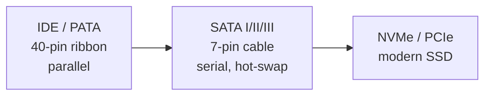
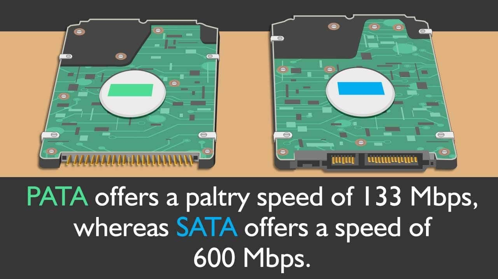

# Disk Management

## Overview

Disk management is the foundation of Linux storage administration: recognising the **physical interface** a drive uses (IDE/PATA vs SATA vs NVMe), understanding how the kernel **names and drives** those devices, and knowing how disks are **partitioned** (MBR vs GPT) before any filesystem is created. This note covers the interface standards you will encounter, how Linux exposes each disk type, and the partitioning models that govern how a disk is carved up.

> [!NOTE]
> This is the conceptual groundwork. Practical partitioning, formatting, mounting, and inspection commands live in [Disk-and-Partition-Management](Disk-and-Partition-Management.md) and [Disk-Usage-Check](Disk-Usage-Check.md).

## Concepts

### Storage interface evolution



### IDE (Integrated Drive Electronics)

- IDE is an interface standard for connecting storage devices like hard disk drives (HDDs) and optical drives to a computer's motherboard.
- The defining feature is that the controller is integrated directly into the disk drive, which reduces complexity and compatibility issues.
- IDE typically uses a flat, 40-pin ribbon cable for data transfer and allows for two devices per cable, set as master and slave.
- Communication is parallel, so multiple bits of data are sent simultaneously.
- IDE played a major role in the evolution of PC storage, but is now largely replaced by newer standards.

### ATA (Advanced Technology Attachment)

- ATA essentially refers to the hardware standard that IDE implements.
- ATA evolved over multiple versions:
    - ATA (basic, supports 2 hard drives, 16-bit interface)
    - ATA-2 (faster speeds, logical block addressing)
    - ATA-3, Ultra-ATA, ATA/66, ATA/100 (higher data rates, improved cables).
- ATA is commonly known as Parallel ATA (PATA) after the introduction of the serial version (SATA).
- ATA covers both IDE and its successors.

### PATA (Parallel ATA)

- PATA stands for Parallel Advanced Technology Attachment.
- It's the technical name for the original ATA interface, also called IDE or EIDE.
- PATA uses parallel communication, transferring data across multiple wires in a ribbon cable.
- These cables can support up to two drives, require jumper settings or colored cable connectors for master/slave configuration, and have no support for hot swapping.
- PATA cables are broader and shorter compared to modern SATA cables (about 0.5m maximum length).
- Data transfer speeds initially started low (8.3MB/s), but increased in later PATA iterations to 133MB/s.
- With the advent of SATA in 2003, PATA became obsolete due to SATA's improved speed, reliability, and convenience.

#### Summary Table: IDE / ATA / PATA

| Name | Full Form | Common Use | Max Devices Per Channel | Cable Type | Data Transfer Type | Max Speed |
| :-- | :-- | :-- | :-- | :-- | :-- | :-- |
| IDE | Integrated Drive Electronics | HDDs, ODDs | 2 (Master/Slave) | 40-pin Ribbon | Parallel | Up to 133MB/s |
| ATA | Advanced Technology Attachment | HDDs | 2 | Ribbon (PATA), SATA (Serial ATA) | Parallel or Serial | Depends on revision |
| PATA | Parallel ATA (Parallel Advanced Technology Attachment) | HDDs, ODDs | 2 | 40/80-conductor Ribbon | Parallel | Up to 133MB/s |

#### Key Points

- IDE, ATA, and PATA often refer to the same type of disk interface in traditional PCs.
- PATA/IDE disks are legacy technology and have been replaced by SATA in newer computers.
- They are easily recognized by their broad ribbon cables and the need for configuration as master/slave when two devices share one cable.

This classification is pivotal in disk management tasks, especially when dealing with legacy computers or migrating older systems to newer storage technologies.



### SATA (Serial ATA) Disk Type

#### What is SATA?

- **SATA (Serial Advanced Technology Attachment)** is the most common interface for hard drives and solid-state drives (SSDs) in modern computers.
- Introduced in 2003, SATA replaced the older PATA (Parallel ATA) interface, offering faster speeds, better efficiency, and easier installation using thin, flexible cables.

#### Technical Features

- **Connection:** Uses a 7-pin data cable, much smaller and simpler than the 40-pin ribbon used by PATA.
- **Data Transfer:** Serial communication—data is sent bit-by-bit, allowing for higher speeds and reduced interference compared to parallel signaling.
- **Hot Swapping:** SATA supports hot swapping, meaning drives can be added or removed while the computer is running.
- **Maximum Speed:**
    - SATA I: 1.5Gbps (up to 150MB/s)
    - SATA II: 3Gbps (up to 300MB/s)
    - SATA III: 6Gbps (up to 600MB/s)
- **Device Support:** Most desktops, many laptops, and external drives use SATA interfaces for HDDs and SSDs.

#### Advantages Over PATA

- **Faster data transfer speeds** (up to 600MB/s vs. 133MB/s for PATA).
- **Slimmer, longer cables** for easier cable management and improved airflow in PC cases.
- **Lower power consumption** and improved reliability.
- **Hot swap capability**, not available with legacy PATA drives.
- **Native Command Queuing (NCQ):** Improves multitasking and disk performance in modern SATA drives.

#### Usage & Compatibility

- SATA is used in desktop and laptop computers, servers, and external hard drive enclosures.
- Forward and backward compatibility: Many newer systems can use older SATA drives, and vice versa.
- High-capacity drives (up to 20TB for HDDs) still use SATA in consumer markets.

#### Comparison Table: SATA vs PATA

| Feature | SATA | PATA |
| :-- | :-- | :-- |
| Full Form | Serial Advanced Technology Attachment | Parallel Advanced Technology Attachment |
| Connector | 7-pin cable | 40-pin ribbon cable |
| Max Speed | Up to 600MB/s (SATA III) | Up to 133MB/s |
| Hot Swapping | Supported | Not supported |
| Cable Length | Up to 1m (39.6in) | Up to 0.5m (18in) |
| Power Usage | Lower | Higher |

#### Key Points

- SATA is **standard for modern disk management** due to its speed, efficiency, and ease of use.
- It's replacing PATA/IDE in all new consumer computers, and is also compatible with SSDs, which benefit from the SATA interface for fast transfers.

SATA remains the dominant standard for consumer-grade storage, providing a balance of performance, reliability, and affordability.

## Architecture

### IDE and SATA Disk Handling in Linux

#### Device Naming Convention

- **IDE disks** are traditionally identified in Linux using `/dev/hdX` naming, where:
    - `/dev/hda` = primary master IDE
    - `/dev/hdb` = primary slave IDE
    - `/dev/hdc` = secondary master IDE
    - `/dev/hdd` = secondary slave IDE
- **SATA disks** are treated like SCSI devices in modern Linux kernels and use `/dev/sdX` naming:
    - `/dev/sda` = first detected SATA (or SCSI/USB/NVMe) disk
    - `/dev/sdb`, `/dev/sdc`, etc., for subsequent disks

#### Kernel Driver Support

- Early Linux kernels used the "IDE" driver stack for IDE/PATA disks.
- For SATA disks, the modern kernel stack is "libata," offering advanced features like hot swapping, NCQ, and better compatibility.
- Many distributions have moved completely to libata, so even some legacy IDE disks might appear under `/dev/sdX` on newer kernels.

#### Disk Management and Tools

- You can use tools like `lsblk`, `fdisk -l`, or `parted -l` to list detected disks and their partitions, regardless of type.
- For IDE disks, legacy systems may use `/proc/ide/` and configuration via device names like `/dev/hdX`.
- For SATA disks, use `/proc/scsi/`, `lsblk` on `/dev/sdX`, and utilities like `smartctl` to get detailed information.
- Disk and partition management (mount, format, partition, etc.) is largely identical, just using different device names.

#### Differences Between IDE and SATA in Linux

| Feature | IDE in Linux | SATA in Linux |
| :-- | :-- | :-- |
| Device Name | `/dev/hdX` | `/dev/sdX` |
| Driver Stack | IDE/ata | libata/SCSI compatible |
| Hot Plugging | Not supported | Supported |
| Typical Use | Old PCs, legacy hardware | Modern desktops/laptops |
| Speed | Up to 133MB/s | Up to 600MB/s (SATA III) |

> [!TIP]
> On most contemporary Linux installations, all modern (SATA/SSD/NVMe) drives show as `/dev/sdX` (NVMe drives appear as `/dev/nvme0n1`). If you are dealing with very old hardware, you may still see `/dev/hdX` for IDE disks; newer kernels may standardize even IDE disks under `/dev/sdX`. Disk utilities and mounting procedures are similar for both; the main difference is the naming and driver handling.

To confirm the transport (interface) behind each block device without opening the case, query the `TRAN` column:

```bash
lsblk -d -o NAME,TRAN,ROTA,SIZE,MODEL
```

The `TRAN` field reports `sata`, `nvme`, `usb`, etc., and `ROTA` (1 = rotational HDD, 0 = SSD) distinguishes spinning disks from solid-state media.

Linux handles both IDE and SATA disks efficiently, but users must be aware of the device naming and the type of kernel drivers involved, especially when dealing with legacy systems or performing low-level disk management.

## Partition Types: Primary, Extended, Logical

Partitioning is an essential part of organizing and managing disks in operating systems like Linux, Windows, and macOS. The sections below detail the types of partitions and their use cases on both MBR (Master Boot Record) and GPT (GUID Partition Table) disks.

### Primary Partition

- **Definition:** A primary partition is a principal division of a disk that can contain an operating system or user data. It is created directly on the disk, not within any other container.
- **Bootable:** It can be set as "active" (using a boot flag), which allows the BIOS/UEFI to start an operating system from it.
- **MBR Limit:** MBR disks allow a maximum of 4 primary partitions or 3 primary partitions plus one extended partition.
- **GPT:** GPT disks support many more (up to 128) partitions, all of which are treated as primary—there is no distinction between primary and logical partitions here.
- **File systems:** Can contain any file system including NTFS, FAT, ext4, xfs, etc.
- **Use Case:** OS installation, main system data storage.

### Extended Partition

- **Definition:** An extended partition is a special type of container that was introduced to overcome the MBR limit of 4 primary partitions per disk.
- **Can it store data directly?** No, you can't format or store data directly in an extended partition.
- **Count:** Only *one* extended partition is allowed per MBR disk, and it occupies one of the four possible partition slots.
- **Purpose:** Holds multiple logical partitions, making it possible to go beyond the 4-partition limit of MBR.
- **Structure:** Extended partitions use a chain of Extended Boot Records (EBRs) to link logical partitions together.

### Logical Partition

- **Definition:** Logical partitions exist *within* the extended partition on MBR disks. Each logical partition acts as its own drive for storage and can be formatted separately.
- **Bootability:** Not directly bootable from BIOS on MBR disks, but can hold data or even OS installations on modern systems using a bootloader. On Linux, any partition (primary/logical) can be used for any mount point, such as /home or /var.
- **Count:** Theoretically, the number of logical partitions is limited only by available disk space and drive letter assignments, not by the partitioning scheme.
- **Use Case:** Organizing user data or applications, creating additional mount points, or making dual/multi-boot systems.

### MBR vs GPT Partition Schemes

| Feature | MBR | GPT |
| :-- | :-- | :-- |
| Max disk size | 2TB | 9.4ZB+ |
| Max partitions | 4 primary or 3+1 extended | 128+ primary |
| Partition types | Primary, Extended, Logical | Primary only |
| Booting | BIOS-based | UEFI-based, more flexible |
| Linux mount points | Any (primary/logical) | Any (primary only) |

### Linux Details

- **Linux allows /, /home, /var, etc., to reside on either primary or logical partitions** when using MBR. Linux does not distinguish between these types in its daily operations; the OS simply refers to partitions by their device names and mount points.
- **With GPT disks, you do not use extended or logical partitions:** all partitions are created as primary.

## Examples

### Visual Overview (MBR Partition Layout)

```text
|-------------------|-------------------|----------------------|
|   Primary #1      |   Primary #2      |   Extended           |
|-------------------|-------------------|--------|-------------|
                                | Logical #1 | Logical #2 | ... | Logical #N |
                                |-------------------------------------------|
```

- **Primary #1 and Primary #2:** Regular primary partitions for OS or data.
- **Extended:** The extended partition, acting as a container.
- **Logical #1 to Logical #N:** Logical partitions created inside the extended partition—these can host data, Linux filesystems, etc.

This layout illustrates that, under MBR, you can have up to 3 primary partitions plus 1 extended partition that contains multiple logical partitions (allowing more than 4 total partitions on the disk).

> [!IMPORTANT]
> **Key Reminders**
> - Use extended/logical partitions only with MBR if you need more than four partitions.
> - On modern systems (GPT), you can create as many primary partitions as you need; no logical/extended layers are required.

These concepts form the foundation of disk management for classic and current systems alike, helping with multi-boot, data segmentation, and advanced administrative tasks.

## Best Practices

- **Prefer GPT for new deployments.** It removes the 2TB / 4-primary ceilings of MBR, stores a backup partition table at the end of the disk, and protects the table with CRC32 checksums.
- **Use UUIDs, not device names, in `/etc/fstab`.** Kernel enumeration order (`/dev/sda` vs `/dev/sdb`) is not guaranteed across reboots or when adding disks — see [Permanent-Mounting-of-Partitions-in-Linux](Permanent-Mounting-of-Partitions-in-Linux.md).
- **Enable SMART monitoring** with `smartctl` (from the `smartmontools` package) so failing drives are flagged before data loss.
- **Align partitions** to the underlying device geometry (modern tools default to 1MiB alignment) to avoid a read/write penalty on SSDs and advanced-format (4K) drives.

## Security Considerations

- **Encrypt data at rest.** Layer LUKS/dm-crypt beneath filesystems on removable or sensitive disks so that a stolen drive does not disclose data (CIS Benchmark guidance recommends encryption for laptops and portable media).
- **Sanitise decommissioned disks.** Removing a partition only unlinks the table entry; data blocks remain. Use `blkdiscard` (SSD/TRIM), `shred`, or ATA Secure Erase before disposal or reassignment.
- **Restrict access to raw block devices.** Read access to `/dev/sdX` bypasses filesystem permissions entirely — keep these device nodes owned by `root:disk` and audit membership of the `disk` group.

## Troubleshooting

| Symptom | Likely Cause | Check / Fix |
| :-- | :-- | :-- |
| Disk not visible in `lsblk` | Not detected by kernel / bad cable | `dmesg | grep -i sata`, reseat cable, rescan SCSI bus |
| `/dev/sda` became `/dev/sdb` after adding a disk | Non-deterministic enumeration | Mount by UUID/LABEL in `/etc/fstab` |
| "GPT PMBR size mismatch" warning | Disk imaged onto a larger/smaller device | Re-write backup GPT with `gdisk` → `w` |
| Cannot create a 5th primary partition on MBR | MBR 4-partition limit reached | Use an extended + logical partitions, or convert to GPT |

## References

- Arch Wiki — Partitioning
- Red Hat Enterprise Linux — Managing Storage Devices
- `man 8 fdisk`, `man 8 gdisk`, `man 8 lsblk`, `man 8 smartctl`

## Related

- [Disk-and-Partition-Management](Disk-and-Partition-Management.md) — partitioning and formatting disks in practice
- [Logical-Volume-Manager(LVM)](Logical-Volume-Manager(LVM).md) — flexible volume management above partitions
- [RAID-in-Linux](RAID-in-Linux.md) — redundant disk arrays
- [Disk-Usage-Check](Disk-Usage-Check.md) — inspect space usage
- [Permanent-Mounting-of-Partitions-in-Linux](Permanent-Mounting-of-Partitions-in-Linux.md) — persist mounts across reboots
- [Linux Administration & Server Hardening](../Readme.md) — Linux administration & server hardening hub
