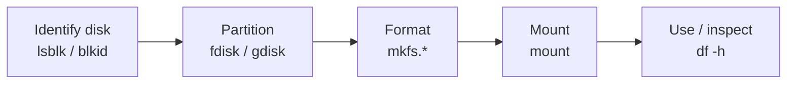

# Disk and Partition Management

## Overview

This note covers the day-to-day workflow of managing block devices on Linux: **identifying** disks and partitions, **partitioning** them with `fdisk`/`gdisk`, **formatting** (creating filesystems) with the `mkfs` family, and **mounting/unmounting** them for use. These commands form the fundamentals for disk and filesystem management on Linux systems, allowing you to create, format, mount, and inspect disks and partitions efficiently.

> [!NOTE]
> For the underlying interface and partition-scheme theory (IDE/SATA, MBR/GPT, primary/extended/logical) see [Disk-Management](Disk-Management.md). To make mounts survive a reboot, see [Permanent-Mounting-of-Partitions-in-Linux](Permanent-Mounting-of-Partitions-in-Linux.md).

## Concepts

### The disk-to-usable-storage workflow



### Listing block device files

The commands below show information about device files in the `/dev` directory in Linux, filtered by certain criteria:

- `ls -lh /dev` lists files in `/dev` with human-readable sizes and detailed info.
- Piping to `grep ^b` filters for lines starting with the letter **b**.
- In `ls -l` output, the **first character** in the permissions column indicates the file type:
    - **b** = block device file

```bash
ls -lh /dev | grep ^b
```

- This command lists **block device files** in `/dev`. Block devices represent hardware devices that handle data in blocks, such as hard drives, SSDs, USB drives, CD-ROMs, etc.

```bash
ls -lh /dev/ | grep br
```

- Lists `/dev` files as above.
- Filters lines containing **br**.
- The combination **"br"** at the start means:
    - **b**: block device file
    - **r**: read permission for owner (part of permission bits)

Essentially, it lists block device files with read permission for the user.

## Commands

### Displaying disk and filesystem information

- List all block devices and partitions with mount points in a tree format:

```bash
lsblk
```

- Show block device attributes like UUID, TYPE (filesystem type), LABEL:

```bash
blkid
```

- Display disk usage for mounted filesystems in human-readable format:

```bash
df -h
```

- List block devices in `/dev` with detailed info:

```bash
cd /dev
```

```bash
ls -lh | grep br
```

### `fdisk`

- Utility to view and manipulate disk partition tables (MBR and some GPT).
- Common interactive commands within `fdisk`:

| Key | Action |
| :-- | :-- |
| `p` | Print existing partition table |
| `n` | Create a new partition |
| `d` | Delete a partition |
| `a` | Toggle a partition's bootable flag |
| `t` | Change partition type (e.g., Linux, NTFS) |
| `w` | Write changes to disk and exit |
| `q` | Quit without saving changes |
| `m` | Show help menu |

Example usage:

- List all disk partitions:

```bash
fdisk -l
```

```bash
fdisk -l /dev/sda
```

- Open disk `/dev/sdb` for editing:

```bash
fdisk /dev/sdb
```

> [!WARNING]
> `w` commits partition-table changes to disk immediately and can destroy existing data. Nothing is written until you press `w`; use `q` to abandon a session safely.

### `gdisk`

- Similar to `fdisk` but designed for GPT disk partitions.
- Used to create, edit, and maintain GPT partition tables.

```bash
yum install gdisk
```

```bash
gdisk /dev/sde
```

## Creating Filesystems (Formatting)

### `mkfs` (Make FileSystem)

Format partitions with a specific filesystem:

| Command | Filesystem | Typical Use |
| :-- | :-- | :-- |
| `mkfs.ext4 /dev/sdb1` | ext4 | Common Linux filesystem |
| `mkfs.xfs /dev/sdb5` | XFS | High-performance Linux filesystem |
| `mkfs.fat /dev/sdc2` | FAT | Older FAT filesystem (for compatibility) |
| `mkfs.vfat /dev/sdc2` | VFAT | FAT variant, supports long filenames |
| `mkfs.ntfs /dev/sdc1` | NTFS | Windows filesystem (requires `ntfs-3g` tools) |

> [!WARNING]
> Running `mkfs.*` on a partition **erases all existing data** on it. Double-check the device name (`lsblk`, `blkid`) before formatting.

### Installing NTFS tools on RPM-based systems (e.g., CentOS, Fedora)

```bash
yum install ntfs*
```

```bash
yum install ntfs-3g-devel.x86_64 ntfs-3g.x86_64 ntfsprogs.x86_64
```

```bash
yum install dosfstools
```

### `mkfs.ext4`

- Formats a partition with the ext4 filesystem, commonly used in Linux for its performance and reliability.
- Prepares the partition for use by creating necessary filesystem structures.

```bash
mkfs.ext4 /dev/sdb1
```

### `mkfs.xfs`

- Formats a partition with the XFS filesystem, known for high performance and scalability in Linux.
- Suitable for large files and parallel I/O workloads.

```bash
mkfs.xfs /dev/sde1
```

### `mkfs.ntfs`

- Formats a partition with the NTFS filesystem, primarily used in Windows.
- Requires `ntfs-3g` utilities installed on Linux for read/write support.

```bash
mkfs.ntfs /dev/sdc1
```

### `blkid`

- Displays block devices with their filesystem types, UUIDs, and labels.
- Useful for confirming filesystem formats and for configuring mounts based on UUID.

```bash
blkid
```

## Mounting and Unmounting Filesystems

### Mount

- Mount `/dev/sdb1` to the `/mnt` directory:

```bash
mount /dev/sdb1 /mnt/
```

### Creating mount points

- Create directories to use as mount points:

```bash
mkdir /d1 /d2 /d3 /d4 /d5
```

- You may specify the filesystem type explicitly:

```bash
mount -t ntfs /dev/sdc1 /d3/
```

```bash
mount -t vfat /dev/sdc2 /d4/
```

```bash
df -h
```

### Unmount

- Unmount the partition:

```bash
umount /dev/sdb1
```

- Or unmount by mount point:

```bash
umount /d1
```

## Other Useful Commands

- Inform the OS of partition table changes made (refresh disk partitions):

```bash
partprobe
```

- Using `fdisk` and `gdisk` after partitioning changes or before creating filesystems is a good practice to verify partition layouts.

- Inspect existing filesystem/partition signatures on a device before reusing it:

```bash
wipefs /dev/sdb
```

- Erase stale filesystem signatures (superblocks) so `blkid` and auto-mount do not detect an old, removed filesystem:

```bash
wipefs -a /dev/sdb1
```

> [!WARNING]
> `wipefs -a` removes the signatures that identify a filesystem and makes the data on it effectively unrecoverable by normal tools. Confirm the target device first.

## Best Practices

- **Verify the target device before every destructive action.** Confirm with `lsblk` and `blkid`; `/dev/sdb` today may be `/dev/sdc` after a reboot.
- **Prefer UUID- or LABEL-based mounts** in `/etc/fstab` over raw device names for reboot stability — see [Permanent-Mounting-of-Partitions-in-Linux](Permanent-Mounting-of-Partitions-in-Linux.md).
- **Choose the filesystem to fit the workload:** XFS scales well for large files and parallel I/O; ext4 is a robust general-purpose default.
- **Run `partprobe` (or re-read with `fdisk`/`gdisk`)** after editing a partition table so the kernel picks up the new layout without a reboot.

## Security Considerations

- **Harden mount options** for user-writable and removable filesystems in `/etc/fstab`: `nodev`, `nosuid`, and `noexec` prevent device-node abuse, setuid escalation, and executing binaries from data partitions (CIS Benchmark recommendations for `/tmp`, `/var`, `/home`, and removable media).
- **Never leave a formatting or partitioning session assuming no writes occurred** — a stray `w` in `fdisk` or a mistyped `mkfs` target destroys data irrecoverably. Keep backups before restructuring disks.
- **Wipe filesystem signatures** with `wipefs` before repurposing a device so stale superblocks do not confuse auto-mount and `blkid`.

## Troubleshooting

| Symptom | Likely Cause | Check / Fix |
| :-- | :-- | :-- |
| `mount: /dev/sdb1 already mounted or mount point busy` | Device or mount point in use | `lsof +D /mnt`, `fuser -m /mnt`, then unmount |
| `umount: target is busy` | Open file/process on the filesystem | `fuser -vm /mnt`, close the process, or `umount -l` (lazy) |
| New partition not seen by kernel | Partition table not re-read | `partprobe` or `blockdev --rereadpt /dev/sdb` |
| `wrong fs type, bad option, bad superblock` on mount | Missing driver or corrupt FS | Install driver (e.g. `ntfs-3g`), run `fsck` |

## Summary

| Command | Description |
| :-- | :-- |
| `fdisk` | Partition disk (MBR) |
| `gdisk` | Partition disk (GPT) |
| `mkfs.ext4` | Format partition as ext4 filesystem |
| `mkfs.xfs` | Format partition as XFS filesystem |
| `mkfs.fat` | Format partition as FAT filesystem |
| `mkfs.ntfs` | Format partition as NTFS filesystem (requires ntfs-3g) |
| `lsblk` | List block devices and partitions |
| `blkid` | Show partition UUIDs and types |
| `df -h` | Show mounted filesystem usage |
| `mount` | Attach filesystem to directory |
| `umount` | Detach filesystem |
| `partprobe` | Refresh kernel partition table info |

## References

- Arch Wiki — Partitioning, File systems
- Ubuntu Server Guide — Storage
- `man 8 fdisk`, `man 8 mkfs`, `man 8 mount`, `man 8 blkid`

## Related

- [Disk-Management](Disk-Management.md) — interface and partition-scheme theory (IDE/SATA, MBR/GPT)
- [Logical-Volume-Manager(LVM)](Logical-Volume-Manager(LVM).md) — flexible volumes built on partitions
- [RAID-in-Linux](RAID-in-Linux.md) — array layout on partitions
- [Permanent-Mounting-of-Partitions-in-Linux](Permanent-Mounting-of-Partitions-in-Linux.md) — persist partition mounts
- [Disk-Usage-Check](Disk-Usage-Check.md) — measure filesystem consumption
- [Linux Administration & Server Hardening](../Readme.md) — Linux administration & server hardening hub
