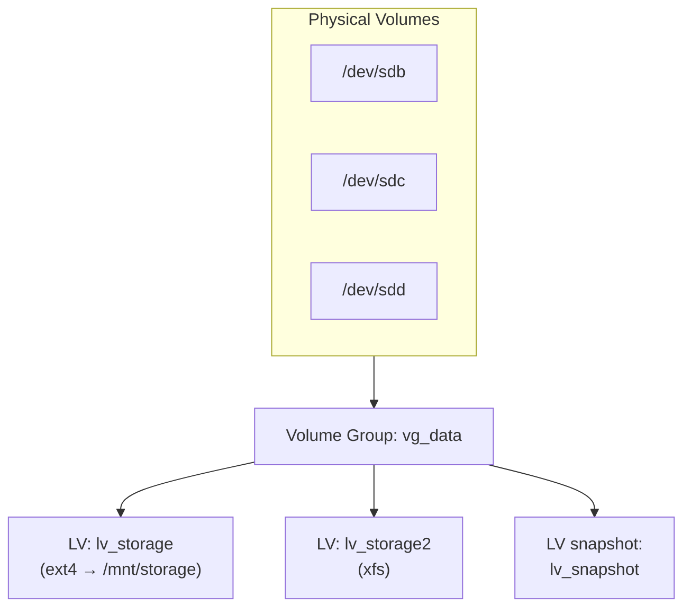

# Logical Volume Manager (LVM)

## Overview

Logical Volume Manager (LVM) is a robust device-mapper framework for Linux (and some other Unix-like systems) that provides a flexible and dynamic method for managing disk storage. It abstracts physical storage devices into logical volumes, enabling administrators to manage storage in a more adaptable way than traditional fixed partitioning — resizing, snapshotting, and moving volumes online without downtime.

> [!TIP]
> The core mental model: **disks/partitions → Physical Volumes → pooled into a Volume Group → carved into Logical Volumes → formatted and mounted.** Because LVs draw from a shared pool, you can grow, shrink, and relocate them long after installation.

## Concepts

### Key components

- **Physical Volumes (PVs):** Physical storage devices like disks or partitions.
- **Volume Groups (VGs):** Pools of storage created by combining one or more PVs.
- **Logical Volumes (LVs):** Virtual partitions carved out from VGs that behave like regular disk partitions but with enhanced flexibility.

## Architecture



### Essential features

- **Dynamic Resizing:** Logical volumes and volume groups can be resized online without downtime.
- **Snapshot Support:** Supports both read-only and read-write snapshots for consistent backups.
- **Thin Provisioning:** Create volumes larger than the physical storage, allocating space dynamically.
- **Caching:** Use fast storage (e.g., SSDs) as cache to accelerate performance.
- **RAID Support:** LVM supports multiple RAID levels (0, 1, 4, 5, 6, 10) for redundancy and performance.
- **Mirroring and Striping:** Provides data redundancy and improved I/O performance.
- **Volume Movement:** Move logical volumes across physical volumes without downtime.
- **LVM Profiles & Configurations:** Manage configurations and profiles for specific setups.
- **JSON Reporting:** Enhanced command outputs with JSON format for easier automation.
- **Historical Logical Volumes:** Track and manage thin snapshots and volumes removed from dependency chains.
- **Multihost Volume Management:** Cluster LVM supports shared volume groups across multiple hosts in a cluster environment.

### Recent updates and enhancements

- Introduction of **RAID0 segment types** integrated into LVM for data striping across multiple subvolumes.
- Enhanced logging features with detailed **command log reports** for audit and troubleshooting.
- Support for **removal of missing physical volumes** with safe reduction options (`vgimport --force` and `vgreduce --mirrorsonly`).
- Extended control over **activation of thin pool snapshots** with dedicated options in volume creation and change commands.
- Expanded **JSON output support** enabling better scripting and integration with modern automation tools.
- Implementation of **LVM caching** leveraging fast block devices as write-back or write-through caches.
- Support for **thin snapshot dependency chain tracking**, enabling detailed management of historical volumes.
- In cluster environments, LVM enables **transparent volume group management across multiple hosts** for high availability and shared storage scenarios.

### Use cases

- Simplified management and resizing of file systems in enterprise servers.
- Enabling flexible storage for virtualized environments and containerized workloads.
- Efficient disk space utilization with thin provisioning.
- Data protection and backup consistency with snapshots.
- High availability solutions using cluster-wide volume management.
- Performance improvement with caching and RAID features.

### Summary table of LVM features

| Feature | Description |
| :-- | :-- |
| Physical Volumes (PVs) | Base physical storage devices. |
| Volume Groups (VGs) | Pools combining multiple PVs as unified storage. |
| Logical Volumes (LVs) | Flexible virtual partitions used by the OS and applications. |
| Dynamic resizing | Resize volumes and groups without downtime. |
| Snapshots | Create point-in-time copies for backups and testing. |
| Thin provisioning | Overcommit storage, allocate space as needed. |
| RAID Support | Supports RAID levels 0,1,4,5,6,10 for performance and redundancy. |
| Caching | Use SSDs or fast disks as caches for slower disks. |
| Volume movement | Move volumes across physical drives without downtime. |
| JSON output | Native command output in JSON for automation. |
| Cluster LVM | Manage shared volumes across multiple hosts for high availability. |

LVM continues to evolve with a strong emphasis on flexibility, performance, and integration with contemporary storage and cloud environments, solidifying its role as a foundational storage management solution in Linux ecosystems.

## Configuration

### 1. Install LVM (if not already installed)

- On Debian/Ubuntu:

```bash
apt install lvm2
```

- On RHEL/CentOS:

```bash
yum install lvm2
```

### 2. Create Physical Volumes (PV)

- Identify available disks:

```bash
lsblk
```

- Initialize disks as physical volumes:

```bash
pvcreate /dev/sdb /dev/sdc /dev/sdd /dev/sde /dev/sdf
```

- Verify physical volumes:

```bash
pvs
```

```bash
pvdisplay
```

### 3. Create a Volume Group (VG)

- Create a VG named `vg_data`:

```bash
vgcreate vg_data /dev/sdb /dev/sdc /dev/sdd /dev/sde
```

- Check volume group details:

```bash
vgs
```

```bash
vgdisplay
```

### 4. Create Logical Volumes (LV)

- Create a 60GB logical volume named `lv_storage`:

```bash
lvcreate -L 60G -n lv_storage vg_data
```

- Or use all free space for `lv_storage2`:

```bash
lvcreate -l 100%FREE -n lv_storage2 vg_data
```

- Verify logical volumes:

```bash
lvs
```

```bash
lvdisplay
```

### 5. Format and mount the Logical Volume

- Format with ext4 or xfs:

```bash
mkfs.ext4 /dev/vg_data/lv_storage
```

```bash
mkfs.xfs /dev/vg_data/lv_storage2
```

- Create a mount point and mount:

```bash
mkdir /mnt/storage
```

```bash
mount /dev/vg_data/lv_storage /mnt/storage
```

## Commands

### 6. Resizing Logical Volumes

#### Extend LV (increase size)

- Add new PV to VG:

```bash
vgextend vg_data /dev/sdf
```

- Increase LV size by 10GB:

```bash
lvextend -L +10G /dev/vg_data/lv_storage
```

- Resize filesystem (ext4 example):

```bash
resize2fs /dev/vg_data/lv_storage
```

- Verify new size:

```bash
df -h /mnt/storage
```

#### Shrink LV (reduce size)

> [!WARNING]
> Shrinking is the dangerous direction. **Always shrink the filesystem before the logical volume** — reducing the LV first truncates live data and corrupts the filesystem. XFS cannot be shrunk at all. Back up before you begin.

- Unmount volume:

```bash
umount /mnt/storage
```

- Check and shrink filesystem:

```bash
e2fsck -f /dev/vg_data/lv_storage
```

```bash
resize2fs /dev/vg_data/lv_storage 15G
```

- Reduce LV size:

```bash
lvreduce -L 15G /dev/vg_data/lv_storage
```

- Remount volume:

```bash
mount /dev/vg_data/lv_storage /mnt/storage
```

#### Resize logical volumes with `lvresize`

- Resize to 90GB and automatically resize filesystem:

```bash
lvresize /dev/vg_data/lv_storage --size 90G --resizefs
```

- Resize to 40GB and automatically resize filesystem:

```bash
lvresize /dev/vg_data/lv_storage --size 40G --resizefs
```

- Resize to 75GB without resizing filesystem (manual resize needed):

```bash
lvresize /dev/vg_data/lv_storage --size 75G
```

- Resize to 25GB without resizing filesystem (manual resize needed):

```bash
lvresize /dev/vg_data/lv_storage --size 25G
```

- Resize to 50GB without resizing filesystem:

```bash
lvresize /dev/vg_data/lv_storage -L 50G
```

- Resize to 100GB without resizing filesystem:

```bash
lvresize /dev/vg_data/lv_storage -L 100G
```

#### Important considerations

- When **increasing** the LV size with `--resizefs`, the filesystem is expanded automatically (supported file systems: ext4, xfs, etc.).
- When **decreasing** LV size, **shrink filesystem first manually** before `lvresize` to avoid data loss.
- If you don't use `--resizefs`, resize the filesystem manually using:
  - For ext4:

```bash
resize2fs /dev/vg_data/lv_storage
```

  - For xfs (can only be grown, not shrunk):

```bash
xfs_growfs /dev/vg_data/lv_storage
```

- Always backup important data before resizing logical volumes.

### 7. Creating and using LVM snapshots

- Create a snapshot of `lv_storage` (5GB snapshot):

```bash
lvcreate -L 5G -s -n lv_snapshot /dev/vg_data/lv_storage
```

- Mount snapshot:

```bash
mount /dev/vg_data/lv_snapshot /mnt/snapshot
```

- Remove snapshot after use:

```bash
umount /dev/vg_data/lv_snapshot
```

```bash
lvremove /dev/vg_data/lv_snapshot
```

> [!NOTE]
> A snapshot only stores changed blocks (copy-on-write). If the source volume changes more than the snapshot's allocated size, the snapshot is invalidated — size it for the expected write volume during the backup window, and remove it promptly afterward to avoid a write-performance penalty.

### 8. Removing LVM components

#### Remove Logical Volume

```bash
umount /mnt/storage
```

```bash
lvremove /dev/vg_data/lv_storage
```

```bash
lvdisplay
```

```bash
lvs
```

#### Remove Volume Group

```bash
vgremove vg_data
```

```bash
vgdisplay
```

```bash
vgs
```

#### Remove Physical Volume

```bash
pvremove /dev/sdb /dev/sdc /dev/sdd /dev/sde /dev/sdf
```

```bash
pvdisplay
```

```bash
pvs
```

### 9. Checking LVM status

- Show logical volumes:

```bash
lvs
```

- Show volume groups:

```bash
vgs
```

- Show physical volumes:

```bash
pvs
```

- Additional commands often used for disk management and LVM inspection:

```bash
fdisk -l | grep sd
```

```bash
fdisk /dev/sdb
```

```bash
rpm -qa | grep lvm
```

```bash
rpm -qi lvm2
```

### 10. Moving data off a physical volume (`pvmove`)

One of LVM's defining capabilities is relocating allocated extents between physical volumes **online**, without unmounting the logical volumes. This is essential when retiring or replacing a failing disk.

- Move all extents off `/dev/sdb` onto the remaining PVs in the volume group:

```bash
pvmove /dev/sdb
```

- Move extents specifically onto a designated target PV:

```bash
pvmove /dev/sdb /dev/sdf
```

- Once the PV is empty, remove it from the volume group and then from LVM:

```bash
vgreduce vg_data /dev/sdb
```

```bash
pvremove /dev/sdb
```

> [!TIP]
> `pvmove` is resumable — if it is interrupted, re-running `pvmove` (with no arguments) continues the in-progress move. Because it copies live data, expect I/O load and run it during a maintenance window on busy systems.

## Best Practices

- **Leave free extents in the VG** rather than allocating 100% up front, so volumes can grow and snapshots have room to breathe.
- **Grow online, shrink offline.** Extending ext4/XFS is a safe online operation; shrinking requires unmounting (ext4) and is impossible for XFS.
- **Name volumes descriptively** (`vg_data`, `lv_storage`) so intent is clear in `lvs`/`vgs` output and in `/etc/fstab`.
- **Snapshot before risky changes** (upgrades, migrations) to get a fast rollback point, and remove snapshots once done.

## Security Considerations

- **Layer LUKS with LVM for encryption at rest.** The common "LVM on LUKS" pattern encrypts the underlying PV so all logical volumes inherit encryption — recommended for laptops, portable, and sensitive server storage.
- **`lvremove`/`vgremove`/`pvremove` are destructive.** Confirm the target device path before running; a wrong `pvremove` can orphan an entire volume group.
- **Snapshots can leak sensitive data.** A read-write snapshot mounted for backup exposes a full copy of the source filesystem — protect its mount point with the same permissions and, where relevant, the same encryption as the original.

## Troubleshooting

| Symptom | Likely Cause | Check / Fix |
| :-- | :-- | :-- |
| `lvextend` succeeds but `df` unchanged | Filesystem not grown | `resize2fs` (ext4) or `xfs_growfs` (xfs) after extending |
| VG shows "insufficient free space" | All extents allocated | `vgextend` with a new PV, then extend the LV |
| Snapshot volume shows as invalid | Snapshot ran out of allocated space | Recreate with a larger `-L` size |
| `vgremove` fails: "still in use" | LVs mounted or active | `umount` and `lvremove` LVs first, or `vgchange -an vg_data` |
| Cannot shrink XFS volume | XFS does not support shrinking | Back up, recreate a smaller LV, restore data |

## References

- Red Hat Enterprise Linux — Configuring and Managing Logical Volumes
- Arch Wiki — LVM
- `man 8 lvm`, `man 8 lvcreate`, `man 8 lvextend`, `man 8 lvresize`, `man 8 vgcreate`, `man 8 pvcreate`

## Related

- [Disk-Management](Disk-Management.md) — overall disk administration
- [Disk-and-Partition-Management](Disk-and-Partition-Management.md) — physical layer under LVM
- [RAID-in-Linux](RAID-in-Linux.md) — combine with LVM for redundancy
- [Swap-Extend](Swap-Extend.md) — extend swap on logical volumes
- [Disk-Usage-Check](Disk-Usage-Check.md) — monitor space on logical volumes
- [Linux Administration & Server Hardening](../Readme.md) — Linux administration & server hardening hub
