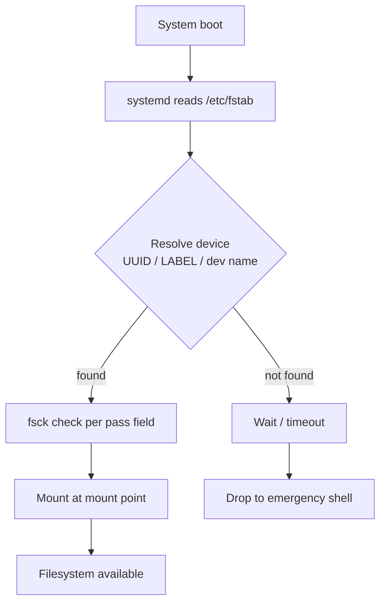

# Permanent Mounting of Partitions in Linux

Permanent mounting ensures that specific partitions are automatically mounted at system startup. This behaviour is configured through the `/etc/fstab` file, using device names, filesystem labels, or UUIDs for stable identification across reboots and hardware changes.

## Overview

A partition that is mounted with the `mount` command alone is *transient* — the association between the block device and its mount point is lost the moment the system reboots. To make a mount **persistent**, its parameters are recorded in `/etc/fstab` (the *file systems table*), which the boot process consults to reconstruct the filesystem hierarchy on every start-up.

Choosing the right device identifier is the single most important decision for reliable persistence. Kernel device names such as `/dev/sdb1` are assigned in probe order and can change when disks are added, removed, or re-cabled — a shifted name in `/etc/fstab` can leave a server unable to boot. UUIDs and labels are bound to the filesystem itself, so they survive re-ordering.

> [!TIP]
> **Recommended identifier**
> Prefer **UUIDs** for production systems. They are globally unique, stable across hardware changes, and are what modern installers write by default.

## Concepts

### What is `/etc/fstab`?

- The `/etc/fstab` file (short for **file systems table**) is a **system configuration file** that defines how disk partitions, devices, and other filesystems are mounted and integrated into the Linux filesystem hierarchy.
- At **boot time**, the system reads the `/etc/fstab` file to **automatically mount** these filesystems according to the rules specified.
- It is also used by the `mount` and `umount` commands to mount/unmount filesystems consistently.

```bash
cat /etc/fstab
```

### Purpose of `/etc/fstab`

- Automates the mounting of partitions and devices after every reboot.
- Defines the **mount points** (directories) where partitions are attached.
- Specifies **filesystem types** and **mount options** for each device.
- Controls filesystem **checks** at boot using `fsck`.
- Provides options for backup operations via `dump` (less commonly used).

### Boot-time mount flow



## Configuration

### Structure of `/etc/fstab` entries

Each line in the file describes one filesystem and contains **six fields**, separated by spaces or tabs:

| Field | Name            | Description                                                                                                 |
|-------|-----------------|-------------------------------------------------------------------------------------------------------------|
| 1     | Device          | Device or filesystem to mount. Could be a device file (e.g. `/dev/sda1`), a UUID (e.g. `UUID=xxxx`), or a label (e.g. `LABEL=home`). |
| 2     | Mount Point     | Directory where the filesystem is mounted (e.g., `/`, `/home`, `/mnt/data`). This directory must exist before mounting. |
| 3     | Filesystem Type | Filesystem type such as `ext4`, `xfs`, `ntfs`, `swap`, `vfat`, etc.                                          |
| 4     | Mount Options   | Comma-separated list of options controlling how the filesystem is mounted (e.g., `defaults`, `ro`, `noatime`, `user`). |
| 5     | Dump Flag       | Used by the `dump` utility to decide if the filesystem needs to be backed up. Typically `0` (no) or `1` (yes). |
| 6     | Fsck Order      | Order in which the `fsck` utility checks the filesystem at boot time. `0` means no check, `1` is highest priority (usually root), and `2` is lower priority for other filesystems. |

### Example `/etc/fstab`

```bash
# <device>                            <mount-point>    <type>  <options>   <dump>  <pass>
UUID=5aee7065-1788-4104-baa7-7c8eebe0d79d   /               xfs     defaults    0       0
UUID=1bd60826-47c9-4b94-ab02-405dd4c25a18   /boot           xfs     defaults    0       0
UUID=eb127c39-4908-4ce8-a720-e835b1062bd1   swap            swap    defaults    0       0
/dev/sdb1                                  /data1          ext4    defaults    0       0
LABEL=data2                                /data2          xfs     defaults    0       0
```

> [!NOTE]
> **📸 Screenshot**
> _Capture: Terminal showing the contents of /etc/fstab with UUID, mount point, type, and options columns aligned_

### Recommended practices

- Use **UUIDs** or **labels** instead of device names (`/dev/sdXN`) to avoid mounting errors caused by device renaming.
- Always create the **mount point directory** before mounting.
- After editing `/etc/fstab`, run:

```bash
mount -a
```

to mount all filesystems without rebooting (this tests your configuration).

- Back up `/etc/fstab` before making changes to avoid system boot issues.

> [!WARNING]
> **Boot safety**
> A malformed `/etc/fstab` entry can halt the boot process and drop the system into an emergency shell. **Always** validate changes with `mount -a` *before* rebooting, and keep a backup of the working file.

### Additional notes

- The file is read-only for automatic processes; only the system administrator should modify it.
- Misconfiguration of `/etc/fstab` can cause the system boot process to drop to an emergency shell, so changes must be made with care.
- Kernel and utilities use `/etc/fstab` but some modern init systems like `systemd` also parse and generate mount points dynamically.

### Refresh partition table

After modifying disk partitions (e.g., creating, deleting partitions), inform the kernel about these changes:

```bash
partprobe
```

This reloads the partition table without rebooting.

## Examples

### Permanent mounting using device names

```bash
vim /etc/fstab
```

Example `/etc/fstab` entries using raw device names:

```bash
/dev/sdb1   /d1   ext4    defaults    0 0
/dev/sdc1   /d2   xfs     defaults    0 0
/dev/sdd1   /d3   ntfs    defaults    0 0
/dev/sdd2   /d4   vfat    defaults    0 0
```

- Create mount points if not existing:

```bash
mkdir -p /d1 /d2 /d3 /d4
```

- Mount all filesystems from `/etc/fstab`:

```bash
mount -a
```

- Verify mounts:

```bash
df -h
```

```bash
lsblk
```

> [!WARNING]
> **Least reliable method**
> Using device names like `/dev/sdb1` is less reliable because Linux may reorder device names on reboot or after hardware changes.

### Permanent mounting using labels

Assign labels to partitions to improve mount stability and readability.

- Check current labels and UUIDs:

```bash
blkid
```

- Set or change label for ext4 partition:

```bash
e2label /dev/sdb1 data1
```

- Set or change label for XFS partition:

```bash
xfs_admin -L data2 /dev/sdc1
```

- Example `/etc/fstab` entries using labels:

```bash
vim /etc/fstab
```

```bash
LABEL=data1   /d1   ext4    defaults      0 0
LABEL=data2   /d2   xfs     defaults      0 0
```

- Mount and verify:

```bash
mount -a
```

```bash
df -h
```

Labels are easier to remember and more robust than device names but can still collide or be duplicated.

### Permanent mounting using UUID (recommended)

UUIDs (Universally Unique Identifiers) guarantee unique identification of partitions and do not change across hardware changes or reboots.

- Retrieve UUIDs:

```bash
blkid
```

- Example `/etc/fstab` entries using UUIDs:

```bash
vim /etc/fstab
```

```bash
UUID=50705329-bc44-4c8c-a9c4-cf017a00404e /                       xfs     defaults	  0 0
UUID=e8b49578-4abd-4328-9199-9a670eec4376 /boot                   xfs     defaults        0 0
UUID=04173dec-b439-43a6-bfde-6aa6e2000083 none                    swap    defaults        0 0
UUID=bc55e41e-7c68-4010-9eba-66a0c13216e6 /d1   		  ext4    defaults    	  0 0
UUID=ca292bfd-ee0f-476c-9d6c-bfa957078e73 /d2   		  xfs     defaults    	  0 0
UUID=3521D2301819E976                     /d3   		  ntfs    defaults    	  0 0
UUID=5362-767A                            /d4   		  vfat    defaults    	  0 0
```

- Mount all from fstab:

```bash
mount -a
```

```bash
df -h
```

Using UUIDs is the most reliable and recommended method for persistent mounting.

## Commands

| Command                      | Purpose                                          |
|------------------------------|--------------------------------------------------|
| `partprobe`                  | Inform kernel of partition table changes         |
| `blkid`                      | List block device UUIDs, labels, and types       |
| `e2label /dev/sdXN label`    | Set ext2/3/4 filesystem label                    |
| `xfs_admin -L label /dev/sdXN` | Set XFS filesystem label                        |
| `mount -a`                   | Mount all filesystems specified in `/etc/fstab`  |
| `df -h`                      | Display disk space usage                          |
| `mkdir -p /mount/point`      | Create mount point directory                      |

## Best Practices

- Always **back up `/etc/fstab`** before editing.
- Use UUIDs or labels rather than device names to avoid mounting issues when device assignments change.
- After editing `/etc/fstab`, run `mount -a` to test without rebooting.
- If a partition fails to mount at boot, the system may drop to a rescue shell or a boot delay may occur; proper validation helps prevent this.
- For networked filesystems or special setups, additional options may be needed in the `options` field.

## Security Considerations

- Apply restrictive mount options on data partitions per CIS Benchmark guidance: `nodev`, `nosuid`, and `noexec` where appropriate (e.g. `/tmp`, `/var/tmp`, `/home`, and removable media). These block device-node creation, set-UID escalation, and binary execution on filesystems that should only hold data.
- Mount removable and untrusted media read-only (`ro`) whenever possible to prevent tampering.
- Keep `/etc/fstab` writable only by root (`0644`, owned by `root:root`) — a user-writable fstab is a privilege-escalation vector at the next boot.
- Prefer UUIDs over device names to remove the risk of an attacker swapping disks to have a controlled device mounted at a sensitive path.

## Troubleshooting

- **System drops to an emergency/rescue shell after editing fstab** — a syntax error or an invalid device reference. Boot into the rescue prompt, remount root read-write (`mount -o remount,rw /`), and correct or comment out the offending line.
- **`mount -a` reports "special device ... does not exist"** — the UUID/label no longer matches; re-run `blkid` and update the entry.
- **Mount point missing** — create it with `mkdir -p` before the mount can succeed.
- **Changes to partition table not seen by the kernel** — run `partprobe` (or reboot) so the kernel re-reads the partition table.

## References

- `man fstab`
- `man mount`
- CIS Linux Benchmarks — filesystem mount option hardening
- Distribution documentation (Red Hat, Ubuntu Server Guide, Arch Wiki)

## Related

- [Disk-and-Partition-Management](Disk-and-Partition-Management.md) — create and manage the partitions you mount
- [Disk-Management](Disk-Management.md) — overall disk administration workflow
- [Logical-Volume-Manager(LVM)](Logical-Volume-Manager(LVM).md) — mounting logical volumes persistently
- [Disk-Usage-Check](Disk-Usage-Check.md) — verify space on mounted filesystems
- [Linux Administration & Server Hardening](../Readme.md) — Linux administration & server hardening hub
