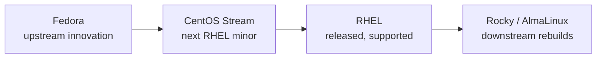
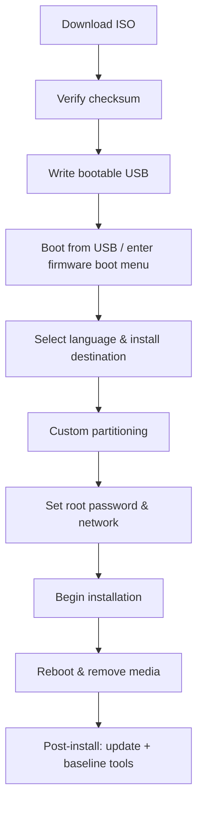

# CentOS Stream Installation

## Overview

**CentOS Stream** is a continuously-delivered Linux distribution that sits *upstream* of Red Hat Enterprise Linux (RHEL): it tracks the next minor release of RHEL rather than rebuilding a released version. This makes it a solid, freely-available platform for learning RHEL-family administration, testing packages against the coming RHEL release, and building lab servers that closely mirror production enterprise environments.

This note walks through a clean install of **CentOS Stream** — from verifying the ISO and writing bootable media, through partitioning and installation, to a first-boot package baseline. Commands assume you are working as `root` (or via `sudo`).

> [!NOTE]
> CentOS Stream is a *rolling* preview of RHEL, not a fixed point release. For workloads that need a stable, RHEL-compatible rebuild with a fixed lifecycle, evaluate **Rocky Linux** or **AlmaLinux** instead.

## Concepts

| Term | Meaning |
|---|---|
| CentOS Stream | Rolling distribution feeding the next RHEL minor release |
| RHEL | Red Hat Enterprise Linux — the commercial, subscription-based downstream product |
| EPEL | Extra Packages for Enterprise Linux — community add-on repository |
| `dnf` | Default RHEL-family package manager (successor to `yum`) |
| XFS | Default filesystem on RHEL/CentOS; high-performance, journaling |
| LVM | Logical Volume Manager — flexible, resizable volume abstraction |
| SELinux | Security-Enhanced Linux — mandatory access control, `enforcing` by default |

### Where CentOS Stream Sits in the RHEL Pipeline

Understanding the flow explains why Stream is ideal for *previewing* RHEL but less suited to fixed-lifecycle production than a downstream rebuild.



## Requirements

- **Minimum System Requirements**:

    - 2 GB RAM (4 GB recommended)

    - 20 GB+ Disk Space (40 GB+ recommended)

- **Tools Needed**:

    - Bootable USB (16+ GB or more)

    - ISO image from [centos.org/download](https://www.centos.org/download/)

    - Partitioning plan (see below)

## Installation Workflow



## Download CentOS ISO

1. Go to [https://www.centos.org/download/](https://www.centos.org/download/)

2. Choose **CentOS Stream 10 DVD ISO**

3. Save the `.iso` file to your computer

> You can download CentOS Stream ISO from:

```text
https://mirror.stream.centos.org/9-stream/BaseOS/x86_64/iso/
```

### Verify ISO Using md5sum

```bash
md5sum CentOS-Stream-9-latest-x86_64-dvd1.iso
```

```bash
sha256sum CentOS-Stream-9-latest-x86_64-dvd1.iso
```

> [!IMPORTANT]
> Always compare the computed hash against the value published on the official mirror. This confirms the ISO is not corrupted or tampered with before you trust it as a boot source.

## Create Bootable USB

- Use one of the following tools:

	- **Windows**: [Rufus](https://rufus.ie/)

	- **Windows**: [Win32 Disk Imager]

	- **Linux/macOS**: `dd` or [Etcher](https://etcher.io/)

### Example (Linux):

```bash
dd if=CentOS-Stream-9-*.iso of=/dev/sdX bs=4M status=progress && sync
```

> [!WARNING]
> Replace `/dev/sdX` with your actual USB device (not a partition such as `/dev/sdX1`). `dd` writes without confirmation — targeting the wrong disk will irrecoverably overwrite it. Confirm the device with `lsblk` first.

## Boot and Start Installation

1. Insert USB and reboot your system

2. Enter BIOS/UEFI Boot Menu (usually **F12**, **ESC**, **F2**)

3. Select the USB drive

4. Choose **Install CentOS Stream 9**

> [!NOTE]
> **📸 Screenshot**
> _Capture: CentOS Stream installer boot menu showing "Install CentOS Stream 9" highlighted_

## Select Installation Options

1. **Language**: Choose your preferred language

2. **Installation Destination**: Click and select your target disk

3. Choose **Custom Partitioning** and set up partitions

## Recommended Partition Layout

For a 40 GB+ disk, here is a typical partitioning scheme:

|Mount Point|Size|Filesystem|Type|Description|
|---|---|---|---|---|
|`/boot`|1 GB|xfs|Standard|Bootloader files|
|`swap`|2–4 GB|swap|Swap|Virtual memory (match RAM size)|
|`/`|Rest of disk|xfs|Root|System and application files|

> [!TIP]
> Use **LVM** for the root volume so you can grow, shrink, or add physical extents later without repartitioning. For hardening, consider separate mounts for `/home`, `/var`, and `/tmp` with `nodev,nosuid,noexec` options per CIS Benchmark guidance.

## Swap Space Guidelines

|RAM Size|Recommended Swap Space|
|---|---|
|< 2 GB|2 × RAM|
|2 – 4 GB|1 × RAM|
|> 8 GB|At least 4 GB|

### Check Swap Usage

```bash
free -h
```

## Configure Users and Network

- Set **root password**

- Optionally create an admin user

- Enable network connection

- Set hostname if needed

> [!TIP]
> Create a non-root administrative user and grant it `sudo` via the `wheel` group instead of relying on the root account for day-to-day work. This preserves an audit trail and limits blast radius.

## Begin Installation

- Click **Begin Installation**

- Wait for it to complete

- Remove USB when prompted and reboot

## Post-Installation Setup

- Log in and update system

```bash
dnf update -y
```

- Enable EPEL (Extra Packages for Enterprise Linux)

```bash
dnf install epel-release -y
```

- Install basic tools

```bash
dnf install -y wget curl vim git net-tools
```

## Commands Reference

| Task | Command |
|---|---|
| Verify ISO integrity | `sha256sum CentOS-Stream-9-latest-x86_64-dvd1.iso` |
| Identify USB device | `lsblk` |
| Write bootable media | `dd if=... of=/dev/sdX bs=4M status=progress && sync` |
| Patch the system | `dnf update -y` |
| Add community repo | `dnf install epel-release -y` |
| Inspect swap | `free -h` |

## Best Practices

- **Verify before you trust** — always checksum the ISO against the published hash.
- **Patch immediately** — run `dnf update -y` on first boot to close known vulnerabilities.
- **Least privilege** — administer through a `sudo`-enabled user, not root.
- **Partition for hardening** — isolate `/var`, `/tmp`, and `/home` where the workload allows.
- **Keep SELinux enforcing** — RHEL-family systems ship with SELinux; leave it in `enforcing` mode unless a documented reason requires otherwise.

## Security Considerations

> [!IMPORTANT]
> - **Media authenticity** — validate the ISO with `sha256sum` and, where available, verify the detached GPG signature against the CentOS signing key before booting untrusted media.
> - **SELinux stays on** — confirm `getenforce` returns `Enforcing` after install; disabling SELinux removes a core layer of mandatory access control.
> - **Mount hardening** — apply `nodev`, `nosuid`, and `noexec` to `/tmp`, `/var/tmp`, and removable media per CIS Benchmark recommendations.
> - **Firewall first boot** — RHEL-family hosts run `firewalld`; keep it active and expose only the services the host must serve.
> - **Remove install-time exposure** — set a strong root password, avoid enabling unused services during install, and patch before the host reaches the network.

## Troubleshooting

| Symptom | Likely Cause | Resolution |
|---|---|---|
| USB not listed in boot menu | Secure Boot or legacy/UEFI mismatch | Toggle Secure Boot / boot mode in firmware; re-write USB in matching mode |
| Checksum mismatch | Corrupt or partial download | Re-download the ISO from an official mirror |
| Installer cannot see the disk | Storage controller in RAID/Intel VMD mode | Switch controller to AHCI or load the correct driver |
| No network after install | Interface not enabled at install time | `nmcli device connect <iface>` or edit the connection with `nmtui` |
| `dnf update` fails on repos | EPEL/base mirror unreachable | Verify DNS and time sync (`chronyd`), then retry |

## References

- [CentOS Official Downloads](https://www.centos.org/download/)
- [CentOS Stream Documentation](https://docs.centos.org/)
- [Red Hat Enterprise Linux Documentation](https://access.redhat.com/documentation/en-us/red_hat_enterprise_linux/)
- [EPEL Project](https://docs.fedoraproject.org/en-US/epel/)

## Related
- [Linux Administration & Server Hardening](../Readme.md) — Linux administration & server hardening hub
- [Debian](Debian.md) — the Debian-family counterpart distribution
- [Linux-and-Unix](Linux-and-Unix.md) — Linux/Unix history and filesystem layout
- [Telnet-Server](../Telnet-and-Remote-Desktop-Server/Telnet-Server.md) — service setup on a CentOS server
- [Preboot-eXecution-Environment(PXE)-Boot-Server](../TFTP-and-PXE-Boot-Server/Preboot-eXecution-Environment(PXE)-Boot-Server.md) — network booting CentOS installs
