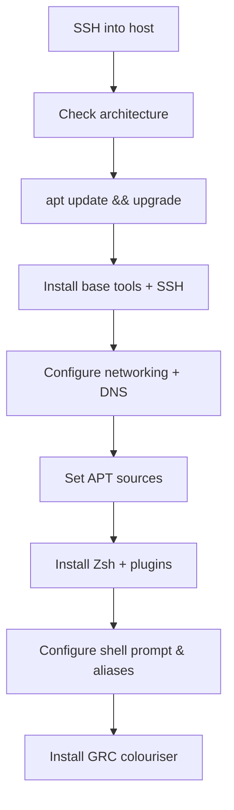

# Debian System Setup

## Overview

This guide covers the post-install baseline for a fresh **Debian** server: connecting over SSH, confirming architecture, patching, installing essential utilities, configuring static networking and DNS, wiring up APT sources, and building a productive shell environment with **Zsh** (autosuggestions + syntax highlighting) and **GRC** (Generic Colouriser).

The commands assume you are operating as `root` or an equivalent `sudo` user. IP addresses, interface names, and paths shown are lab examples — substitute the values for your own environment.

> [!NOTE]
> This note documents a lab workflow. On production hosts, disable direct root SSH login, use key-based authentication, and manage APT sources through configuration management rather than by hand.

## Setup Workflow



## SSH into the Debian System

```bash
ssh root@192.168.1.35
```

## Check System Architecture

```bash
dpkg --print-architecture
```

## Update and Upgrade the System

```bash
apt update
```

```bash
apt upgrade -y
```

> [!TIP]
> `apt update` refreshes the package index; `apt upgrade` installs available upgrades. Run both after every fresh install to close known vulnerabilities before exposing services.

## Install Basic Tools

```bash
apt install bash* vim net-tools -y
```

## Install SSH Server and Client

```bash
apt install openssh-server openssh-client ssh -y
```

### Edit SSH Configuration (Optional)

```bash
vim /etc/ssh/sshd_config
```

> Example:

```text
PermitRootLogin yes
```

> [!WARNING]
> `PermitRootLogin yes` is convenient in a lab but weakens a production host. Prefer `PermitRootLogin prohibit-password` (key-only) or `no`, and administer through a `sudo` user. See [Login-Methods-in-Linux](Login-Methods-in-Linux.md) for hardened authentication.

### Enable and Start SSH

```bash
systemctl enable ssh
```

```bash
systemctl start ssh
```

```bash
systemctl restart ssh
```

## Configure Network Interfaces

- Edit the interfaces file:

```bash
vim /etc/network/interfaces
```

> Example configuration:

```bash
# Loopback interface
auto lo
iface lo inet loopback

# Primary interface (enp0s3)
allow-hotplug enp0s3
iface enp0s3 inet static
    address 192.168.1.25
    netmask 255.255.255.0
    network 192.168.1.0
    broadcast 192.168.1.255
    gateway 192.168.1.1
    dns-nameservers 8.8.8.8

iface enp0s3 inet6 auto

# Secondary interface (enp0s8)
allow-hotplug enp0s8
iface enp0s8 inet static
    address 192.168.2.10
    netmask 255.255.255.0
    network 192.168.2.0
    broadcast 192.168.2.255
    dns-nameservers 8.8.8.8

iface enp0s8 inet6 auto
```

### Configure DNS Resolver

- Edit the resolver configuration:

```bash
vim /etc/resolv.conf
```

> Example:

```text
nameserver 8.8.8.8
```

### Restart Network Services

```bash
systemctl restart networking
```

```bash
ifdown enp0s3 && ifup enp0s3
```

```bash
ifdown enp0s8 && ifup enp0s8
```

- Reboot the System

```bash
reboot
```

## SSH from a Different User

```bash
ssh armour@192.168.1.21
```

## Switch to Root

```bash
su - root
```

## Configure APT Sources

- Edit the APT sources list:

```bash
vim /etc/apt/sources.list
```

The correct suite name depends on the Debian release. Pick the block matching your installed version:

| Release | Codename | Notes |
|---|---|---|
| Debian 11 | Bullseye | Older stable; `non-free-firmware` not yet split out |
| Debian 12 | Bookworm | Introduces the `non-free-firmware` component |
| Debian 13 | Trixie | Current stable (2025) |

### Debian 11 (Bullseye)

```bash
deb http://deb.debian.org/debian/ bullseye main
# deb-src http://deb.debian.org/debian/ bullseye-updates main
```

### Debian 12 (Bookworm)

```bash
deb https://deb.debian.org/debian/ bookworm main non-free-firmware
# deb-src http://deb.debian.org/debian/ bookworm main non-free-firmware
```

### Debian 13 (Trixie)

```bash
deb http://deb.debian.org/debian/ trixie main non-free-firmware
# deb-src http://deb.debian.org/debian/ trixie main non-free-firmware
```

## Install Useful Utilities

```bash
apt install vim fonts-lato fonts-open-sans fonts-roboto fonts-mononoki fonts-indic zsh net-tools curl wget unzip dnsutils -y
```

---

## Zsh Installation and Configuration

**Zsh** is an extended, highly-configurable shell. Paired with `zsh-autosuggestions` (history-based inline hints) and `zsh-syntax-highlighting` (live command validation), it substantially improves interactive administration.

- Check Current Shell

```bash
echo $SHELL
```

- View Available Shells

```bash
cat /etc/shells
```

- Install Zsh and Plugins

```bash
apt install zsh zsh-autosuggestions zsh-syntax-highlighting -y
```

- Verify Installation

```bash
zsh --version
```

```bash
which zsh
```

- Set Zsh as Default Shell, For the current user:

```bash
chsh -s $(which zsh)
```

> Verify:

```bash
grep zsh /etc/passwd
```

### Configure Zsh

- Edit the Zsh configuration:

```bash
nano ~/.zshrc
```

> Add your preferred aliases, themes, plugins, and prompt customizations.

```bash
# ~/.zshrc file for zsh interactive shells.
# see /usr/share/doc/zsh/examples/zshrc for examples

setopt autocd              # change directory just by typing its name
#setopt correct            # auto correct mistakes
setopt interactivecomments # allow comments in interactive mode
setopt magicequalsubst     # enable filename expansion for arguments of the form ‘anything=expression’
setopt nonomatch           # hide error message if there is no match for the pattern
setopt notify              # report the status of background jobs immediately
setopt numericglobsort     # sort filenames numerically when it makes sense
setopt promptsubst         # enable command substitution in prompt

WORDCHARS=${WORDCHARS//\/} # Don't consider certain characters part of the word

# hide EOL sign ('%')
PROMPT_EOL_MARK=""

# configure key keybindings
bindkey -e                                        # emacs key bindings
bindkey ' ' magic-space                           # do history expansion on space
bindkey '^U' backward-kill-line                   # ctrl + U
bindkey '^[[3;5~' kill-word                       # ctrl + Supr
bindkey '^[[3~' delete-char                       # delete
bindkey '^[[1;5C' forward-word                    # ctrl + ->
bindkey '^[[1;5D' backward-word                   # ctrl + <-
bindkey '^[[5~' beginning-of-buffer-or-history    # page up
bindkey '^[[6~' end-of-buffer-or-history          # page down
bindkey '^[[H' beginning-of-line                  # home
bindkey '^[[F' end-of-line                        # end
bindkey '^[[Z' undo                               # shift + tab undo last action

# enable completion features
autoload -Uz compinit
compinit -d ~/.cache/zcompdump
zstyle ':completion:*:*:*:*:*' menu select
zstyle ':completion:*' auto-description 'specify: %d'
zstyle ':completion:*' completer _expand _complete
zstyle ':completion:*' format 'Completing %d'
zstyle ':completion:*' group-name ''
zstyle ':completion:*' list-colors ''
zstyle ':completion:*' list-prompt %SAt %p: Hit TAB for more, or the character to insert%s
zstyle ':completion:*' matcher-list 'm:{a-zA-Z}={A-Za-z}'
zstyle ':completion:*' rehash true
zstyle ':completion:*' select-prompt %SScrolling active: current selection at %p%s
zstyle ':completion:*' use-compctl false
zstyle ':completion:*' verbose true
zstyle ':completion:*:kill:*' command 'ps -u $USER -o pid,%cpu,tty,cputime,cmd'

# History configurations
HISTFILE=~/.zsh_history
HISTSIZE=1000
SAVEHIST=2000
setopt hist_expire_dups_first # delete duplicates first when HISTFILE size exceeds HISTSIZE
setopt hist_ignore_dups       # ignore duplicated commands history list
setopt hist_ignore_space      # ignore commands that start with space
setopt hist_verify            # show command with history expansion to user before running it
#setopt share_history         # share command history data

# force zsh to show the complete history
alias history="history 0"

# configure `time` format
TIMEFMT=$'\nreal\t%E\nuser\t%U\nsys\t%S\ncpu\t%P'

# make less more friendly for non-text input files, see lesspipe(1)
#[ -x /usr/bin/lesspipe ] && eval "$(SHELL=/bin/sh lesspipe)"

# set variable identifying the chroot you work in (used in the prompt below)
if [ -z "${debian_chroot:-}" ] && [ -r /etc/debian_chroot ]; then
    debian_chroot=$(cat /etc/debian_chroot)
fi

# set a fancy prompt (non-color, unless we know we "want" color)
case "$TERM" in
    xterm-color|*-256color) color_prompt=yes;;
esac

# uncomment for a colored prompt, if the terminal has the capability; turned
# off by default to not distract the user: the focus in a terminal window
# should be on the output of commands, not on the prompt
force_color_prompt=yes

if [ -n "$force_color_prompt" ]; then
    if [ -x /usr/bin/tput ] && tput setaf 1 >&/dev/null; then
        # We have color support; assume it's compliant with Ecma-48
        # (ISO/IEC-6429). (Lack of such support is extremely rare, and such
        # a case would tend to support setf rather than setaf.)
        color_prompt=yes
    else
        color_prompt=
    fi
fi

configure_prompt() {
    prompt_symbol=㉿
    # Skull emoji for root terminal
    #[ "$EUID" -eq 0 ] && prompt_symbol=
    case "$PROMPT_ALTERNATIVE" in
        twoline)
            PROMPT=$'%F{%(#.blue.green)}┌──${debian_chroot:+($debian_chroot)─}${VIRTUAL_ENV:+($(basename $VIRTUAL_ENV))─}(%B%F{%(#.red.blue)}%n'$prompt_symbol$'%m%b%F{%(#.blue.green)})-[%B%F{reset}%(6~.%-1~/…/%4~.%5~)%b%F{%(#.blue.green)}]\n└─%B%(#.%F{red}#.%F{blue}$)%b%F{reset} '
            # Right-side prompt with exit codes and background processes
            #RPROMPT=$'%(?.. %? %F{red}%B⨯%b%F{reset})%(1j. %j %F{yellow}%B%b%F{reset}.)'
            ;;
        oneline)
            PROMPT=$'${debian_chroot:+($debian_chroot)}${VIRTUAL_ENV:+($(basename $VIRTUAL_ENV))}%B%F{%(#.red.blue)}%n@%m%b%F{reset}:%B%F{%(#.blue.green)}%~%b%F{reset}%(#.#.$) '
            RPROMPT=
            ;;
        backtrack)
            PROMPT=$'${debian_chroot:+($debian_chroot)}${VIRTUAL_ENV:+($(basename $VIRTUAL_ENV))}%B%F{red}%n@%m%b%F{reset}:%B%F{blue}%~%b%F{reset}%(#.#.$) '
            RPROMPT=
            ;;
    esac
    unset prompt_symbol
}

# The following block is surrounded by two delimiters.
# These delimiters must not be modified. Thanks.
# START KALI CONFIG VARIABLES
PROMPT_ALTERNATIVE=twoline
NEWLINE_BEFORE_PROMPT=yes
# STOP KALI CONFIG VARIABLES

if [ "$color_prompt" = yes ]; then
    # override default virtualenv indicator in prompt
    VIRTUAL_ENV_DISABLE_PROMPT=1

    configure_prompt

    # enable syntax-highlighting
    if [ -f /usr/share/zsh-syntax-highlighting/zsh-syntax-highlighting.zsh ]; then
        . /usr/share/zsh-syntax-highlighting/zsh-syntax-highlighting.zsh
        ZSH_HIGHLIGHT_HIGHLIGHTERS=(main brackets pattern)
        ZSH_HIGHLIGHT_STYLES[default]=none
        ZSH_HIGHLIGHT_STYLES[unknown-token]=underline
        ZSH_HIGHLIGHT_STYLES[reserved-word]=fg=cyan,bold
        ZSH_HIGHLIGHT_STYLES[suffix-alias]=fg=green,underline
        ZSH_HIGHLIGHT_STYLES[global-alias]=fg=green,bold
        ZSH_HIGHLIGHT_STYLES[precommand]=fg=green,underline
        ZSH_HIGHLIGHT_STYLES[commandseparator]=fg=blue,bold
        ZSH_HIGHLIGHT_STYLES[autodirectory]=fg=green,underline
        ZSH_HIGHLIGHT_STYLES[path]=bold
        ZSH_HIGHLIGHT_STYLES[path_pathseparator]=
        ZSH_HIGHLIGHT_STYLES[path_prefix_pathseparator]=
        ZSH_HIGHLIGHT_STYLES[globbing]=fg=blue,bold
        ZSH_HIGHLIGHT_STYLES[history-expansion]=fg=blue,bold
        ZSH_HIGHLIGHT_STYLES[command-substitution]=none
        ZSH_HIGHLIGHT_STYLES[command-substitution-delimiter]=fg=magenta,bold
        ZSH_HIGHLIGHT_STYLES[process-substitution]=none
        ZSH_HIGHLIGHT_STYLES[process-substitution-delimiter]=fg=magenta,bold
        ZSH_HIGHLIGHT_STYLES[single-hyphen-option]=fg=green
        ZSH_HIGHLIGHT_STYLES[double-hyphen-option]=fg=green
        ZSH_HIGHLIGHT_STYLES[back-quoted-argument]=none
        ZSH_HIGHLIGHT_STYLES[back-quoted-argument-delimiter]=fg=blue,bold
        ZSH_HIGHLIGHT_STYLES[single-quoted-argument]=fg=yellow
        ZSH_HIGHLIGHT_STYLES[double-quoted-argument]=fg=yellow
        ZSH_HIGHLIGHT_STYLES[dollar-quoted-argument]=fg=yellow
        ZSH_HIGHLIGHT_STYLES[rc-quote]=fg=magenta
        ZSH_HIGHLIGHT_STYLES[dollar-double-quoted-argument]=fg=magenta,bold
        ZSH_HIGHLIGHT_STYLES[back-double-quoted-argument]=fg=magenta,bold
        ZSH_HIGHLIGHT_STYLES[back-dollar-quoted-argument]=fg=magenta,bold
        ZSH_HIGHLIGHT_STYLES[assign]=none
        ZSH_HIGHLIGHT_STYLES[redirection]=fg=blue,bold
        ZSH_HIGHLIGHT_STYLES[comment]=fg=black,bold
        ZSH_HIGHLIGHT_STYLES[named-fd]=none
        ZSH_HIGHLIGHT_STYLES[numeric-fd]=none
        ZSH_HIGHLIGHT_STYLES[arg0]=fg=cyan
        ZSH_HIGHLIGHT_STYLES[bracket-error]=fg=red,bold
        ZSH_HIGHLIGHT_STYLES[bracket-level-1]=fg=blue,bold
        ZSH_HIGHLIGHT_STYLES[bracket-level-2]=fg=green,bold
        ZSH_HIGHLIGHT_STYLES[bracket-level-3]=fg=magenta,bold
        ZSH_HIGHLIGHT_STYLES[bracket-level-4]=fg=yellow,bold
        ZSH_HIGHLIGHT_STYLES[bracket-level-5]=fg=cyan,bold
        ZSH_HIGHLIGHT_STYLES[cursor-matchingbracket]=standout
    fi
else
    PROMPT='${debian_chroot:+($debian_chroot)}%n@%m:%~%(#.#.$) '
fi
unset color_prompt force_color_prompt

toggle_oneline_prompt(){
    if [ "$PROMPT_ALTERNATIVE" = oneline ]; then
        PROMPT_ALTERNATIVE=twoline
    else
        PROMPT_ALTERNATIVE=oneline
    fi
    configure_prompt
    zle reset-prompt
}
zle -N toggle_oneline_prompt
bindkey ^P toggle_oneline_prompt

# If this is an xterm set the title to user@host:dir
case "$TERM" in
xterm*|rxvt*|Eterm|aterm|kterm|gnome*|alacritty)
    TERM_TITLE=$'\e]0;${debian_chroot:+($debian_chroot)}${VIRTUAL_ENV:+($(basename $VIRTUAL_ENV))}%n@%m: %~\a'
    ;;
*)
    ;;
esac

precmd() {
    # Print the previously configured title
    print -Pnr -- "$TERM_TITLE"

    # Print a new line before the prompt, but only if it is not the first line
    if [ "$NEWLINE_BEFORE_PROMPT" = yes ]; then
        if [ -z "$_NEW_LINE_BEFORE_PROMPT" ]; then
            _NEW_LINE_BEFORE_PROMPT=1
        else
            print ""
        fi
    fi
}

# enable color support of ls, less and man, and also add handy aliases
if [ -x /usr/bin/dircolors ]; then
    test -r ~/.dircolors && eval "$(dircolors -b ~/.dircolors)" || eval "$(dircolors -b)"
    export LS_COLORS="$LS_COLORS:ow=30;44:" # fix ls color for folders with 777 permissions

    alias ls='ls --color=auto'
    #alias dir='dir --color=auto'
    #alias vdir='vdir --color=auto'

    alias grep='grep --color=auto'
    alias fgrep='fgrep --color=auto'
    alias egrep='egrep --color=auto'
    alias diff='diff --color=auto'
    alias ip='ip --color=auto'

    export LESS_TERMCAP_mb=$'\E[1;31m'     # begin blink
    export LESS_TERMCAP_md=$'\E[1;36m'     # begin bold
    export LESS_TERMCAP_me=$'\E[0m'        # reset bold/blink
    export LESS_TERMCAP_so=$'\E[01;33m'    # begin reverse video
    export LESS_TERMCAP_se=$'\E[0m'        # reset reverse video
    export LESS_TERMCAP_us=$'\E[1;32m'     # begin underline
    export LESS_TERMCAP_ue=$'\E[0m'        # reset underline

    # Take advantage of $LS_COLORS for completion as well
    zstyle ':completion:*' list-colors "${(s.:.)LS_COLORS}"
    zstyle ':completion:*:*:kill:*:processes' list-colors '=(#b) #([0-9]#)*=0=01;31'
fi

# some more ls aliases
alias ll='ls -l'
alias la='ls -A'
alias l='ls -CF'

# enable auto-suggestions based on the history
if [ -f /usr/share/zsh-autosuggestions/zsh-autosuggestions.zsh ]; then
    . /usr/share/zsh-autosuggestions/zsh-autosuggestions.zsh
    # change suggestion color
    ZSH_AUTOSUGGEST_HIGHLIGHT_STYLE='fg=#999'
fi

# enable command-not-found if installed
if [ -f /etc/zsh_command_not_found ]; then
    . /etc/zsh_command_not_found
fi

```

- Apply changes:

```bash
source ~/.zshrc
```

### Configure Zsh for Another User

- Switch user:

```bash
su - armour
```

- Set Zsh as the default shell:

```bash
chsh -s $(which zsh)
```

- Edit the user's configuration:

```bash
nano /home/armour/.zshrc
```


## GRC (Generic Colouriser)

GRC is a tool that colorizes command output and log files using regular expressions, making terminal output easier to read.

- Download GRC

```bash
wget https://github.com/garabik/grc/archive/refs/tags/v1.13.tar.gz
```

- Extract the Archive

```bash
tar -xvf v1.13.tar.gz
```

- Move to `/opt`

```bash
mv -v grc-1.13 /opt
```

- Enter the Directory

```bash
cd /opt/grc-1.13
```

- Install GRC

```bash
./install.sh
```

### Enable Automatic Aliases

- Edit:

```bash
vim /etc/default/grc
```

- Set:

```bash
GRC_ALIASES=true
```

- Or append directly:

```bash
echo "GRC_ALIASES=true" >> /etc/default/grc
```

### Install Initialization Script

- Copy the script:

```bash
cp -v /opt/grc-1.13/grc.sh /etc/grc.sh
```

- Verify:

```bash
ls -lh /etc/grc.sh
```

```bash
cat /etc/grc.sh
```

### Configure Bash

- Append the following lines:

```bash
echo "GRC_ALIASES=true" >> ~/.bashrc
echo '[[ -s "/etc/profile.d/grc.sh" ]] && source /etc/grc.sh' >> ~/.bashrc
```

- Reload Bash:

```bash
source ~/.bashrc
```

### Configure Zsh

- Append:

```bash
echo '[[ -s "/etc/grc.zsh" ]] && source /etc/grc.zsh' >> ~/.zshrc
```

- Reload Zsh:

```bash
source ~/.zshrc
```

### Test GRC

- Run:

```bash
grc ping google.com
```

- Or use commands such as:

```bash
ls
```

```bash
netstat -tulpn
```

```bash
ping google.com
```

> If aliases are enabled, GRC will automatically colorize supported command output.

## Best Practices

- **Patch first, expose later** — complete `apt update && apt upgrade` before enabling network services.
- **Harden SSH** — move from password + root login to key-only authentication and a non-root admin user before the host leaves the lab.
- **Match APT suites to the release** — using the wrong codename in `sources.list` can pull incompatible packages or break upgrades.
- **Set a resilient resolver** — `/etc/resolv.conf` is often managed by `resolvconf`/`systemd-resolved`; on such systems edit the managing tool's config so changes persist across reboots.
- **Version-pin third-party tools** — GRC is fetched from a tagged release (`v1.13`) rather than `master`, keeping the install reproducible.

## Security Considerations

> [!IMPORTANT]
> - **Disable root SSH on production** — replace `PermitRootLogin yes` with `prohibit-password` or `no`, and administer through a `sudo` user (per CIS Debian Benchmark).
> - **Prefer key-based authentication** — set `PasswordAuthentication no` once keys are deployed to eliminate brute-force and credential-stuffing exposure.
> - **Trust your APT sources** — use HTTPS mirrors and let APT verify the release signing keys; a tampered `sources.list` mirror can inject malicious packages.
> - **Validate downloaded tooling** — GRC is fetched over HTTPS from a tagged release; verify checksums/signatures for any tool pulled outside the distro repositories before running its installer as root.
> - **Least privilege for shells** — configuring Zsh per user (`/home/armour/.zshrc`) keeps root's environment minimal and avoids sourcing user-writable files as root.

## Troubleshooting

| Symptom | Likely Cause | Resolution |
|---|---|---|
| `apt update` fails with 404s | Wrong codename in `sources.list` | Match the suite (bullseye/bookworm/trixie) to your release |
| Static IP not applied | `NetworkManager` or `systemd-networkd` managing the interface | Use the active network stack, or bring the interface down/up with `ifdown`/`ifup` |
| DNS reverts after reboot | `resolv.conf` regenerated by a resolver manager | Configure the manager instead of editing `/etc/resolv.conf` directly |
| `chsh` change not active | Shell only applies on new login session | Log out and back in, or start `zsh` manually |
| GRC colours not showing | `GRC_ALIASES` unset or init script not sourced | Confirm `/etc/default/grc` and the sourcing line in `~/.bashrc`/`~/.zshrc` |

## References

- [Debian Project](https://www.debian.org/)
- [OpenSSH Documentation](https://www.openssh.com/manual.html)
- [GRC GitHub Repository](https://github.com/garabik/grc)
- [Zsh Documentation](https://zsh.sourceforge.io/Doc/)

## Related
- [Linux Administration & Server Hardening](../Readme.md) — Linux administration & server hardening hub
- [Debian](Debian.md) — installing the Debian base system
- [Login-Methods-in-Linux](Login-Methods-in-Linux.md) — hardened SSH and authentication
- [Advanced-Package-Tool(APT)](../Package-Management/Advanced-Package-Tool(APT).md) — APT package management on Debian
- [Debian-Package-Manager(dpkg)](../Package-Management/Debian-Package-Manager(dpkg).md) — low-level .deb package handling
- [Package-Manager-in-Linux](../Package-Management/Package-Manager-in-Linux.md) — package manager overview
