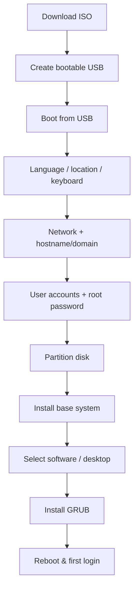

# Debian

## Overview

**Debian** is a free and open-source Linux distribution developed by the **Debian Project**, founded by **Ian Murdock** in 1993. It is one of the oldest and most influential Linux distributions, serving as the foundation for many others, including Ubuntu, Kali Linux, and Raspbian.

Debian is widely recognized for its **commitment to free software principles**, its **extensive software repositories** (with over 51,000 packages), and its **stability and security**, making it suitable for a broad range of environments — from personal desktops to enterprise servers and cloud platforms.

The **latest stable release**, **Debian 13 "Trixie"**, was released in **August 2025**. Debian's **community-driven development model** ensures long-term support, reliability, and a consistent focus on free and open-source software.

Thanks to its flexibility and robustness, Debian is also a popular choice as a **base image for Docker containers**, a host OS in virtualization, and a trusted platform for cloud infrastructure.

## Concepts

| Aspect | Detail |
|---|---|
| First release | 1993 (Ian Murdock) |
| Package format | `.deb` |
| Package tools | `apt` (high-level), `dpkg` (low-level) |
| Release channels | `stable`, `testing`, `unstable` (sid) |
| Current stable | Debian 13 "Trixie" (2025) |
| Init system | systemd |
| Governance | Community-driven, Social Contract + DFSG |
| Notable derivatives | Ubuntu, Kali Linux, Raspberry Pi OS, Linux Mint (LMDE) |

> [!NOTE]
> Debian release codenames come from *Toy Story* characters. "Trixie", "Bookworm", and "Bullseye" are consecutive stable releases; knowing the codename matters when configuring APT sources.

## Debian 13 "Trixie" Installation

Debian is a stable, secure, and versatile Linux distribution. This guide covers a clean installation of **Debian 13 "Trixie"** for desktops or servers.

### Installation Flow



### Prerequisites

- **USB drive**: Minimum 8 GB

- **Disk space**: Minimum 25 GB for the system

- **Internet connection**: Recommended for netinst ISO

- **ISO image**: Download from [Debian Official Downloads](https://www.debian.org/distrib/netinst)

### Step 1: Download the Debian ISO

- **Netinst ISO**: Small, downloads packages during installation.

- **Full DVD ISO**: Includes all packages for offline install.

> Official release notes: [Debian 13 Release Notes](https://www.debian.org/releases/trixie/)

### Step 2: Create Bootable USB

- **Windows**: Use [Rufus](https://rufus.ie/)

- **Linux/macOS/Windows**: Use [Etcher](https://www.balena.io/etcher/)

- **Linux (CLI)**: `dd if=debian-13.iso of=/dev/sdX bs=4M status=progress`

> [!WARNING]
> Replace `/dev/sdX` with your USB device identifier — and confirm it with `lsblk` first. `dd` overwrites the target device without prompting.

### Step 3: Boot from USB

1. Insert USB drive.

2. Enter BIOS/UEFI boot menu (usually F12, F2, DEL).

3. Select USB as the boot device.

4. Choose **Graphical Install** (recommended) or **Install**.

> [!NOTE]
> **📸 Screenshot**
> _Capture: Debian installer main menu with "Graphical Install" highlighted_

### Step 4: Select Language, Location, and Keyboard

- Choose your preferred **language**.

- Select your **country** or **region**.

- Choose the correct **keyboard layout**.

### Step 5: Configure Network

- **DHCP**: Automatic IP assignment (default).
- **Manual**: Set static IP, gateway, and DNS if needed.

### Step 6: Set Hostname and Domain

- **Hostname**: Name your machine (e.g., `debian-pc`).
- **Domain**: Optional for home setups; required for servers in networks.

### Step 7: Create User Accounts

- **Root password**: Set a root password or leave blank to use sudo.
- **Regular user**: Create a personal account for daily use.

> [!TIP]
> Leaving the root password blank makes the installer add your first user to `sudo` automatically — the recommended, auditable model for servers. Use a strong, unique password for every account.

### Step 8: Partition the Disk

- **Guided partitioning**: Uses entire disk, recommended for beginners.
- **Manual partitioning**: For advanced setups: LVM, encryption, RAID.
- **Suggested layout**:
    - `/` root: 20–25 GB

    - `swap`: Equal to RAM (optional with modern systems)

    - `/home`: Remaining space

> [!WARNING]
> Disk partitioning is destructive. Double-check the target disk and layout before you confirm — the installer will format the selected partitions.

### Step 9: Install Base System

- Installs Linux kernel, core utilities, and essential packages.
- Automatic network download of missing packages if using netinst ISO.

### Step 10: Select Software

- **Desktop Environment**: GNOME (default), KDE, XFCE, LXQt, Cinnamon, MATE.

- Optional packages:

    - SSH server

    - Print server

    - Standard system utilities

> You can install additional software later using `apt`.

### Step 11: Install GRUB Bootloader

- Install GRUB on the primary disk (usually `/dev/sda`).
- Required for system boot.

> [!IMPORTANT]
> If using UEFI, ensure an EFI System Partition exists or is auto-created; otherwise GRUB cannot install and the system will not boot.

### Step 12: Finish Installation & Reboot

1. Remove USB installation media.
2. Reboot the system.
3. Log in with the user account you created.

### Tips & Notes

- **Netinst vs DVD ISO**: Netinst requires internet but is smaller; DVD is full offline installation.
- **Advanced setups**: Consider full disk encryption, LVM, or custom partitions.
- **Docker & virtualization**: Debian is a solid base for containers and cloud VMs.
- **Software updates**: Run after install:

```bash
apt update && apt upgrade -y
```

## Best Practices

- **Patch on first boot** — run `apt update && apt upgrade -y` before exposing the host.
- **Prefer sudo over root** — leave the root password blank at install to get an auditable `sudo` user.
- **Encrypt where it matters** — enable LUKS full-disk encryption on laptops and any host holding sensitive data.
- **Separate `/home`** — a dedicated `/home` partition simplifies reinstalls and lets you apply distinct mount hardening.
- **Track the stable channel** — for servers, stay on `stable` and apply security updates rather than chasing `testing`/`unstable`.

## Security Considerations

> [!IMPORTANT]
> - **Verify installer media** — check the ISO against the published SHA-256 sum and, ideally, its detached GPG signature before writing bootable media.
> - **Full-disk encryption** — enable LUKS during install on laptops and any host holding sensitive data so an offline attacker cannot read the disk.
> - **No root password → sudo model** — leaving the root password blank yields an auditable `sudo`-only administration path, reducing shared-credential risk.
> - **Enable unattended security updates** — install `unattended-upgrades` so security patches apply automatically on unmanaged servers.
> - **Minimal software footprint** — deselect desktop tasks on servers; every installed package widens the attack surface and patch burden.

## Troubleshooting

| Symptom | Likely Cause | Resolution |
|---|---|---|
| Installer cannot reach mirrors | No DHCP / wrong proxy | Configure network manually; verify gateway and DNS |
| Missing Wi-Fi firmware prompt | Non-free firmware not on media | Use the official installer image that bundles `non-free-firmware` |
| System boots to grub rescue | GRUB installed to wrong disk / missing EFI partition | Reinstall GRUB targeting the correct disk / create the ESP |
| No desktop after install | No desktop task selected in tasksel | `apt install <desktop-environment>` post-install |

## References

- [Debian Official Downloads](https://www.debian.org/distrib/netinst)
- [Debian 13 "Trixie" Release Notes](https://www.debian.org/releases/trixie/)
- [Debian Administrator's Handbook](https://www.debian.org/doc/manuals/debian-handbook/)
- [Debian Wiki](https://wiki.debian.org/)

## Related
- [Linux Administration & Server Hardening](../Readme.md) — Linux administration & server hardening hub
- [Debian-System-Setup](Debian-System-Setup.md) — post-install Debian configuration
- [CentOS-Stream-Installation](CentOS-Stream-Installation.md) — the RHEL-family counterpart distribution
- [Linux-and-Unix](Linux-and-Unix.md) — Linux/Unix history and filesystem layout
