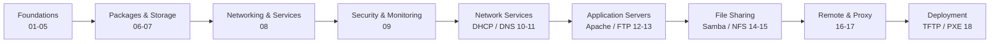

# Linux Administration Server Hardening

## Overview

Master Linux server administration, enterprise networking, Apache web hosting, DNS, DHCP, Samba, NFS, VPN, proxy servers, security hardening, monitoring, and infrastructure management with hands-on practical labs.

This note is the **curriculum map** for the Enterprise Linux Server Administration and Networking program — an 18-module, hands-on path from Linux fundamentals to production-grade service deployment and hardening. Use it as the table of contents for the module notes in this vault; each module below corresponds to a folder or set of notes you can drill into.

---

## Course Information

| Detail | Value |
|---|---|
| Duration | 4 Months / 16 Weeks / 120 Hours |
| Level | Beginner to Advanced |
| Modules | 18 |
| Format | Hands-on Labs |

---

## Course Description

The Enterprise Linux Server Administration and Networking program is designed to provide practical and industry-ready skills in Linux system administration and enterprise infrastructure management. This course covers Linux fundamentals and command-line administration, user and permission management, package and repository management, file system and storage administration, network configuration and troubleshooting, process management and system monitoring, enterprise security and firewall management, DNS and DHCP server configuration, Apache web server administration, FTP, Samba, NFS, and proxy server configuration, and PXE/TFTP deployment infrastructure.

---

## Prerequisites

- Basic computer knowledge
- Familiarity with operating systems
- Basic networking knowledge (recommended)
- No prior Linux experience required

---

## Learning Path

---

## Course Modules

### 01. Introduction to Linux

- UNIX, Linux, and Open Source
- What is Linux?
- History and Evolution of Linux
- Linux Kernel
- Features of Linux
- Linux Distributions
- Linux Directory Structure
- Linux Installation
- Login Methods
- Run Levels in Linux

### 02. Linux Basic Commands

- File Navigation
- File and Directory Management
- Copying and Moving Files
- Cat Command
- Less and More Commands
- Pipes and Redirects
- Compression and Archiving
- Symbolic Links
- Linux Shortcuts

### 03. Text Editors

- Cat editor usage
- Nano editor
- Vi/Vim editor mastery
- Editor modes and navigation
- Search and replace operations
- Configuration file editing

### 04. String Processing & Finding Files

- head and tail commands
- wc (word count)
- sort command
- cut command
- paste command
- grep pattern matching
- awk text processing
- sed stream editor
- tree command
- find command
- which and whereis commands

### 05. Users, Groups & Permissions

- Types of Shells
- Users and Groups
- /etc/passwd file
- /etc/shadow file
- /etc/group file
- /etc/gshadow file
- User Management commands
- Group Management commands
- Root Access
- su and sudo
- File Permissions (rwx)
- SUID, SGID, Sticky Bit
- ACL Permissions

### 06. Package Management

- RPM and SRPM Packages
- Linux Architectures
- RPM Package Installation and Management
- Repositories and repo configuration
- Yum Package Manager

### 07. File System & Disk Management

- Types of Disks
- Parted Utility
- Fdisk Utility
- Mounting File Systems
- /etc/fstab configuration
- Quota Management
- SWAP configuration
- RAID concepts
- RAID Levels (0, 1, 5, 10)
- Logical Volume Manager (LVM)

### 08. Network Configuration & Controlling Services

- Network Configuration files
- Network Tools (ifconfig, ip)
- traceroute and tracepath
- netstat and ss commands
- SSH remote access
- SCP secure file copy
- FTP client usage
- Wget downloads
- Rsync synchronization
- Managing Services with systemd

### 09. Security, Process Management & Monitoring

- Securing SSH server
- Changing Default SSH Port
- Disabling Root Login via SSH
- Public/Private Key Authentication
- IP Allow and Deny (hosts.allow/deny)
- Job Management (cron, at)
- Process Management (ps, top, kill, nice)
- Monitoring Tools (htop, iotop, vmstat)
- Antivirus Software (ClamAV)
- Linux Malware Detect (LMD)
- IPTables firewall rules
- UFW (Uncomplicated Firewall)
- TCPdump packet capture

### 10. Dynamic Host Configuration Protocol (DHCP)

- DHCP Overview and concepts
- Installing DHCP Server
- Configuring DHCP Scopes
- Address Pools configuration
- DHCP Reservations
- MAC-Based Reservations
- IP Exclusions

### 11. Domain Name System (DNS)

- DNS Overview and architecture
- Installing DNS Server (BIND)
- Forward Lookup Zones
- Reverse Lookup Zones
- DNS Zone Transfers
- DNS Client Tools (dig, nslookup)
- Dynamic DNS configuration

### 12. Apache Web Server

- Apache Web Server Overview
- Apache Installation and startup
- Apache Configuration Files (httpd.conf)
- Virtual Hosts (Name and IP-based)
- Website Binding
- SSL Certificate Configuration
- Authentication (Basic and Digest)
- Apache Logging and Log Analysis
- User Directories (public_html)
- WebDAV configuration
- CGI Scripts

### 13. FTP Server (VSFTPD)

- FTP Protocol Overview
- VSFTPD Installation
- User and Group Management for FTP
- FTP Client Configuration
- Uploading and Downloading Files
- File Operations and permissions
- Anonymous FTP configuration
- FTP security hardening

### 14. Samba/SMB/CIFS Server

- SMB Protocol Overview
- SMB Protocol Versions (v1, v2, v3)
- Samba Installation and configuration
- Shared Folder Configuration
- User Access Permissions
- SMB Authentication
- SMB Client Utilities (smbclient, mount.cifs)

### 15. NFS Server

- NFS Protocol Overview
- Installing NFS Server
- Configuring NFS Exports (/etc/exports)
- Mounting NFS Shares on clients
- NFS permissions and security

### 16. Telnet & Remote Desktop Server

- Telnet Overview and risks
- Telnet Server Configuration
- Remote Desktop Protocol (RDP) concepts
- Remote Desktop Installation (XRDP)
- Remote Desktop Client Configuration
- Secure alternatives (SSH, VNC)

### 17. Proxy Server

- Proxy Server Overview and concepts
- Installing Squid Proxy
- Forward Proxy Configuration
- Transparent Proxy setup
- Content Filtering rules
- Access Control Lists (ACLs)

### 18. TFTP & PXE Boot Server

- TFTP Protocol Overview
- PXE Boot Overview
- Installing TFTP Server
- PXE Boot Configuration
- DHCP and TFTP Integration
- Network OS deployment

---

## Learning Outcomes

- Install and manage Linux servers in production environments
- Configure enterprise network services (DNS, DHCP, Web, FTP)
- Implement proper user, group, and permission management
- Manage disk storage with LVM, RAID, and quotas
- Configure and harden Linux firewalls (IPTables, UFW)
- Deploy Apache web servers with SSL and virtual hosts
- Set up enterprise file sharing (Samba, NFS)
- Configure proxy servers for content filtering and caching
- Automate server deployment with PXE/TFTP boot
- Monitor system performance and manage processes
- Secure SSH and implement key-based authentication
- Troubleshoot Linux server and network issues

---

## Hands-On Labs

- Enterprise virtual lab environment
- Multiple Linux distributions (CentOS/RHEL, Ubuntu)
- Server farm with interconnected services
- DNS and DHCP server deployment labs
- Apache web hosting with SSL certificates
- Samba and NFS file sharing scenarios
- Squid proxy server configuration
- PXE network boot environment
- Firewall and security hardening exercises
- Performance monitoring and troubleshooting labs
- SSH hardening and key management practice
- Real-world enterprise infrastructure scenarios

---

## Security Considerations

Every module in this program carries a hardening dimension. Keep these principles in view throughout:

> [!IMPORTANT]
> - **Least privilege** — administer through `sudo`, keep SELinux/AppArmor enforcing, and grant the minimum permissions a service needs.
> - **Reduce attack surface** — disable unused services (Telnet, anonymous FTP), close unneeded ports, and remove default sample content.
> - **Encrypt in transit** — prefer SSH/SCP/SFTP and TLS over cleartext protocols; TLS-terminate Apache and reject weak ciphers.
> - **Patch and monitor** — apply updates promptly, log centrally, and run malware detection (ClamAV, LMD) on exposed hosts.
> - **Benchmark against a standard** — align configurations with the CIS Benchmarks and relevant NIST guidance for the distribution in use.

---

## Certification Preparation

- RHCSA (Red Hat Certified System Administrator)
- RHCE (Red Hat Certified Engineer)
- CompTIA Linux+
- LPIC-1 and LPIC-2
- Foundation for Linux privilege escalation courses

---

## Meet Your Instructor

**Armour Infosec Security Team** — *Linux Systems & Infrastructure Specialist*

Our Linux instructors have managed enterprise Linux infrastructure at scale across data centers and cloud environments. They combine deep system administration expertise with security hardening knowledge to teach production-ready deployments used in real enterprise environments.

**Certifications:** OSCP+, CEH, RHCE, LPIC-2, CompTIA Linux+

---

## What Students Say

> "From Linux beginner to managing multiple servers with 18 different services. The Apache and Samba labs are incredibly practical."
>
> — **Rohit M.**, Junior Admin

> "Solid enterprise foundation course. The security modules (IPTables, SSH hardening) make this stand out from generic Linux training."
>
> — **Anjali S.**, DevOps Engineer

> "Understanding Linux administration is crucial for pentesting. The 18 detailed modules gave me comprehensive server knowledge."
>
> — **Pranav K.**, Security Student

---

## Frequently Asked Questions

**Q. Do I need prior Linux experience?**

No. We start from the very basics including Linux history, installation, and basic commands. By the end, you will be deploying and managing 10+ enterprise services.

**Q. Which distributions are covered?**

We primarily use CentOS/RHEL for server administration. Concepts are transferable across all major Linux distributions including Ubuntu and Debian.

**Q. Is this relevant for security professionals?**

Essential. Most servers run Linux, and understanding the OS is critical for penetration testing, forensics, privilege escalation, and security hardening.

**Q. What practical labs are included?**

Extensive labs including server installation, user management, SSH hardening, firewall configuration, DNS/DHCP deployment, Apache hosting, Samba/NFS file sharing, proxy setup, and PXE boot configuration.

**Q. Who should take this course?**

Linux Administrators, System Administrators, Network Engineers, DevOps Engineers, SOC Analysts, Cybersecurity Professionals, IT Support Engineers, and students beginning their Linux career.

**Q. Does this cover container technologies?**

We focus on traditional Linux server administration and services. Docker and Kubernetes are covered in advanced DevOps courses.

---

_Source: <https://www.armourinfosec.com/training/linux-administration/>_

## Related
- [Linux Administration & Server Hardening](../Readme.md) — Linux administration & server hardening hub
- [Linux-and-Unix](Linux-and-Unix.md) — Module 01 foundations: Unix/Linux history and filesystem layout
- [Debian](Debian.md) — installing a Debian-family server (Module 01)
- [CentOS-Stream-Installation](CentOS-Stream-Installation.md) — installing a RHEL-family server (Module 01)
- [Login-Methods-in-Linux](Login-Methods-in-Linux.md) — securing authentication and access
- [Reset-Root-Password-and-Protect-GRUB-Boot-Loader](../Security-Firewall-and-Monitoring/Reset-Root-Password-and-Protect-GRUB-Boot-Loader.md) — bootloader and root hardening
- [Service-Management-in-Linux](../Process-Service-and-Job-Management/Service-Management-in-Linux.md) — disabling unneeded services
- [ClamAV-Antivirus](../Security-Firewall-and-Monitoring/ClamAV-Antivirus.md) — malware scanning on Linux servers
