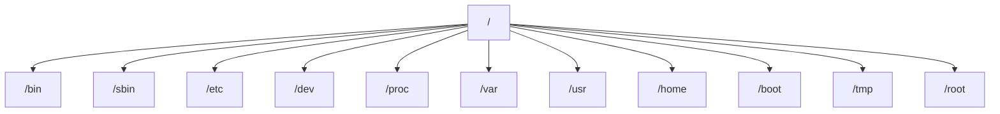

# Linux and Unix

## Overview

**Unix** and **Linux** are the two pillars of modern server and infrastructure computing. Unix, born at AT&T Bell Labs in the late 1960s, established the design philosophy — small composable tools, a hierarchical filesystem, everything-is-a-file, multi-user and multi-tasking by default. **Linux**, created by Linus Torvalds in 1991, re-implemented those principles from scratch under a free-software licence and, combined with GNU userland tools, became the dominant Unix-like platform on servers, cloud, mobile, and embedded systems.

This note traces that lineage, contrasts the major distribution families and their package managers, and lays out both the Linux and Windows directory structures for reference.

## History

### Unix

- Developed in the 1960s and 1970s at AT&T Bell Labs by Ken Thompson, Dennis Ritchie, and others.

- Designed as a portable, multi-tasking, and multi-user system.

- Originally proprietary but led to many influential variants:

    - BSD (Berkeley Software Distribution)

    - AIX (IBM)

    - HP-UX (Hewlett-Packard)

    - Solaris (Sun Microsystems)

- Historically dominant in academia, enterprise servers, and research systems.

### Linux

- Created by Linus Torvalds in 1991.

- Inspired by Unix principles but built from scratch.

- Uses the GNU General Public License (GPL).

- Often combined with GNU utilities to form GNU/Linux.

- Widely used in servers, desktops, IoT, and supercomputers.

### Popular Distributions

- Ubuntu

- Debian

- Fedora

- Red Hat Enterprise Linux (RHEL)

- CentOS

- Arch Linux

- Kali Linux

- SUSE Linux

## What is An Operating System?

- An operating system (OS) is a system software that manages hardware, software resources, and provides services for computer programs.

### Basic Flow Of Operation

```text
User → Application → OS → Hardware
```

### With Shell And Kernel

```text
User → Shell → Kernel → Hardware
```

The **shell** is the interface a user (or script) types into; the **kernel** is the privileged core that actually drives the hardware. This layered mediation is why an unprivileged command cannot touch hardware directly:


## Functions of an Operating System

1. Process Management

2. Memory Management

3. File System Management

4. Device Management

5. Security and Protection

6. User Interface

7. Network Management

8. System Performance Monitoring

9. Utility and Support Services

## Features Of Linux

1. **Open Source (GPL License)**  :   Linux is distributed under the GNU General Public License (GPL), which allows anyone to view, modify, and distribute the source code. This encourages transparency, community development, and innovation.

2. **Multitasking**  :   Linux can handle multiple tasks simultaneously without slowing down the system. Each task is treated as a separate process, managed by the kernel using scheduling algorithms.

3. **Multiuser Capability**  :   Multiple users can access the system at the same time without interfering with each other’s processes or files. This is essential for server and enterprise environments.

4. **Portability**  :  Linux can run on a wide range of hardware platforms, from smartphones and tablets to mainframes and supercomputers. This is possible because the kernel is written in portable C and assembly.

5. **Security**  :  Linux offers robust security features including file permissions, user roles, firewall tools (like `iptables` and `firewalld`), and SELinux (Security-Enhanced Linux). The open-source nature also allows vulnerabilities to be identified and patched quickly.

6. **Stability and Reliability**  :  Linux systems are known for running for years without crashes or reboots. This stability makes it a preferred choice for servers and mission-critical systems.

7. **Customizability**  :  Everything in Linux can be customized — from the kernel to the desktop environment. Users can build their own distributions or modify existing ones to suit specific needs.

8. **Community Support** :   A vast global community provides continuous updates, documentation, forums, tutorials, and help. Platforms like Stack Overflow, Reddit, and LinuxQuestions.org are active with expert discussions.

9. **Performance**  :  Linux is lightweight and optimized for performance. It efficiently manages system resources, making it ideal for high-performance computing, servers, and embedded systems.

10. **Unix Compatibility** :  Linux is designed to be compatible with traditional Unix commands and behavior, making it easier for users transitioning from Unix systems and enabling the reuse of Unix knowledge and tools.

11. **Scalability**  :  Linux can scale from a small embedded system to large-scale enterprise and cloud infrastructure. It supports clusters, containers, virtualization, and distributed computing environments.

## Linux Distributions and Package Managers

|Distribution Type|Package Format|Installer|Package Tool|Examples|
|---|---|---|---|---|
|Debian-Based|`.deb`|dpkg|apt|Ubuntu, Kali Linux|
|Red Hat-Based|`.rpm`|rpm|yum / dnf|Fedora, CentOS, RHEL|
|Arch-Based|N/A|pacman|pacman|Arch Linux, Manjaro|
|Unix-Like (BSD Family)|Varies|ports/pkg|pkg_add/pkg|FreeBSD, OpenBSD|

### Debian-Based (e.g., Debian, Ubuntu, Linux Mint)

**Pros:**

- **User-friendly**: Especially Ubuntu and its derivatives.
- **APT Package Manager**: Simple package management with `apt` and `dpkg`.
- **Vast Repositories**: Huge number of precompiled packages.
- **Strong Community Support**: Tons of tutorials, forums, and guides.

**Cons:**

- **Slow to adopt bleeding-edge software** (Debian Stable).
- May carry **extra layers of abstraction** (e.g., in Ubuntu) that are unnecessary for advanced users.

**Use Cases:**

- General-purpose desktops (Ubuntu, Mint)
- Servers (Debian, Ubuntu Server)
- Beginners and enterprise environments

### Red Hat-Based (e.g., RHEL, CentOS, Fedora, Rocky, AlmaLinux)

**Pros:**

- **RPM Package Manager**: Uses `yum` or `dnf` (Fedora, newer RHEL).
- **SELinux support**: Enhanced security.
- **Enterprise-grade**: Stable, long-term support (RHEL, Rocky, Alma).
- **Fedora** is cutting-edge and upstream for RHEL.

**Cons:**

- **Proprietary features** (RHEL is paid with subscription model).
- **Software availability** is more limited compared to Debian repos (especially older RHEL versions).
- Configuration often more **complex** than Debian.

**Use Cases:**

- Enterprise environments
- Commercial web hosting
- Security-conscious systems

### Arch-Based (e.g., Arch Linux, Manjaro, EndeavourOS)

**Pros:**

- **Rolling release**: Always up to date.
- **Pacman & AUR**: Powerful package manager and massive user repository.
- **Minimalist by design**: Build exactly what you need.
- **Excellent documentation**: The Arch Wiki is best-in-class.

**Cons:**

- **Not beginner-friendly** (especially vanilla Arch).
- Rolling release may **introduce breaking changes**.
- Requires **manual configuration and maintenance**.

**Use Cases:**

- Advanced users
- Developers who want full control
- Enthusiasts who value customization

### Unix-Like (BSD Family: FreeBSD, OpenBSD, NetBSD, etc.)

**Pros:**

- **True Unix heritage**: Clean and consistent system design.
- **Security-focused**: OpenBSD is renowned for security.
- **ZFS support** (especially in FreeBSD).
- **Ports system**: Source-based package installation with great flexibility.

**Cons:**

- **Smaller ecosystem**: Fewer precompiled packages.
- **Hardware support** not as broad as Linux.
- Less community support compared to mainstream Linux.

**Use Cases:**

- Firewalls and routers (OpenBSD, pfSense)
- High-performance servers (FreeBSD)
- Academic and research settings

### Summary Table

| Feature               | Debian-Based             | Red Hat-Based                        | Arch-Based                      | BSD Family             |
|----------------------|--------------------------|--------------------------------------|----------------------------------|------------------------|
| **Ease of Use**       | High                     | Medium                               | Low (Arch), Medium (Manjaro)    | Low to Medium          |
| **Package Manager**   | APT                      | YUM / DNF                            | Pacman / AUR                    | pkg / Ports            |
| **Release Model**     | Stable / LTS             | Stable (RHEL), Rolling (Fedora)      | Rolling                         | Mostly stable          |
| **Community Support** | Huge                     | Large                                | Growing                         | Niche                  |
| **Security Focus**    | Moderate                 | High (SELinux)                       | User-dependent                  | Very High (OpenBSD)    |
| **Customization**     | Moderate                 | Moderate                             | Very High                       | High (via ports)       |
| **Market Share**      | ~50% (esp. Ubuntu)       | ~25% (mainly servers)                | ~5% (enthusiast desktop users)  | <1% (mostly servers)   |

## Windows Directory Structure (C:)

For cross-platform reference, here is how the Windows system drive is laid out.

### C:\

The root of the system drive. Contains system-critical folders and files.

### Windows

- The **main operating system** directory.

- Contains OS components like:

    - `System32` – Core Windows system files (DLLs, EXEs, drivers).

    - `WinSxS` – Side-by-side assemblies (Windows component store).

    - `Temp` – Temporary files.

    - `Logs` – System and installation logs.

### Program Files

- Default folder for **64-bit applications** on 64-bit Windows.

### Program Files (x86)

- Default folder for **32-bit applications** on 64-bit Windows.

### Users

- Contains **user profiles**, each as a subfolder:

    - `Default` – Template for new user profiles.

    - `Public` – Shared user space.

    - `YourUsername` – Personal files like:

        - `Desktop`

        - `Documents`

        - `Downloads`

        - `AppData` (Hidden, for app data and configs)

### ProgramData

- Stores **application data** shared across all users.

- Often used for app settings or cache.

- Hidden by default.

### System Volume Information

- Contains **system restore points** and volume metadata.

- Restricted access; system-managed.

### $Recycle.Bin

- Stores deleted files for all users (recycle bin contents).

### Documents and Settings

- Legacy folder from Windows XP.

- Typically a **junction point** now (redirects to `Users`).

### PerfLogs

- Stores **performance logs** generated by system diagnostics.

### Recovery

- Contains **Windows Recovery Environment (WinRE)** files.

- May be used for factory reset or troubleshooting.

### System Files

|File|Purpose|
|---|---|
|`pagefile.sys`|Virtual memory page file.|
|`swapfile.sys`|Used by modern Windows apps for swapping.|
|`DumpStack.log.tmp`|Temp file for crash dump analysis.|

## Linux Directory Structure

The Linux filesystem follows the **Filesystem Hierarchy Standard (FHS)** — a single rooted tree (`/`) rather than per-drive letters.



|Directory|Purpose|
|---|---|
|`/`|Root directory; the top-level of the filesystem hierarchy.|
|`/bin`|Essential **user binaries** (e.g. `ls`, `cp`, `mv`). Needed for booting and single-user mode.|
|`/sbin`|Essential **system binaries** (e.g. `init`, `fsck`, `reboot`). Mainly for system administration.|
|`/lib`|Shared **libraries** needed by `/bin` and `/sbin` programs.|
|`/lib64`|64-bit specific shared libraries. Present on 64-bit systems.|
|`/etc`|System-wide **configuration files** and startup scripts.|
|`/dev`|**Device files** representing hardware (e.g. `/dev/sda`, `/dev/null`).|
|`/proc`|Virtual filesystem for **kernel and process information**.|
|`/var`|**Variable data** like logs (`/var/log`), mail, spool files, cache.|
|`/tmp`|Temporary files. Usually cleared on reboot.|
|`/usr`|Secondary hierarchy for **user applications** and libraries (`/usr/bin`, `/usr/lib`).|
|`/boot`|Files needed to **boot** the system (e.g. kernel, GRUB configs).|
|`/opt`|**Optional** third-party or add-on software packages.|
|`/srv`|**Service data** (e.g. for web servers, FTP).|
|`/home`|**Home directories** for normal users (e.g. `/home/alex`).|
|`/root`|Home directory for the **root** user.|
|`/mnt`|**Temporary mount point** for manually mounted filesystems.|
|`/media`|**Auto-mounted removable media** (e.g. USB drives, CDs).|

> [!TIP]
> `/proc` and `/sys` are *virtual* filesystems generated by the kernel in memory — they do not consume disk space. Reading files under `/proc` (e.g. `/proc/cpuinfo`, `/proc/<pid>/status`) is the canonical way to inspect live system and process state.

## Best Practices

- **Match the distribution to the workload** — RHEL-family for enterprise/commercial support and SELinux, Debian/Ubuntu for broad package availability and community depth, Arch for rolling bleeding-edge control, BSD for security-focused network appliances.
- **Standardize a fleet** — pick one distribution family per environment to keep package management, hardening baselines, and automation consistent.
- **Prefer LTS/stable channels for servers** — track long-term-support or `stable` releases and apply security updates rather than chasing rolling releases in production.
- **Learn the FHS, not memorized paths** — knowing *why* a file lives under `/etc`, `/var`, or `/usr` transfers across every distribution and speeds troubleshooting.
- **Keep mandatory access control enabled** — leave SELinux (RHEL) or AppArmor (Debian/SUSE) enforcing; they contain compromised services beyond standard permissions.

## Security Considerations

> [!IMPORTANT]
> - **Everything-is-a-file** means the permission model (`rwx`, ownership, ACLs, SUID/SGID) governs nearly all access — audit it carefully.
> - `/etc` holds security-critical configuration (`passwd`, `shadow`, `sudoers`, service configs); restrict write access and monitor for change.
> - SELinux (RHEL family) and AppArmor (Debian/SUSE) add mandatory access control on top of standard permissions — keep them enabled.
> - Cross-platform teams should note that a Windows `.exe` will not run natively on Linux and vice versa; the ABI, filesystem semantics, and permission models differ fundamentally.

## References

- [The Open Group — UNIX](https://www.opengroup.org/membership/forums/platform/unix)
- [Linux Kernel Archives](https://www.kernel.org/)
- [Filesystem Hierarchy Standard (FHS)](https://refspecs.linuxfoundation.org/fhs.shtml)
- [GNU Operating System](https://www.gnu.org/)

## Related
- [Linux Administration & Server Hardening](../Readme.md) — Linux administration & server hardening hub
- [Linux-Basic-Commands](../Linux-Basic-Commands/Linux-Basic-Commands.md) — first commands for the filesystem described here
- [Debian](Debian.md) — a concrete Debian-family distribution
- [CentOS-Stream-Installation](CentOS-Stream-Installation.md) — a concrete RHEL-family distribution
