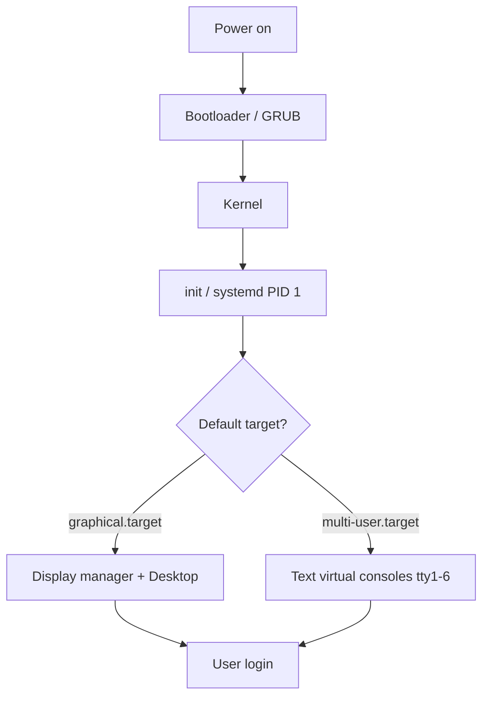

# Login Methods in Linux

## Overview

Linux exposes several distinct paths for a user to authenticate and reach an interactive session. Understanding these entry points is foundational for day-to-day administration, remote management, and recovery: they determine *how* a session is presented (graphical desktop, text console, remote shell), *what* system state the machine is running in (a runlevel or systemd target), and *where* an administrator can intervene when the normal login flow breaks.

This note covers the three principal login surfaces on a typical desktop or server install — the graphical environment, the local virtual (text) consoles, and the runlevel/target model that governs which of those surfaces are available — along with the everyday commands used to inspect and switch between them.

> [!NOTE]
> The `Ctrl + Alt + F#` key combinations below switch between local virtual terminals (VTs) provided by the kernel. On systems running a graphical login manager, the exact function-key mapping can vary by distribution and display server (X11 vs. Wayland); the GUI is not always fixed to `F7`.

## Concepts

Linux separates the *presentation* of a login (graphical vs. text) from the *system state* that decides whether the graphical stack even starts.

| Login surface | Description | Typical use |
|---|---|---|
| Graphical (GUI) | Desktop environment rendered by the X Window System or Wayland, fronted by a display manager (GDM, SDDM, LightDM). | Workstations, developer desktops. |
| Virtual console (CUI) | Kernel-provided text terminals (`tty1`–`tty6`), each an independent full-screen text login. | Servers, headless boxes, recovery. |
| Remote login | Network session over SSH (or, legacy/insecure, Telnet). | Managing servers over the network. |

> [!TIP]
> On a headless server you will almost always log in over **SSH** rather than at a local console. See [SSH Secure Shell Server](../SSH-Secure-Shell-Server/SSH(Secure-Shell)-Server.md) and [Telnet-Server](../Telnet-and-Remote-Desktop-Server/Telnet-Server.md) for the remote-access counterparts to the local methods documented here.

## Graphical (GUI)

- Uses the **X Window System** (Wayland on newer distributions).

- Common Desktop Environments:

    - **GNOME** (Default on many distributions)

    - **KDE Plasma** (Alternative)

### Switch to GUI Console

```bash
Ctrl + Alt + F7
```

> [!NOTE]
> On several modern distributions the display manager runs on `tty1` (so the graphical session is reached with `Ctrl + Alt + F1`) while the text consoles start at `F2`. Cycle through `F1`–`F7` to locate the active graphical VT if `F7` shows a blank screen.

## Virtual Console (Text-Based / CUI)

The Linux kernel provides several independent text terminals. Each is a separate login session, useful when the desktop hangs or when working on a server with no graphical stack installed.

- Access virtual terminals using:

```bash
Ctrl + Alt + F1 to F6
```

> [!NOTE]
> **📸 Screenshot**
> _Capture: A full-screen black text login prompt on tty2 showing the hostname, a "login:" prompt awaiting a username, and a Password prompt below it_

## Init Runlevels (Legacy Systems)

Runlevels are the **SysVinit** model for describing overall system state — from a full halt through single-user maintenance up to a multi-user graphical desktop. Each runlevel defines a specific set of services that should be running.

| Runlevel | Description |
|---|---|
| 0 | Halt (Shutdown) |
| 1 | Single-user mode (Maintenance) |
| 2 | Multi-user (No networking) |
| 3 | Multi-user (Text-only) |
| 4 | Undefined / Custom |
| 5 | Multi-user with GUI |
| 6 | Reboot |

### systemd target equivalents

Almost every current distribution uses **systemd**, which replaces numeric runlevels with named **targets**. The classic runlevels are preserved as compatibility aliases, so understanding the mapping lets you translate legacy documentation.

| Runlevel | systemd target | Purpose |
|---|---|---|
| 0 | `poweroff.target` | Halt the system |
| 1 | `rescue.target` | Single-user / maintenance |
| 2, 3, 4 | `multi-user.target` | Multi-user, text-mode, networked |
| 5 | `graphical.target` | Multi-user with graphical login |
| 6 | `reboot.target` | Reboot the system |



### Example init Commands

On systemd hosts these `init N` calls are translated to the equivalent `systemctl isolate` of the mapped target, so they remain functional for backwards compatibility.

- Shutdown

```bash
init 0
```

- Single-user mode

```bash
init 1
```

- Console mode

```bash
init 3
```

- Graphical mode

```bash
init 5
```

- Reboot

```bash
init 6
```

> Note: Modern systems use `systemd`, where `runlevel` is replaced by **targets** like `graphical.target`, `multi-user.target`, etc.

## Commands

Everyday commands for inspecting the current login state, session, and system.

| Command | Purpose |
|---|---|
| `runlevel` | Show previous and current runlevel |
| `uname -r` | Print the running kernel version |
| `cat /etc/os-release` | Identify the Linux distribution and version |
| `df -h` | List mounted filesystems and free space (human-readable) |
| `ps aux` | List all running processes |
| `top` / `htop` | Monitor processes in real time |
| `du -sh /*` | Summarize disk usage per top-level directory |

### Extra Tips and Useful Commands

- Check Current Runlevel

```bash
runlevel
```

- Check Kernel Version

```bash
uname -r
```

- Check Linux Distribution

```bash
cat /etc/os-release
```

- List All Mounted Filesystems

```bash
df -h
```

- List All Running Processes

```bash
ps aux
```

- Monitor Real-Time Processes

```bash
top
```

- Or enhanced view:

```bash
htop
```

- Check Disk Usage

```bash
du -sh /*
```

### systemd equivalents

When working on a systemd host, prefer the native tooling over the legacy `init`/`runlevel` commands.

```bash
# Show the current default target (equivalent to the default runlevel)
systemctl get-default

# Switch to text/multi-user mode now (runlevel 3 equivalent)
systemctl isolate multi-user.target

# Persistently boot into text mode instead of the GUI
systemctl set-default multi-user.target

# List logged-in users and their sessions
loginctl list-sessions
```

## Best Practices

> [!TIP]
> - On production **servers**, set the default target to `multi-user.target` — a desktop environment adds attack surface and consumes resources with no operational benefit.
> - Keep at least one virtual console reachable (`Ctrl + Alt + F2`) so you can recover a local session if the display manager or SSH daemon fails.
> - Prefer `systemctl` targets over `init N` on modern systems; the numeric form is a compatibility shim and may be removed in future.

## Security Considerations

> [!WARNING]
> - **Single-user / rescue mode grants a root shell without a password by default.** Anyone with physical access and the ability to edit the bootloader can drop into it. Protect the GRUB boot menu with a password and set a root password for rescue mode — see [Reset-Root-Password-and-Protect-GRUB-Boot-Loader](../Security-Firewall-and-Monitoring/Reset-Root-Password-and-Protect-GRUB-Boot-Loader.md).
> - Disable unused virtual consoles and restrict physical console access on shared or exposed hosts (CIS Benchmark guidance for interactive login hardening).
> - Prefer **SSH** over Telnet for remote logins; Telnet transmits credentials in cleartext.
> - Configure a console idle timeout (`TMOUT`) and lock screens on idle to limit exposure of unattended sessions.

## Troubleshooting

| Symptom | Likely cause | Action |
|---|---|---|
| Blank screen after `Ctrl + Alt + F7` | GUI is on a different VT (e.g. `F1`) | Cycle through `F1`–`F7` to find the display manager |
| System boots to a text prompt, no desktop | Default target is `multi-user.target`, or the display manager failed | `systemctl get-default`; check `systemctl status gdm` (or `sddm`/`lightdm`) |
| `init 5` does nothing | No graphical target/DE installed | Install a desktop environment and display manager, or leave the host headless |
| Cannot log in at any console | Full disk, PAM, or auth failure | Boot to `rescue.target` and inspect `journalctl -b`, `/var/log/auth.log` |

## References

- systemd `bootup(7)` and `systemd.target(5)` manual pages
- SysVinit `inittab(5)` — legacy runlevel configuration
- CIS Benchmarks — interactive login and console hardening guidance

## Related
- [Linux Administration & Server Hardening](../Readme.md) — Linux administration & server hardening hub
- [Linux-and-Unix](Linux-and-Unix.md) — history and fundamentals of the Linux/Unix platform
- [su-and-sg](../Users-Groups-and-Permissions/su-and-sg.md) — switching users and groups
- [Reset-Root-Password-and-Protect-GRUB-Boot-Loader](../Security-Firewall-and-Monitoring/Reset-Root-Password-and-Protect-GRUB-Boot-Loader.md) — recovering and protecting login access
- [Linux-Administration-Server-Hardening](Linux-Administration-Server-Hardening.md) — securing login and authentication
