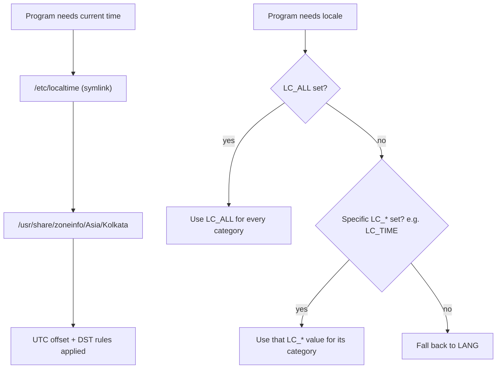

# System Localization and Time Zones

System localization controls what time zone, language, character encoding, and keyboard layout a Linux host presents to users and applications; getting it wrong causes silently misordered log timestamps, garbled console text, and cron/systemd jobs that fire at the wrong wall-clock hour.

## Overview

`systemd`-based distributions expose two coordinated `systemd` components for this: `timedatectl` for the clock/time zone and `localectl` for locale and keyboard layout. Both write their state to plain files under `/etc` so the settings survive reboots and can be inspected without the tools.

| Area | Tool (systemd) | Config file | Legacy/Debian tool |
| :-- | :-- | :-- | :-- |
| Time zone | `timedatectl` | `/etc/localtime` (symlink) | `dpkg-reconfigure tzdata` |
| Locale | `localectl` | `/etc/locale.conf` (RHEL) / `/etc/default/locale` (Debian) | `dpkg-reconfigure locales` |
| Keyboard (console + X11) | `localectl` | `/etc/vconsole.conf`, `/etc/X11/xorg.conf.d/00-keyboard.conf` | `dpkg-reconfigure keyboard-configuration` |

> [!NOTE]
> Both `timedatectl` and `localectl` are part of `systemd`, so they work identically on CentOS Stream 10, Debian 12, and every other systemd distribution. Debian additionally ships `debconf`-driven wrappers (`dpkg-reconfigure tzdata`/`locales`) that predate and still coexist with `localectl`/`timedatectl` — either path edits the same underlying files.

## How It Works

`/etc/localtime` is a **symlink**, not a copy, pointing into the zoneinfo database at `/usr/share/zoneinfo/<Region>/<City>`. Every time-aware program (the kernel's RTC-to-UTC conversion, `date`, log daemons, cron) resolves the offset and DST rules by following that symlink. Locale resolution follows a **precedence chain**: `LC_ALL` overrides everything, individual `LC_*` categories (e.g. `LC_TIME`, `LC_MESSAGES`) override `LANG`, and `LANG` is the fallback default for every category not set explicitly.



> [!NOTE]
> **Precedence, most to least specific**
> `LC_ALL` > individual `LC_*` (e.g. `LC_TIME`, `LC_COLLATE`, `LC_MESSAGES`) > `LANG`. `LC_ALL` is meant for scripting/testing (force a known locale) — do not set it permanently in a locale config file, or it silently defeats every `LC_*` override.

## Configuration

### Step 1: Inspect Current Time Zone

> Example:

```bash
timedatectl status
```

```text
               Local time: Tue 2026-07-22 14:32:10 IST
           Universal time: Tue 2026-07-22 09:02:10 UTC
                 RTC time: Tue 2026-07-22 09:02:10
                Time zone: Asia/Kolkata (IST, +0530)
System clock synchronized: yes
              NTP service: active
          RTC in local TZ: no
```

### Step 2: List and Set the Time Zone

List every valid zoneinfo identifier (both distros):

```bash
timedatectl list-timezones
```

> Example — narrow the list before choosing:

```bash
timedatectl list-timezones | grep -i kolkata
```

Set the time zone (CentOS Stream 10 and Debian 12, identical command):

```bash
timedatectl set-timezone Asia/Kolkata
```

This repoints the `/etc/localtime` symlink; verify it directly:

```bash
readlink -f /etc/localtime
```

```text
/usr/share/zoneinfo/Asia/Kolkata
```

### Step 3 (Debian alternative): `dpkg-reconfigure tzdata`

Debian's `debconf`-driven, menu-based equivalent — useful for interactive/offline installs where `timedatectl` isn't wired up yet:

```bash
dpkg-reconfigure tzdata
```

Both paths write the same symlink, so `timedatectl status` reflects the change either way.

### Step 4: Inspect Current Locale

```bash
localectl status
```

```text
   System Locale: LANG=en_US.UTF-8
       VC Keymap: us
      X11 Layout: us
```

The POSIX `locale` command shows the fully resolved, per-category state a process actually sees (useful when `LC_*` overrides are in play):

```bash
locale
```

```text
LANG=en_US.UTF-8
LC_CTYPE="en_US.UTF-8"
LC_NUMERIC="en_US.UTF-8"
LC_TIME="en_US.UTF-8"
LC_COLLATE="en_US.UTF-8"
LC_MESSAGES="en_US.UTF-8"
LC_ALL=
```

### Step 5: List and Set the Locale

```bash
localectl list-locales
```

Set the system-wide default locale (CentOS Stream 10 and Debian 12):

```bash
localectl set-locale LANG=en_US.UTF-8
```

> [!WARNING]
> `set-locale` fails silently on a locale that isn't **generated** yet. On Debian, generate it first with `locale-gen en_US.UTF-8` (or run `dpkg-reconfigure locales` and tick the box); on CentOS Stream, install the language pack with `dnf install glibc-langpack-en` if `list-locales` doesn't show it.

`localectl` writes `LANG=` (and any `LC_*` overrides you pass) into:

- RHEL/CentOS Stream: `/etc/locale.conf`
- Debian/Ubuntu: `/etc/default/locale`

```bash
cat /etc/locale.conf        # CentOS Stream 10
```

```bash
cat /etc/default/locale     # Debian 12
```

```ini
LANG=en_US.UTF-8
```

### Step 6 (Debian alternative): `dpkg-reconfigure locales`

```bash
dpkg-reconfigure locales
```

Presents a checklist of locales to generate (writes `/etc/locale.gen`, runs `locale-gen`) and lets you pick the system default, which is then written to `/etc/default/locale`.

### Step 7: Set the Keyboard Layout

Console (virtual terminal) keymap:

```bash
localectl set-keymap us
```

X11 (graphical session) layout — only relevant on hosts running a desktop:

```bash
localectl set-x11-keymap us
```

> Example — a non-US layout with a variant:

```bash
localectl set-x11-keymap gb extd
```

`set-keymap` writes `/etc/vconsole.conf`; `set-x11-keymap` writes `/etc/X11/xorg.conf.d/00-keyboard.conf`. On Debian, `dpkg-reconfigure keyboard-configuration` drives the equivalent interactive menu.

## Common Locale/Time Variables

| Variable | Governs | Example value |
| :-- | :-- | :-- |
| `LANG` | Default for every `LC_*` category not set explicitly | `en_US.UTF-8` |
| `LC_ALL` | Overrides **every** category (scripting/testing only, never persist it) | `C` |
| `LC_CTYPE` | Character classification and case conversion | `en_US.UTF-8` |
| `LC_TIME` | Date/time formatting | `en_GB.UTF-8` |
| `LC_NUMERIC` | Decimal point / thousands separator | `de_DE.UTF-8` |
| `LC_COLLATE` | String sort order | `C` |
| `LC_MESSAGES` | Language of system/program messages | `en_US.UTF-8` |
| `TZ` | Per-process time zone override (bypasses `/etc/localtime`) | `Asia/Kolkata` |

> Example — override just one category, one shell, without touching system config:

```bash
LC_TIME=en_GB.UTF-8 date
```

> Example — override the time zone for a single command only:

```bash
TZ=UTC date
```

## Debian vs RHEL-Family Quick Reference

| Task | CentOS Stream 10 | Debian 12 |
| :-- | :-- | :-- |
| Set time zone | `timedatectl set-timezone Asia/Kolkata` | `timedatectl set-timezone Asia/Kolkata` **or** `dpkg-reconfigure tzdata` |
| Time zone config file | `/etc/localtime` → `/usr/share/zoneinfo/...` | `/etc/localtime` → `/usr/share/zoneinfo/...` |
| Set locale | `localectl set-locale LANG=en_US.UTF-8` | `localectl set-locale LANG=en_US.UTF-8` **or** `dpkg-reconfigure locales` |
| Locale config file | `/etc/locale.conf` | `/etc/default/locale` |
| Generate a missing locale | `dnf install glibc-langpack-<lang>` | `locale-gen <locale>` (edits `/etc/locale.gen`) |
| Keyboard config | `localectl set-keymap` / `set-x11-keymap` | same, or `dpkg-reconfigure keyboard-configuration` |

## Best Practices

- Run production servers on **UTC** (`timedatectl set-timezone UTC`) and let application/reporting layers convert to local time; it eliminates DST-transition ambiguity in logs and cron schedules.
- Pair the time zone with **NTP sync** — check `System clock synchronized: yes` and `NTP service: active` in `timedatectl status`; an unsynced clock breaks TLS validation, Kerberos, and log correlation regardless of the time zone.
- Standardize `LANG=en_US.UTF-8` (or your fleet's chosen UTF-8 locale) across servers so log timestamps, sort order, and script output parsing are consistent; avoid `C.UTF-8`/`POSIX` unless you specifically need locale-free, byte-exact behavior.
- Never persist `LC_ALL` in a config file — reserve it for one-off shell/script overrides, since it silently overrides all other `LC_*` settings.
- After any `dpkg-reconfigure locales` or manual `/etc/locale.gen` edit, confirm with `locale -a` that the locale was actually generated before referencing it.

## Security Considerations

> [!WARNING]
> Inconsistent time zones or unsynchronized clocks across a fleet corrupt log correlation during incident response — SIEM timelines, `journalctl` cross-host comparisons, and Kerberos/TLS clock-skew checks all depend on accurate, consistent time.

- Verify time sync status (`timedatectl status` → `System clock synchronized`) as part of routine hardening checks; a drifted clock can also mask or misdate evidence of compromise.
- Locale files (`/etc/locale.conf`, `/etc/default/locale`, `/etc/vconsole.conf`) are root-owned config, not secrets, but unexpected changes to them can indicate unauthorized system tampering — include them in configuration/file-integrity monitoring baselines alongside `/etc/localtime`.
- A stale or incorrect `/etc/localtime` symlink (e.g., pointing to a nonexistent zoneinfo file) can cause services to fall back to UTC unexpectedly; audit it with `readlink -f /etc/localtime` after any change.

## Troubleshooting

| Symptom | Likely cause | Resolution |
| :-- | :-- | :-- |
| `timedatectl set-timezone` reports "Invalid time zone" | Typo or wrong `Region/City` format | `timedatectl list-timezones \| grep -i <city>` to find the exact identifier |
| `localectl set-locale` succeeds but `locale` still shows old values | Locale wasn't regenerated, or change needs a new login shell | Run `locale-gen <locale>` (Debian) / install `glibc-langpack-<lang>` (CentOS), then re-login |
| `locale: Cannot set LC_ALL to default locale` warning | Requested locale not installed/generated | `locale -a` to list installed locales; generate the missing one |
| System clock correct but logs show wrong hour | App reads `TZ` env var, overriding `/etc/localtime` | Unset a stray `TZ` in the service's environment or systemd unit |
| Console shows wrong characters for non-ASCII keys | Wrong `vconsole` keymap, mismatched with `X11` layout | `localectl set-keymap <map>` and `localectl set-x11-keymap <layout>` to match |
| Time zone reverts after reboot | Config drift tool (Ansible/Puppet/cloud-init) re-applies old value | Update the configuration-management source of truth, not just the live host |

## References

- [systemd `timedatectl` man page](https://www.freedesktop.org/software/systemd/man/latest/timedatectl.html)
- [systemd `localectl` man page](https://www.freedesktop.org/software/systemd/man/latest/localectl.html)
- [systemd `locale.conf` man page](https://www.freedesktop.org/software/systemd/man/latest/locale.conf.html)
- [Debian Handbook: Configuring the Base System](https://debian-handbook.info/)
- [glibc locale documentation (GNU manual)](https://www.gnu.org/software/libc/manual/html_node/Locales.html)

## Related

- [Login-Methods-in-Linux](Login-Methods-in-Linux.md) — locale/keyboard settings are applied at session start on local and remote logins
- [CentOS-Stream-Installation](CentOS-Stream-Installation.md) — installer-time locale/time zone selection on RHEL-family systems
- [Debian-System-Setup](Debian-System-Setup.md) — installer-time locale/time zone selection and `debconf` on Debian
- [Introduction to Linux](Readme.md) — module hub
- [Linux Administration & Server Hardening](../Readme.md)
