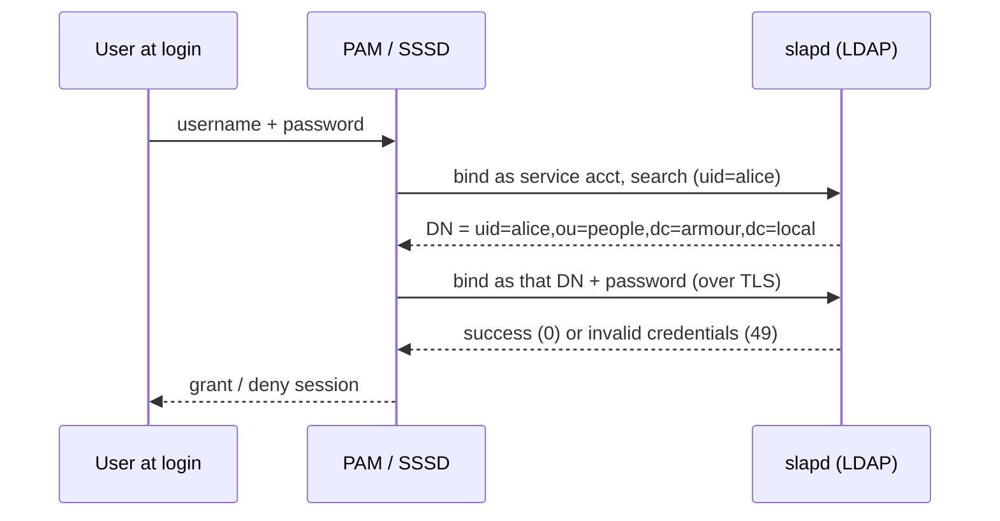

# LDAP Authentication

## Overview

LDAP authentication centralizes login for a fleet of Linux hosts against a single directory. Instead of each machine keeping local `/etc/passwd` and `/etc/shadow` entries, clients resolve users and verify passwords over LDAP. On modern systems this is wired through **NSS** (name resolution — "who is user X?"), **PAM** (the authentication conversation — "is this password correct?"), and a caching daemon, almost always **SSSD**.

This note explains the bind mechanisms and the NSS/PAM/SSSD stack. For encrypting that traffic, see [LDAP-over-TLS](LDAP-over-TLS.md); for the client packages, see [LDAP-Client-Configuration](LDAP-Client-Configuration.md).

> [!WARNING]
> Never send LDAP passwords in cleartext. Every authentication flow below **must** run over StartTLS or LDAPS in production. A plain-`389` simple bind puts the user's password on the wire in the clear. See [LDAP-Security-Hardening](LDAP-Security-Hardening.md).

## Concepts

### Bind operations

Authentication in LDAP is the **bind**. There are three mechanisms:

| Bind type | How it works | Use case |
|-----------|--------------|----------|
| **Anonymous** | No DN, no password | Read-only public lookups (usually disabled) |
| **Simple** | DN + cleartext password (protected by TLS) | Most common; user/app authentication |
| **SASL** | Pluggable mechanisms (EXTERNAL, GSSAPI/Kerberos, DIGEST-MD5) | Certificate or Kerberos-backed auth; admin over `ldapi:///` |

### The two-phase login flow

A user login is **not** a single bind. It is:

1. **Search (as a service/bind account or anonymously):** find the user's full DN from their `uid`.
2. **Bind (as the user):** re-bind using that DN and the supplied password to verify it.



### NSS vs PAM

| Layer | Answers | Backed by |
|-------|---------|-----------|
| **NSS** | Identity/enumeration: uid, gid, home, shell, group membership | `/etc/nsswitch.conf` → `sss`/`ldap` |
| **PAM** | Authentication & account/session policy | `/etc/pam.d/*` → `pam_sss`/`pam_ldap` |

## Architecture

Two client stacks exist; **SSSD is the recommended default** on both families.

| Stack | Components | Notes |
|-------|-----------|-------|
| **SSSD** (recommended) | `sssd`, `pam_sss`, `nss` via `sss` | Caches credentials (offline login), one config file |
| Legacy `nss-pam-ldapd` | `nslcd`, `libnss-ldap`, `libpam-ldap` | Older, no offline cache; being retired |

## Configuration

### SSSD — `/etc/sssd/sssd.conf`

```ini
[sssd]
config_file_version = 2
services = nss, pam
domains = armour.local

[domain/armour.local]
id_provider = ldap
auth_provider = ldap
ldap_uri = ldap://192.168.1.200
ldap_search_base = dc=armour,dc=local
ldap_default_bind_dn = cn=admin,dc=armour,dc=local
ldap_default_authtok = ChangeMe_BindPassword
ldap_id_use_start_tls = true
ldap_tls_reqcert = demand
ldap_tls_cacert = /etc/openldap/certs/ca.crt
cache_credentials = true
ldap_schema = rfc2307
enumerate = false
```

> [!IMPORTANT]
> `/etc/sssd/sssd.conf` contains a bind password and **must be mode `0600`, owned by root**, or `sssd` refuses to start.

```bash
sudo chown root:root /etc/sssd/sssd.conf
sudo chmod 600 /etc/sssd/sssd.conf
sudo systemctl restart sssd
```

### nsswitch — `/etc/nsswitch.conf`

```conf
passwd:     files sss
group:      files sss
shadow:     files sss
```

## Commands

### Enable LDAP auth (RHEL family — authselect)

```bash
sudo dnf install sssd sssd-ldap oddjob-mkhomedir -y
sudo authselect select sssd with-mkhomedir --force
sudo systemctl enable --now sssd oddjobd
```

### Enable LDAP auth (Debian / Ubuntu)

```bash
sudo apt install sssd sssd-ldap libnss-sss libpam-sss -y
# add 'sss' to passwd/group/shadow in /etc/nsswitch.conf
sudo pam-auth-update            # tick "SSS authentication" + "mkhomedir"
sudo systemctl enable --now sssd
```

### Verify resolution and authentication

```bash
id testuser1                    # NSS: does the directory user resolve?
getent passwd testuser1         # NSS: full passwd entry
ldapwhoami -x -D "uid=testuser1,ou=it,dc=armour,dc=local" -W   # bind test
su - testuser1                  # full PAM login test
```

## Examples

### Confirm a directory user resolves

```bash
getent passwd testuser1
```

Plausible output:

```text
testuser1:*:1101:1101:Test User1:/home/testuser1:/bin/bash
```

### Test a simple bind directly

```bash
ldapwhoami -x -H ldap://192.168.1.200 \
  -D "uid=testuser1,ou=it,dc=armour,dc=local" -W
```

```text
dn:uid=testuser1,ou=it,dc=armour,dc=local
```

> [!NOTE]
> **📸 Screenshot**
> _Capture: Terminal showing successful su - testuser1 login for an LDAP-backed account, with pam_mkhomedir creating /home/testuser1 on first login_

## Best Practices

- Use **SSSD** with `cache_credentials = true` so laptops/remote hosts survive directory outages.
- Bind for searches with a **dedicated least-privilege service account**, never the rootDN.
- Enforce **StartTLS/LDAPS** (`ldap_id_use_start_tls = true`, `ldap_tls_reqcert = demand`).
- Auto-create home directories with **`pam_mkhomedir` / `oddjob-mkhomedir`**.
- Manage PAM through **`authselect`** (RHEL) or **`pam-auth-update`** (Debian) — don't hand-edit `/etc/pam.d/system-auth`.
- Restrict which hosts a user may log into with `access_provider = ldap` + `ldap_access_filter`.

## Security Considerations

- A bind password in `sssd.conf` is a standing credential — scope it to read-only, rotate it, and keep the file `0600`.
- Set `ldap_tls_reqcert = demand` so a MITM cannot present a forged certificate; `allow`/`never` defeats TLS.
- Prefer **SASL EXTERNAL over `ldapi:///`** for server administration so no password crosses the network.
- Enforce password policy in the directory (**ppolicy overlay**) rather than trusting each client; see [LDAP-Security-Hardening](LDAP-Security-Hardening.md).
- Limit login by group/host using SSSD access control; a valid bind is authentication, not authorization.

## Troubleshooting

| Symptom | Check |
|---------|-------|
| `id user` fails but bind works | NSS not pointed at `sss`; fix `/etc/nsswitch.conf` |
| Bind works, login denied | `access_provider`/`ldap_access_filter` excludes the user |
| `sssd` won't start | `sssd.conf` perms not `0600`, or TLS CA path wrong |
| Cleartext creds despite TLS config | `ldap_uri` uses `ldaps://` **and** `ldap_id_use_start_tls=true` (pick one) |

### Debug SSSD

```bash
journalctl -u sssd -e
sudo sssctl domain-status armour.local
sudo sss_cache -E                # flush the cache while testing
```

Raise `debug_level = 6` under the `[domain/...]` section for verbose logs, then restart `sssd`.

## References

- Red Hat — Configuring SSSD to use LDAP for authentication
- SSSD upstream documentation (sssd.conf, sssd-ldap man pages)
- RFC 4513 — LDAP Authentication Methods and Security Mechanisms
- Ubuntu Server Guide — SSSD and LDAP

## Related
- [Linux Administration & Server Hardening](../Readme.md) — Linux administration & server hardening hub
- [LDAP-Client-Configuration](LDAP-Client-Configuration.md) — installing and wiring the client stack
- [LDAP-over-TLS](LDAP-over-TLS.md) — encrypting the bind traffic
- [LDAP-Security-Hardening](LDAP-Security-Hardening.md) — ACLs, ppolicy, and disabling anonymous bind
