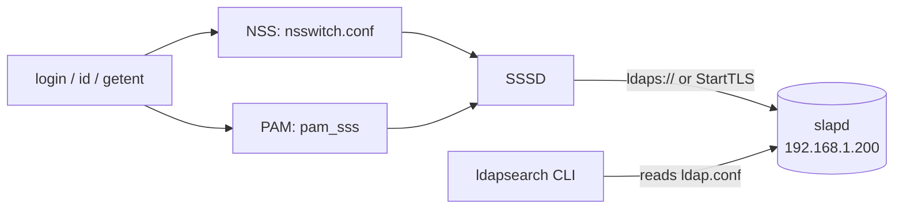

# LDAP Client Configuration

## Overview

A correctly configured **LDAP client** lets a Linux host resolve users/groups and authenticate logins against a central directory. This note covers the client side: the command-line tooling (`ldap-utils` / `openldap-clients`), the system-wide `ldap.conf`, and joining the machine to the directory with **SSSD** so that `id`, `getent`, and interactive login all work.

For the bind mechanisms and NSS/PAM theory, see [LDAP-Authentication](LDAP-Authentication.md); for encrypting client traffic, see [LDAP-over-TLS](LDAP-over-TLS.md).

## Concepts

There are two distinct "clients":

| Client | What it is | Config file |
|--------|-----------|-------------|
| **CLI tools** | `ldapsearch`, `ldapadd`, `ldapwhoami`, … | `/etc/openldap/ldap.conf` or `/etc/ldap/ldap.conf` |
| **System auth** | NSS + PAM via SSSD, so the OS sees directory users | `/etc/sssd/sssd.conf` + `/etc/nsswitch.conf` |

> [!NOTE]
> `ldap.conf` (client tools) and `slapd.conf`/`cn=config` (the server) are unrelated files. Editing one never affects the other.

## Architecture



## Configuration

### Client tool defaults — `ldap.conf`

Debian/Ubuntu: `/etc/ldap/ldap.conf`  •  RHEL family: `/etc/openldap/ldap.conf`

```conf
BASE    dc=armour,dc=local
URI     ldap://192.168.1.200
TLS_CACERT      /etc/openldap/certs/ca.crt
TLS_REQCERT     demand
```

With `BASE` and `URI` set, you can drop `-b` and `-H` from most `ldapsearch` invocations.

### System authentication — `/etc/sssd/sssd.conf`

```ini
[sssd]
config_file_version = 2
services = nss, pam
domains = armour.local

[domain/armour.local]
id_provider = ldap
auth_provider = ldap
ldap_uri = ldap://192.168.1.200
ldap_search_base = dc=armour,dc=local
ldap_default_bind_dn = cn=admin,dc=armour,dc=local
ldap_default_authtok = ChangeMe_BindPassword
ldap_id_use_start_tls = true
ldap_tls_reqcert = demand
ldap_tls_cacert = /etc/openldap/certs/ca.crt
cache_credentials = true
ldap_schema = rfc2307
enumerate = false
```

> [!IMPORTANT]
> `/etc/sssd/sssd.conf` must be `chmod 600`, `chown root:root`. SSSD refuses to start otherwise.

### Name service switch — `/etc/nsswitch.conf`

```conf
passwd:     files sss
group:      files sss
shadow:     files sss
```

## Commands

### Install client tooling

```bash
# Debian / Ubuntu
sudo apt install ldap-utils sssd sssd-ldap libnss-sss libpam-sss -y
```

```bash
# RHEL / CentOS / Rocky / Alma
sudo dnf install openldap-clients sssd sssd-ldap oddjob-mkhomedir -y
```

### Wire up NSS/PAM

```bash
# RHEL family — configure NSS + PAM in one step
sudo authselect select sssd with-mkhomedir --force

# Debian / Ubuntu — enable pam_sss and home-dir creation
sudo pam-auth-update
```

### Start and enable

```bash
sudo systemctl enable --now sssd
sudo systemctl enable --now oddjobd     # RHEL, for mkhomedir
```

## Examples

### Basic searches using ldap.conf defaults

```bash
# BASE/URI come from ldap.conf, so -b/-H are optional
ldapsearch -x "(uid=testuser1)"

# Explicit server and base
ldapsearch -x -H ldap://192.168.1.200 -b dc=armour,dc=local "(objectClass=inetOrgPerson)" uid cn mail
```

### Confirm the host sees directory identities

```bash
getent passwd testuser1
id testuser1
```

Plausible output:

```text
testuser1:*:1101:1101:Test User1:/home/testuser1:/bin/bash
uid=1101(testuser1) gid=1101(testuser1) groups=1101(testuser1)
```

### Change a directory password from the client

```bash
ldappasswd -x -H ldap://192.168.1.200 \
  -D "uid=testuser1,ou=it,dc=armour,dc=local" -W -S
```

> [!NOTE]
> **📸 Screenshot**
> _Capture: Terminal running getent passwd testuser1 returning the LDAP account, followed by a successful su - testuser1 login and home directory auto-creation_

## Best Practices

- Deploy `ldap.conf` and `sssd.conf` via **configuration management** (Ansible/Puppet) for fleet consistency.
- Set **`enumerate = false`** — full directory enumeration is slow and leaks the user list to every host.
- Keep **`cache_credentials = true`** so hosts survive directory/network outages.
- Point NSS at **`sss`, not `ldap`** — the `nss_ldap`/`nslcd` path is legacy and cacheless.
- Provision **home directories** automatically (`with-mkhomedir` / `pam_mkhomedir`).
- Manage PAM through **`authselect`/`pam-auth-update`**, never by editing `/etc/pam.d` by hand.

## Security Considerations

- Enforce TLS on the client: `ldap_id_use_start_tls = true` + `ldap_tls_reqcert = demand`, and distribute the **CA certificate** to every client. See [LDAP-over-TLS](LDAP-over-TLS.md).
- The **bind password** in `sssd.conf` is a real credential — least-privilege, rotate it, keep the file `0600`.
- Restrict login with `access_provider = ldap` and an `ldap_access_filter` so not every directory user can log into every host.
- Set `TLS_REQCERT demand` in `ldap.conf` so CLI tools reject forged certificates too.
- See [LDAP-Security-Hardening](LDAP-Security-Hardening.md) for the server-side controls that back these up.

## Troubleshooting

| Symptom | Check |
|---------|-------|
| `id user` returns nothing | `sss` missing from `/etc/nsswitch.conf`, or `sssd` down |
| Login hangs | Wrong `ldap_uri`/firewall; test with `ldapsearch -x -H ...` |
| `sssd` won't start | `sssd.conf` perms not `0600`, or bad TLS CA path |
| Password changes rejected | ppolicy on the server, or missing write ACL |
| Stale user data | Flush cache: `sudo sss_cache -E` |

### Diagnostics

```bash
journalctl -u sssd -e
sudo sssctl domain-status armour.local
ldapwhoami -x -H ldap://192.168.1.200 -D "uid=testuser1,ou=it,dc=armour,dc=local" -W
```

## References

- Red Hat — Configuring authentication with authselect and SSSD
- Ubuntu Server Guide — SSSD / LDAP authentication client
- `man sssd.conf`, `man sssd-ldap`, `man ldap.conf`
- OpenLDAP Admin Guide — Client configuration

## Related
- [Linux Administration & Server Hardening](../Readme.md) — Linux administration & server hardening hub
- [LDAP-Authentication](LDAP-Authentication.md) — NSS/PAM/SSSD auth flow and bind types
- [LDAP-over-TLS](LDAP-over-TLS.md) — CA distribution and encrypted client transport
- [Ldap-Server-Setup](Ldap-Server-Setup.md) — the server these clients connect to
