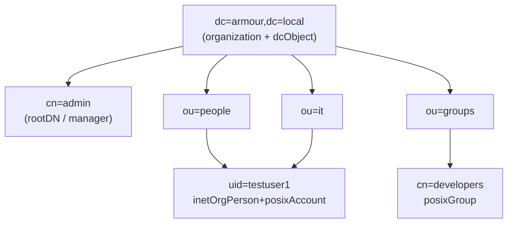

# LDAP Directory Structure

## Overview

An LDAP directory is a **tree of entries** — the Directory Information Tree (DIT). Every entry has a globally unique name (its **Distinguished Name**), a set of **objectClasses** that dictate its shape, and typed **attributes** carrying data. Getting the structure right up front matters: the base DN, organizational units, and naming attributes you choose become load-bearing across authentication, ACLs, replication, and every application that binds to the directory.

This note covers how the tree is named and laid out. For the daemon and packaging, see [OpenLDAP-Overview](OpenLDAP-Overview.md); for building it, see [Ldap-Server-Setup](Ldap-Server-Setup.md).

## Concepts

### Distinguished Names

A DN is read **leaf-to-root**, comma-separated, most-specific component first.

```text
uid=testuser1,ou=it,dc=armour,dc=local
└── RDN ─┘ └OU┘ └─── base DN (suffix) ───┘
```

| Element | Attribute | Typical use |
|---------|-----------|-------------|
| `dc` | domainComponent | Builds the base DN from a DNS domain |
| `o` | organization | Company/organization entry |
| `ou` | organizationalUnit | Container: `ou=people`, `ou=groups`, `ou=it` |
| `cn` | commonName | Groups, admin/service roles |
| `uid` | userid | Login name for person entries |

> [!TIP]
> Derive the base DN from a real DNS domain you control: `armour.local` → `dc=armour,dc=local`. This keeps names unambiguous and replication/referrals sane.

### objectClasses

Every entry lists one or more objectClasses. Each is **STRUCTURAL**, **AUXILIARY**, or **ABSTRACT**, and defines MUST (required) and MAY (optional) attributes.

| objectClass | Purpose | Key attributes |
|-------------|---------|----------------|
| `dcObject` | Domain component marker | `dc` |
| `organization` | Org root | `o` |
| `organizationalUnit` | Container / OU | `ou` |
| `inetOrgPerson` | A person/user | `cn`, `sn`, `uid`, `mail`, `userPassword` |
| `posixAccount` | UNIX login attributes | `uidNumber`, `gidNumber`, `homeDirectory`, `loginShell` |
| `shadowAccount` | Password-aging attributes | `shadowLastChange`, `shadowMax` |
| `posixGroup` | UNIX group | `cn`, `gidNumber`, `memberUid` |
| `groupOfNames` | Generic group (DN members) | `cn`, `member` |

> [!IMPORTANT]
> An entry may have exactly **one structural** objectClass chain but many auxiliary ones. A POSIX login user is commonly `inetOrgPerson` (structural) **+** `posixAccount` **+** `shadowAccount` (auxiliary). Mixing two unrelated structural classes is a schema violation.

## Architecture

A conventional enterprise DIT for `dc=armour,dc=local`:



> [!NOTE]
> Two common layouts exist: **flat** (all users under one `ou=people`, all groups under `ou=groups`) or **departmental** (users nested under `ou=it`, `ou=hr`, …). Flat is easier for search filters and ACLs; departmental mirrors org charts but complicates base-DN search scoping. The [Ldap-Server-Setup](Ldap-Server-Setup.md) example uses departmental OUs like `ou=it`.

## Configuration

### Design checklist

| Decision | Recommendation |
|----------|----------------|
| Base DN | From owned DNS domain: `dc=armour,dc=local` |
| User container | Single `ou=people` (flat) unless org demands departments |
| Group container | `ou=groups` |
| Naming attribute | `uid` for users, `cn` for groups |
| UID/GID numbering | Reserve a range (e.g. 10000–19999) to avoid clashing with local accounts |
| Group model | `posixGroup`+`memberUid` for UNIX login; `groupOfNames`+`member` for app authz |

## Commands

### Create the base and containers (LDIF)

```ldif
dn: dc=armour,dc=local
objectClass: top
objectClass: dcObject
objectClass: organization
o: Armour Local
dc: armour

dn: ou=people,dc=armour,dc=local
objectClass: organizationalUnit
ou: people

dn: ou=groups,dc=armour,dc=local
objectClass: organizationalUnit
ou: groups
```

```bash
ldapadd -x -D cn=admin,dc=armour,dc=local -W -f /root/base.ldif
```

### Walk the tree (DNs only)

```bash
ldapsearch -x -H ldap://localhost -b dc=armour,dc=local -s sub "(objectClass=*)" dn
```

### Scope of a search

| `-s` value | Returns |
|-----------|---------|
| `base` | Only the base entry itself |
| `one` | Immediate children of the base |
| `sub` | The base and its entire subtree (default) |

## Examples

### A complete POSIX user entry

```ldif
dn: uid=testuser1,ou=it,dc=armour,dc=local
objectClass: inetOrgPerson
objectClass: posixAccount
objectClass: shadowAccount
cn: Test User1
sn: User1
uid: testuser1
uidNumber: 1101
gidNumber: 1101
homeDirectory: /home/testuser1
loginShell: /bin/bash
mail: testuser1@armour.local
userPassword: {SSHA}ypm0toBJ18/4ojMPlRjP15glbeG8Jxzq
```

### A POSIX group

```ldif
dn: cn=developers,ou=groups,dc=armour,dc=local
objectClass: posixGroup
cn: developers
gidNumber: 10001
memberUid: testuser1
```

### Filter examples

```bash
# All people
ldapsearch -x -b dc=armour,dc=local "(objectClass=inetOrgPerson)" uid cn

# One user by uid
ldapsearch -x -b dc=armour,dc=local "(uid=testuser1)"

# Members of a group via posixGroup
ldapsearch -x -b dc=armour,dc=local "(&(objectClass=posixGroup)(cn=developers))" memberUid
```

## Best Practices

- Choose a base DN once — **changing it later is a migration**, not an edit.
- Keep the tree **shallow**; deep nesting complicates ACLs and search scoping.
- Reserve dedicated **uidNumber/gidNumber ranges** for directory accounts.
- Use **consistent naming attributes** (`uid` everywhere for users).
- Prefer **`inetOrgPerson`** over the older `person`/`organizationalPerson` for user records.
- Document the intended structure so applications bind against predictable containers.

## Security Considerations

- Structure influences **ACL surface**: a flat `ou=people` lets you write one `olcAccess` rule for `userPassword` across all users. See [LDAP-Security-Hardening](LDAP-Security-Hardening.md).
- Don't store secrets in world-readable attributes; `userPassword` must be ACL-protected and hashed.
- Service/bind accounts should live in a distinct container (e.g. `ou=services`) with least-privilege ACLs, not among human users.

## Troubleshooting

| Symptom | Likely cause |
|---------|--------------|
| `objectClass violation (65)` | Missing MUST attribute or two structural classes |
| `no such object (32)` | Parent container doesn't exist yet — add OUs before children |
| `naming violation (64)` | RDN attribute not present as an attribute in the entry |
| Search returns nothing | Wrong `-b` base DN or scope; check ACL read rights |

## References

- OpenLDAP Admin Guide — "The Big Picture" & schema chapters
- RFC 4519 — LDAP: Schema for User Applications
- RFC 2307 / RFC 2307bis — Using LDAP as a Network Information Service (POSIX)

## Related
- [Linux Administration & Server Hardening](../Readme.md) — Linux administration & server hardening hub
- [OpenLDAP-Overview](OpenLDAP-Overview.md) — daemons, packaging, and paths
- [LDIF-Files-and-Schema](LDIF-Files-and-Schema.md) — LDIF format and schema definitions
- [Ldap-Server-Setup](Ldap-Server-Setup.md) — building the DIT for dc=armour,dc=local
