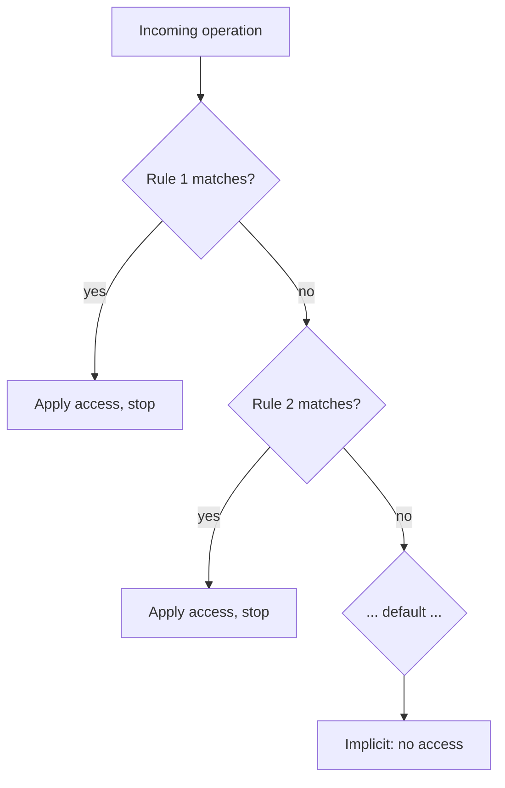

# LDAP Security Hardening

## Overview

An LDAP directory is a **single point of trust** for an entire estate — compromise it and every host and application that authenticates against it is exposed. Hardening OpenLDAP means locking down four surfaces: **transport** (encryption), **access control** (ACLs), **authentication policy** (binds and password rules), and **operations** (logging, backups, patching). This note consolidates those controls, aligned with CIS Benchmark, NIST SP 800-53/800-63, and defense-in-depth practice.

It builds on [LDAP-over-TLS](LDAP-over-TLS.md) (transport) and [LDAP-Authentication](LDAP-Authentication.md) (auth flow), and assumes a directory built as in [Ldap-Server-Setup](Ldap-Server-Setup.md).

> [!WARNING]
> The **rootDN bypasses all ACLs**. Anything using `cn=admin,dc=armour,dc=local` has unconditional read/write. Reserve it for break-glass administration; give applications and clients scoped service accounts instead.

## Concepts

### Threats to a directory

| Threat | Vector | Primary control |
|--------|--------|-----------------|
| Credential sniffing | Cleartext bind on 389 | Enforce TLS / StartTLS |
| Anonymous data harvest | Anonymous bind + broad read | Disable anon bind, scope ACLs |
| Password attribute leak | Readable `userPassword` | ACL: `by self write by * none` |
| Brute force | Repeated binds | ppolicy lockout |
| Weak stored hashes | `{CRYPT}`/plaintext | `{SSHA}`/`{ARGON2}` + `olcPasswordHash` |
| Config tampering | Network write to cn=config | `ldapi:/// + EXTERNAL` only |
| DoS via unbounded search | Huge result sets | size/time limits |

## Architecture

### olcAccess evaluation order

ACLs are evaluated **top to bottom, first match wins, then stop** (unless `break`/`continue`). Order most-specific rules first.



## Configuration

### 1. Protect passwords and scope reads (olcAccess)

```ldif
dn: olcDatabase={2}mdb,cn=config
changetype: modify
replace: olcAccess
olcAccess: {0}to attrs=userPassword,shadowLastChange
  by self write
  by anonymous auth
  by dn.exact="cn=admin,dc=armour,dc=local" manage
  by * none
olcAccess: {1}to dn.subtree="dc=armour,dc=local"
  by self read
  by users read
  by * none
```

> [!IMPORTANT]
> `by anonymous auth` lets an unauthenticated client *attempt a bind* against `userPassword` without being able to *read* the hash. Removing it breaks login; changing it to `read` leaks every password hash.

### 2. Disable anonymous binds

```ldif
dn: cn=config
changetype: modify
replace: olcDisallows
olcDisallows: bind_anon

dn: olcDatabase={-1}frontend,cn=config
changetype: modify
replace: olcRequires
olcRequires: authc
```

### 3. Require encryption (reject cleartext binds)

```ldif
dn: olcDatabase={2}mdb,cn=config
changetype: modify
replace: olcSecurity
olcSecurity: ssf=128 update_ssf=128 simple_bind=128
```

`ssf` = Security Strength Factor; `128` demands a TLS-grade channel for the operation.

### 4. Enforce strong TLS parameters

```ldif
dn: cn=config
changetype: modify
replace: olcTLSProtocolMin
olcTLSProtocolMin: 3.3
-
replace: olcTLSCipherSuite
olcTLSCipherSuite: HIGH:!aNULL:!MD5:!3DES:!RC4
```

> [!NOTE]
> `olcTLSProtocolMin: 3.3` means **TLS 1.2** (3.1=TLS1.0, 3.2=TLS1.1, 3.3=TLS1.2, 3.4=TLS1.3). Set the CipherSuite syntax to match your TLS library (OpenSSL vs GnuTLS on Debian).

### 5. Password policy overlay (ppolicy)

```ldif
dn: olcOverlay=ppolicy,olcDatabase={2}mdb,cn=config
changetype: add
objectClass: olcOverlayConfig
objectClass: olcPPolicyConfig
olcOverlay: ppolicy
olcPPolicyDefault: cn=default,ou=policies,dc=armour,dc=local
olcPPolicyHashCleartext: TRUE
olcPPolicyUseLockout: TRUE
```

```ldif
dn: cn=default,ou=policies,dc=armour,dc=local
objectClass: pwdPolicy
objectClass: person
cn: default
sn: default
pwdAttribute: userPassword
pwdMinLength: 12
pwdMaxFailure: 5
pwdLockout: TRUE
pwdLockoutDuration: 900
pwdMaxAge: 7776000
pwdInHistory: 5
pwdCheckQuality: 2
```

### 6. Set the default stored hash

```ldif
dn: olcDatabase={-1}frontend,cn=config
changetype: modify
replace: olcPasswordHash
olcPasswordHash: {SSHA}
```

## Commands

### Apply hardening LDIFs

```bash
sudo ldapmodify -Y EXTERNAL -H ldapi:/// -f /root/harden-acl.ldif
sudo ldapmodify -Y EXTERNAL -H ldapi:/// -f /root/harden-tls.ldif
sudo ldapadd    -Y EXTERNAL -H ldapi:/// -f /root/ppolicy.ldif
```

### Restrict the daemon at the OS level

```bash
# Firewall: only allow LDAP/LDAPS from the management network
sudo firewall-cmd --permanent --add-rich-rule='rule family=ipv4 source address=192.168.1.0/24 service name=ldaps accept'
sudo firewall-cmd --reload
```

```bash
# Verify slapd runs unprivileged
ps -o user,comm -C slapd
```

Plausible output:

```text
USER     COMMAND
ldap     slapd
```

## Examples

### Confirm anonymous bind is refused

```bash
ldapsearch -x -H ldap://192.168.1.200 -b dc=armour,dc=local "(uid=testuser1)"
```

```text
ldap_bind: Inappropriate authentication (48)
        additional info: anonymous bind disallowed
```

### Confirm a cleartext bind is rejected but TLS works

```bash
# Should fail (no TLS, ssf too low):
ldapsearch -x -H ldap://192.168.1.200 -D "cn=admin,dc=armour,dc=local" -W -b dc=armour,dc=local

# Should succeed (StartTLS):
ldapsearch -x -ZZ -H ldap://ldap.armour.local -D "cn=admin,dc=armour,dc=local" -W -b dc=armour,dc=local
```

## Best Practices

| Area | Control |
|------|---------|
| Transport | Enforce TLS 1.2+; `olcSecurity ssf=128`; StartTLS/LDAPS only |
| Anonymous | `olcDisallows: bind_anon`; scope any anon read to nothing sensitive |
| Passwords | ppolicy lockout + complexity; `{SSHA}`/`{ARGON2}` hashes; history |
| rootDN | Break-glass only; administer via `ldapi:/// + EXTERNAL` |
| Service accounts | Read-only, scoped ACL, rotated credentials, distinct container |
| Network | Firewall to management subnet; no directory on the public internet |
| Auditing | Enable connection/stats logging; ship to a central log host |
| Backups | Scheduled `slapcat` of config + data, stored off-box, tested restore |
| Patching | Track OpenLDAP CVEs; keep `slapd` and TLS libs current |

## Security Considerations

- Map controls to frameworks: **CIS** (disable anon bind, enforce TLS, restrict access), **NIST SP 800-63B** (password/lockout policy), **NIST SP 800-52** (TLS config), **least privilege** for every bind identity.
- The **prior GitHub token exposure** noted for this vault is a reminder: never commit LDIF containing bind passwords or `olcRootPW` — keep them `0600` and out of version control.
- Treat `TLS_REQCERT never/allow` on any client as a finding — it disables server authentication.
- Log and alert on **repeated bind failures** and **modifications to `cn=config`**.

## Troubleshooting

| Symptom | Cause / fix |
|---------|-------------|
| All logins fail after hardening | `olcSecurity ssf` too high for a non-TLS client; verify TLS end-to-end |
| Users locked out unexpectedly | `pwdMaxFailure`/`pwdLockoutDuration` too aggressive; unlock via `pwdAccountLockedTime` reset |
| Anonymous still works | `olcRequires: authc` not applied to frontend; re-check DB index `{-1}` |
| `ldapmodify` refuses ACL | Syntax/order error — one `olcAccess` per rule, `{n}` prefixes sequential |

### Enable auditing/log level

```ldif
dn: cn=config
changetype: modify
replace: olcLogLevel
olcLogLevel: stats
```

```bash
sudo ldapmodify -Y EXTERNAL -H ldapi:/// -f /root/loglevel.ldif
journalctl -u slapd -e
```

## References

- CIS Benchmarks — OpenLDAP / Linux server hardening
- NIST SP 800-63B — Digital Identity (authenticator/lockout requirements)
- NIST SP 800-52 Rev. 2 — TLS implementation guidance
- OpenLDAP Admin Guide — Access Control, Security, and the ppolicy overlay
- `man slapd.access`, `man slapo-ppolicy`, `man slapd-config`

## Related
- [Linux Administration & Server Hardening](../Readme.md) — Linux administration & server hardening hub
- [LDAP-over-TLS](LDAP-over-TLS.md) — the transport-encryption half of hardening
- [LDAP-Authentication](LDAP-Authentication.md) — bind types and NSS/PAM this protects
- [LDIF-Files-and-Schema](LDIF-Files-and-Schema.md) — applying these controls via cn=config LDIF
