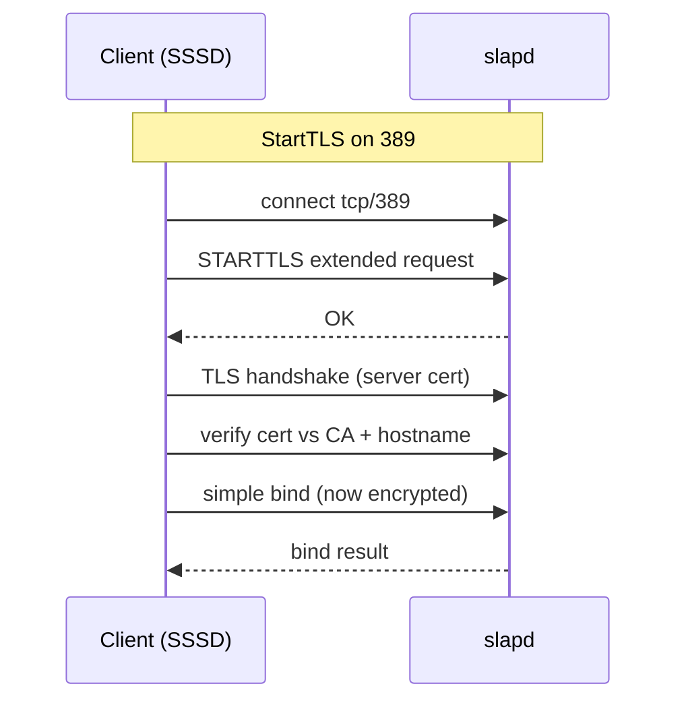

# LDAP over TLS

## Overview

By default OpenLDAP listens on **port 389 in cleartext** — simple binds send passwords unencrypted. Encrypting LDAP is mandatory for any production directory. There are two ways to do it: **StartTLS**, which upgrades an existing port-389 connection to TLS, and **LDAPS**, a dedicated TLS-from-the-start listener on **port 636**. Both use the same X.509 certificates; they differ only in how the TLS handshake begins.

This note covers issuing certificates, configuring `slapd` for TLS, and pointing clients at it. For the broader hardening picture, see [LDAP-Security-Hardening](LDAP-Security-Hardening.md); for the client files, see [LDAP-Client-Configuration](LDAP-Client-Configuration.md).

## Concepts

| | StartTLS | LDAPS |
|---|----------|-------|
| Port | 389 | 636 |
| Scheme | `ldap://` then `STARTTLS` | `ldaps://` |
| Handshake | Upgrade a plaintext connection | TLS immediately |
| Status | Recommended by RFC 4513 | Widely used, historically "deprecated" but common |
| slapd knob | Uses standard listener + TLS config | Add `ldaps:///` to listen URIs |

> [!IMPORTANT]
> Do **not** combine `ldaps://` (implicit TLS) with StartTLS on the same connection — that is a double handshake and will fail. Pick LDAPS **or** StartTLS per URI. Clients using `ldaps://192.168.1.200` must **not** also set `ldap_id_use_start_tls = true`.

### Certificate requirements

| Requirement | Detail |
|-------------|--------|
| Subject / SAN | Must match the hostname clients use (`ldap.armour.local`) — put it in **subjectAltName** |
| Trust chain | Clients must trust the issuing CA (distribute `ca.crt`) |
| Key protection | Private key `0600`, owned by the `slapd` runtime user (`ldap`/`openldap`) |
| Validity | Track expiry; an expired cert breaks every login at once |

## Architecture



## Configuration

### 1. Issue a CA and server certificate (lab / internal CA)

```bash
# Create an internal CA
openssl req -x509 -newkey rsa:4096 -sha256 -days 3650 -nodes \
  -keyout ca.key -out ca.crt \
  -subj "/O=Armour Local/CN=Armour Local Root CA"

# Server key + CSR with SAN
openssl req -newkey rsa:2048 -nodes \
  -keyout ldap.key -out ldap.csr \
  -subj "/O=Armour Local/CN=ldap.armour.local" \
  -addext "subjectAltName=DNS:ldap.armour.local"

# Sign the server cert with the CA
openssl x509 -req -in ldap.csr -CA ca.crt -CAkey ca.key -CAcreateserial \
  -days 825 -sha256 -out ldap.crt \
  -extfile <(printf "subjectAltName=DNS:ldap.armour.local")
```

### 2. Install certs and set ownership (RHEL paths)

```bash
sudo cp ca.crt ldap.crt /etc/openldap/certs/
sudo cp ldap.key /etc/openldap/certs/
sudo chown ldap:ldap /etc/openldap/certs/ldap.key
sudo chmod 600 /etc/openldap/certs/ldap.key
```

> [!NOTE]
> On Debian/Ubuntu the slapd user is **`openldap`** and certs conventionally live under `/etc/ldap/sasl2/` or `/etc/ssl/`. Adjust ownership to `openldap:openldap` and paths accordingly.

### 3. Point slapd at the certs via cn=config

```ldif
dn: cn=config
changetype: modify
replace: olcTLSCACertificateFile
olcTLSCACertificateFile: /etc/openldap/certs/ca.crt
-
replace: olcTLSCertificateFile
olcTLSCertificateFile: /etc/openldap/certs/ldap.crt
-
replace: olcTLSCertificateKeyFile
olcTLSCertificateKeyFile: /etc/openldap/certs/ldap.key
```

```bash
sudo ldapmodify -Y EXTERNAL -H ldapi:/// -f /root/tls.ldif
```

### 4. Enable the LDAPS listener (port 636)

Add `ldaps:///` to the slapd listen URIs.

```bash
# Debian / Ubuntu
sudo sed -i 's|^SLAPD_SERVICES=.*|SLAPD_SERVICES="ldap:/// ldapi:/// ldaps:///"|' /etc/default/slapd
```

```conf
# RHEL family: /etc/sysconfig/slapd
SLAPD_URLS="ldapi:/// ldap:/// ldaps:///"
```

```bash
sudo systemctl restart slapd
```

### 5. Open the firewall for 636

```bash
# firewalld (RHEL)
sudo firewall-cmd --add-service=ldaps --permanent
sudo firewall-cmd --reload
```

```bash
# ufw (Ubuntu)
sudo ufw allow 636/tcp
```

## Commands

### Client trust and enforcement — `ldap.conf`

```conf
TLS_CACERT   /etc/openldap/certs/ca.crt
TLS_REQCERT  demand
```

| `TLS_REQCERT` | Behaviour |
|---------------|-----------|
| `never` | No cert check — **insecure, defeats TLS** |
| `allow` | Check if presented, proceed on failure — insecure |
| `try` | Check, proceed only if no cert offered |
| `demand` / `hard` | Require a valid cert or abort — **use this** |

## Examples

### Verify LDAPS on 636

```bash
ldapsearch -x -H ldaps://ldap.armour.local -b dc=armour,dc=local -s base
```

### Verify StartTLS on 389

```bash
ldapsearch -x -ZZ -H ldap://ldap.armour.local -b dc=armour,dc=local -s base
```

> [!TIP]
> `-Z` requests StartTLS; **`-ZZ`** *requires* it and fails if the server can't negotiate TLS — use `-ZZ` in tests so a silent fallback to cleartext never passes.

### Inspect the served certificate

```bash
openssl s_client -connect ldap.armour.local:636 -showcerts </dev/null | openssl x509 -noout -dates -subject
```

Plausible output:

```text
notBefore=Jul 18 00:00:00 2026 GMT
notAfter=Oct 20 00:00:00 2028 GMT
subject=O = Armour Local, CN = ldap.armour.local
```

> [!NOTE]
> **📸 Screenshot**
> _Capture: Terminal output of openssl s_client showing the LDAP server certificate chain verifying against the Armour Local Root CA with matching CN ldap.armour.local_

## Best Practices

- Prefer **StartTLS on 389** for interoperability, but running **both** StartTLS and LDAPS is fine.
- Always populate **subjectAltName** with the exact hostname clients use — CN-only certs are rejected by modern clients.
- Set clients to **`TLS_REQCERT demand`** / `ldap_tls_reqcert = demand`; anything weaker invites MITM.
- Distribute the **CA certificate** to every client (and into the system trust store where practical).
- **Monitor expiry** and automate renewal; a lapsed cert is a fleet-wide outage.
- Disable weak protocols/ciphers with `olcTLSProtocolMin` and `olcTLSCipherSuite` (see [LDAP-Security-Hardening](LDAP-Security-Hardening.md)).

## Security Considerations

- Once TLS works, **require it**: set a `min_ssf` / reject unencrypted simple binds so no client can fall back to cleartext.
- Protect the **private key** (`0600`, slapd-user-owned); its compromise lets an attacker impersonate the directory.
- Enforce **TLS 1.2+** and drop SSLv3/TLS 1.0/1.1 per CIS/NIST guidance.
- `TLS_REQCERT never/allow` silently disables authentication of the server — treat its presence as a finding.

## Troubleshooting

| Error | Cause / fix |
|-------|-------------|
| `TLS: hostname does not match CN` | Missing/incorrect SAN; reissue with correct `subjectAltName` |
| `Can't contact LDAP server` on 636 | `ldaps:///` not in listen URIs, or firewall closed |
| `Connect error (-11)` with StartTLS | Cert/key path wrong or key unreadable by slapd user |
| Handshake failure | Client offers only TLS<1.2 while server requires 1.2+ |
| `ldap_start_tls: Operations error` | Already using `ldaps://` — don't StartTLS on top |

### Check slapd logs

```bash
journalctl -u slapd -e | grep -i tls
```

## References

- RFC 4513 — LDAP Authentication Methods and Security Mechanisms (StartTLS)
- OpenLDAP Admin Guide — Using TLS
- `man slapd-config` (olcTLS* attributes), `man ldap.conf`
- Mozilla Server Side TLS / NIST SP 800-52 Rev. 2 — TLS configuration guidance

## Related
- [Linux Administration & Server Hardening](../Readme.md) — Linux administration & server hardening hub
- [LDAP-Security-Hardening](LDAP-Security-Hardening.md) — enforcing TLS, ciphers, and min_ssf
- [LDAP-Client-Configuration](LDAP-Client-Configuration.md) — client CA trust and TLS_REQCERT
- [LDAP-Authentication](LDAP-Authentication.md) — why binds must run over TLS
