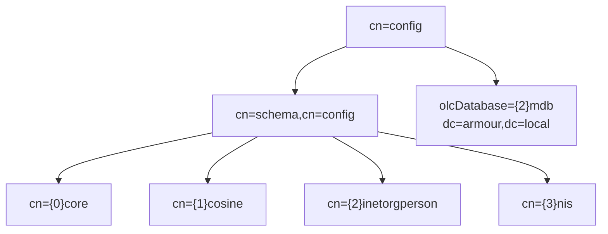

# LDIF Files and Schema

## Overview

**LDIF** (LDAP Data Interchange Format, RFC 2849) is the plain-text serialization used to add, modify, and delete directory entries and — crucially in modern OpenLDAP — to configure the server itself through the `cn=config` backend. **Schema** defines the objectClasses and attribute types that entries are allowed to use. Together they are how you both populate and administer an OpenLDAP directory.

This note is the reference for LDIF syntax and schema handling. For the tree it describes, see [LDAP-Directory-Structure](LDAP-Directory-Structure.md); for the full build, see [Ldap-Server-Setup](Ldap-Server-Setup.md).

## Concepts

### Two flavours of LDIF

| Flavour | Purpose | Applied with |
|---------|---------|--------------|
| **Content LDIF** | Full entries to create/load | `ldapadd`, `slapadd` |
| **Change LDIF** | A `changetype:` describing a modification | `ldapmodify` |

### Change types

| `changetype` | Effect |
|--------------|--------|
| `add` | Create a new entry |
| `modify` | Alter attributes of an existing entry (`add`/`replace`/`delete`) |
| `delete` | Remove an entry |
| `modrdn` | Rename / move an entry |

> [!IMPORTANT]
> LDIF is whitespace- and column-sensitive. A **leading space** on a line means *continuation of the previous line*. A **blank line separates entries**. Attribute/value is `name: value` (a single space after the colon); `name:: value` means the value is **base64-encoded** (used for binary data or values with leading spaces/non-ASCII).

## Architecture

### Schema as `cn=schema,cn=config`

In modern OpenLDAP the schema lives inside the running config backend, loaded from LDIF, not from static `.schema` includes.



> [!NOTE]
> Load order matters: `cosine` and `inetorgperson` depend on `core`; `nis` depends on `cosine`. Load them in dependency order or the add fails.

## Configuration

### Anatomy of a content-LDIF entry

```ldif
dn: uid=testuser1,ou=it,dc=armour,dc=local
objectClass: inetOrgPerson
objectClass: posixAccount
cn: Test User1
sn: User1
uid: testuser1
uidNumber: 1101
gidNumber: 1101
homeDirectory: /home/testuser1
loginShell: /bin/bash
```

| Line | Meaning |
|------|---------|
| `dn:` | Distinguished Name — first line of every entry |
| `objectClass:` | One per line; determines allowed/required attributes |
| `attr: value` | An attribute value; repeat the attr for multi-valued |
| blank line | Ends this entry |

## Commands

### Add / modify / delete

```bash
# Add entries from a content LDIF (authenticated bind)
ldapadd -x -D cn=admin,dc=armour,dc=local -W -f /root/base.ldif

# Apply a change LDIF
ldapmodify -x -D cn=admin,dc=armour,dc=local -W -f /root/change.ldif

# Delete a single entry
ldapdelete -x -D cn=admin,dc=armour,dc=local -W "uid=testuser1,ou=it,dc=armour,dc=local"
```

### Configure the server via cn=config

```bash
# Uses SASL EXTERNAL over the local root socket — no password on the wire
ldapmodify -Y EXTERNAL -H ldapi:/// -f /root/db_config.ldif
```

### Schema management

```bash
# Check which schemas are loaded
ldapsearch -Y EXTERNAL -H ldapi:/// -b cn=schema,cn=config dn

# Load shipped schemas (dependency order) — RHEL paths
ldapadd -Y EXTERNAL -H ldapi:/// -f /etc/openldap/schema/cosine.ldif
ldapadd -Y EXTERNAL -H ldapi:/// -f /etc/openldap/schema/nis.ldif
ldapadd -Y EXTERNAL -H ldapi:/// -f /etc/openldap/schema/inetorgperson.ldif
```

> [!NOTE]
> On Debian/Ubuntu the schema LDIFs live under `/etc/ldap/schema/`. The `.ldif` versions load into `cn=config`; the older `.schema` files are for the legacy static config only.

## Examples

### Modify: replace a database suffix and rootDN

```ldif
dn: olcDatabase={2}mdb,cn=config
changetype: modify
replace: olcSuffix
olcSuffix: dc=armour,dc=local

dn: olcDatabase={2}mdb,cn=config
changetype: modify
replace: olcRootDN
olcRootDN: cn=admin,dc=armour,dc=local

dn: olcDatabase={2}mdb,cn=config
changetype: modify
replace: olcRootPW
olcRootPW: {SSHA}rN1KA1XloARl8DMmhYW0i2QBlEEDdGeL
```

### Modify: add then delete an attribute value

```ldif
dn: uid=testuser1,ou=it,dc=armour,dc=local
changetype: modify
add: mail
mail: testuser1@armour.local
-
replace: loginShell
loginShell: /bin/zsh
-
delete: description
```

> [!TIP]
> Inside one `modify` entry, separate multiple operations with a line containing only a hyphen (`-`).

### Generate a hashed password for `userPassword`/`olcRootPW`

```bash
slappasswd -h {SSHA}
```

Plausible output:

```text
{SSHA}ypm0toBJ18/4ojMPlRjP15glbeG8Jxzq
```

### Base64 an awkward value by hand

```bash
printf '%s' 'value with leading space' | base64
```

## Best Practices

- Keep LDIF under **version control**; it is your directory-as-code and rollback source.
- Configure the server with **change LDIF against `cn=config`**, never by editing `slapd.d/*.ldif` directly (checksums will break slapd).
- Add **custom schema** as new files with your own OID arc; never edit shipped schema.
- Load schemas in **dependency order** (`core` → `cosine` → `inetorgperson` → `nis`).
- Use **`slapadd` (offline)** for bulk initial loads and **`ldapadd` (online)** for incremental changes.

## Security Considerations

- LDIF files frequently contain `userPassword`/`olcRootPW` hashes and bind passwords — store them **root-only (`0600`)** and shred temporary copies.
- Always store passwords **hashed** (`{SSHA}` minimum; `{ARGON2}` where supported) — never plaintext `userPassword`.
- Prefer **`ldapi:/// + EXTERNAL`** for config changes so the rootPW never traverses the network.
- Validate untrusted LDIF before loading; a crafted `changetype: modrdn` can move entries and alter ACL scope. See [LDAP-Security-Hardening](LDAP-Security-Hardening.md).

## Troubleshooting

| Error | Cause / fix |
|-------|-------------|
| `ldif_read_file: missing dn` | Blank line inside an entry, or bad indentation |
| `objectClass violation (65)` | Attribute not permitted by the entry's objectClasses |
| `undefined attribute type (17)` | Required schema not loaded yet |
| `Duplicate attribute` | Same attr/value listed twice in the entry |
| `olcSchemaConfig` write refused | Editing loaded schema — add new, don't mutate |

### Dump the live directory to LDIF

```bash
slapcat -b dc=armour,dc=local -l /root/backup-data.ldif
slapcat -n 0 -l /root/backup-config.ldif
```

## References

- RFC 2849 — The LDAP Data Interchange Format (LDIF)
- RFC 4512 — LDAP Directory Information Models (schema)
- OpenLDAP Admin Guide — Schema Specification & The cn=config backend
- `man slapd.access`, `man ldif`, `man slappasswd`

## Related
- [Linux Administration & Server Hardening](../Readme.md) — Linux administration & server hardening hub
- [LDAP-Directory-Structure](LDAP-Directory-Structure.md) — the entries LDIF creates
- [OpenLDAP-Overview](OpenLDAP-Overview.md) — cn=config and the slapd backends
- [Ldap-Server-Setup](Ldap-Server-Setup.md) — LDIF used to build dc=armour,dc=local
