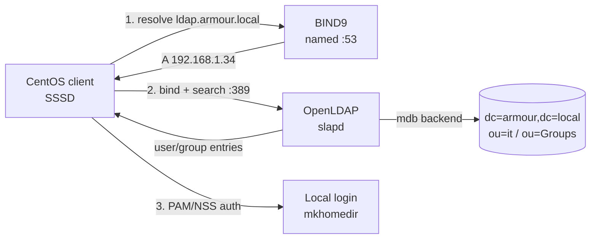

# Ldap Server Setup

## Overview

This note is an end-to-end, production-oriented walkthrough for standing up a centralized **directory and authentication service** on CentOS 9 using **OpenLDAP** (`slapd`) backed by a **BIND9** DNS zone. It covers the full lifecycle: hardening the host by disabling IPv6, providing forward name resolution for the LDAP domain, installing and provisioning the OpenLDAP backend (`cn=config` / `mdb`), loading the base directory tree and organizational units, creating user entries, and finally joining a CentOS client so it authenticates against the directory through **SSSD**.

The reference domain used throughout is `armour.local`, with the LDAP/DNS master at `192.168.1.34`.

> [!NOTE]
> LDAP (Lightweight Directory Access Protocol) provides a hierarchical, read-optimized store for identity data. Centralizing users, groups, and credentials here means a single source of truth for Linux, application, and network authentication instead of per-host `/etc/passwd` entries.

| Component | Role | Key package | Service |
|-----------|------|-------------|---------|
| BIND9 | Forward DNS for `armour.local` | `bind`, `bind-utils` | `named.service` |
| OpenLDAP server | Directory / auth backend | `openldap-servers` | `slapd.service` |
| OpenLDAP clients | CLI tooling (`ldapsearch`, `ldapadd`) | `openldap-clients` | — |
| SSSD (client host) | LDAP → PAM/NSS integration | `nss-pam-ldapd`, `sssd` | `sssd` |

## Architecture



## Disable IPv6

Disabling IPv6 removes an unused attack surface and avoids dual-stack binding ambiguity for `slapd` and `named` in an IPv4-only lab. Two approaches are shown — the GRUB method disables it at the kernel level (most complete), the `sysctl` method is runtime-tunable.

> [!WARNING]
> Only disable IPv6 if nothing on the host depends on it. Some services bind to `::1` by default; verify with `ss -tlnp` after applying.

### Kernel method (GRUB)

Edit the GRUB configuration:

```bash
vim /etc/default/grub
```

Add `ipv6.disable=1` to the `GRUB_CMDLINE_LINUX` line:

```bash
GRUB_CMDLINE_LINUX="ipv6.disable=1 ..."
```

Regenerate GRUB and reboot:

```bash
grub2-mkconfig -o /boot/grub2/grub.cfg
```

```bash
reboot
```

### Runtime method (sysctl)

Or disable via `sysctl`:

```bash
vim /etc/sysctl.conf
```

Add:

```conf
net.ipv6.conf.all.disable_ipv6 = 1
net.ipv6.conf.default.disable_ipv6 = 1
net.ipv6.conf.lo.disable_ipv6 = 1
```

Apply immediately:

```bash
sysctl -p
```

## Configure DNS Server With BIND9

LDAP relies on forward name resolution so clients can locate the directory master by name (`ldap.armour.local`). BIND9 is available in the CentOS repositories.

### Install BIND9

Install BIND and utilities:

```bash
yum install bind bind-utils -y
```

Enable and start the service:

```bash
systemctl enable named.service
```

```bash
systemctl start named.service
```

### Configure DNS Zone

Edit local configuration:

```bash
vim /etc/named.conf
```

Allow queries from your local network:

```conf
acl mynetwork {
	127.0.0.1;
	192.168.1.0/24;
	192.168.2.0/24;
};
```

Define a new zone:

```bash
vim /etc/named.rfc1912.zones
```

```conf
zone "armour.local" IN {
	type master;
	file "forward.armour.local";
	allow-update { none; };
};
```

Example zone file:

```bash
vim /var/named/forward.armour.local
```

```conf
$TTL 1D
@	IN SOA	ns1.armour.local. root.armour.local. (
					20250313	; serial
					3600		; refresh
					1800		; retry
					604800		; expire
					86400 )		; minimum
@			IN	NS	ns1.armour.local.
@			IN	NS	ns2.armour.local.
ns1			IN	A	192.168.1.34
ns2			IN	A	192.168.1.38
ldap			IN	A	192.168.1.34
armour.local.		IN	A	192.168.1.34
www			IN	CNAME	armour.local.
router			IN		A	192.168.1.1
emp1			IN		A	192.168.1.200
emp2			IN		A	192.168.1.201

; Mail exchange
@			IN		MX	10 mail.armour.local.
mail			IN		A	192.168.1.50

; Text record for SPF
@			IN		TXT	"v=spf1 mx a ~all"

; Additional Services
ftp			IN		CNAME	armour.local.
dev			IN		A	192.168.1.100
fileserver		IN		A	192.168.1.110
db			IN		A	192.168.1.120
test			IN		A	192.168.1.130
vpn			IN		A	192.168.1.140
git			IN		A	192.168.1.150
webapp			IN		A	192.168.1.160
logs			IN		A	192.168.1.170

```

> [!TIP]
> Bump the `serial` field on every zone edit (a `YYYYMMDDNN` convention works well). Secondaries and caches only refresh when the serial increases.

Set correct permissions:

```bash
chgrp named forward.armour.local
```

Restart BIND:

```bash
systemctl restart named.service
```

Allow DNS through the firewall:

```bash
firewall-cmd --add-service=dns --permanent
```

```bash
firewall-cmd --reload
```

## Configure LDAP Server

Install and provision the OpenLDAP server. Modern OpenLDAP stores its runtime configuration in the dynamic `cn=config` (OLC) tree rather than a static `slapd.conf`, so configuration changes are applied as LDIF modifications through `ldapmodify`.

### Install OpenLDAP Services

Install OpenLDAP server packages:

```bash
yum install openldap-servers openldap-clients -y
```

Inspect the installed package to learn its file, documentation, and config layout:

```bash
rpm -q openldap-servers
```

```bash
rpm -ql openldap-servers
```

```bash
rpm -qd openldap-servers
```

```bash
rpm -qc openldap-servers
```

| Flag | Query |
|------|-------|
| `-q` | Package version installed |
| `-ql` | List all files owned by the package |
| `-qd` | List documentation files |
| `-qc` | List configuration files |

Start and enable `slapd`:

```bash
systemctl enable slapd.service
```

```bash
systemctl start slapd.service
```

### Configure LDAP Backend

Generate a hashed root password. Record the resulting `{SSHA}` string — it goes into the config and base LDIFs below.

```bash
slappasswd
```

```text
{SSHA}rN1KA1XloARl8DMmhYW0i2QBlEEDdGeL
```

> [!IMPORTANT]
> Never store LDAP credentials in plaintext. `slappasswd` produces a salted `{SSHA}` hash; only the hash is written to LDIF files. Still, protect the LDIF files (`chmod 600`) and delete them after import — they contain the admin password hash.

Create a configuration LDIF that sets the database suffix, the manager DN, and the root password on the default `mdb` backend:

```bash
vim /root/db_config.ldif
```

Example:

```ldif
dn: olcDatabase={2}mdb,cn=config
changetype: modify
replace: olcSuffix
olcSuffix: dc=armour,dc=local

dn: olcDatabase={2}mdb,cn=config
changetype: modify
replace: olcRootDN
olcRootDN: cn=admin,dc=armour,dc=local

dn: olcDatabase={2}mdb,cn=config
changetype: modify
replace: olcRootPW
olcRootPW: {SSHA}rN1KA1XloARl8DMmhYW0i2QBlEEDdGeL
```

Apply the configuration using the `EXTERNAL` (root over `ldapi:///`) SASL mechanism:

```bash
ldapmodify -Y EXTERNAL -H ldapi:/// -f db_config.ldif
```

## Add Base Structure

With the suffix defined, seed the top of the directory tree — the domain object and the manager (`admin`) entry.

Create your base domain structure:

```bash
vim /root/base.ldif
```

```ldif
dn: dc=armour,dc=local
objectClass: top
objectClass: dcObject
objectClass: organization
o: Armour Local
dc: armour

dn: cn=admin,dc=armour,dc=local
objectClass: simpleSecurityObject
objectClass: organizationalRole
cn: admin
description: LDAP Manager
userPassword: {SSHA}rN1KA1XloARl8DMmhYW0i2QBlEEDdGeL
```

Add the structure:

```bash
ldapadd -x -D cn=admin,dc=armour,dc=local -W -f /root/base.ldif
```

### Check if NIS and cosine schemas are loaded

POSIX account attributes (`uidNumber`, `gidNumber`, `homeDirectory`, `loginShell`) require the `cosine`, `nis`, and `inetorgperson` schemas. Confirm which are present:

```bash
ldapsearch -Y EXTERNAL -H ldapi:/// -b cn=schema,cn=config dn
```

Look for outputs containing:

| Schema DN | Provides |
|-----------|----------|
| `cn=cosine` | Internet-oriented attributes (RFC 1274) |
| `cn=nis` | POSIX account/group attributes |
| `cn=inetorgperson` | `inetOrgPerson` object class (people entries) |

### Load missing schemas

**Manually add schemas** if needed:

```bash
ldapadd -Y EXTERNAL -H ldapi:/// -f /etc/openldap/schema/cosine.ldif
```

```bash
ldapadd -Y EXTERNAL -H ldapi:/// -f /etc/openldap/schema/nis.ldif
```

```bash
ldapadd -Y EXTERNAL -H ldapi:/// -f /etc/openldap/schema/inetorgperson.ldif
```

> [!NOTE]
> Load `cosine` before `nis` — the `nis` schema depends on attribute types defined in `cosine`. Loading out of order raises an "attribute type undefined" error.

## Create Organizational Units

Organizational Units (OUs) partition the tree into logical branches (departments, groups). Here `ou=it` holds people and `ou=Groups` holds group objects.

Create OUs for users and groups:

```bash
vim /root/ou.ldif
```

```ldif
dn: ou=it,dc=armour,dc=local
objectClass: organizationalUnit
ou: it

dn: ou=Groups,dc=armour,dc=local
objectClass: organizationalUnit
ou: Groups
```

Add OUs:

```bash
ldapadd -x -D cn=admin,dc=armour,dc=local -W -f /root/ou.ldif
```

## Add User To LDAP

Add user entries to the LDAP server. A POSIX-capable user combines `inetOrgPerson` (identity), `posixAccount` (UID/GID/home/shell), and `shadowAccount` (password aging) object classes.

### Manual User Creation

Create a user LDIF:

```bash
vim /root/testuser1.ldif
```

Generate a password hash for the user:

```bash
slappasswd
```

Example:

```ldif
dn: uid=testuser1,ou=it,dc=armour,dc=local
uid: testuser1
cn: testuser1
givenName: Test
sn: User
objectClass: inetOrgPerson
objectClass: posixAccount
objectClass: shadowAccount
userPassword: {SSHA}ypm0toBJ18/4ojMPlRjP15glbeG8Jxzq
loginShell: /bin/bash
uidNumber: 1101
gidNumber: 1101
homeDirectory: /home/testuser1
mail: testuser1@armour.local
```

Add the user:

```bash
ldapadd -x -D cn=admin,dc=armour,dc=local -W -f /root/testuser1.ldif
```

Verify the entry can bind (authenticate) with its own DN and password:

```bash
ldapwhoami -x -D "uid=testuser1,ou=it,dc=armour,dc=local" -W
```

## Testing And Restarting Services

Test your LDAP configuration and restart the service.

Validate the on-disk configuration (checks `cn=config` consistency):

```bash
slaptest
```

Restart OpenLDAP:

```bash
systemctl restart slapd.service
```

## Join LDAP Client

Configure a CentOS client machine to authenticate against the LDAP server. On modern CentOS/RHEL the client integration is handled by **SSSD**, wired into PAM and NSS by `authselect`.

> [!NOTE]
> **📸 Screenshot**
> _Capture: Terminal showing a successful getent passwd lookup returning the LDAP user testuser1 with its uid, gid, home directory and shell_

### Install Required Packages

Install the necessary packages:

```bash
dnf install nss-pam-ldapd openldap-clients -y
```

### Configure LDAP Client

Select the SSSD profile and enable automatic home-directory creation on first login:

```bash
authselect select sssd with-mkhomedir --force
```

Edit the SSSD configuration:

```bash
vim /etc/sssd/sssd.conf
```

Example configuration:

```conf
[domain/default]
id_provider = ldap
auth_provider = ldap
ldap_uri = ldap://192.168.1.200
ldap_search_base = dc=server,dc=local

[sssd]
services = nss, pam
domains = default

[nss]
homedir_substring = /home
```

> [!WARNING]
> `ldap_uri` and `ldap_search_base` above (`192.168.1.200`, `dc=server,dc=local`) are placeholders from a template. Point them at your actual directory master and suffix — for this build that is `ldap://192.168.1.34` and `dc=armour,dc=local`.

Set proper permissions — SSSD refuses to start if `sssd.conf` is group/world readable:

```bash
chmod 600 /etc/sssd/sssd.conf
```

Enable and start SSSD:

```bash
systemctl enable sssd
systemctl start sssd
```

Allow LDAP-related traffic on the firewall if needed.

### Verify Connection

Test LDAP user lookup through NSS:

```bash
getent passwd testuser1
```

A successful lookup returns the user's `passwd`-style line resolved from the directory, confirming the client is reading identities over LDAP.

## Security Considerations

> [!WARNING]
> A default OpenLDAP deployment listens on cleartext `ldap://` (389/tcp), so binds and searches — including passwords on simple binds — traverse the network unencrypted. Harden before any production use.

| Risk | Hardening measure |
|------|-------------------|
| Cleartext credentials on the wire | Enable **LDAPS (636/tcp)** or **StartTLS** with a proper CA-signed certificate; require TLS for user binds. |
| Anonymous enumeration | Restrict anonymous reads with `olcAccess` ACLs; expose only what clients need. |
| Password hash exposure | Deny read access to `userPassword` for all but `self` and the manager DN. |
| Credential material left on disk | `chmod 600` all LDIF files and delete them after import; never commit them to version control. |
| Overexposed service ports | Scope `firewalld` rules to trusted subnets (e.g. `192.168.1.0/24`) instead of opening 389/636 globally. |
| Weak account policy | Enforce the `ppolicy` overlay for lockout, complexity, and expiry; use `shadowAccount` aging attributes. |

These map to CIS Benchmark guidance on authentication services and NIST SP 800-53 controls IA-2 (identification/authentication) and SC-8 (transmission confidentiality).

## Troubleshooting

| Symptom | Likely cause | Action |
|---------|--------------|--------|
| `ldap_bind: Invalid credentials (49)` | Wrong DN or password hash mismatch | Re-run `slappasswd`, update the LDIF, reapply with `ldapmodify`. |
| `additional info: attribute type undefined` | Schema not loaded / loaded out of order | Load `cosine` before `nis`; confirm with the `ldapsearch` schema check. |
| `getent passwd testuser1` returns nothing | SSSD not reading the directory | Check `ldap_uri`/`ldap_search_base` in `sssd.conf`, `systemctl status sssd`, and `/var/log/sssd/`. |
| `slapd` fails to start after edits | Invalid `cn=config` | Run `slaptest` to pinpoint the offending entry. |
| Client cannot resolve `ldap.armour.local` | DNS zone/serial issue | `dig @192.168.1.34 ldap.armour.local`; bump zone serial and restart `named`. |
| SSSD won't start | `sssd.conf` permissions too open | `chmod 600 /etc/sssd/sssd.conf`. |

## References

- OpenLDAP Software Administrator's Guide — https://www.openldap.org/doc/admin26/
- Red Hat Enterprise Linux — Configuring authentication with SSSD and LDAP
- RFC 4511 (LDAP: The Protocol), RFC 2307 (NIS schema), RFC 4519 (schema for user apps)
- ISC BIND 9 Administrator Reference Manual

## Related

- [OpenLDAP-Overview](OpenLDAP-Overview.md) — concepts, components, and roles behind the `slapd` server
- [LDAP-Directory-Structure](LDAP-Directory-Structure.md) — DIT, DNs, and how OUs/entries are organized
- [LDIF-Files-and-Schema](LDIF-Files-and-Schema.md) — LDIF syntax and the schemas that define entries
- [LDAP-Authentication](LDAP-Authentication.md) — binds, SSSD/PAM integration, and client-side auth flow
- [Readme](../Readme.md) — LDAP-Server module index
- [Linux Administration & Server Hardening](../Readme.md) — Linux administration & server hardening hub
