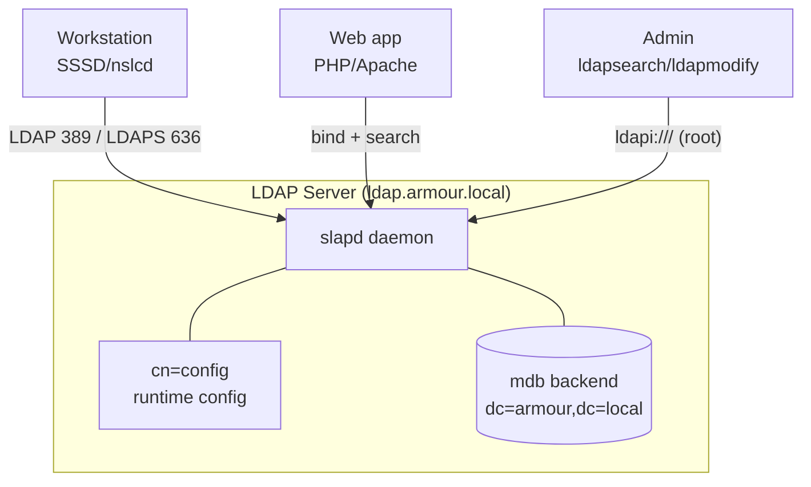

# OpenLDAP Overview

## Overview

**OpenLDAP** is the reference open-source implementation of the **Lightweight Directory Access Protocol (LDAP)** — a protocol for querying and modifying a hierarchical, network-accessible directory of objects (users, groups, hosts, services, certificates). It is the backbone of centralized identity on Linux/UNIX estates, providing a single authoritative source that many machines and applications authenticate and authorize against instead of maintaining local `/etc/passwd` accounts on each host.

This note orients you to the OpenLDAP project, its daemons, packages, and where files live on both major distribution families. For a full hands-on build, see [Ldap-Server-Setup](Ldap-Server-Setup.md).

> [!NOTE]
> LDAP is a **protocol**, not a database product. OpenLDAP is one implementation; others include 389 Directory Server, Microsoft Active Directory, Apache Directory Server, and OpenDJ. All speak LDAP on TCP **389** (plain/StartTLS) and **636** (LDAPS).

## Concepts

| Term | Meaning |
|------|---------|
| **DIT** | Directory Information Tree — the hierarchical namespace of entries |
| **Entry** | A single record identified by a Distinguished Name (DN) |
| **DN** | Distinguished Name, e.g. `uid=testuser1,ou=it,dc=armour,dc=local` |
| **RDN** | Relative DN — the left-most component of a DN (`uid=testuser1`) |
| **Attribute** | A typed name/value pair on an entry (`mail: user@armour.local`) |
| **objectClass** | Template defining which attributes an entry may/must have |
| **Schema** | Collection of objectClasses and attribute definitions |
| **Suffix / Base DN** | Root of your directory (`dc=armour,dc=local`) |
| **slapd** | The standalone LDAP daemon (the server) |
| **cn=config** | The live, runtime configuration backend (OLC) |

> [!IMPORTANT]
> Modern OpenLDAP (2.3+) configures the server through the **dynamic `cn=config` backend (OLC / "slapd.d")**, not the legacy static `slapd.conf`. Configuration changes are applied online with `ldapmodify` against `ldapi:///` and take effect without a restart. See [LDIF-Files-and-Schema](LDIF-Files-and-Schema.md).

## Architecture

OpenLDAP ships several components; on a server you primarily run `slapd`.

| Component | Role |
|-----------|------|
| `slapd` | Standalone LDAP daemon — serves and stores the directory |
| `slapd.d` / `cn=config` | Runtime configuration database (replaces `slapd.conf`) |
| **mdb** (LMDB) | Default high-performance memory-mapped backend database |
| **hdb/bdb** | Legacy Berkeley DB backends (deprecated, avoid) |
| `ldap*` client tools | `ldapsearch`, `ldapadd`, `ldapmodify`, `ldapdelete`, `ldappasswd`, `ldapwhoami` |
| `slap*` admin tools | `slapcat`, `slapadd`, `slapindex`, `slaptest`, `slappasswd` |



## Configuration

### File and path layout

| Item | Debian / Ubuntu | RHEL / CentOS / Rocky / Alma |
|------|-----------------|------------------------------|
| Server package | `slapd` | `openldap-servers` |
| Client package | `ldap-utils` | `openldap-clients` |
| Config backend | `/etc/ldap/slapd.d/` | `/etc/openldap/slapd.d/` |
| Data directory | `/var/lib/ldap/` | `/var/lib/ldap/` |
| Schema files | `/etc/ldap/schema/` | `/etc/openldap/schema/` |
| Client config | `/etc/ldap/ldap.conf` | `/etc/openldap/ldap.conf` |
| Service unit | `slapd.service` | `slapd.service` |

## Commands

### Install the server and client tooling

```bash
# Debian / Ubuntu
sudo apt update
sudo apt install slapd ldap-utils -y
sudo dpkg-reconfigure slapd     # interactive base DN / admin password
```

```bash
# RHEL / CentOS / Rocky / Alma
sudo dnf install openldap-servers openldap-clients -y
sudo systemctl enable --now slapd.service
```

### Inspect package contents (RHEL)

```bash
rpm -q openldap-servers      # is it installed?
rpm -ql openldap-servers     # list files
rpm -qc openldap-servers     # config files
```

### Service management

```bash
systemctl status slapd.service
systemctl enable --now slapd.service
journalctl -u slapd.service -e
```

## Examples

### Confirm slapd is listening

```bash
ss -tlnp | grep -E ':389|:636'
```

Plausible output:

```text
LISTEN 0  128  0.0.0.0:389  0.0.0.0:*  users:(("slapd",pid=812,fd=8))
```

### Anonymous root-DSE query (server sanity check)

```bash
ldapsearch -x -H ldap://localhost -s base -b "" namingContexts
```

```text
namingContexts: dc=armour,dc=local
```

### Read the running configuration

```bash
sudo ldapsearch -Y EXTERNAL -H ldapi:/// -b cn=config dn
```

> [!NOTE]
> **📸 Screenshot**
> _Capture: Terminal showing ldapsearch output listing the cn=config DIT with olcDatabase entries for frontend, config, and mdb backends_

## Best Practices

- Use the **mdb (LMDB)** backend — bdb/hdb are removed in current releases.
- Manage config through **`cn=config`** online; never hand-edit files under `slapd.d/`.
- Give the directory a stable **base DN** derived from a domain you control (`dc=armour,dc=local`).
- Keep **schema** additive — never delete or mutate a shipped schema in production.
- Separate the **admin (rootDN)** identity used for management from application service-bind accounts.
- Back up with `slapcat` on a schedule (see Troubleshooting).

## Security Considerations

- LDAP on port **389 is cleartext by default** — binds transmit passwords in the clear. Deploy TLS before any real use; see [LDAP-over-TLS](LDAP-over-TLS.md) and [LDAP-Security-Hardening](LDAP-Security-Hardening.md).
- Restrict who may read `userPassword` and other sensitive attributes via **ACLs (olcAccess)**.
- Disable **anonymous binds** for write and limit anonymous read scope.
- The **rootDN bypasses ACLs** — protect its credentials and prefer `ldapi:///` + `EXTERNAL` (root socket auth) for administration instead of exposing rootPW over the network.

## Troubleshooting

| Symptom | Check |
|---------|-------|
| `ldap_bind: Invalid credentials (49)` | Wrong bind DN or password; verify with `ldapwhoami` |
| `Can't contact LDAP server (-1)` | `slapd` down, firewall, or wrong `-H` URI |
| Config change ignored | You edited `slapd.conf` — modern builds use `cn=config` |
| Schema load fails | Missing dependency schema (load `cosine` before `nis`) |

### Validate configuration offline

```bash
sudo slaptest -u          # RHEL path implied; syntax-check config
```

### Back up config and data (LDIF export)

```bash
sudo slapcat -n 0 -l /root/config.ldif      # cn=config
sudo slapcat -n 2 -l /root/data.ldif        # mdb data (DB number may vary)
```

## References

- OpenLDAP Software 2.6 Administrator's Guide — https://www.openldap.org/doc/admin26/
- RFC 4510–4519 — LDAP technical specification road map
- Red Hat Enterprise Linux — Configuring OpenLDAP
- Ubuntu Server Guide — OpenLDAP Server

## Related
- [Linux Administration & Server Hardening](../Readme.md) — Linux administration & server hardening hub
- [Ldap-Server-Setup](Ldap-Server-Setup.md) — full end-to-end OpenLDAP build on CentOS
- [LDAP-Directory-Structure](LDAP-Directory-Structure.md) — DIT, DNs, objectClasses and naming
- [LDIF-Files-and-Schema](LDIF-Files-and-Schema.md) — LDIF syntax and schema management
- [LDAP-over-TLS](LDAP-over-TLS.md) — encrypting slapd traffic with TLS/LDAPS
