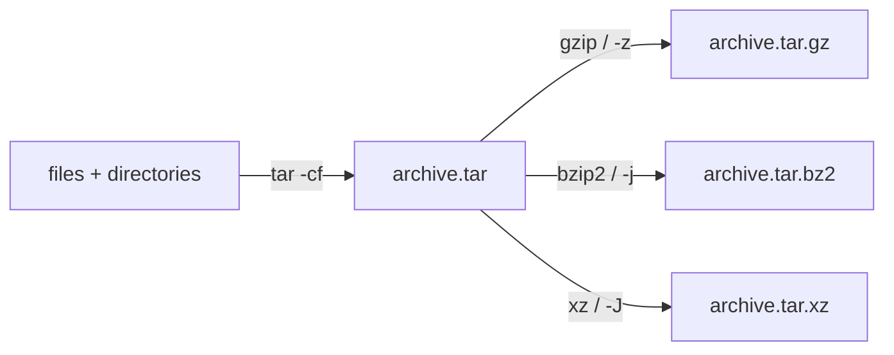

# Compress and Archive

## Overview

On Linux, **archiving** and **compression** are two distinct operations that are often combined:

- **Archiving** bundles many files and directories into a single file while preserving structure, permissions, and timestamps. `tar` is the classic archiver.
- **Compression** shrinks data using an algorithm to save disk space and transfer time. `gzip`, `bzip2`, and `xz` compress a *single* stream or file; `zip` and `7z` do both archiving and compression at once.

Understanding which tool does what — and how they pair together (for example `tar` + `gzip` → `.tar.gz`) — is fundamental to managing backups, distributing software, and rotating logs on a server.

## Concepts

| Tool | Role | Algorithm | Typical Extension | Notes |
|------|------|-----------|-------------------|-------|
| `tar` | Archive only | none (by itself) | `.tar` | Preserves permissions, ownership, structure |
| `gzip` / `gunzip` | Compress single file | DEFLATE | `.gz` | Fast, ubiquitous |
| `bzip2` / `bunzip2` | Compress single file | Burrows-Wheeler | `.bz2` | Better ratio than gzip, slower |
| `xz` | Compress single file | LZMA2 | `.xz` | Best ratio, slowest, most memory |
| `zip` / `unzip` | Archive + compress | DEFLATE | `.zip` | Cross-platform, supports passwords |
| `7z` / `7za` | Archive + compress | LZMA | `.7z` | Excellent ratio, supports passwords |



> [!NOTE]
> The commands in this note use `yum install …`, reflecting a RHEL/CentOS environment. On Debian/Ubuntu the equivalent is `apt install …` (for example `apt install bzip2 gzip zip unzip p7zip-full`).

## bzip2

- Install bzip2:  Installs the bzip2 package to enable `.bz2` compression.

```bash
yum install bzip2
```

- Compress a single file: Compresses `filename` using the Burrows-Wheeler algorithm.

```bash
bzip2 filename
```

- Compress multiple files: Compresses multiple files at once.

```bash
bzip2 file1 file2 file3
```

- Verbose compression: Shows detailed output during compression.

```bash
bzip2 -v messages3
```

- Compress the `cron` and `firewalld` files using bzip2:

```bash
bzip2 cron firewalld
```

- Compress all files in the `/root/Downloads/log` directory:

```bash
bzip2 /root/Downloads/log/*
```

- Compress only `.txt` files in `/root/data/`:

```bash
bzip2 /root/data/*.txt
```

- Compress all files ending in `.log` in the current directory:

```bash
bzip2 *.log
```

- Compress files whose names begin with the letter `s`:

```bash
bzip2 s*
```

- Compress every file in the current directory:

```bash
bzip2 *
```

- Compress every file in the current directory, displaying verbose output:

```bash
bzip2 -v *
```

> [!WARNING]
> By default `bzip2` and `gzip` **replace** the original file with the compressed version (and vice versa on decompression). Use `-k` (`--keep`) to retain the original.

## bunzip2

- Decompress `filename.bz2`:

```bash
bunzip2 filename.bz2
```

- Decompress all `.bz2` files in `/root/Downloads/log`:

```bash
bunzip2 /root/Downloads/log/*
```

- Decompress all `.bz2` files in `/root/data/` that start with `ip`:

```bash
bunzip2 /root/data/ip*
```

- Decompress `messages1.bz2` and `messages2.bz2` at the same time:

```bash
bunzip2 messages1.bz2 messages2.bz2
```

- Decompress every `.bz2` file that starts with `messages`:

```bash
bunzip2 messages*
```

- Decompress every `.log.bz2` file in the current directory:

```bash
bunzip2 *.log.bz2
```

- Decompress every `.bz2` file:

```bash
bunzip2 *.bz2
```

- Decompress all `.bz2` files that start with `s`:

```bash
bunzip2 s*
```

- Decompress every `.bz2` file in the current directory:

```bash
bunzip2 *
```

## Gzip

- Installs gzip for `.gz` compression.

```bash
yum install gzip
```

- Compress a single file: Creates `.gz` file from a single file.

```bash
gzip filename
```

- Compress `messages2` into `messages2.gz`:

```bash
gzip messages2
```

- Compress `messages3` and `messages4` into separate `.gz` files:

```bash
gzip messages3 messages4
```

- Compress every `.log` file:

```bash
gzip *.log
```

- Compress every file in the current directory that starts with `s`:

```bash
gzip s*
```

- Compress every file in the current directory:

```bash
gzip *
```

- Compress `file1`, `file2`, and `file3` into separate `.gz` files:

```bash
gzip file1 file2 file3
```

- Verbose compression: Shows progress during compression.

```bash
gzip -v messages-2
```

- Recursively compress all files in the `log/` directory:

```bash
gzip -r log/
```

- Recursively compress all files in the `log/` directory with verbose output:

```bash
gzip -vr log/
```

## Gunzip

- Decompress `filename.gz` back to its original file:

```bash
gunzip filename.gz
```

- Decompress `messages3.gz`:

```bash
gunzip messages3.gz
```

- Decompress `messages.gz` and `lastlog.gz` in one command:

```bash
gunzip messages.gz lastlog.gz
```

- Decompress all `.log.gz` files in the current directory with verbose output:

```bash
gunzip -v *.log.gz
```

- Decompress every `.log.gz` file in the current directory:

```bash
gunzip *.log.gz
```

- Decompress every `.gz` file in the current directory:

```bash
gunzip *
```

- Recursively decompress all `.gz` files within the `log/` directory:

```bash
gunzip -r log/
```

- Recursively decompress all `.gz` files within the `log/` directory with verbose output:

```bash
gunzip -vr log/
```

- Compress all files in the `/root/data/` directory:

```bash
gzip /root/data/*
```

- Decompress all `.gz` files in the `/root/data/` directory:

```bash
gunzip /root/data/*
```

- Compress all files in `/root/data/` starting with `ip`:

```bash
gzip /root/data/ip*
```

- Decompress all `.gz` files in `/root/data/` starting with `ip`:

```bash
gunzip /root/data/ip*
```

- Recursively compress all files in the `/root/data/` directory and its subdirectories:

```bash
gzip -r /root/data/
```

- Recursively decompress all `.gz` files in the `/root/data/` directory and its subdirectories:

```bash
gunzip -r /root/data/
```

## Zip

- Installs zip tool.

```bash
yum install zip
```

- Create a ZIP archive `messages.zip` containing `messages3`:

```bash
zip messages.zip messages3
```

- Create a ZIP archive `messages-all.zip` containing `messages4`, `messages5`, and `messages6`:

```bash
zip messages-all.zip messages4 messages5 messages6
```

- Create a ZIP archive `log.zip` containing all `.log` files in the current directory:

```bash
zip log.zip *.log
```

- Create a ZIP archive `files1.zip` containing all files starting with `b`, with verbose output:

```bash
zip -v files1.zip b*
```

- Create a ZIP archive `all-files.zip` containing all files in the current directory:

```bash
zip all-files.zip *
```

- Recursively create a ZIP archive `log.zip` containing the entire `log` directory:

```bash
zip -r log.zip log/
```

- Create a ZIP archive `filename.zip` containing the file `filesname`:

```bash
zip filename.zip filesname
```

- Create a ZIP archive `filename.zip` containing `file1`, `file2`, and `file3`:

```bash
zip filename.zip file1 file2 file3
```

- View zip archive information: Lists details about `.zip` contents.

```bash
zipinfo messages-all.zip
```

```bash
zipinfo log.zip
```

## Unzip

- Installs unzip tools.

```bash
yum install unzip
```

- Extract the contents of `messages.zip` into the current directory:

```bash
unzip messages.zip
```

- Extract the contents of `messages-all.zip` into the current directory:

```bash
unzip messages-all.zip
```

- Extract the contents of `messages-all.zip` into the directory `mes`:

```bash
unzip messages-all.zip -d mes
```

- Extract the contents of `log.zip` into the `/tmp/` directory:

```bash
unzip -d /tmp/ log.zip
```

- Extract the contents of `log.zip` into the current directory:

```bash
unzip log.zip
```

- Extract all `.zip` files in the current directory:

```bash
unzip *.zip
```

## 7z (7-Zip)

- Install the 7-Zip archiving tool (via EPEL repository).

```bash
yum install epel-release.noarch
```

```bash
yum install p7zip p7zip-plugins
```

- Show usage help: Displays help and usage options.

```bash
7za --help
```

- Create an archive named `messages.7z` containing the `messages` file/directory:

```bash
7za a messages.7z messages
```

- Create an archive `messages-files.7z` containing `messages5`, `messages6`, `messages7`, and `messages8`:

```bash
7za a messages-files messages5 messages6 messages7 messages8
```

- Create an archive `logfiles.7z` containing all `.log` files in the current directory:

```bash
7za a logfiles.7z *.log
```

- Create an archive `log.7z` containing the `log/` directory:

```bash
7za a log.7z log/
```

- Create an archive `files.7z` containing all files and directories in the current directory starting with `b`:

```bash
7za a files.7z b*
```

- Create an archive `log.7z` containing the `log` directory:

```bash
7za a log.7z log
```

- Create an archive `Downloads.7z` by recursively archiving the `/root/Downloads/` directory:

```bash
7za a Downloads.7z -r /root/Downloads/
```

- The `7za` command is a standalone version of 7-Zip that works with a limited set of compression formats. The following command lists the contents of the archive file `logfiles.7z`:

```bash
7za l logfiles.7z
```

- Similarly, to view the contents of another archive named `log.7z`:

```bash
7za l log.7z
```

- The `7za` command is a more complete tool, supporting additional compression formats. To list the contents of `messages.7z`:

```bash
7za l messages.7z
```

- To view the contents of `data.7z`:

```bash
7z l data.7z
```

- You can also list the contents of multiple `.7z` archives at once:

```bash
7z l *.7z
```

- Or, if you have archives in different directories:

```bash
7z l /path/to/directory/*.7z
```

- Extract Files From `messages.7z` Using 7za

```bash
7za e messages.7z
```

- Extract `log.7z` To A Subdirectory Named `log`

```bash
7za e -olog log.7z
```

- Extract `log.7z` To Current Directory

```bash
7za e log.7z
```

- Explanation Of The `e` Command

	- `e` stands for extract.

	- It does not preserve directory structure.

	- Use `-o<dir>` to specify the output directory.

```bash
7za e archive.7z -o output_dir
```

> When To Use `e` vs `x`
> - Use `e` (extract) when:
>
>    - You want a flat output (no subfolders).
>
>    - You're extracting a simple archive with only files.
>
>- Use `x` (extract with full paths) when:
>
> - You want to preserve the directory structure inside the archive.

- Example using `x`:

```bash
7za x archive.7z
```

- Extract with directory structure: Keeps folder structure during extraction.

```bash
7za x log.7z
```

```bash
7z x log.7z
```

- Test archive integrity: Verifies archive integrity.

```bash
7za t log.7z
```

```bash
7z t mess.7z
```

## Tar

The `tar` command in Linux is used to archive files and directories. By default, it does not compress them (you can add compression options later like `-z` for gzip or `-j` for bzip2). Here, we’re using the `-c` (create), `-v` (verbose), and `-f` (file name) options.

- Display help:  Lists tar’s options and usage.

```bash
tar --help
```

- Create An Archive Named `messages.tar` Containing The `messages` File Or Directory

```bash
tar -cvf messages.tar messages
```

> - `-c`: create a new archive.
> - `-v`: verbose output showing the files being archived.
> - `-f messages.tar`: specifies the archive file name.
> - `messages`: the directory to include in the archive.

- Create An Archive Containing Multiple Directories

```bash
tar -cvf messages-files.tar messages2 messages3 messages4 messages5
```

- Create An Archive Of A Directory Named `log`

```bash
tar -cvf log.tar log/
```

- Create An Archive Using Wildcards

```bash
tar -cvf log.tar *.log
```

- This creates an archive called `archive.tar` from the specified directory.

```bash
tar -cvf archive.tar /path/to/directory
```

```bash
tar -cvf Downloads.tar /root/Downloads/
```

- Create Gzip-Compressed Archive Of `messages4`

```bash
tar -czvf messages4.tgz messages4
```

> - `-c`: create a new archive.
> - `-z`: compress using gzip.
> - `-v`: show progress while archiving.
> - `-f messages4.tgz`: output archive filename.
> - `messages4`: the directory to archive.
> - The `.tgz` extension is commonly used as a shorthand for `.tar.gz` archives.

- Create Bzip2-Compressed Archive Of `messages5`

```bash
tar -cjvf messages5.tbz messages5
```

> - `-j`: compress using bzip2.
> - `.tbz` is often used as an alternative to `.tar.bz2`.

- Create Bzip2-Compressed Archive Of The `log` Directory

```bash
tar -cjvf log.tbz log/
```

- Create Gzip-Compressed Archive Of The `log` Directory

```bash
tar -czvf log.tgz log/
```

- Create A Bzip2-Compressed Archive Of A Single File

```bash
tar -cjvf filename.tbz file
```

- Create A Gzip-Compressed Archive Of A Single File

```bash
tar -czvf filename.tgz file
```

> Explanation Of Compression Options
> - `-z`: Use gzip compression, produces `.tar.gz` or `.tgz` archives.
> - `-j`: Use bzip2 compression, produces `.tar.bz2` or `.tbz` archives.
> - `-J`: Use xz compression, produces `.tar.xz` archives (more modern and highly compressed).

- You can view the contents of a compressed archive without extracting it:

```bash
tar -tzvf archive.tgz
```

- or

```bash
tar -tjvf archive.tbz
```

- Extract a gzip-compressed archive:

```bash
tar -xzvf archive.tgz
```

- Extract a bzip2-compressed archive:

```bash
tar -xjvf archive.tbz
```

> Extract `messages-files.tar`

```bash
tar -xvf messages-files.tar
```

> - `-x`: extract the contents.
> - `-v`: show progress.
> - `-f messages-files.tar`: the archive to extract.

- Extracts the entire contents of the `log.tar` archive into the current directory.

```bash
tar -xvf log.tar
```

- Extracts everything in `messages.tar` to the current location.

```bash
tar -xvf messages.tar
```

- Extracts files from `filename.tar` into the current directory.

```bash
tar -xvf filename.tar
```

- Extracts the `data.tar` archive.

```bash
tar -xvf data.tar
```

- Extract A Gzip-Compressed Archive: `filename.tgz`

```bash
tar -xzvf filename.tgz
```

> - `-z`: decompress with gzip.
> - Extracts `filename.tgz` and recreates the directory structure within.

- Extract A Bzip2-Compressed Archive: `filename.tbz`

```bash
tar -xjvf filename.tbz
```

> - `-j`: decompress with bzip2.
> - Extracts `filename.tbz` archive’s contents.

- Extract A `.tar.gz` Archive: `data.tar.gz`, Even though it has the `.tar.gz` extension, the same `-z` option applies to handle gzip compression.

```bash
tar -xzvf data.tar.gz
```

### Explanation Of Extraction Options

| Option | Description                                               |
|--------|-----------------------------------------------------------|
| -x     | Extract files from the archive                            |
| -v     | Verbose mode: show the extracted files                    |
| -f     | Specify the archive file name                             |
| -z     | Decompress with gzip (for `.tgz` or `.tar.gz` files)      |
| -j     | Decompress with bzip2 (for `.tbz` or `.tar.bz2` files)    |
| -J     | Decompress with xz (for `.tar.xz` files)                  |

- Extract a gzip-compressed tar archive:

```bash
tar -xzvf archive.tar.gz
```

- Extract a bzip2-compressed tar archive:

```bash
tar -xjvf archive.tar.bz2
```

- Extract an xz-compressed tar archive:

```bash
tar -xJvf archive.tar.xz
```

- To extract to a directory other than the current one:

```bash
tar -xvf archive.tar -C /path/to/directory
```

> - `-C /path/to/directory` tells `tar` where to extract the files.

- Check file type:  Identify file type to avoid confusion.

```bash
file messages1.tar
```

- Decompress compressed tar files separately:  Uncompress before extracting.

```bash
gunzip file.tar
bunzip2 data.tar.bz2
```

### Using bzip2 for Compression

- Create a tar archive named `log.tar` containing the `log` directory.

```bash
tar -cvf log.tar log
```

- Compress the `log.tar` file using bzip2.

```bash
bzip2 log.tar
```

> Output: `log.tar.bz2`.

- Decompress the `log.tar.bz2` file.

```bash
bunzip2 log.tar.bz2
```

> Output: `log.tar`.

- Extract the contents of the `log.tar` archive.

```bash
tar -xvf log.tar
```

### Using gzip for Compression

- Create a tar archive named `log.tar` containing the `log` directory.

```bash
tar -cvf log.tar log
```

- Compress the `log.tar` file using gzip.

```bash
gzip log.tar
```

> Output: `log.tar.gz`.

- Decompress the `log.tar.gz` file.

```bash
gunzip log.tar.gz
```

> Output: `log.tar`.

- Extract the contents of the `log.tar` archive.

```bash
tar -xvf log.tar
```

## Quick Summary Table

| Tool        | File Type            | Compression Algorithm | Typical Extension         | Example Command (Create)                               | Example Command (Extract)                           | Example Command (Password-Protected Extract)      |
|-------------|----------------------|-----------------------|---------------------------|--------------------------------------------------------|-----------------------------------------------------|--------------------------------------------------|
| `tar`       | Archive only         | None                  | `.tar`                    | `tar -cvf archive.tar directory/`                      | `tar -xvf archive.tar`                              | *(no built-in password support)*                 |
| `tar+gzip`  | Compressed archive   | gzip                  | `.tar.gz`, `.tgz`         | `tar -czvf archive.tgz directory/`                     | `tar -xzvf archive.tgz`                             | *(no built-in password support)*                 |
| `tar+bzip2` | Compressed archive   | bzip2                 | `.tar.bz2`, `.tbz`        | `tar -cjvf archive.tbz directory/`                     | `tar -xjvf archive.tbz`                             | *(no built-in password support)*                 |
| `tar+xz`    | Compressed archive   | xz                    | `.tar.xz`                 | `tar -cJvf archive.tar.xz directory/`                  | `tar -xJvf archive.tar.xz`                          | *(no built-in password support)*                 |
| `gzip`      | Single file          | gzip                  | `.gz`                     | `gzip filename`                                        | `gunzip filename.gz`                                | *(no built-in password support)*                 |
| `bzip2`     | Single file          | bzip2                 | `.bz2`                    | `bzip2 filename`                                       | `bunzip2 filename.bz2`                              | *(no built-in password support)*                 |
| `zip`       | Archive + compression| deflate               | `.zip`                    | `zip archive.zip file1 file2`                          | `unzip archive.zip`                                 | `unzip archive.zip` → prompts for password       |
| `7z`        | Archive + compression| LZMA                  | `.7z`                     | `7z a archive.7z directory/`                           | `7z x archive.7z`                                    | `7z x -pSECRET archive.7z`                       |

## Password Protection and Encryption

-  Tools like `zip` and `7z` **support password protection** directly:

- `zip -e archive.zip file1 file2` → prompts for a password interactively.

- `7z a -pSECRET archive.7z directory/` → password is `SECRET`.

- `tar`, `gzip`, `bzip2`, and `xz` **do not have built-in password protection**.

> Instead, to protect `tar` archives, you might:

- Use a tool like `gpg` or `openssl` to encrypt:

```bash
tar -czf archive.tgz directory/ && gpg -c archive.tgz
```

- Or use `zip`/`7z` if you want both compression and password protection.

> [!WARNING]
> Legacy ZIP encryption (ZipCrypto) is cryptographically weak and easily cracked. For real confidentiality, prefer AES-256 (`7z -mhe=on` for header encryption, or `zip` implementations supporting AES) or encrypt with `gpg`/`openssl`. Never pass a password inline as `-pSECRET` on a shared host — it appears in the process list and shell history.

## Best Practices

- Choose the algorithm by workload: `gzip` for speed (log rotation, quick transfers), `xz` for maximum ratio (long-term archives, distribution), `bzip2` as a middle ground.
- Use `tar`'s built-in compression flags (`-z`, `-j`, `-J`) rather than piping through a separate compressor — it is simpler and produces the standard `.tar.gz` / `.tar.bz2` / `.tar.xz` layout.
- Verify an archive after creating it (`tar -tzvf archive.tgz`, `7z t archive.7z`, `unzip -t archive.zip`) before deleting the originals.
- Prefer relative paths inside archives; extracting archives built with absolute paths can overwrite unexpected locations.
- Keep the `-k` (keep) habit with `gzip`/`bzip2` when you need the original file to survive.

## Security Considerations

- **Path traversal / "tar slip":** Extracting untrusted archives can write files outside the target directory if they contain `../` or absolute paths. Inspect first with `tar -tvf`, extract into a dedicated empty directory, and use GNU tar's protections (it strips leading `/` by default and refuses `..` traversal in modern versions).
- **Decompression bombs:** A tiny archive can expand to fill the disk (a "zip bomb"). Be cautious extracting archives from untrusted sources; monitor available space.
- **Confidentiality:** `tar`/`gzip`/`bzip2`/`xz` provide no encryption — anyone who obtains the file reads the contents. Encrypt sensitive archives with `gpg` or use AES-based `7z`/`zip`.
- **Metadata leakage:** Archives preserve ownership, timestamps, and full paths, which can reveal usernames and directory structure. Review before sharing externally.

## Troubleshooting

| Symptom | Likely Cause | Resolution |
|---------|--------------|------------|
| `tar: Refusing to read archive contents from terminal` | Missing `-f` or wrong argument order | Always specify the archive with `-f archive.tar` |
| `gzip: file already exists` | Target output already present | Use `-f` to force, or remove/rename the existing file |
| `unzip: cannot find zipfile directory` | Corrupt or truncated ZIP | Re-download; test with `unzip -t`; try `zip -FF` to repair |
| `7za`/`7z: command not found` | p7zip not installed | Install `p7zip` (and `p7zip-plugins` / `p7zip-full`) |
| Archive extracts with wrong/no directory structure | Used `7za e` (flat) instead of `x` | Use `7z x` to preserve full paths |
| Disk fills during extraction | Decompression bomb or huge archive | Check `df -h`; extract selectively; verify source trust |

## References

- `man 1 tar`, `man 1 gzip`, `man 1 bzip2`, `man 1 xz`, `man 1 zip`, `man 1 7z` — utility manual pages.
- GNU Tar Manual — [Basic Tar Operations](https://www.gnu.org/software/tar/manual/html_node/Tutorial.html).
- CVE-2007-4559 — Python `tarfile` directory-traversal ("tar slip"); illustrates the path-traversal risk when extracting untrusted archives.

## Related
- [Find-Command](../String-Processing-and-Finding-Files/Find-Command.md) — locate files to feed into archives
- [Disk-Management](../File-System-and-Disk-Management/Disk-Management.md) — manage space freed by compression
- [Standard-Data-Streams](Standard-Data-Streams.md) — pipe tar/gzip streams
- [Linux Administration & Server Hardening](../Readme.md) — Linux administration & server hardening hub
