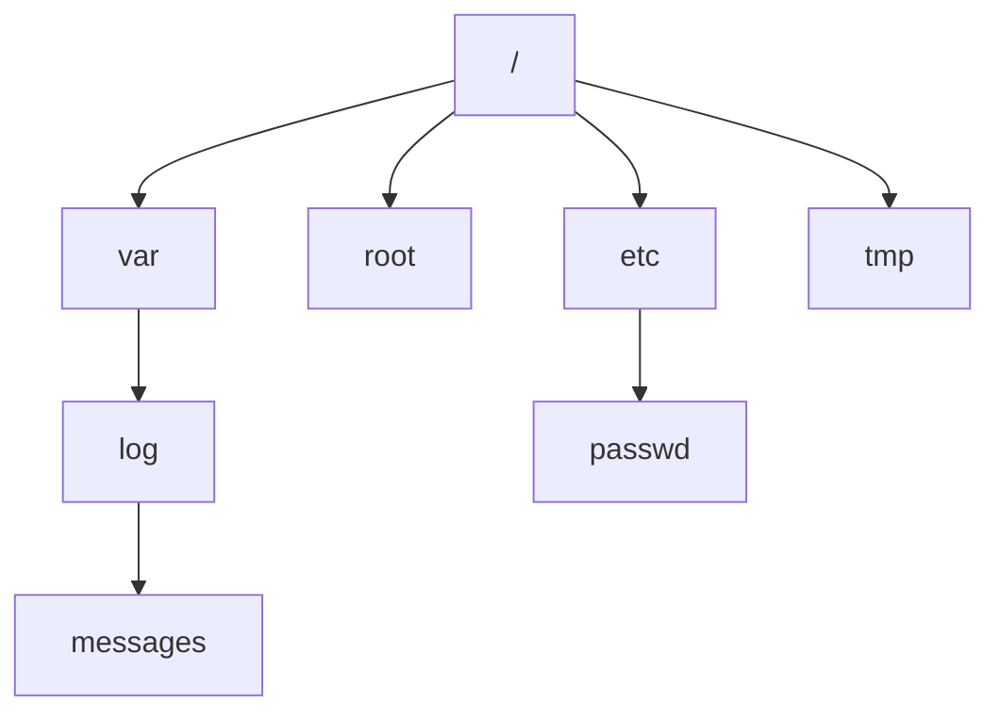

# Linux Basic Commands

## Overview

This note is a working reference for the core commands every Linux user and administrator relies on daily: reading the shell prompt, getting help, navigating the filesystem, creating and removing files and directories, listing contents, copying and moving data, inspecting the system, and controlling power state.

These commands form the foundation for everything that follows in server administration and hardening — you cannot secure a system you cannot confidently navigate and inspect. Wherever a command is potentially destructive (notably `rm -rf`), the risks are called out explicitly.

> [!NOTE]
> Examples span multiple distributions. Commands like `yum` are RHEL/CentOS; `ifconfig`/`route` are legacy net-tools (use `ip` on modern systems). Paths such as `/root/Desktop` assume a root desktop session and are illustrative.

## Concepts

| Concept | Description |
|---------|-------------|
| Shell prompt | The line the shell prints to accept input; encodes user, host, and path |
| Working directory | The directory a process is "in"; relative paths resolve from here |
| Absolute vs relative path | Absolute starts at `/`; relative starts from the working directory |
| Globbing / wildcards | Shell pattern matching (`*`, `?`, `[]`, `{}`) that expands to filenames |
| Man / info pages | Built-in manual system documenting commands, files, and syscalls |



## Shell Prompt Formats

- General shell prompt format

```bash
[username@hostname path]
```

- Root user prompt

```bash
[root@localhost ~] #
```

- Normal user prompt

```bash
[armour@localhost ~] $
```

> [!TIP]
> The final prompt character is a quick privilege check: `#` means you are `root` (full privileges), while `$` means an unprivileged user. Always confirm this before running destructive or system-wide commands.

## Hostname

- Displays the system’s hostname, which identifies the machine on the network.

```bash
hostname
```

## Present Working Directory

- Prints the absolute path of the current working directory.

```bash
pwd
```

## Getting Help With Commands

- Displays help documentation about usage and options for each command.

```bash
help
```

```bash
ls --help
```

```bash
ls -h
```

```bash
sudo --help
```

```bash
sudo -h
```

```bash
vim --help
```

```bash
vim -h
```

```bash
crunch --help
```

```bash
crunch -h
```

> [!NOTE]
> `--help` prints a quick usage summary; `-h` is a common shorthand but is **not** universal — for some commands `-h` means something else entirely (for example `ls -h` means "human-readable sizes"). When unsure, use the long form `--help` or the manual page.

## Manual And Info Pages

- Displays the manual page for the `crunch` command.

```bash
man crunch
```

```bash
man vim
```

- Shows the info page for `crunch`, often more detailed and structured.

```bash
info crunch
```

```bash
info vim
```

- Opens the main manual interface.

```bash
man man
```

- Searches the manual pages for any command related to `mkdir`.

```bash
man -k mkdir
```

- Searches exactly for `mkdir`.

```bash
man -k '^mkdir$'
```

- Opens the section 2 manual for the `mkdir` system call.

```bash
man 2 mkdir
```

- Used to search and display information related to the `passwd` and `ls` commands.

```bash
man -k passwd
```

```bash
man ls
```

```bash
info ls
```

> [!TIP]
> Manual pages are divided into numbered sections. Section 1 is user commands, section 2 is system calls, section 5 is file formats (e.g. `man 5 passwd` documents the `/etc/passwd` file format, not the `passwd` command). Specify the section when a name exists in more than one.

## File And Directory Listing With ls

- Lists files and directories.

```bash
ls
```

- Shows long listing format with details like permissions, size, and timestamp.

```bash
ls -l
```

- Same as above but sizes are human-readable.

```bash
ls -lh
```

```bash
ls -lh /etc
```

- Includes hidden files as well.

```bash
ls -lha
```

- Long listing with human-readable sizes, sorted in reverse order.

```bash
ls -lhr
```

- Sorts files by modification time.

```bash
ls -lt
```

- Reverses the sorting by modification time.

```bash
ls -lt -r
```

```bash
ls -ltr
```

- Recursively lists directories with human-readable sizes.

```bash
ls -lhR
```

- Lists one file per line.

```bash
ls -1
```

- Lists only `.txt` or `.conf` files.

```bash
ls -1 *.txt
```

```bash
ls -1 /etc/*.conf
```

### Common `ls` Options

| Option | Meaning |
|--------|---------|
| `-l` | Long listing (permissions, owner, size, timestamp) |
| `-h` | Human-readable sizes (KB, MB, GB) |
| `-a` | Include hidden files (dotfiles) |
| `-t` | Sort by modification time (newest first) |
| `-r` | Reverse sort order |
| `-R` | Recurse into subdirectories |
| `-1` | One entry per line |

## Navigating Directories With cd

- Both commands take you to the user's home directory.

```bash
cd
```

```bash
cd ~
```

- Takes you to the root directory.

```bash
cd /
```

- Moves up one or two levels in the directory tree.

```bash
cd ..
```

```bash
cd ../../
```

- Navigates to specific paths relative to the current directory.

```bash
cd /var/log/anaconda/
```

```bash
cd ../var/log/anaconda/
```

```bash
cd ../../cache/yum/x86_64/7/
```

## Creating Files With touch

- Creates one or more empty files.

```bash
touch f1.txt
```

```bash
touch file1
```

```bash
touch f2.txt f3.txt f4.txt
```

- Demonstrates file naming with spaces, hyphens, and underscores.

```bash
touch ARMOUR INFOSEC
```

```bash
touch 'ARMOUR INFOSEC'
```

```bash
touch "ARMOUR INFOSEC"
```

```bash
touch ARMOUR-INFOSEC
```

```bash
touch ARMOUR_INFOSEC
```

- Creates files at specific locations.

```bash
touch /tmp/f5.txt /root/Desktop/f6.txt
```

> [!WARNING]
> `touch ARMOUR INFOSEC` creates **two** files, `ARMOUR` and `INFOSEC`, because the space separates arguments. To create a single file whose name contains a space, quote it: `touch 'ARMOUR INFOSEC'`. Avoid spaces in filenames on servers — they complicate scripting.

## Viewing File Contents With cat

- Displays the content of one or multiple files.

```bash
cat f1.txt
```

```bash
cat anaconda-ks.cfg
```

```bash
cat anaconda-ks.cfg initial-setup-ks.cfg
```

```bash
cat /var/log/messages
```

```bash
cat /etc/passwd
```

- Creates or overwrites a file with keyboard input.

```bash
cat > f1.txt
```

> See [Cat-Command](Cat-Command.md) for a full treatment of `cat`, including appending, heredocs, and line numbering.

## Creating Directories With mkdir

- Creates single or nested directories.

```bash
mkdir d1
```

```bash
mkdir d2 d3 d4
```

- The `-p` flag allows creation of parent directories as needed.

```bash
mkdir -p s1/s2/s3/s4/s5/s6
```

```bash
mkdir -p d2/d3/d4/d5
```

## Removing Directories With rmdir and rm

- Removes empty directories with `rmdir`, or non-empty with `rm -rf`.

```bash
rmdir d3/ d4/
```

```bash
rmdir -p d1/d2/d3/d4/d5/
```

- Be cautious with `rm -rf`, especially with `/` and `*`, as they can erase all data.

```bash
rm f1.txt
```

```bash
rm -f f2.txt
```

```bash
rm -f f3.txt f4.txt f5.txt
```

```bash
rm -vf f6.txt
```

```bash
rm -vf A*
```

```bash
rm -vf *.txt
```

```bash
rm -rfv anaconda/
```

```bash
rm -rfv anaconda/*
```

```bash
rm -rf /
```

```bash
rm -f *
```

> [!WARNING]
> `rm -rf /` recursively and forcibly deletes **everything** on the system. `rm -rf *` destroys everything in the current directory. There is no recycle bin — deletion is immediate and permanent. Before any recursive `rm`, run `pwd` and `ls` to confirm exactly where you are and what will match. Never run these as `root` without absolute certainty.

## Wildcards (Globbing Patterns)

| Symbol | Description | Example | Matches |
|--------|-------------|---------|---------|
| `*` | Matches any number of characters (including none) | `ca*` | `car`, `carpet`, `ca` |
| `?` | Matches exactly one character | `hel?` | `help`, `hell` |
| `[]` | Matches exactly one character from the set or range | `file[0-2]` | `file0`, `file1`, `file2` |
| `[hd]` | Matches exactly one character: either `h` or `d` | `[hd]ello` | `hello`, `dello` |
| `[!]` | Matches any character _not_ in the set | `file[!1]` | `file2`, `file3` |
| `{}` | Matches any of the comma-separated patterns | `{*.txt,*.pdf}` | `doc.txt`, `manual.pdf` |

```bash
touch car carpet ca help hell file0 file1 file2 hello dello file2 file3 doc.txt manual.pdf doc.docx doc.pptx doc.pdf
```

- `*` - Matches any number of characters (including none).

```bash
ls ca*
```

```bash
ls f*
```

```bash
ls hel*
```

```bash
ls *.txt
```

```bash
ls doc.*
```

```bash
rm -fv ca*
```

> Matches: `car`, `carpet`, `ca`

- `?` - Matches any single character.

```bash
ls hel?
```

```bash
rm -fv hel?
```

> Matches: `help`, `hell`

- `[]` - Matches a single character in a range or set.

```bash
ls file[0-2]
```

```bash
ls file[1]
```

```bash
ls file[0,1,2]
```

```bash
rm -fv file[0-2]
```

> Matches: `file0`, `file1`, `file2`

- `[hd]` - Matches one of the characters `h` or `d`.

```bash
ls [hd]ello
```

```bash
rm -fv [hd]ello
```

> Matches: `hello`, `dello`

- `[!]` - Matches anything _not_ in the set.

```bash
ls file[!1]
```

```bash
rm -fv file[!1]
```

> Matches: `file2`, `file3`

- `{}` - Matches multiple comma-separated patterns.

```bash
ls {*.txt,*.pdf}
```

```bash
ls doc{*.txt,*.pdf}
```

```bash
rm -fv {*.txt,*.pdf}
```

> Matches: `doc.txt`, `manual.pdf`

> [!TIP]
> Wildcards are expanded by the **shell**, not the command — by the time `rm` runs it sees the final file list. Preview any destructive glob first by running the same pattern with `ls` or `echo`, e.g. `echo *.txt`, to see exactly what it will hit.

## Copying Files And Directories With cp

- Copies files. Use `-v` for verbose and `-r` for directories.

```bash
cp anaconda-ks.cfg anaconda-ks.cfg.back
```

```bash
cp /etc/passwd /root/Desktop/
```

```bash
cp /etc/passwd /etc/hosts /var/log/messages /root/Desktop/
```

```bash
cp * /root/d1/
```

```bash
cp -v /var/log/* .
```

```bash
cp -vr /etc/*.conf ~/Desktop/
```

```bash
cp -v *.log /root/d2/
```

```bash
cp -vr /var/log/*.log /root/Desktop/d1/
```

```bash
cp -vr /etc/*.conf /root/Desktop/conf/
```

```bash
cp -vr /var/log/* /root/Desktop/d1/
```

```bash
cp -vr /var/log/ /root/Desktop/d1/
```

```bash
cp ca* /root/Desktop/
```

```bash
cp hel? /root/Desktop/
```

```bash
cp file[0-2] /root/Desktop/
```

```bash
cp [hd]ello /root/Desktop/
```

```bash
cp file[!1] /root/Desktop/
```

```bash
cp {*.txt,*.pdf} /root/Desktop/
```

## Moving and Renaming With mv

- Used to move or rename files/directories.

```bash
mv anaconda-ks.cfg anaconda1
```

```bash
mv a.txt d9/
```

```bash
mv -v X* /root/d2/
```

```bash
mv ca* /root/Desktop/
```

```bash
mv hel? /root/Desktop/
```

```bash
mv file[0-2] /root/Desktop/
```

```bash
mv [hd]ello /root/Desktop/
```

```bash
mv file[!1] /root/Desktop/
```

```bash
mv {*.txt,*.pdf} /root/Desktop/
```

> [!NOTE]
> `mv` both **moves** and **renames** — renaming is simply moving within the same directory. Unlike `cp`, `mv` does not need `-r` for directories. By default it overwrites the destination silently; use `-i` to prompt or `-n` to never overwrite.

## Creating Links With ln

- **Hard link**: Points directly to the file content (inode). It’s indistinguishable from the original file; deleting the original filename doesn’t delete the content if another hard link exists.

- **Soft link (symbolic link)**: Points to the pathname of the target file. It’s like a shortcut. If the original file is deleted, the soft link becomes broken (dangling).

```bash
ln /var/log/messages my_hard_link
```

```bash
ln -s /var/log/messages my_soft_link
```

| Feature | Hard Link | Soft (Symbolic) Link |
|---------|-----------|----------------------|
| Points to | Inode (data) | Pathname |
| Survives original deletion | Yes | No (becomes dangling) |
| Cross filesystem | No | Yes |
| Can link directories | No (normally) | Yes |
| Created with | `ln` | `ln -s` |

## Viewing File Contents With less and more

- **more**: A basic pager for viewing text files one screen at a time. Navigation is limited: you can only move forward (with `space` or `enter`), and you can’t move backward (except in some enhanced versions).

```bash
more /var/log/messages
```

- **less**: A more advanced pager that lets you move both forward and backward through a file. It supports search (with `/`), and has better performance with large files because it doesn’t load the whole file into memory at once.

- Allows scrolling through large files.

```bash
less /var/log/messages
```

## User and System Identification

> Shows user info, terminal type, and who is logged in.

### id

- Shows your user ID (UID), group ID (GID), and group memberships.

```bash
id
```

### tty (teletype)

#### tty

- Traditionally refers to a physical terminal (like a keyboard and monitor directly connected to a machine).

- In modern Linux, `tty` typically refers to a virtual console (`/dev/tty1`, `/dev/tty2`, etc.).

- You can switch between them using `Ctrl+Alt+F1` to `Ctrl+Alt+F6`.

#### pts (pseudo-terminal slave)

- These are virtual terminals created by software like SSH, screen, tmux, or terminal emulators (like GNOME Terminal, xterm, etc.).

- They appear as `/dev/pts/0`, `/dev/pts/1`, etc.

- These are "pseudo-terminals" that allow remote or multiplexed access.

```bash
tty
```

> If you’re in a virtual console:

```text
/dev/tty1
```

> If you’re in a terminal emulator:

```text
/dev/pts/0
```

> So:

- `tty` and `pts` are both types of terminal interfaces.

- `tty` is usually for physical or virtual consoles.

- `pts` is for pseudo-terminals created by remote or multiplexed sessions.

### whoami

- Prints the current logged-in username.

```bash
whoami
```

### who

- Shows who is currently logged in.

```bash
who
```

### who -a

- Displays detailed information about logged-in users and system processes, including run-level changes, system boot time, etc.

```bash
who -a
```

### w

- Displays who is logged on and what they are doing.

```bash
w
```

## Hostname and System Info

### hostname

- Displays the system’s hostname.

```bash
hostname
```

- Displays the alias names of the host (rarely used).

```bash
hostname -a
```

- Displays the IP address associated with the hostname (usually resolves to `127.0.1.1` or the local network IP).

```bash
hostname -i
```

- Displays all IP addresses assigned to the host (useful for systems with multiple interfaces).

```bash
hostname -I
```

### uname

- Prints system information (default is the kernel name).

```bash
uname
```

- Displays all available system information:

	- Kernel name

	- Node name (hostname)

	- Kernel release

	- Kernel version

	- Machine hardware name

	- Processor type

	- Hardware platform

	- Operating system

```bash
uname -a
```

- Displays the kernel release version.

```bash
uname -r
```

- Displays:

	- Kernel name (`-s`)

	- Kernel release (`-r`)

	- Machine hardware name (`-m`)

```bash
uname -mrs
```

## System and Hardware Information

```bash
ls -lh /etc/*release
```

- Displays operating system identification details.

```bash
cat /etc/os-release
```

> **Example output:**

```text
NAME="Ubuntu"
VERSION="22.04.4 LTS (Jammy Jellyfish)"
ID=ubuntu
ID_LIKE=debian
PRETTY_NAME="Ubuntu 22.04.4 LTS"
VERSION_ID="22.04"
```

- Shows Red Hat or compatible distribution version.

```bash
cat /etc/redhat-release
```

> **Example output:**

```text
Red Hat Enterprise Linux release 9.0 (Plow)
```

- Displays detailed CPU architecture and processor info.

```bash
lscpu
```

> **Example output:**

```text
Architecture:        x86_64
CPU op-mode(s):      32-bit, 64-bit
Byte Order:          Little Endian
CPU(s):              4
Model name:          Intel(R) Core(TM) i5-8265U CPU @ 1.60GHz
```

- Lists USB devices connected to the system.

```bash
lsusb
```

> **Example output:**

```text
Bus 002 Device 003: ID 046d:c077 Logitech, Inc. M105 Optical Mouse
Bus 001 Device 002: ID 8087:0026 Intel Corp. AX200 Bluetooth
```

- Lists PCI devices such as graphics cards, network adapters.

```bash
lspci
```

> **Example output:**

```text
00:02.0 VGA compatible controller: Intel Corporation UHD Graphics 620
01:00.0 Network controller: Intel Corporation Wireless-AC 9560
```

- Lists block devices — disks, partitions, and mount points.

```bash
lsblk
```

> **Example output:**

```text
NAME   MAJ:MIN RM   SIZE RO TYPE MOUNTPOINT
sda      8:0    0  512G  0 disk
├─sda1   8:1    0  500G  0 part /
└─sda2   8:2    0   12G  0 part [SWAP]
```

- Shows system memory usage in human-readable format.

```bash
free -h
```

> **Example output:**

```text
              total        used        free      shared  buff/cache   available
Mem:           15Gi       2.1Gi        10Gi       248Mi       3.1Gi        12Gi
Swap:         2.0Gi          0B       2.0Gi
```

- Displays detailed information about physical memory (RAM). Requires root privileges.

```bash
dmidecode --type 17
```

> **Example output:**

```text
Handle 0x002E, DMI type 17, 40 bytes
Memory Device
    Size: 8192 MB
    Locator: DIMM A
    Speed: 2400 MT/s
    Manufacturer: Samsung
```

## Date And Calendar

- Shows the current date and time.

```bash
date
```

- To see the date in a specific format:

```bash
date "+%Y-%m-%d %H:%M:%S"
```

- Displays a calendar of the current month.

```bash
cal
```

- To view a specific month and year:

```bash
cal 12 2014
```

## Network Configuration

- Displays information about active network interfaces and their configurations.

```bash
ifconfig
```

- Shows information about all network interfaces, including inactive ones.

```bash
ifconfig -a
```

- Shows detailed information about network interfaces and their addresses.

```bash
ip address
```

- Lists all network interfaces and their IP addresses (short for `ip address`).

```bash
ip a
```

- Equivalent to `ip a`, displays all interfaces and IP addresses.

```bash
ip ad
```

- Displays the kernel IP routing table with numeric IP addresses (no DNS lookup).

```bash
route -n
```

- Displays DNS resolver configuration, including nameserver IPs.

```bash
cat /etc/resolv.conf
```

> [!NOTE]
> `ifconfig` and `route` come from the legacy `net-tools` package and may be absent on modern distributions. The `ip` suite (`ip address`, `ip route`, `ip link`) is the current standard and should be preferred in new work.

## History

- Displays the list of recently executed commands in the current shell session.

```bash
history
```

- Shows the current user’s default shell.

```bash
echo $SHELL
```

- Displays the full command history saved in the user’s bash history file.

```bash
cat ~/.bash_history
```

- Clears the current shell’s command history.

```bash
history -c
```

- Repeats the last executed command.

```bash
!!
```

- Repeats the command numbered 701 in the history list.

```bash
!701
```

- Repeats the most recent command starting with “if”.

```bash
!if
```

- Repeats the most recent command starting with “pi”.

```bash
!pi
```

> [!WARNING]
> Shell history persists sensitive input. Secrets typed on the command line (passwords, tokens, keys) are written to `~/.bash_history` in plaintext. Prefer prompting or environment files over inline secrets, and be aware that `history -c` clears only the in-memory list for the current session, not the saved history file.

## Power And Shutdown Commands

```bash
shutdown
```

- Cancels a scheduled shutdown or reboot.

```bash
shutdown -c
```

- Halts the system immediately (shuts down and powers off).

```bash
shutdown -h
```

```bash
shutdown -h now
```

- Powers off the system immediately.

```bash
shutdown -P
```

```bash
shutdown -P now
```

- Reboots the system immediately.

```bash
shutdown -r
```

```bash
shutdown -r now
```

- Powers off the system.

```bash
poweroff
```

- Reboots the system.

```bash
reboot
```

- Brings the system down to runlevel 0 (shutdown).

```bash
init 0
```

- Reboots the system (runlevel 6).

```bash
init 6
```

## Best Practices

- Confirm your location and privilege before destructive actions: `pwd`, `ls`, and check whether the prompt ends in `#` (root) or `$` (user).
- Preview wildcard expansions with `echo` or `ls` before feeding them to `rm`, `mv`, or `cp`.
- Prefer the modern `ip` command over deprecated `ifconfig`/`route`.
- Use `less` rather than `cat` for large log files, and `man`/`--help` liberally rather than guessing options.
- On production servers, schedule reboots and shutdowns during maintenance windows and warn logged-in users (`who`, `w`) first.

## Security Considerations

- **Least privilege:** Operate as an unprivileged user and elevate with `sudo` only for specific commands; avoid living in a root shell.
- **Command history hygiene:** Keep secrets off the command line; they leak into `~/.bash_history` and process listings.
- **Information disclosure:** Files like `/etc/passwd` and outputs of `id`, `who`, `hostname -I`, and `uname -a` reveal usernames, network layout, and kernel version — useful to an attacker for enumeration. Restrict who can log in and what they can read.
- **Destructive commands:** Guard `rm -rf` behind confirmation habits; consider aliases (`alias rm='rm -i'`) on personal accounts, but never rely on aliases in scripts.

## Troubleshooting

| Symptom | Likely Cause | Resolution |
|---------|--------------|------------|
| `command not found` | Package not installed or not in `$PATH` | Install the package; check `echo $PATH` and `which cmd` |
| `Permission denied` | Insufficient privileges | Check `ls -l`; use `sudo` where appropriate |
| `No such file or directory` | Wrong path or working directory | Verify with `pwd` and `ls`; use absolute paths |
| `ifconfig: command not found` | `net-tools` not installed | Use `ip address` / `ip route`, or install `net-tools` |
| `rmdir: failed to remove: Directory not empty` | Directory has contents | Use `rm -rf dir/` (with caution) after verifying contents |

## References

- `man 1 ls`, `man 1 cp`, `man 1 mv`, `man 1 rm`, `man 7 glob` — core coreutils and globbing manual pages.
- GNU Coreutils Manual — [File system utilities](https://www.gnu.org/software/coreutils/manual/html_node/index.html).
- Filesystem Hierarchy Standard (FHS) 3.0 — layout of `/etc`, `/var`, `/root`, and other top-level directories.

## Related
- [Cat-Command](Cat-Command.md) — view file contents
- [Multiple-Commands-and-Pipes](Multiple-Commands-and-Pipes.md) — chain commands together
- [File-Finding-in-Linux](../String-Processing-and-Finding-Files/File-Finding-in-Linux.md) — locate files on disk
- [Linux-Permissions](../Users-Groups-and-Permissions/Linux-Permissions.md) — read/write/execute basics
- [Linux Administration & Server Hardening](../Readme.md) — Linux administration & server hardening hub
