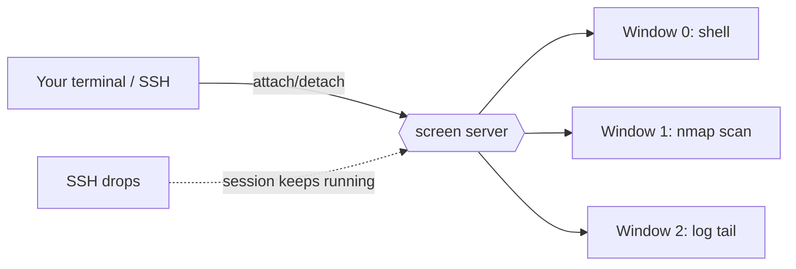

# Screen Command

## Overview

`screen` is a **terminal multiplexer**: it allows multiple terminal sessions to be created, accessed, and controlled from a single terminal window. It lets users run processes in the background, detach from sessions, and reattach to them later without interrupting the running tasks. This is particularly useful for managing long-running processes (scans, builds, transfers) or maintaining work over unstable network connections such as SSH.

Because a `screen` session keeps running on the server even after the controlling terminal disconnects, a dropped SSH connection no longer kills the job — you simply reconnect and reattach.

> [!TIP]
> On modern systems `tmux` is a popular, more actively developed alternative to `screen`. The mental model is identical: a persistent server process hosts detachable sessions. Learn one and the other is easy to pick up.

## Concepts

| Term | Meaning |
|------|---------|
| Session | A persistent `screen` instance that survives detachment and disconnection |
| Window | A shell (or program) running inside a session; one session can hold many windows |
| Detach | Disconnect your terminal from a session while it keeps running (`Ctrl + a` then `d`) |
| Reattach | Reconnect your terminal to a running session (`screen -r`) |
| Named session | A session started with a human-readable name (`-S name`) for easy identification |

Key features of the `screen` command include:

- Persistence of terminal sessions even after disconnection.
- Ability to have multiple terminal windows (or sessions) inside one physical terminal.
- Easy switching between sessions or windows.
- Running commands or scripts in the background.
- Sharing sessions with multiple users for collaboration.

## Architecture



When you detach (or your SSH link drops), the `screen` server process and every window inside it keep running on the host. Reattaching simply reconnects your terminal to that still-live server.

## Installation

- On RHEL/CentOS:

```bash
yum install screen
```

- On Debian/Ubuntu:

```bash
apt install screen
```

- Display Help:

```bash
screen --help
```

## Commands

### Basic Screen Commands

- Start a Screen Session

```bash
screen
```

- Start a Named Screen Session

```bash
screen -S <session_name>
```

> Example:

```bash
screen -S mysession
```

- Run a Command in the Background within a Named Screen Session

```bash
screen -S <session_name> -dm <command>
```

> Example:

```bash
screen -S ping -dm ping 8.8.8.8
```

### Managing Screen Sessions

- List Active Screen Sessions

```bash
screen -ls
```

- Reattach to the Last Detached Screen Session

```bash
screen -r
```

- Reattach to a Specific Screen Session

```bash
screen -r <session_name>
```

> Example:

```bash
screen -r mysession
```

### Key Bindings (In-Session)

All in-session commands are prefixed with the escape key sequence **`Ctrl + a`**, followed by another key.

| Key Binding | Action |
|-------------|--------|
| `Ctrl + a` then `d` | Detach from the current session (leaves it running) |
| `Ctrl + a` then `c` | Create a new window |
| `Ctrl + a` then `n` | Switch to the next window |
| `Ctrl + a` then `p` | Switch to the previous window |
| `Ctrl + a` then `"` | List windows to select interactively |
| `Ctrl + a` then `A` | Rename the current window |
| `Ctrl + a` then `k` | Kill the current window |

## Examples

### Run a Custom Script in the Background

```bash
screen -S nmapver -dm nmap-warrior.py -l Public-IPs.txt -pvu -o Public-IPs-Nmap-Output
```

```bash
screen -S nmapver -dm /home/armour/nmap-warrior.sh -u 192.168.1.1 -pvs -o 192.168.1.1
```

```bash
screen -S nmapver -dm /home/armour/nmap-warrior.sh -u 192.168.1.1 -pvs
```

> [!NOTE]
> **📸 Screenshot**
> _Capture: Terminal showing `screen -ls` output listing two detached sessions named mysession and nmapver with their PIDs and Detached status_

## Best Practices

- Always name long-running sessions with `-S` so `screen -ls` output is meaningful when you have several sessions.
- Use `-dm` to launch a detached session running a specific command — ideal for kicking off scans or transfers that must outlive your SSH connection.
- Reattach explicitly by name (`screen -r nmapver`) rather than relying on "the last session" when multiple sessions exist.
- Clean up finished sessions; a `screen` session whose command has exited will normally close on its own, but stale sessions can be listed with `screen -ls` and wiped with `screen -wipe`.

## Security Considerations

- A detached `screen` session keeps a shell alive with your privileges. On a shared or compromised host, an attacker who gains your account can reattach to your live sessions — do not leave privileged (root) sessions detached on untrusted systems.
- Session sharing (multiuser mode) is powerful for collaboration but effectively grants another user your shell; enable it only deliberately and with trusted parties.
- Screen sockets live under `/run/screen` (or `/var/run/screen`) with per-user permissions; verify these permissions on multi-user servers so other users cannot access your sessions.

## Troubleshooting

| Symptom | Likely Cause | Resolution |
|---------|--------------|------------|
| `There is no screen to be resumed` | No detached session, or wrong name | Run `screen -ls` to see live sessions and exact names |
| `There are several suitable screens` | Multiple sessions match `screen -r` | Reattach by full name/PID: `screen -r nmapver` |
| Session shows `(Attached)` but you cannot reattach | Session attached elsewhere | Force-detach and reattach with `screen -dr <name>` |
| Dead sessions clutter `screen -ls` | Sessions ended uncleanly | Remove them with `screen -wipe` |

## Summary

- `screen` allows running processes in the background.
- Named sessions help in managing multiple screens.
- Sessions can be detached and reattached as needed.
- Use `screen -ls` to list sessions and `screen -r <session_name>` to resume a specific session.

## References

- `man 1 screen` — GNU Screen manual page (full list of key bindings and command-line options).
- GNU Screen Manual — [Introduction](https://www.gnu.org/software/screen/manual/screen.html).
- `man 1 tmux` — the modern terminal-multiplexer alternative referenced above.

## Related
- [Shells-in-Linux](../Shells-and-Environment/Shells-in-Linux.md) — screen multiplexes shell sessions
- [Process-Management-in-Linux](../Process-Service-and-Job-Management/Process-Management-in-Linux.md) — manage detached background jobs
- [Multiple-Commands-and-Pipes](Multiple-Commands-and-Pipes.md) — background and job control at the shell level
- [Linux Administration & Server Hardening](../Readme.md) — Linux administration & server hardening hub
