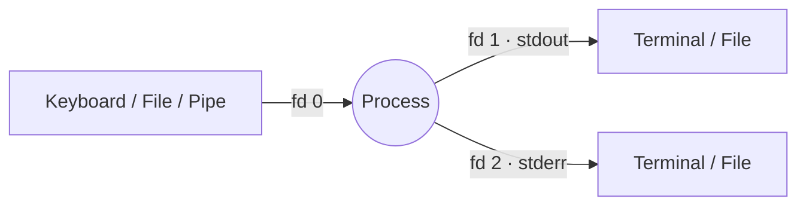

# Standard Data Streams

## Overview

In Unix-like operating systems, every running process is automatically given three **standard data streams** the moment it starts. These streams are the primary channels through which a program receives input and emits output. Because they are exposed as ordinary file descriptors, the shell can transparently reconnect ("redirect") them to files, devices, or other processes — this uniform I/O model is the foundation of the classic Unix philosophy of small, composable tools.

| Stream | File Descriptor | Purpose |
|---|---|---|
| stdin | 0 | Input to a program (default: keyboard) |
| stdout | 1 | Normal output from a program (default: terminal) |
| stderr | 2 | Error output from a program (default: terminal) |

> [!NOTE]
> A **file descriptor** is a small non-negative integer the kernel uses to identify an open file or stream for a process. Descriptors 0, 1, and 2 are reserved for stdin, stdout, and stderr; user-opened files start at 3.

## Concepts

Each stream is a one-directional flow of bytes attached to a process at creation time. Keeping *normal* output (stdout) separate from *diagnostic/error* output (stderr) is deliberate: it lets you capture results while still seeing errors, log them to different files, or discard one without losing the other.



> [!TIP]
> Because stderr is a distinct stream, error messages still reach your screen even when you redirect stdout to a file. This is why `find / ... 2> /dev/null` silences *only* the "Permission denied" noise while keeping the useful matches on screen.

## Standard Input (stdin)

**Standard Input (stdin)** is used by programs to receive input. It is represented by **file descriptor 0**.

- Default source: Keyboard
- Can be redirected from files, commands, or devices

### Examples

- Interactive input

```bash
cat
```

```bash
vim
```

- Redirect input from a file

```bash
sort < unsorted.txt
```

```bash
cat < input.txt
```

- Read from stdin in a script

```bash
vim sum.sh
```

```bash
#!/bin/bash
read -p "Enter a number: " num1
read -p "Enter another number: " num2
sum=$((num1 + num2))
echo "The sum is $sum"
```

```bash
chmod +x sum.sh
```

- Piping input

```bash
cat /etc/passwd | wc -l
```

```bash
echo "hello world" | tr 'a-z' 'A-Z'
```

- Using stdin explicitly

```bash
cat /dev/stdin
```

## Standard Output (stdout)

**Standard Output (stdout)** is used by programs to display normal output. It is represented by **file descriptor 1**.

- Default destination: Terminal
- Can be redirected to files

### Examples

- Redirect output

```bash
ls -1 > file.txt
```

```bash
echo "Name: Armour" > users.txt
```

```bash
echo "Name: Rahul" 1> users.txt
```

- Append output

```bash
echo "Email: user@example.com" >> users.txt
```

```bash
ls -1 /etc/ >> files.txt
```

> [!WARNING]
> `>` **truncates** the target file to zero length before writing. Use `>>` to append. Enabling `set -o noclobber` in Bash makes `>` refuse to overwrite an existing file, guarding against accidental data loss.

## Standard Error (stderr)

**Standard Error (stderr)** is used for error messages. It is represented by **file descriptor 2**.

- Default destination: Terminal
- Can be redirected separately from stdout

### Examples

- Generate an error

```bash
ls nonexistentfile
```

- Redirect error output

```bash
ls nonexistentfile 2> error.txt
```

- Separate stdout and stderr

```bash
cat /etc/shadow /etc/passwd 1> out.txt 2> err.txt
```

```bash
cat /etc/shadow /etc/passwd 1>> out.txt 2>> err.txt
```

- Combine stdout and stderr

```bash
cat /etc/shadow /etc/passwd > both.txt 2>&1
```

```bash
cat /etc/shadow /etc/passwd &> both.txt
```

## Redirection and Appending

The shell rewires descriptors *before* the command runs. The table below summarizes the operators.

| Operator | Meaning |
|---|---|
| `>` | Redirect stdout to a file (truncate) |
| `>>` | Redirect stdout to a file (append) |
| `2>` | Redirect stderr to a file (truncate) |
| `2>>` | Redirect stderr to a file (append) |
| `<` | Redirect stdin from a file |
| `2>&1` | Redirect stderr to wherever stdout currently points |
| `&>` | Redirect both stdout and stderr (Bash shorthand) |
| `\|` | Pipe stdout of one command into stdin of the next |

- Redirect stdout

```bash
ls > files.txt
```

```bash
echo "Hello" > demo.txt
```

- Append stdout

```bash
echo "More data" >> demo.txt
```

- Redirect stderr to `/dev/null` (`/dev/null` discards all data written to it)

```bash
command 2> /dev/null
```

Example:

```bash
find / -name passwd 2> /dev/null
```

- Redirect both stdout and stderr

```bash
command > /dev/null 2>&1
```

```bash
command &> /dev/null
```

> [!IMPORTANT]
> Order matters in `> file 2>&1`. This first points stdout at `file`, **then** points stderr at the same place — so both land in the file. Writing `2>&1 > file` instead sends stderr to the *original* terminal and only stdout to the file, because `2>&1` is evaluated while stdout still points at the terminal.

## Practical Examples

- Redirect output and errors separately

```bash
cat /etc/shadow /etc/os-release /etc/sudoers 1> stdout.txt 2> stderr.txt
```

- Redirect both together

```bash
cat /etc/shadow /etc/os-release /etc/sudoers > /tmp/all.txt 2>&1
```

- Suppress output

```bash
cat /etc/*.conf > /dev/null
```

```bash
cat /etc/*.conf 2> /dev/null
```

- Find with output control

```bash
find / -name passwd > passwd.txt
```

```bash
find / -name passwd 2> errors.txt
```

```bash
find / -name passwd &> all.txt
```

- Find setuid binaries

```bash
find / -perm -u=s -type f 2> /dev/null
```

> [!TIP]
> The setuid enumeration one-liner above is a staple of Linux privilege-escalation triage: `2> /dev/null` strips the flood of "Permission denied" errors so only the interesting setuid binaries remain. See Remote-Code-Execution-to-Reverse-shell for how these primitives extend into shells.

## Notes on Pipes

Pipes (`|`) pass **stdout of one command as stdin to another**, letting you build processing chains without temporary files:

```bash
ls -lh | sort | less
```

## C Programming Mapping

At the C library level the three streams are exposed as `FILE *` objects wired to the standard I/O functions:

| Stream | Function |
|---|---|
| stdin | `scanf()` |
| stdout | `printf()` |
| stderr | `fprintf(stderr, ...)` |

## Security Considerations

> [!WARNING]
> Redirection touches the filesystem with the caller's privileges. Keep these hardening points in mind:

- **Sensitive data leakage** — Redirecting the output of commands that read `/etc/shadow`, private keys, or credentials into world-readable files (e.g. under `/tmp`) can expose secrets. Set a restrictive `umask 077` before writing such files.
- **`noclobber`** — Enable `set -o noclobber` in interactive shells and hardening scripts to prevent `>` from silently overwriting existing files.
- **Never blind-silence errors in production scripts** — `2> /dev/null` hides genuine failures. Log stderr to a file you review instead of discarding it, so audit trails and failures are not lost (aligns with NIST SP 800-53 AU audit-logging controls).
- **Symlink / TOCTOU risks** — Redirecting into predictable paths in shared directories can be abused via symlink attacks. Prefer `mktemp` for temporary files and validate targets.

## Troubleshooting

| Symptom | Likely Cause | Fix |
|---|---|---|
| Errors still print despite `> file` | stderr is a separate stream | Add `2>&1` or use `&> file` |
| Output file is empty but command ran | stdout went elsewhere or command wrote only to stderr | Check with `2> err.txt` separately |
| File unexpectedly emptied | `>` truncated it before the command failed | Use `>>` or enable `noclobber` |
| Both streams in wrong file | Redirection order wrong | Put `2>&1` *after* the stdout redirect |
| Pipe seems to lose errors | Pipes carry stdout only | Redirect stderr explicitly, or use `\|&` in Bash |

## Summary

- **stdin (0):** Input stream
- **stdout (1):** Normal output
- **stderr (2):** Error output
- `>` redirects output
- `>>` appends output
- `2>` redirects errors
- `2>&1` merges stderr with stdout
- `/dev/null` discards output
- `|` passes output between commands

## Related

- [Linux Administration & Server Hardening](../Readme.md) — Linux administration & server hardening hub
- [Linux-Basic-Commands](Linux-Basic-Commands.md) — module index for core command-line fundamentals
- [Shells-in-Linux](../Shells-and-Environment/Shells-in-Linux.md) — shells wire up stdin/stdout/stderr
- [String-Processing](../String-Processing-and-Finding-Files/String-Processing.md) — pipe streams through text filters
- [Multiple-Commands-and-Pipes](Multiple-Commands-and-Pipes.md) — chaining commands via pipes
- Remote-Code-Execution-to-Reverse-shell — stream redirection builds reverse shells
