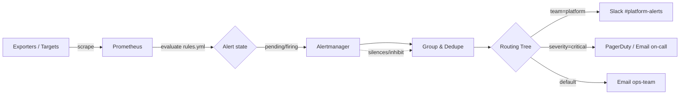

# Alerting with Alertmanager

## Overview

Prometheus evaluates alerting rules against scraped time-series data and fires alerts to Alertmanager, which is a separate service responsible for deduplicating, grouping, silencing, inhibiting, and routing those alerts to the right humans via email, Slack, PagerDuty, or webhooks. Splitting rule evaluation from notification handling keeps [Metrics-with-Prometheus](Metrics-with-Prometheus.md) focused on data collection while Alertmanager owns the operational concerns of "who gets paged, when, and how often." This note covers writing alert rules, configuring Alertmanager's routing tree and receivers, and using silences and grouping to control alert noise.

> [!NOTE]
> **Alertmanager is stateful for silences and notification log data. Run it with persistent storage (`--storage.path`) and cluster 2-3 replicas with `--cluster.peer` for high availability — a single instance is a notification single point of failure.**

## Concepts

| Term | Meaning |
|---|---|
| Alerting rule | PromQL expression in Prometheus that becomes `pending` then `firing` when true for `for:` duration |
| Alert | An instance of a firing rule, carrying labels (identity) and annotations (human text) |
| Route | A node in Alertmanager's routing tree matching alerts by label to decide the receiver |
| Receiver | A named notification target (email, Slack webhook, PagerDuty, generic webhook) |
| Grouping | Bundles related alerts (same `group_by` labels) into one notification |
| Inhibition | Suppresses an alert if another, higher-severity alert is already firing |
| Silence | A time-boxed manual mute matching a label selector, created via UI/API/`amtool` |

## Architecture



Prometheus pushes alert state to Alertmanager over HTTP (default port `9093`); Alertmanager does not query Prometheus, it only receives alerts pushed to `/api/v2/alerts`.

## Installation

**RHEL-family (RPM via official tarball, no first-party repo):**

```bash
sudo useradd --no-create-home --shell /usr/sbin/nologin alertmanager
curl -LO https://github.com/prometheus/alertmanager/releases/latest/download/alertmanager-0.27.0.linux-amd64.tar.gz
tar xvf alertmanager-0.27.0.linux-amd64.tar.gz
sudo mv alertmanager-0.27.0.linux-amd64/alertmanager /usr/local/bin/
sudo mv alertmanager-0.27.0.linux-amd64/amtool /usr/local/bin/
sudo mkdir -p /etc/alertmanager /var/lib/alertmanager
sudo chown -R alertmanager:alertmanager /var/lib/alertmanager
```

**Debian-family (apt, Debian 12+/Ubuntu 22.04+):**

```bash
sudo apt update
sudo apt install -y prometheus-alertmanager
# systemd unit and /etc/prometheus/alertmanager.yml created automatically
```

**systemd unit (manual install path):**

```ini
[Unit]
Description=Alertmanager
Wants=network-online.target
After=network-online.target

[Service]
User=alertmanager
Group=alertmanager
Type=simple
ExecStart=/usr/local/bin/alertmanager \
  --config.file=/etc/alertmanager/alertmanager.yml \
  --storage.path=/var/lib/alertmanager

[Install]
WantedBy=multi-user.target
```

```bash
sudo systemctl daemon-reload
sudo systemctl enable --now alertmanager
```

## Configuration

### Prometheus: point at Alertmanager and load rule files

```yaml
# /etc/prometheus/prometheus.yml
alerting:
  alertmanagers:
    - static_configs:
        - targets: ["localhost:9093"]

rule_files:
  - "/etc/prometheus/rules/*.yml"
```

### Alert rules (Prometheus)

```yaml
# /etc/prometheus/rules/node.yml
groups:
  - name: node-health
    rules:
      - alert: InstanceDown
        expr: up{job="node"} == 0
        for: 2m
        labels:
          severity: critical
          team: platform
        annotations:
          summary: "{{ $labels.instance }} is down"
          description: "{{ $labels.instance }} has been unreachable for 2m."

      - alert: HighDiskUsage
        expr: >
          (node_filesystem_avail_bytes{fstype!~"tmpfs|overlay"}
           / node_filesystem_size_bytes) * 100 < 10
        for: 10m
        labels:
          severity: warning
          team: platform
        annotations:
          summary: "Low disk space on {{ $labels.instance }}"
          description: "Filesystem {{ $labels.mountpoint }} has less than 10% free."

      - alert: HighCPULoad
        expr: 100 - (avg by (instance) (rate(node_cpu_seconds_total{mode="idle"}[5m])) * 100) > 85
        for: 15m
        labels:
          severity: warning
          team: platform
        annotations:
          summary: "High CPU on {{ $labels.instance }}"
          description: "CPU usage above 85% for 15 minutes."
```

Validate rules before reloading:

```bash
promtool check rules /etc/prometheus/rules/node.yml
sudo systemctl reload prometheus
```

### Alertmanager: routing, grouping, and receivers

```yaml
# /etc/alertmanager/alertmanager.yml
global:
  resolve_timeout: 5m
  smtp_smarthost: "smtp.example.com:587"
  smtp_from: "alertmanager@example.com"
  smtp_auth_username: "alertmanager@example.com"
  smtp_auth_password_file: "/etc/alertmanager/smtp_password"
  slack_api_url_file: "/etc/alertmanager/slack_webhook_url"

route:
  receiver: default-email
  group_by: ["alertname", "team"]
  group_wait: 30s        # wait to batch alerts firing together
  group_interval: 5m     # wait before sending updates to an existing group
  repeat_interval: 4h    # re-notify if still firing
  routes:
    - matchers:
        - severity="critical"
      receiver: pagerduty-critical
      continue: true      # also fall through to next matching route
    - matchers:
        - team="platform"
      receiver: slack-platform

inhibit_rules:
  - source_matchers:
      - severity="critical"
    target_matchers:
      - severity="warning"
    equal: ["alertname", "instance"]

receivers:
  - name: default-email
    email_configs:
      - to: "ops-team@example.com"
        send_resolved: true

  - name: slack-platform
    slack_configs:
      - channel: "#platform-alerts"
        send_resolved: true
        title: '{{ .CommonAnnotations.summary }}'
        text: '{{ .CommonAnnotations.description }}'

  - name: pagerduty-critical
    pagerduty_configs:
      - routing_key_file: "/etc/alertmanager/pagerduty_key"
        send_resolved: true
```

```bash
amtool check-config /etc/alertmanager/alertmanager.yml
sudo systemctl reload alertmanager
```

## Commands

| Command | Purpose |
|---|---|
| `promtool check rules FILE` | Validate alerting/recording rule syntax |
| `promtool test rules TEST.yml` | Unit-test rule expressions against fixtures |
| `amtool check-config alertmanager.yml` | Validate Alertmanager config |
| `amtool alert query` | List currently active alerts |
| `amtool silence add alertname=HighDiskUsage --duration=2h --comment="maint"` | Create a silence |
| `amtool silence query` | List active silences |
| `amtool silence expire <id>` | Expire (remove) a silence early |
| `amtool config routes test` | Trace which receiver a label set routes to |

## Examples

Silence all alerts for one host during planned maintenance:

```bash
amtool silence add instance="db01.example.com:9100" \
  --duration=1h \
  --comment="Planned kernel patching - JIRA-4521" \
  --author="averma"
```

Trace routing for a hypothetical alert:

```bash
amtool config routes test severity=critical team=platform
```

Check active alerts from the CLI (or browse `http://localhost:9093`):

```bash
amtool alert query --alertmanager.url=http://localhost:9093
```

## Best Practices

- Group by `alertname` plus a coarse ownership label (`team`, `service`) — never group by `instance`, or every host pages separately.
- Set `for:` on every rule to avoid flapping alerts on transient blips; 2-5 minutes is typical for availability checks.
- Use `inhibit_rules` so a `critical` node-down alert suppresses the dozen `warning` alerts it causes (disk, CPU, service-down on the same instance).
- Keep `repeat_interval` long for low-severity alerts (hours) and short for critical (30-60m) so on-call isn't spammed but isn't forgotten either.
- Store secrets (`smtp_auth_password`, Slack webhook, PagerDuty key) in `*_file` variants, not inline in YAML, so the config file itself is safe to version-control.
- Write a short runbook link into every `annotations.runbook_url` — alerts without an action are noise.

## Security Considerations

- Alertmanager's HTTP API (`9093`) has no built-in auth — bind to `127.0.0.1` or an internal interface and put it behind a reverse proxy with TLS + basic auth or mTLS if exposed beyond localhost (CIS-aligned: minimize unauthenticated network services).
- Never commit SMTP passwords, Slack webhook URLs, or PagerDuty routing keys directly in `alertmanager.yml`; use the `_file` suffix config options and restrict file permissions (`chmod 600`, owned by the `alertmanager` service user).
- Restrict who can create silences — a malicious or careless silence can mask a real incident; audit `amtool silence query` output periodically and pair silences with a ticket reference in `--comment`.
- Run Alertmanager as a dedicated unprivileged user (never root), and if clustering, restrict the gossip port (`9094/tcp+udp`) to trusted internal hosts only via firewall rules.
- Validate configs with `amtool check-config` in CI before deploy — a malformed route can silently send critical alerts to the wrong (or no) receiver.

> [!WARNING]
> **The default route's receiver is the catch-all for anything that matches no sub-route. If it points to an inbox nobody watches, critical alerts can go unseen. Treat the default receiver as itself a paging destination, not a junk drawer.**

## Troubleshooting

| Symptom | Likely Cause | Fix |
|---|---|---|
| Alerts never fire | Rule expression syntax error or metric name typo | `promtool check rules`; test expression in Prometheus UI |
| Alerts fire in Prometheus but no notification | Alertmanager unreachable from Prometheus | Check `alerting:` target, `curl localhost:9093/-/healthy` |
| Notifications flood inbox/Slack | `group_by` too granular or missing `for:` | Add coarser grouping label; add/increase `for:` duration |
| Duplicate notifications from HA pair | Alertmanager instances not clustered | Add `--cluster.peer` flags pointing at each other |
| Silence not suppressing alert | Label matcher mismatch (regex vs exact) | `amtool silence query -v` to inspect matcher; use `=~` for regex |
| Email receiver fails silently | SMTP auth or TLS mismatch | Check Alertmanager logs: `journalctl -u alertmanager -f` |

> [!NOTE]
> **📸 Screenshot**
> _Capture: Alertmanager web UI (`http://localhost:9093/#/alerts`) showing grouped firing alerts and the active silences list._

## References

- Alertmanager documentation: https://prometheus.io/docs/alerting/latest/alertmanager/
- Alerting rules documentation: https://prometheus.io/docs/prometheus/latest/configuration/alerting_rules/
- Alertmanager configuration reference: https://prometheus.io/docs/alerting/latest/configuration/
- `amtool` reference: https://github.com/prometheus/alertmanager/blob/main/docs/cli/amtool.md

## Related Notes

- [Metrics with Prometheus](Metrics-with-Prometheus.md) — scraping, exporters, and PromQL that feed alerting rules
- [Linux Administration & Server Hardening](../Readme.md) — course hub and map of content
