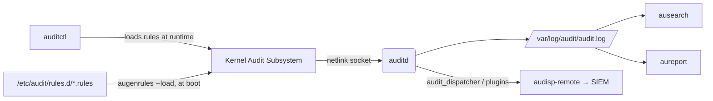

# Auditing with auditd

## Overview

`auditd` is the Linux Audit Framework's userspace daemon — it receives kernel-generated audit events and writes them to `/var/log/audit/audit.log`, giving administrators a tamper-evident record of security-relevant activity: who ran what, which files were read or changed, and which syscalls executed. It complements [System-Logging-with-journald](System-Logging-with-journald.md) (which captures application/service messages) by focusing on kernel-level, forensic-grade events tied to CIS and NIST 800-53 control requirements, and it is the backbone of the host-based monitoring controls described in [Readme](../Security-Firewall-and-Monitoring/Readme.md).

> [!IMPORTANT]
> **auditd logs, it does not block**
> The Audit Framework is a **detective**, not a preventive, control. It records what happened; it does not stop the action (with the narrow exception of `-f 2`, panic mode, on rule-load failure). Pair it with SELinux/AppArmor and firewalling for prevention.

## Concepts

| Term | Meaning |
|---|---|
| **Audit daemon (`auditd`)** | Userspace service that reads events from the kernel audit subsystem and writes them to disk. |
| **Audit rules** | Definitions of what to watch: syscalls, files/directories (watches), or filters by UID/arch/exit code. |
| **`auditctl`** | Runtime tool to load, list, and delete rules against the running kernel (non-persistent by default). |
| **`/etc/audit/rules.d/*.rules`** | Persistent rule files loaded by `augenrules` at boot, compiled into `audit.rules`. |
| **`ausearch`** | Query tool to search `audit.log` by key, syscall, UID, time range, event ID, etc. |
| **`aureport`** | Summarization tool that turns raw events into human-readable reports (logins, file access, commands). |
| **Audit key (`-k`)** | A tag attached to a rule so matching events can be searched with `ausearch -k <key>`. |
| **`auparse`/`ausyscall`** | Helper libraries/CLIs for parsing raw records and translating syscall numbers to names. |

## Architecture



The kernel intercepts syscalls and file-access attempts, matches them against loaded rules, and pushes matching events over a netlink socket to `auditd`. Rules loaded with `auditctl` live only in kernel memory and vanish on reboot; rules in `/etc/audit/rules.d/` are compiled by `augenrules` into `/etc/audit/audit.rules` and reloaded automatically on boot (and by the `auditd` systemd unit).

## Installation

```bash
# RHEL / CentOS / Rocky / Alma
sudo dnf install -y audit audit-libs

# Debian / Ubuntu
sudo apt update && sudo apt install -y auditd audispd-plugins

# Enable and start (both families)
sudo systemctl enable --now auditd
sudo systemctl status auditd
```

> [!NOTE]
> **auditd cannot be managed with `systemctl restart` cleanly**
> Because it configures immutable kernel state, prefer `service auditd restart` (RHEL) or reload rules with `augenrules --load` instead of a full daemon restart when only rules changed.

## Configuration

Main daemon config: `/etc/audit/auditd.conf`.

```conf
# /etc/audit/auditd.conf (key settings)
log_file = /var/log/audit/audit.log
log_format = ENRICHED
max_log_file = 50
max_log_file_action = ROTATE
num_logs = 10
space_left = 100
space_left_action = SYSLOG
admin_space_left = 50
admin_space_left_action = SUSPEND
disk_full_action = SUSPEND
disk_error_action = SUSPEND
flush = INCREMENTAL_ASYNC
freq = 50
```

| Setting | Purpose |
|---|---|
| `log_format = ENRICHED` | Resolves UID/GID to names in the log — CIS-recommended over `RAW`. |
| `max_log_file_action = ROTATE` | Rotates instead of silently truncating when the log fills. |
| `space_left_action` / `admin_space_left_action` | Alerting and fail-safe behavior as disk fills — CIS requires action beyond `IGNORE`. |
| `disk_full_action = SUSPEND` (or `HALT`) | Prevents silent audit-loss when the disk is full; `HALT` is stricter but riskier operationally. |

Persistent rules live in `/etc/audit/rules.d/` (one or more `.rules` files, commonly `audit.rules` or `CIS.rules`), compiled with:

```bash
sudo augenrules --load          # compile rules.d/*.rules -> audit.rules and load into kernel
sudo auditctl -l                # confirm loaded rules
```

## Commands

| Command | Description |
|---|---|
| `auditctl -l` | List currently loaded rules. |
| `auditctl -s` | Show audit daemon status (enabled, rate, lost events). |
| `auditctl -D` | Delete all rules (use before reload, not in production without care). |
| `auditctl -w <path> -p rwxa -k <key>` | Add a file/directory watch for read/write/execute/attribute-change. |
| `auditctl -a always,exit -F arch=b64 -S execve -k exec` | Add a syscall rule matching on 64-bit `execve`. |
| `auditctl -e 2` | Lock the audit configuration (immutable until reboot) — required for CIS Level 2. |
| `ausearch -k <key>` | Search log for events tagged with a given key. |
| `ausearch -ui <uid>` | Search events by user ID. |
| `ausearch -ts today -te now` | Search events within a time window. |
| `ausearch -m USER_LOGIN -sv no` | Search for failed login attempts. |
| `aureport -au` | Authentication report. |
| `aureport -f` | File-access report. |
| `aureport --summary` | High-level activity summary. |
| `ausyscall x86_64 <num>` | Translate a syscall number back to its name. |

## Examples

Watch `/etc/passwd` and `/etc/shadow` for changes:

```bash
sudo auditctl -w /etc/passwd -p wa -k passwd_changes
sudo auditctl -w /etc/shadow -p wa -k shadow_changes
```

Watch privilege-escalation binaries for execution:

```bash
sudo auditctl -w /usr/bin/sudo -p x -k privileged_sudo
sudo auditctl -w /usr/bin/su -p x -k privileged_su
```

Persist rules so they survive reboot — add to `/etc/audit/rules.d/hardening.rules`:

```conf
## /etc/audit/rules.d/hardening.rules
-D
-b 8192

# Identity / privilege files
-w /etc/passwd -p wa -k identity
-w /etc/group -p wa -k identity
-w /etc/shadow -p wa -k identity
-w /etc/sudoers -p wa -k sudoers_changes
-w /etc/sudoers.d/ -p wa -k sudoers_changes

# Login/logout records
-w /var/log/faillog -p wa -k logins
-w /var/log/lastlog -p wa -k logins
-w /var/run/utmp -p wa -k session

# Unauthorized access attempts (EACCES/EPERM) to files
-a always,exit -F arch=b64 -S open,openat -F exit=-EACCES -F auid>=1000 -F auid!=4294967295 -k access_denied

# Track use of privileged commands (execve)
-a always,exit -F arch=b64 -S execve -F auid>=1000 -F auid!=4294967295 -k exec_commands

# Make the configuration immutable (must be last line)
-e 2
```

```bash
sudo augenrules --load
sudo systemctl restart auditd   # or reboot, since -e 2 requires it for further changes
```

Query and report:

```bash
ausearch -k passwd_changes -i          # -i = interpret UID/GID to names
aureport -k --summary                  # summary of events per key
ausearch -f /etc/shadow -ts recent
```

## Best Practices

- Use **keys (`-k`)** on every rule — untagged rules are far harder to correlate during an investigation.
- Keep rule files under `/etc/audit/rules.d/`, one per concern (`identity.rules`, `access.rules`, `execution.rules`), so they can be version-controlled and reviewed individually.
- Set `-e 2` (immutable mode) only after rules are finalized and tested — it requires a reboot to change further.
- Ship `audit.log` off-box via `audisp-remote` or a log forwarder; a local-only audit trail can be wiped by an attacker with root.
- Monitor `auditctl -s` for `lost` events — a non-zero value means the kernel buffer (`-b`) is too small for event volume; increase `-b` in the rules file.
- Rotate and retain logs per your compliance window (`max_log_file`, `num_logs` in `auditd.conf`); default retention is often too short for incident response.

## Security Considerations

- **CIS Benchmark alignment**: CIS Linux benchmarks (RHEL/Debian/Ubuntu) mandate auditd installed, enabled, `log_format = ENRICHED`, non-`IGNORE` space-action settings, and specific watch rules for `/etc/passwd`, `/etc/group`, `/etc/shadow`, `/etc/sudoers`, sudo log, `/etc/hosts`, kernel module loading (`init_module`/`delete_module`), and mount operations.
- **NIST 800-53 mapping**: auditd rule coverage maps to `AU-2` (event logging), `AU-3` (content of audit records), `AU-6` (review/analysis), and `AC-6(9)` (privileged function logging).
- **Protect the audit trail**: restrict `/var/log/audit/` to `root:root 0700` (default), and monitor the audit config files themselves (`-w /etc/audit/ -p wa -k audit_config`) so tampering is itself logged.
- **Immutable mode (`-e 2`)** blocks runtime rule changes (including by root) until reboot — use it on hardened production hosts, but plan maintenance windows since it also blocks legitimate rule updates.
- **Watch for `auditctl -D` abuse**: an attacker or careless admin flushing all rules is a common way audit visibility gets silently disabled — alert on this via your SIEM.
- Do not rely on auditd alone for integrity monitoring; pair file watches with AIDE/Tripwire-style hashing for detecting content changes auditd doesn't capture on its own.

> [!NOTE]
> **📸 Screenshot**
> _Capture: `auditctl -l` output showing loaded watch and syscall rules, alongside `ausearch -k <key> -i` returning a matching interpreted event._

## Troubleshooting

| Symptom | Cause | Fix |
|---|---|---|
| `auditctl -s` shows `enabled 0` | auditd not running or disabled at boot | `systemctl enable --now auditd` |
| Rules disappear after reboot | Rules only added via `auditctl`, not saved to `rules.d/` | Add rules to `/etc/audit/rules.d/*.rules` and run `augenrules --load` |
| `auditctl -D` / rule edits fail with "Operation not permitted" | Audit config is immutable (`-e 2` loaded) | Reboot to clear immutable mode, then reload rules |
| `lost` counter increasing in `auditctl -s` | Kernel audit buffer too small for event rate | Increase `-b <n>` in rules file, reduce noisy rules, raise `freq` in `auditd.conf` |
| Disk fills, auditd suspends logging | `disk_full_action = SUSPEND` triggered | Rotate/archive `audit.log`, increase log partition, tune `max_log_file`/`num_logs` |
| `ausearch` returns nothing for a known event | Wrong time window or key mismatch | Widen `-ts`/`-te`, verify key spelling with `auditctl -l` |
| High CPU from `auditd`/`kauditd` | Overly broad syscall rules (e.g., unfiltered `open`) matching every process | Add `-F auid>=1000 -F auid!=4294967295` filters or narrow to specific paths |

## References

- Red Hat Enterprise Linux — Security Hardening Guide: System Auditing
- `man auditd.conf`, `man auditctl`, `man ausearch`, `man aureport`
- CIS Benchmarks for RHEL/Ubuntu/Debian — Section: System Auditing (auditd)
- NIST SP 800-53 Rev. 5 — AU-2, AU-3, AU-6, AC-6(9)

## Related Notes

- [System-Logging-with-journald](System-Logging-with-journald.md)
- [Readme](../Security-Firewall-and-Monitoring/Readme.md)
- [Reset-Root-Password-and-Protect-GRUB-Boot-Loader](../Security-Firewall-and-Monitoring/Reset-Root-Password-and-Protect-GRUB-Boot-Loader.md)
- [Linux Administration & Server Hardening](../Readme.md) — course hub and map of content
