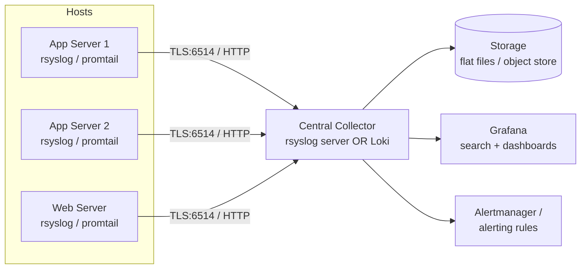

# Centralized Logging

## Overview

Centralized logging collects logs from every host in a fleet into one searchable store, so an admin investigating an incident does not have to SSH into dozens of machines one at a time. This note builds on [Logging-with-rsyslog](Logging-with-rsyslog.md) (which covers single-host `rsyslog` configuration) by turning it into a fan-in log server, and it complements [Dashboards-with-Grafana](Dashboards-with-Grafana.md) by pairing log storage with a query/visualization layer. The two dominant patterns today are a classic **rsyslog central server** (syslog protocol, flat files or a database) and the modern **Grafana Loki + Promtail** stack (label-indexed logs queried with LogQL).

> [!NOTE]
> **Centralized logging is a security control, not just a convenience**
> Shipping logs off-host in near-real-time is one of the few reliable defenses against an attacker who gains root and wants to cover their tracks by editing local log files. Treat the log pipeline itself as a hardening target: it needs its own access control, encryption in transit, and retention policy.

## Concepts

| Term | Meaning |
|---|---|
| **Log shipper / forwarder** | Agent on each host that reads local logs and sends them onward (`rsyslog`, `promtail`, `fluentd`, `filebeat`) |
| **Aggregator / collector** | Central service that receives shipped logs (`rsyslog` server, `loki`) |
| **Index vs. full-text store** | rsyslog with a flat file is full-text (grep-based); Loki indexes only labels (job, host, level) and compresses log bodies, keeping cost low |
| **Retention** | How long logs are kept before deletion/rotation — driven by compliance (PCI-DSS, HIPAA), disk budget, and incident-response window |
| **RFC 5424 / RFC 3164** | Syslog message formats — 5424 (modern, structured) vs. 3164 (legacy BSD syslog) |
| **LogQL** | Loki's query language, similar to PromQL but for logs (`{job="nginx"} |= "error"`) |

## Architecture



Two viable back ends:

- **rsyslog central server** — every host's `rsyslog` forwards via TCP/TLS to a receiver; the receiver writes per-host/per-program files (or a database via `ommysql`/`ompgsql`). Simple, mature, works everywhere `rsyslog` runs.
- **Loki + Promtail** — Promtail tails log files (or reads the systemd journal) on each host and pushes to Loki over HTTP; Loki indexes only labels, storing log content in cheap object storage (S3, GCS, or local filesystem). Grafana queries Loki directly with LogQL.

## Installation

**rsyslog client and server (RHEL/Debian — same package name):**

```bash
# RHEL/CentOS/Fedora
sudo dnf install -y rsyslog rsyslog-gnutls

# Debian/Ubuntu
sudo apt update && sudo apt install -y rsyslog rsyslog-gnutls
```

**Loki + Promtail (binary install, both families):**

```bash
# On the central collector — Loki
LOKI_VER="2.9.8"
curl -fsSL -o loki.zip "https://github.com/grafana/loki/releases/download/v${LOKI_VER}/loki-linux-amd64.zip"
unzip loki.zip && sudo install -m 0755 loki-linux-amd64 /usr/local/bin/loki

# On every shipped-from host — Promtail
curl -fsSL -o promtail.zip "https://github.com/grafana/loki/releases/download/v${LOKI_VER}/promtail-linux-amd64.zip"
unzip promtail.zip && sudo install -m 0755 promtail-linux-amd64 /usr/local/bin/promtail
```

> [!TIP]
> **Prefer the distro/container-native path in production**
> Grafana Labs ships official APT/YUM repos and container images for Loki/Promtail; pin a version and use those instead of ad hoc binary downloads for anything beyond a lab.

## Configuration

### rsyslog central server (receiver)

`/etc/rsyslog.d/10-server.conf` on the collector — TLS-wrapped TCP on 6514, one file per remote host:

```conf
# Load TLS-capable TCP input module
module(load="imtcp"
       StreamDriver.Name="gtls"
       StreamDriver.Mode="1"
       StreamDriver.Authmode="anon")

global(
  DefaultNetstreamDriver="gtls"
  DefaultNetstreamDriverCAFile="/etc/rsyslog.d/ca.pem"
  DefaultNetstreamDriverCertFile="/etc/rsyslog.d/server-cert.pem"
  DefaultNetstreamDriverKeyFile="/etc/rsyslog.d/server-key.pem"
)

input(type="imtcp" port="6514")

# Route by remote hostname into /var/log/remote/<host>/<program>.log
template(name="RemoteLogs" type="string"
         string="/var/log/remote/%HOSTNAME%/%PROGRAMNAME%.log")

if $fromhost-ip != '127.0.0.1' then {
    action(type="omfile" dynaFile="RemoteLogs")
    stop
}
```

### rsyslog client (shipper)

`/etc/rsyslog.d/90-forward.conf` on every host being shipped from:

```conf
module(load="omfwd")
global(
  DefaultNetstreamDriver="gtls"
  DefaultNetstreamDriverCAFile="/etc/rsyslog.d/ca.pem"
)

action(type="omfwd"
       target="log-collector.internal"
       port="6514"
       protocol="tcp"
       StreamDriver="gtls"
       StreamDriverMode="1"
       StreamDriverAuthMode="x509/name"
       StreamDriverPermittedPeers="log-collector.internal"
       action.resumeRetryCount="-1"        # queue and retry indefinitely on outage
       queue.type="linkedList"
       queue.filename="fwdq"
       queue.saveOnShutdown="on")
```

Restart both ends:

```bash
sudo systemctl restart rsyslog
```

### Promtail (shipper) — `/etc/promtail/config.yml`

```yaml
server:
  http_listen_port: 9080

positions:
  filename: /var/lib/promtail/positions.yaml

clients:
  - url: https://loki-collector.internal:3100/loki/api/v1/push
    basic_auth:
      username: promtail
      password_file: /etc/promtail/loki-password

scrape_configs:
  - job_name: syslog
    static_configs:
      - targets: [localhost]
        labels:
          job: syslog
          host: ${HOSTNAME}
          __path__: /var/log/syslog
  - job_name: journal
    journal:
      max_age: 12h
      labels:
        job: systemd-journal
```

### Loki (collector) — `/etc/loki/config.yml` (key retention block)

```yaml
limits_config:
  retention_period: 744h        # 31 days

compactor:
  working_directory: /var/loki/compactor
  retention_enabled: true
  retention_delete_delay: 2h

schema_config:
  configs:
    - from: 2024-01-01
      store: tsdb
      object_store: filesystem
      schema: v13
      index:
        prefix: index_
        period: 24h
```

## Commands

| Task | rsyslog world | Loki/Promtail world |
|---|---|---|
| Check service status | `systemctl status rsyslog` | `systemctl status loki promtail` |
| Test config syntax | `rsyslogd -N1` | `loki -config.file=/etc/loki/config.yml -verify-config` |
| Tail live central logs | `tail -f /var/log/remote/webserver01/nginx.log` | `logcli query '{host="webserver01"}' --tail` |
| Search last hour, one host | `grep "ERROR" /var/log/remote/web01/*.log` | `logcli query '{host="web01"} |= "ERROR"' --since=1h` |
| Check shipper queue backlog | `ls -la /var/spool/rsyslog/` | `curl localhost:9080/metrics \| grep promtail_read_lines_total` |
| Force log rotation now | `logrotate -f /etc/logrotate.d/rsyslog` | N/A (compactor handles retention) |
| Verify TLS handshake | `openssl s_client -connect log-collector.internal:6514` | `curl -v https://loki-collector.internal:3100/ready` |

## Examples

Query nginx 5xx errors across the whole fleet in the last 30 minutes (LogQL, run in Grafana Explore or `logcli`):

```text
{job="nginx"} |= "HTTP/1.1\" 5" | logfmt | __error__=""
```

Count failed SSH logins per host over the last day (LogQL):

```text
sum by (host) (count_over_time({job="syslog"} |= "Failed password" [24h]))
```

rsyslog: forward only `auth`/`authpriv` facility (security-relevant) to a separate, stricter-retention file while everything else goes to the general remote log:

```conf
if $syslogfacility-text == 'auth' or $syslogfacility-text == 'authpriv' then {
    action(type="omfile" file="/var/log/remote/security/auth.log")
    stop
}
```

## Best Practices

- Ship logs **off-host as close to real-time as possible** — a local-only log is one `rm` away from disappearing after a compromise.
- Use **disk-assisted queues** (`queue.type="linkedList"` + `queue.filename`) on shippers so a network blip or collector outage doesn't drop events.
- Set **retention by data class**: security/audit logs (auth, sudo, firewall) longer than debug/application logs; align with your compliance regime.
- **Tag/label consistently** (`host`, `job`, `env`, `service`) so cross-host queries stay simple — decide the label schema before rollout, not after.
- Monitor the **pipeline itself**: alert on shipper-down, queue-depth-growing, or collector-disk-nearly-full — a silent logging outage is worse than no logging, because it creates false confidence.
- Keep clocks synchronized (NTP/chrony) across the fleet — see [Readme](../Process-Service-and-Job-Management/Readme.md) if present — otherwise cross-host log correlation is unreliable.

## Security Considerations

- **Encrypt in transit**: use TLS (rsyslog `gtls` driver, Loki behind HTTPS/reverse proxy) — never ship logs over plaintext UDP syslog (port 514) across untrusted networks (CIS control: protect audit information).
- **Authenticate shippers**: mutual TLS client certs (rsyslog `x509/name`) or basic-auth/API keys (Promtail→Loki) so an attacker on the network can't inject forged log entries.
- **Write-once / append-only** where possible on the collector — restrict file permissions (`0640`, owned by a dedicated `syslog`/`loki` user) so a compromised shipper account cannot rewrite history.
- **Segregate audit logs** (auth, sudo, `auditd`) from general application logs with tighter access control — these are the logs an incident responder needs untampered (aligns with NIST SP 800-53 AU-9, protection of audit information).
- **Restrict collector network exposure**: firewall port 6514/3100 to known shipper IPs only (`firewalld`/`nftables`); never expose the Loki push API to the internet unauthenticated.
- **Retention vs. right-to-be-forgotten / storage cost**: define and document a retention period; don't keep everything forever by default — it becomes both a cost sink and a data-breach liability.
- Rotate credentials used by shippers (basic-auth passwords, TLS client certs) on a schedule, and revoke immediately when decommissioning a host.

> [!WARNING]
> **Don't rely on local rsyslog rotation as your retention policy**
> `logrotate` on individual hosts governs local disk usage, not your actual audit trail. The **central** collector's retention config (Loki compactor, or a cron `find -mtime +N -delete` on the rsyslog server) is the real retention boundary — verify it separately.

> [!NOTE]
> **📸 Screenshot**
> _Capture: Grafana Explore view running a LogQL query against Loki, showing log lines from multiple `host` labels with the query bar and result panel visible._

## References

- [rsyslog official documentation](https://www.rsyslog.com/doc/)
- [Grafana Loki documentation](https://grafana.com/docs/loki/latest/)
- [LogQL query language reference](https://grafana.com/docs/loki/latest/query/)
- NIST SP 800-53 Rev. 5, AU family (Audit and Accountability)
- CIS Benchmarks — Logging and Auditing sections (distro-specific)

## Related Notes

- [Logging with rsyslog](Logging-with-rsyslog.md)
- [Dashboards with Grafana](Dashboards-with-Grafana.md)
- [Linux Administration & Server Hardening](../Readme.md) — course hub and map of content
