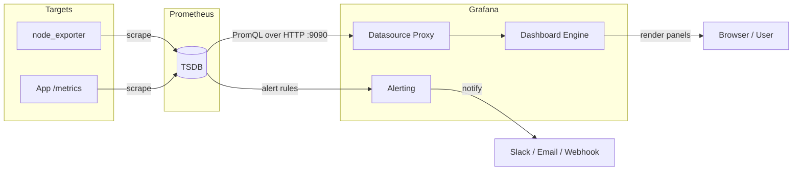

# Dashboards with Grafana

## Overview

Grafana is an open-source visualization and dashboarding platform that queries time-series backends — most commonly [Prometheus](Metrics-with-Prometheus.md) — and renders the data as graphs, tables, and alerts. Where Prometheus stores and scrapes metrics, Grafana turns those raw series into human-readable dashboards that an SRE actually looks at during an incident, so the two are almost always deployed together in the same monitoring stack. This note covers installing Grafana, wiring up a Prometheus datasource, building and importing dashboards, using template variables, and hardening the default configuration for production.

> [!TIP]
> **Mental Model**
> Grafana does not store metrics itself — it is purely a query and rendering layer on top of a datasource (Prometheus, Loki, InfluxDB, etc.). If a dashboard shows no data, the fault is almost always in the datasource connection or the underlying PromQL query, not in Grafana.

## Concepts

| Term | Meaning |
|---|---|
| Datasource | A configured connection to a backend (Prometheus, Loki, MySQL, etc.) that Grafana queries |
| Dashboard | A JSON document describing a collection of panels, variables, and layout |
| Panel | A single visualization (time series, stat, table, gauge, heatmap) bound to one or more queries |
| Template variable | A dashboard-level dropdown (`$var`) that parameterizes queries — e.g. `instance`, `job`, `namespace` |
| Data source proxy | Grafana server-side component that forwards browser queries to the datasource, keeping credentials off the client |
| Organization | A tenant boundary inside a single Grafana instance; each org has its own dashboards, users, and datasources |
| Folder | A grouping container for dashboards, used for permissions and organization |
| Provisioning | Defining datasources/dashboards as YAML/JSON files on disk instead of via the UI, so config is version-controlled |

## Architecture



Grafana itself is stateless with respect to metrics: it holds only dashboards, users, and datasource definitions in its own database (SQLite by default, PostgreSQL/MySQL recommended for production/HA).

## Installation

**Debian/Ubuntu (APT repository):**

```bash
sudo apt-get install -y apt-transport-https software-properties-common wget
sudo mkdir -p /etc/apt/keyrings/
wget -q -O - https://apt.grafana.com/gpg.key | gpg --dearmor | sudo tee /etc/apt/keyrings/grafana.gpg > /dev/null
echo "deb [signed-by=/etc/apt/keyrings/grafana.gpg] https://apt.grafana.com stable main" | \
  sudo tee /etc/apt/sources.list.d/grafana.list

sudo apt-get update
sudo apt-get install -y grafana

sudo systemctl enable --now grafana-server
```

**RHEL/CentOS/Fedora (YUM/DNF repository):**

```bash
cat <<'EOF' | sudo tee /etc/yum.repos.d/grafana.repo
[grafana]
name=grafana
baseurl=https://rpm.grafana.com
repo_gpgcheck=1
enabled=1
gpgcheck=1
gpgkey=https://rpm.grafana.com/gpg.key
sslverify=1
sslcacert=/etc/pki/tls/certs/ca-bundle.crt
EOF

sudo dnf install -y grafana
sudo systemctl enable --now grafana-server
```

**Firewall (both families):** Grafana listens on TCP `3000` by default.

```bash
# firewalld (RHEL family)
sudo firewall-cmd --permanent --add-port=3000/tcp
sudo firewall-cmd --reload

# ufw (Debian family)
sudo ufw allow 3000/tcp
```

Verify the service and default login (`admin`/`admin`, forced change on first login):

```bash
systemctl status grafana-server
curl -s http://localhost:3000/api/health
```

## Configuration

Grafana's main config file is `/etc/grafana/grafana.ini`. Key sections to review before going to production:

```ini
[server]
protocol = https
http_addr =
http_port = 3000
domain = grafana.example.com
cert_file = /etc/grafana/ssl/grafana.crt
cert_key = /etc/grafana/ssl/grafana.key
root_url = https://grafana.example.com/

[database]
type = postgres
host = 127.0.0.1:5432
name = grafana
user = grafana
password = $__file{/etc/grafana/secrets/db_password}

[security]
admin_user = admin
admin_password = $__file{/etc/grafana/secrets/admin_password}
secret_key = $__file{/etc/grafana/secrets/secret_key}
disable_gravatar = true
cookie_secure = true
strict_transport_security = true

[auth.anonymous]
enabled = false

[users]
allow_sign_up = false
auto_assign_org_role = Viewer
```

Restart to apply:

```bash
sudo systemctl restart grafana-server
```

### Adding the Prometheus datasource

**Via UI:** *Connections → Data sources → Add data source → Prometheus* → set URL `http://localhost:9090` → *Save & test*.

**Via provisioning (preferred for reproducibility)** — drop a YAML file in `/etc/grafana/provisioning/datasources/`:

```yaml
# /etc/grafana/provisioning/datasources/prometheus.yaml
apiVersion: 1

datasources:
  - name: Prometheus
    type: prometheus
    access: proxy
    url: http://localhost:9090
    isDefault: true
    editable: false
    jsonData:
      httpMethod: POST
      timeInterval: 15s
```

Restart Grafana and confirm the datasource is green under *Connections → Data sources → Prometheus → Save & test*.

### Provisioning dashboards from disk

```yaml
# /etc/grafana/provisioning/dashboards/dashboards.yaml
apiVersion: 1

providers:
  - name: default
    orgId: 1
    folder: "Linux Hosts"
    type: file
    disableDeletion: false
    updateIntervalSeconds: 30
    options:
      path: /var/lib/grafana/dashboards
```

Place exported dashboard JSON files in `/var/lib/grafana/dashboards`; Grafana reloads them automatically on the configured interval, so dashboards can live in version control alongside the rest of the monitoring stack.

## Commands

| Task | Command |
|---|---|
| Start/stop/status | `sudo systemctl start\|stop\|status grafana-server` |
| Reset admin password | `sudo grafana-cli admin reset-admin-password <newpass>` |
| List installed plugins | `grafana-cli plugins ls` |
| Install a plugin | `sudo grafana-cli plugins install grafana-piechart-panel` |
| Validate config syntax | `grafana-server -config /etc/grafana/grafana.ini -homepath /usr/share/grafana cfg:default.log.mode=console` |
| Health check API | `curl -s http://localhost:3000/api/health` |
| Export dashboard JSON | *Dashboard → Share → Export → Save to file* (or `GET /api/dashboards/uid/<uid>`) |
| Import dashboard by ID | *Dashboards → New → Import* → enter grafana.com dashboard ID |

## Examples

**Import the standard Node Exporter Full dashboard** (ID `1860` on grafana.com):

1. *Dashboards → New → Import*.
2. Enter `1860` in *Import via grafana.com*.
3. Select the `Prometheus` datasource created above.
4. Click *Import*.

**A minimal PromQL panel query** for CPU usage per instance:

```text
100 - (avg by (instance) (rate(node_cpu_seconds_total{mode="idle"}[5m])) * 100)
```

**Template variable for host filtering** (*Dashboard settings → Variables → New*):

```text
Name:  instance
Type:  Query
Query: label_values(node_uname_info, instance)
Multi-value: enabled
Include All option: enabled
```

Reference it in any panel query as `$instance`:

```text
node_load1{instance=~"$instance"}
```

Chained variable example — a `job` variable narrows the `instance` variable's options:

```text
# instance variable query, dependent on $job
label_values(up{job=~"$job"}, instance)
```

## Best Practices

- Provision datasources and dashboards as code (YAML/JSON in git) rather than clicking through the UI — makes disaster recovery and review trivial.
- Use a real database backend (PostgreSQL/MySQL) instead of the default SQLite once more than one Grafana instance or HA is needed.
- Build dashboards with template variables (`$instance`, `$job`, `$namespace`) instead of one dashboard per host.
- Set sensible panel refresh intervals (`30s`–`1m`) — sub-10s refresh on large dashboards adds unnecessary load to Prometheus.
- Tag dashboards and organize into folders by team/service for discoverability at scale.
- Pin dashboard and datasource UIDs in provisioning files so links and alert rules survive re-imports.

## Security Considerations

- **Disable anonymous access and public sign-up** (`[auth.anonymous] enabled = false`, `[users] allow_sign_up = false`) — CIS-aligned least-privilege default.
- **Terminate TLS** at Grafana or a reverse proxy in front of it; never run the web UI over plain HTTP beyond localhost (NIST SP 800-52).
- **Rotate the default admin password immediately** and store secrets (`admin_password`, `secret_key`, DB credentials) via `$__file{}` references or environment variables, never in plaintext in `grafana.ini` under version control.
- **Integrate with SSO/LDAP/OAuth** for real organizations instead of local accounts; enforce MFA at the identity provider.
- **Use role-based access control (RBAC)**: assign Viewer by default (`auto_assign_org_role = Viewer`), grant Editor/Admin only where required, and scope datasource permissions per team.
- **Restrict the Prometheus datasource network path** — Grafana should reach Prometheus over a private/internal network segment, not the public internet.
- **Keep Grafana patched**: subscribe to Grafana security advisories; CVEs affecting the alerting engine and plugin sandbox have been exploited in the wild.
- **Audit plugin installs**: only install plugins from the official catalog; third-party plugins run with server-side privileges.

> [!WARNING]
> **Default Credentials**
> A freshly installed Grafana instance uses `admin`/`admin` and listens on all interfaces by default. Treat first login and firewall exposure as day-zero hardening tasks, not follow-ups.

> [!NOTE]
> **📸 Screenshot**
> _Capture: the Grafana dashboard editor showing a time-series panel bound to the Prometheus datasource with the `$instance` template variable dropdown visible in the top toolbar._

## Troubleshooting

| Symptom | Likely Cause | Fix |
|---|---|---|
| "No data" on all panels | Datasource URL unreachable or Prometheus down | `curl http://localhost:9090/-/healthy`; check `Save & test` on the datasource |
| Datasource test fails with connection refused | Firewall blocking Grafana → Prometheus path | Verify `firewall-cmd`/`ufw` rules and Prometheus `--web.listen-address` |
| Dashboard shows old data only | Panel or dashboard refresh interval too long | Set refresh in top-right dashboard picker or panel edit |
| Provisioned dashboard not appearing | Wrong `path` in dashboards.yaml or JSON parse error | Check `journalctl -u grafana-server` for provisioning errors |
| 502/504 behind reverse proxy | Missing `root_url` / proxy headers misconfigured | Set `[server] root_url` and forward `X-Forwarded-Proto`/`Host` |
| Login page loops after SSO setup | Callback URL mismatch | Confirm `root_url` matches the IdP redirect URI exactly |
| High memory usage on large dashboards | Too many panels/high cardinality queries | Reduce panel count per dashboard, use recording rules in Prometheus |

## References

- Grafana official documentation: https://grafana.com/docs/grafana/latest/
- Grafana provisioning reference: https://grafana.com/docs/grafana/latest/administration/provisioning/
- Grafana security hardening guide: https://grafana.com/docs/grafana/latest/setup-grafana/configure-security/
- grafana.com dashboard library (Node Exporter Full, ID 1860): https://grafana.com/grafana/dashboards/

## Related Notes

- [Metrics with Prometheus](Metrics-with-Prometheus.md)
- [Linux Administration & Server Hardening](../Readme.md) — course hub and map of content
