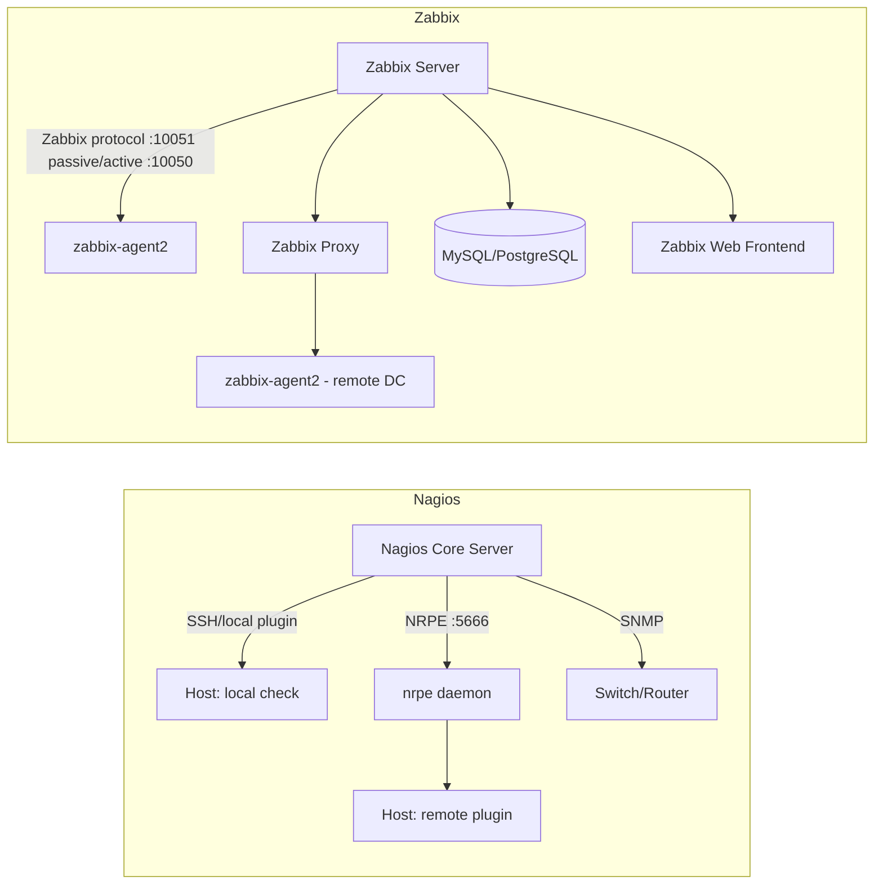

# Infrastructure Monitoring with Nagios and Zabbix

## Overview

Nagios and Zabbix are the two most widely deployed open-source infrastructure monitoring platforms, and both solve a different slice of the "is my fleet healthy" problem than the lightweight tools covered in [Service-Monitoring-with-Monit](Service-Monitoring-with-Monit.md) or the pull-based metrics model in [Metrics-with-Prometheus](Metrics-with-Prometheus.md). Nagios is a check-execution engine: a central server runs plugins on a schedule and evaluates their exit codes as OK/WARNING/CRITICAL/UNKNOWN, historically extended to remote hosts via NRPE. Zabbix is a full monitoring *system* — server, database, web UI, and agent — that natively stores time-series metrics, ships with templates for common services, and layers triggers, graphs, and auto-discovery on top without needing a separate TSDB.

> [!NOTE]
> **Scope**
> This note covers Nagios Core (checks, plugins, NRPE) and Zabbix (server/agent/proxy, templates, triggers), and gives a decision framework for choosing between them, Monit, and Prometheus for a given environment.

## Concepts

| Concept | Nagios | Zabbix |
|---|---|---|
| Core model | Active/passive **check** execution, plugin exit codes | Agent/server **item** collection into a built-in TSDB |
| Data storage | None natively (status only; add-ons like PNP4Nagios/Graphite for history) | Built-in (MySQL/PostgreSQL/TimescaleDB/Elasticsearch) |
| Remote execution | NRPE / NSCA / SSH / SNMP | Zabbix Agent (active/passive), Zabbix Proxy, SNMP, IPMI |
| Config style | Flat text object files (`define host {}`, `define service {}`) | Web UI + API-managed, exportable as XML/YAML/JSON templates |
| Extensibility | Any script returning exit codes 0-3 | Agent UserParameters, custom items, low-level discovery (LLD) |
| Visualization | Basic web UI; Grafana/PNP4Nagios for graphs | Native graphs, maps, dashboards, screens |
| Alerting | Contacts/escalations via notification commands | Actions, escalation steps, media types (email/SMS/webhook) |

**Check states (both tools share this idiom):**

| Exit code | Nagios/Zabbix meaning |
|---|---|
| 0 | OK |
| 1 | WARNING |
| 2 | CRITICAL |
| 3 | UNKNOWN |

## Architecture



Nagios is check-pull only from the server (or NSCA push for passive checks); Zabbix agents can run in **passive** mode (server polls the agent) or **active** mode (agent pushes to the server, useful behind NAT/firewalls), and a **Zabbix Proxy** offloads collection for remote sites or WAN-separated segments.

## Installation

### Nagios Core + NRPE (RHEL/Rocky/Alma)

```bash
# Server
sudo dnf install -y epel-release
sudo dnf install -y nagios nagios-plugins-all nagios-plugins-nrpe httpd
sudo htpasswd -c /etc/nagios/passwd nagiosadmin
sudo systemctl enable --now nagios httpd

# Monitored host (client)
sudo dnf install -y nrpe nagios-plugins-all
sudo systemctl enable --now nrpe
sudo firewall-cmd --permanent --add-port=5666/tcp && sudo firewall-cmd --reload
```

### Nagios Core + NRPE (Debian/Ubuntu)

```bash
# Server
sudo apt update
sudo apt install -y nagios4 nagios-plugins-contrib monitoring-plugins nagios-nrpe-plugin
sudo systemctl enable --now nagios4

# Monitored host (client)
sudo apt install -y nagios-nrpe-server monitoring-plugins
sudo systemctl enable --now nagios-nrpe-server
sudo ufw allow from <nagios_server_ip> to any port 5666 proto tcp
```

### Zabbix Server (RHEL/Rocky/Alma)

```bash
sudo dnf install -y https://repo.zabbix.com/zabbix/6.4/rhel/9/x86_64/zabbix-release-6.4-1.el9.noarch.rpm
sudo dnf install -y zabbix-server-pgsql zabbix-web-pgsql zabbix-nginx-conf zabbix-sql-scripts zabbix-agent2

sudo -u postgres createuser --pwprompt zabbix
sudo -u postgres createdb -O zabbix zabbix
zcat /usr/share/zabbix-sql-scripts/postgresql/server.sql.gz | sudo -u zabbix psql zabbix

sudo sed -i 's/^# DBPassword=.*/DBPassword=StrongPassHere/' /etc/zabbix/zabbix_server.conf
sudo systemctl enable --now zabbix-server zabbix-nginx-conf zabbix-agent2 php-fpm
```

### Zabbix Agent (Debian/Ubuntu client)

```bash
wget https://repo.zabbix.com/zabbix/6.4/ubuntu/pool/main/z/zabbix-release/zabbix-release_6.4-1+ubuntu22.04_all.deb
sudo dpkg -i zabbix-release_6.4-1+ubuntu22.04_all.deb
sudo apt update
sudo apt install -y zabbix-agent2
sudo systemctl enable --now zabbix-agent2
```

## Configuration

### Nagios: defining a host and NRPE-backed service check

`/etc/nagios/objects/servers.cfg` (or `/etc/nagios4/objects/` on Debian):

```conf
define host {
    use                     linux-server
    host_name               web01
    alias                   Web Server 01
    address                 10.0.1.11
    max_check_attempts      3
    check_period            24x7
    notification_interval   30
    notification_period     24x7
}

define service {
    use                     generic-service
    host_name               web01
    service_description     Disk Usage /
    check_command           check_nrpe!check_disk_root
    check_interval          5
    retry_interval          1
}
```

On the client, `/etc/nagios/nrpe.cfg`:

```conf
allowed_hosts=127.0.0.1,10.0.1.5
command[check_disk_root]=/usr/lib64/nagios/plugins/check_disk -w 20% -c 10% -p /
command[check_load]=/usr/lib64/nagios/plugins/check_load -w 5,4,3 -c 10,8,6
```

```bash
sudo nagios -v /etc/nagios/nagios.cfg   # validate config before reload
sudo systemctl reload nagios
```

### Zabbix: linking a template via the frontend/API

```bash
# Quick host registration via API (curl) instead of clicking through the UI
curl -s -X POST http://localhost/zabbix/api_jsonrpc.php \
  -H 'Content-Type: application/json-rpc' \
  -d '{
    "jsonrpc":"2.0","method":"host.create",
    "params":{
      "host":"web01",
      "interfaces":[{"type":1,"main":1,"useip":1,"ip":"10.0.1.11","dns":"","port":"10050"}],
      "groups":[{"groupid":"2"}],
      "templates":[{"templateid":"10001"}]
    },
    "auth":"<api_token>","id":1
  }'
```

Template `Linux by Zabbix agent active` auto-creates items (CPU, memory, disk, network), triggers, and **low-level discovery** rules (e.g. filesystem discovery) with zero manual per-host config — this is the core productivity win over Nagios's flat-file model.

## Commands

| Task | Nagios | Zabbix |
|---|---|---|
| Validate config | `nagios -v nagios.cfg` | `zabbix_server -R config_cache_reload` |
| Reload | `systemctl reload nagios` | `systemctl restart zabbix-server` |
| Test plugin manually | `/usr/lib64/nagios/plugins/check_disk -w 20% -c 10% -p /` | `zabbix_get -s <host> -k vfs.fs.size[/,pfree]` |
| Test agent item | `/usr/lib64/nagios/plugins/check_nrpe -H web01 -c check_disk_root` | `zabbix_agent2 -t agent.ping` (on the agent host) |
| Tail logs | `tail -f /var/log/nagios/nagios.log` | `tail -f /var/log/zabbix/zabbix_server.log` |
| Ack/silence | Web UI "Acknowledge" | Web UI "Problems → Acknowledge" or `event.acknowledge` API |

## Examples

Custom NRPE check for a service:

```bash
# /etc/nagios/nrpe.cfg on client
command[check_nginx_proc]=/usr/lib64/nagios/plugins/check_procs -c 1: -C nginx
```

Zabbix UserParameter equivalent, in `/etc/zabbix/zabbix_agent2.d/userparameter_nginx.conf`:

```conf
UserParameter=nginx.proc.count,pgrep -c nginx
```

```yaml
# Zabbix trigger expression referencing the item above
expression: "last(/web01/nginx.proc.count)=0"
name: "Nginx is not running on {HOST.NAME}"
priority: HIGH
```

## Best Practices

- Use **host/service templates** (Nagios `use` inheritance, Zabbix templates) — never hand-configure every host individually.
- Set sane `retry_interval`/`max_check_attempts` (Nagios) or dependent-item polling (Zabbix) to avoid alert flapping on transient blips.
- Keep NRPE `allowed_hosts` and Zabbix agent `Server=` directives locked to the monitoring server's IP only.
- Use Zabbix **active** agent checks (or Nagios passive/NSCA) for hosts behind NAT or with restrictive inbound firewalls.
- Layer **dependencies** (Nagios `service dependency` / Zabbix trigger dependencies) so a downed switch doesn't page for every host behind it.
- Prefer Zabbix low-level discovery for dynamic fleets (autoscaling, containers) over static Nagios host definitions.
- Version-control Nagios `.cfg` files and export/import Zabbix templates as YAML for change tracking.

## Security Considerations

- **NRPE is unauthenticated by default beyond `allowed_hosts`** — it does not encrypt traffic unless built with SSL; prefer wrapping in a VPN/private network or use NRPE with `--enable-ssl`, and never expose port 5666 to the internet (CIS control: restrict management-plane ports).
- **Zabbix agent/server traffic on 10050/10051 supports PSK or certificate-based TLS** (`TLSConnect=psk`, `TLSPSKIdentity`) — enable it for any traffic crossing untrusted segments; plaintext is the insecure default.
- Restrict the Nagios/Zabbix **web UI** to admin networks or behind a reverse proxy with MFA; both interfaces have had CVEs enabling RCE via crafted requests when internet-exposed.
- Run check/agent daemons as unprivileged users (`nagios`, `zabbix`) — never as root; grant only the specific `sudo` NOPASSWD entries a plugin genuinely needs (e.g. `check_disk` via `sudo` for restricted mounts), scoped by command, not blanket access.
- Rotate the Zabbix DB password and API tokens; disable the default `Admin/zabbix` account or set a strong password immediately after install (a persistent top-10 default-credential finding in internal pentests).
- Audit NRPE `command[]` definitions for shell-injection risk — never pass unsanitized `$ARG1$` values into a shell command.

> [!WARNING]
> **Legacy exposure**
> NRPE and older Zabbix agent (v1) protocols are frequently found exposed to entire internal subnets or, worse, the internet during external/internal pentests. Both should be firewalled to the monitoring server's IP alone (`iptables`/`firewalld`/`ufw`), never `0.0.0.0/0`.

## Troubleshooting

| Symptom | Likely cause | Fix |
|---|---|---|
| Nagios: `CHECK_NRPE: Error - Could not complete SSL handshake` | SSL mismatch between plugin and nrpe.cfg build | Rebuild both with matching `--enable-ssl`/`--disable-ssl`, or add `-n` to disable SSL on both ends |
| Nagios: `NRPE: Unable to read output` | Plugin timeout or crash on client | Run the command manually on the client as the `nagios`/`nrpe` user |
| Zabbix: host shows "Zabbix agent is not available" | Firewall blocking 10050, or `Server=` mismatch in agent conf | Check `zabbix_get -s <ip> -k agent.ping`; verify `Server=` matches Zabbix server IP |
| Zabbix: items collect but no triggers fire | Trigger expression syntax error or macro typo | Test in Data collection → Triggers → "Test" dialog |
| Zabbix: "database is down" on frontend | DB service stopped or wrong credentials in `zabbix_server.conf` | `systemctl status postgresql`/`mysql`; verify `DBPassword` |
| High false-positive alert rate | Thresholds too tight, no flap detection | Enable Nagios flap detection (`enable_flap_detection=1`); use Zabbix trigger `nodata()`/hysteresis expressions |

> [!NOTE]
> **📸 Screenshot**
> _Capture: Zabbix "Problems" dashboard showing an active trigger alongside a Nagios web UI service status page for the same host, for a side-by-side alerting comparison._

## References

- Nagios Core documentation: https://www.nagios.org/documentation/
- NRPE plugin (Nagios Plugins project): https://github.com/NagiosEnterprises/nrpe
- Zabbix official documentation: https://www.zabbix.com/documentation/current/
- Zabbix API reference: https://www.zabbix.com/documentation/current/en/manual/api
- CIS Benchmarks (monitoring/logging control families): https://www.cisecurity.org/cis-benchmarks

## Related Notes

- [Metrics-with-Prometheus](Metrics-with-Prometheus.md) — pull-based metrics/TSDB alternative for cloud-native and containerized environments
- [Service-Monitoring-with-Monit](Service-Monitoring-with-Monit.md) — lightweight single-host process/resource watchdog vs. fleet-wide monitoring
- [Linux Administration & Server Hardening](../Readme.md) — course hub and map of content
