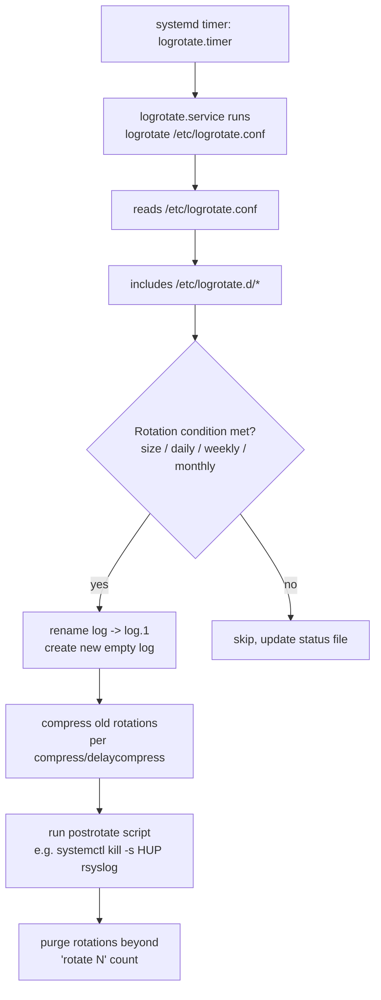

# Log Rotation with logrotate

## Overview

`logrotate` is the standard Linux utility for rotating, compressing, and eventually discarding log files so that services like [Logging-with-rsyslog](Logging-with-rsyslog.md), Apache, or application daemons never fill the disk with unbounded log growth. It runs as a periodic systemd timer (or cron job) that reads a central policy file, `/etc/logrotate.conf`, plus per-application drop-in policies under `/etc/logrotate.d/`, and applies rules such as rotation frequency, size thresholds, retention count, and compression. Getting this right is core to server hardening: unrotated logs are a classic cause of disk-exhaustion outages, and correctly configured rotation is also what keeps audit trails available long enough for incident response without violating retention/compliance windows.

> [!TIP]
> **Rotation, not deletion**
> `logrotate` doesn't just delete old logs — it renames, compresses, optionally mails, and runs `postrotate` scripts (e.g., to signal a daemon to reopen its log file). Understanding the rotate-then-signal sequence is the key to avoiding "log file was rotated but the service kept writing to the deleted inode" bugs.

## Concepts

| Term | Meaning |
|---|---|
| Rotate | Rename the current log (`app.log` → `app.log.1`), start a fresh empty file |
| Retention (`rotate N`) | Keep `N` rotated generations before the oldest is purged |
| Compress | gzip (or other) the rotated file to save disk space |
| `delaycompress` | Skip compressing the most recent rotation (`.1`) for one more cycle, so a process still holding the old fd can finish writing |
| `copytruncate` | Copy the log then truncate the original in place, instead of rename+recreate — used when a program can't be told to reopen its log |
| `postrotate`/`prerotate` | Shell commands run after/before rotation, typically to `HUP`/reload a daemon so it reopens its log file handle |
| State file | `/var/lib/logrotate/logrotate.status` — tracks when each log was last rotated |

## Architecture



On most modern distros (RHEL 8/9, Debian 11+, Ubuntu 20.04+), rotation is triggered by `logrotate.timer` → `logrotate.service` (daily, systemd-managed) rather than a raw `/etc/cron.daily/logrotate` script, though the cron path still exists as a fallback on some systems.

## Installation

logrotate ships by default on nearly every server distribution, but if it's missing:

```bash
# RHEL / CentOS / Fedora / Rocky / Alma
sudo dnf install -y logrotate

# Debian / Ubuntu
sudo apt update && sudo apt install -y logrotate

# Verify
rpm -q logrotate      # RHEL family
dpkg -l | grep logrotate   # Debian family
logrotate --version
```

Confirm the scheduler is enabled:

```bash
# systemd-driven (RHEL 8/9, Debian 11+, Ubuntu 20.04+)
systemctl status logrotate.timer
systemctl list-timers logrotate.timer

# older cron-driven systems
cat /etc/cron.daily/logrotate
```

## Configuration

### `/etc/logrotate.conf` — global defaults

```conf
# /etc/logrotate.conf
weekly
rotate 4
create
dateext
compress
include /etc/logrotate.d

# packages drop per-app configs into /etc/logrotate.d, no need to
# duplicate rotation rules here for wtmp/btmp etc — distro defaults
# already handle those via a stanza below or a separate drop-in.
```

Directives set here are the **defaults** every drop-in file inherits unless overridden locally.

### `/etc/logrotate.d/*` — per-application policy

Each application (or you) should ship one file per service, not edit `logrotate.conf` directly.

```conf
# /etc/logrotate.d/myapp
/var/log/myapp/*.log {
    daily
    rotate 14
    missingok
    notifempty
    compress
    delaycompress
    size 50M
    dateext
    dateformat -%Y%m%d
    create 0640 myapp myapp
    sharedscripts
    postrotate
        systemctl kill -s HUP myapp.service >/dev/null 2>&1 || true
    endscript
}
```

### Key directives reference

| Directive | Effect |
|---|---|
| `daily` / `weekly` / `monthly` | Rotation cadence |
| `size 50M` | Rotate once the log exceeds this size, regardless of cadence (can combine with `daily` — whichever triggers first) |
| `rotate N` | Keep `N` old copies before deleting the oldest |
| `compress` | gzip rotated files (adds `.gz`) |
| `delaycompress` | Defer compressing the newest rotation by one cycle |
| `missingok` | Don't error if the log file doesn't exist |
| `notifempty` | Skip rotation if the log is empty |
| `create 0640 user group` | Recreate the log with these permissions/owner after rotation |
| `copytruncate` | Copy-then-truncate instead of rename (no `postrotate` reload needed, but a small write-loss window exists) |
| `sharedscripts` | Run `postrotate` once for the whole glob, not once per matched file |
| `dateext` / `dateformat` | Suffix rotated files with a date (`app.log-20260722`) instead of `.1`, `.2` |
| `maxage N` | Delete rotated files older than `N` days regardless of `rotate` count |

## Commands

```bash
# Test a config WITHOUT rotating anything (dry run, verbose)
logrotate -d /etc/logrotate.conf

# Test just one drop-in file, verbose, dry run
logrotate -d /etc/logrotate.d/myapp

# Force rotation right now, ignoring cadence/size checks
sudo logrotate -f /etc/logrotate.conf
sudo logrotate -f /etc/logrotate.d/myapp

# Run for real with verbose output (writes to state file)
sudo logrotate -v /etc/logrotate.conf

# Use an alternate state file (useful for testing without touching prod state)
sudo logrotate -s /tmp/test-logrotate.status -v /etc/logrotate.d/myapp

# Inspect last-rotation bookkeeping
cat /var/lib/logrotate/logrotate.status
```

> [!IMPORTANT]
> **Always `-d` before deploying a new stanza**
> `logrotate -d` prints exactly what it *would* do — including whether the size/age condition is currently true — without touching any files or the state file. Run it after every edit to `/etc/logrotate.d/*` before trusting the real timer with it.

## Examples

**Nginx/Apache-style pattern with reload, not restart:**

```conf
/var/log/nginx/*.log {
    daily
    rotate 30
    missingok
    notifempty
    compress
    delaycompress
    sharedscripts
    postrotate
        [ -f /run/nginx.pid ] && kill -USR1 $(cat /run/nginx.pid)
    endscript
}
```

**High-volume log capped by size, with hard age limit for compliance:**

```conf
/var/log/appserver/access.log {
    size 100M
    rotate 10
    maxage 90
    compress
    missingok
    notifempty
    create 0640 appsvc appsvc
}
```

**Using `copytruncate` for a process that can't be signaled to reopen its log:**

```conf
/var/log/legacyapp/output.log {
    weekly
    rotate 6
    copytruncate
    compress
}
```

## Best Practices

- Ship one drop-in per application under `/etc/logrotate.d/` rather than growing `/etc/logrotate.conf` — matches how packages already do it and keeps diffs reviewable.
- Prefer signal/`postrotate`-reopen over `copytruncate` when the daemon supports it (e.g. `SIGHUP`, `systemctl reload`) — `copytruncate` has a race window where writes between copy and truncate are lost.
- Use `sharedscripts` when a stanza's glob matches multiple files but the service only needs one reload.
- Set `create` with explicit mode/owner so a rotated-away log doesn't leave the new file world-readable or owned by root when the app runs as an unprivileged user.
- Combine `size` with `daily`/`weekly` for chatty services — pure time-based rotation can let a busy log balloon between cycles.
- Always test new stanzas with `logrotate -d` before the next scheduled run picks them up.

## Security Considerations

- **CIS control alignment**: CIS Benchmarks for RHEL/Ubuntu require log rotation to be configured (`ensure logrotate is configured` control family) so audit-relevant logs (auth, sudo, application) don't get lost to disk pressure or silently stop being written when a partition fills.
- Set `create 0640 <owner> <group>` (never `0644`/`0666`) on logs containing credentials, session tokens, or PII — the default recreate mode should match least-privilege, not the umask.
- Retain audit-relevant logs (`/var/log/secure`, `/var/log/auth.log`, application audit logs) long enough to meet your incident-response/compliance window — check `rotate`/`maxage` against your org's retention policy (NIST SP 800-92 recommends log retention be a deliberate, documented decision, not a default).
- Ship rotated+compressed logs to a remote log collector (see [Logging-with-rsyslog](Logging-with-rsyslog.md)) before local retention expires — `logrotate` deleting the last local copy should never be the only copy that existed.
- Avoid `postrotate` scripts that run as root with attacker-influenced input (e.g., shelling out to a path constructed from log filenames) — keep `postrotate` commands static and minimal.
- Don't disable `compress` on sensitive logs purely for readability convenience; compressed archives still work with `zcat`/`zgrep` and reduce the window an intruder has to scrape uncompressed plaintext off disk.

> [!NOTE]
> **📸 Screenshot**
> _Capture: output of `logrotate -d /etc/logrotate.d/myapp` showing the dry-run decision (rotate vs skip) and the resulting rename/compress plan._

## Troubleshooting

| Symptom | Likely Cause | Fix |
|---|---|---|
| Log not rotating at all | Stanza not under `/etc/logrotate.d/` or not `include`d | Confirm `include /etc/logrotate.d` is present in `/etc/logrotate.conf` |
| Rotated but service still writes to old (deleted) file | No `postrotate` reload, or reload command wrong | Add correct `SIGHUP`/`systemctl reload` in `postrotate`; verify with `lsof \| grep deleted` |
| "log file turned over too soon" error | Manual rotation ran or size shrank unexpectedly vs status file | Check/clear stale entry in `/var/lib/logrotate/logrotate.status` |
| Disk still filling despite rotation | `rotate N` too high, or `compress` missing, or another log outside logrotate's scope | Audit `du -sh /var/log/*`, tighten `rotate`/add `compress`/add `maxage` |
| Rotation runs but nothing changes | Condition (`size`/`daily`) not yet met | Use `logrotate -d` to see the "not rotating" reason; force with `-f` to confirm the stanza itself works |
| Permission errors during rotation | `create` mode/owner mismatch with app's expected file perms | Match `create` to the app's runtime user/group and required mode |

## References

- `man logrotate` / `man logrotate.conf`
- Red Hat Enterprise Linux System Administrator's Guide — Viewing and Managing Log Files
- CIS Benchmarks (RHEL/Ubuntu) — System Logging / logrotate configuration controls
- NIST SP 800-92 — Guide to Computer Security Log Management

## Related Notes

- [Logging-with-rsyslog](Logging-with-rsyslog.md) — the syslog daemon whose log files `logrotate` typically manages
- [Linux Administration & Server Hardening](../Readme.md) — course hub and map of content
