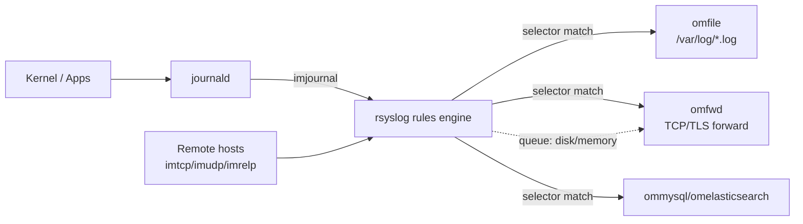

# Logging with rsyslog

## Overview

`rsyslog` is the default system logging daemon on most RHEL-family and Debian-family distributions, collecting messages from the kernel, `systemd` services (via the journal), and applications, then routing them to local files, remote collectors, or databases based on facility/severity rules. It coexists with [System-Logging-with-journald](System-Logging-with-journald.md) — journald typically forwards to rsyslog (`ImportEnvironment`/`imjournal` module) so that traditional flat-file logs under `/var/log/` keep working alongside the structured, indexed journal. Understanding rsyslog's selector syntax, templates, and queueing model is the foundation for building [Centralized-Logging](Centralized-Logging.md) pipelines that ship logs off-host for tamper resistance and long-term retention.

> [!NOTE]
> **rsyslog is RFC 5424/3164 compatible and modular — nearly everything (inputs, outputs, filters, parsing) is implemented as a loadable module (`imfile`, `imtcp`, `omfwd`, `mmjsonparse`, etc.), which is why its config reads like a pipeline rather than a flat rule list.**

## Concepts

### Facilities and severities

Every syslog message carries a **facility** (subsystem that generated it) and a **severity** (urgency). Together they form the *priority* (`facility.severity`) used in selector lines.

| Facility | Meaning |
|---|---|
| `kern` | Kernel messages |
| `user` | Generic user-level messages (default if unset) |
| `mail` | Mail subsystem |
| `daemon` | System daemons |
| `auth` / `authpriv` | Authentication / security (authpriv is restricted, preferred for auth logs) |
| `syslog` | Messages generated by syslogd itself |
| `lpr`, `news`, `uucp` | Legacy subsystems |
| `cron` | Cron/at scheduler |
| `local0`–`local7` | Reserved for local/custom use |

| Severity | Numeric | Meaning |
|---|---|---|
| `emerg` | 0 | System unusable |
| `alert` | 1 | Immediate action required |
| `crit` | 2 | Critical condition |
| `err` | 3 | Error condition |
| `warning` | 4 | Warning condition |
| `notice` | 5 | Normal but significant |
| `info` | 6 | Informational |
| `debug` | 7 | Debug-level detail |

Selector syntax: `facility.severity   action`. `*.*` matches everything; `.=info` matches *only* that severity (not "and above"); `.info;.!=warn` excludes a specific level; `!facility` negates.

### Message flow



## Architecture

- **rsyslogd** reads `/etc/rsyslog.conf`, which `$IncludeConfig`s (legacy) or natively globs `/etc/rsyslog.d/*.conf` (drop-ins) — always prefer drop-ins over editing the main file.
- **Input modules** (`imuxsock`, `imjournal`, `imtcp`, `imudp`, `imfile`, `imrelp`) ingest messages.
- **Rules** filter messages (traditional selectors or RainerScript `if/then` blocks) and route them to **output modules** (`omfile`, `omfwd`, `omrelp`, `ommysql`, `omelasticsearch`).
- **Queues** (in-memory, disk-assisted, or pure disk) buffer messages between input and output so a slow/down remote collector doesn't block local logging.
- **Templates** control the on-wire or on-disk message format (legacy syslog, RFC 5424, JSON).

## Installation

```bash
# RHEL / CentOS / Rocky / Alma
sudo dnf install -y rsyslog
sudo systemctl enable --now rsyslog

# Debian / Ubuntu
sudo apt update && sudo apt install -y rsyslog
sudo systemctl enable --now rsyslog

# TLS support (both families need the gnutls stream driver module)
sudo dnf install -y rsyslog-gnutls        # RHEL family
sudo apt install -y rsyslog-gnutls        # Debian family
```

## Configuration

### /etc/rsyslog.conf skeleton

```conf
# /etc/rsyslog.conf — modules and global directives only; rules go in drop-ins

module(load="imuxsock")     # local system logging socket (/dev/log)
module(load="imjournal" StateFile="imjournal.state")  # pull from journald

global(workDirectory="/var/lib/rsyslog")

# Include all drop-in configs (native globbing, rsyslog 8+)
include(file="/etc/rsyslog.d/*.conf" mode="optional")
```

### Drop-in: local file routing (/etc/rsyslog.d/50-default.conf)

```conf
# Traditional selector syntax
auth,authpriv.*                /var/log/secure       # RHEL uses "secure"
# auth,authpriv.*               /var/log/auth.log     # Debian uses "auth.log"
mail.*                         -/var/log/maillog
cron.*                          /var/log/cron
*.emerg                         :omusrmsg:*
local7.*                        /var/log/boot.log

# Catch-all, excluding auth/mail/cron already routed above
*.info;mail.none;authpriv.none;cron.none   /var/log/messages
```

`-` before a path enables async (buffered) writes for high-volume facilities like `mail`.

### Drop-in: RainerScript filtering (/etc/rsyslog.d/10-filters.conf)

```conf
# Modern property-based filtering, more expressive than selectors
if $programname == 'sshd' and $syslogseverity <= 4 then {
    action(type="omfile" file="/var/log/sshd-warnings.log")
}

# Drop noisy debug messages from a chatty daemon before they hit disk
if $programname == 'noisy-agent' and $syslogseverity == 7 then {
    stop
}
```

### Remote / central logging — collector (server)

```conf
# /etc/rsyslog.d/20-remote-input.conf on the LOG COLLECTOR

module(load="imtcp" StreamDriver.Name="gtls"
       StreamDriver.Mode="1" StreamDriver.Authmode="anon")
module(load="imtcp")

global(
    DefaultNetstreamDriver="gtls"
    DefaultNetstreamDriverCAFile="/etc/pki/rsyslog/ca.pem"
    DefaultNetstreamDriverCertFile="/etc/pki/rsyslog/server-cert.pem"
    DefaultNetstreamDriverKeyFile="/etc/pki/rsyslog/server-key.pem"
)

input(type="imtcp" port="6514" StreamDriver.Mode="1" StreamDriver.Authmode="x509/name")

# Store remote logs per-host, per-program
template(name="RemoteHost" type="string"
         string="/var/log/remote/%HOSTNAME%/%PROGRAMNAME%.log")
*.*   ?RemoteHost
& stop
```

### Remote / central logging — client (forwarder)

```conf
# /etc/rsyslog.d/90-forward.conf on a LOG SHIPPER

global(
    DefaultNetstreamDriver="gtls"
    DefaultNetstreamDriverCAFile="/etc/pki/rsyslog/ca.pem"
)

# Reliable disk-assisted queue so a network blip doesn't drop logs
action(type="omfwd"
       target="log-collector.internal" port="6514" protocol="tcp"
       StreamDriver="gtls" StreamDriverMode="1" StreamDriverAuthMode="x509/name"
       action.resumeRetryCount="-1"
       queue.type="LinkedList"
       queue.filename="fwd_queue"
       queue.saveOnShutdown="on"
       queue.maxDiskSpace="1g")
```

Plain TCP (no TLS) for lab/internal-only use: `*.* @@log-collector.internal:514` (`@@`=TCP, single `@`=UDP — avoid UDP for anything you can't afford to lose).

### Templates

```conf
# JSON output template — ideal for shipping to Elasticsearch/Loki
template(name="JsonLog" type="list") {
    constant(value="{")
    constant(value="\"timestamp\":\"")   property(name="timereported" dateFormat="rfc3339")
    constant(value="\",\"host\":\"")     property(name="hostname")
    constant(value="\",\"severity\":\"") property(name="syslogseverity-text")
    constant(value="\",\"program\":\"")  property(name="programname")
    constant(value="\",\"message\":\"")  property(name="msg" format="json")
    constant(value="\"}\n")
}
*.*  action(type="omfile" file="/var/log/all-json.log" template="JsonLog")
```

## Commands

| Command | Purpose |
|---|---|
| `sudo systemctl restart rsyslog` | Apply config changes |
| `sudo rsyslogd -N1` | Validate config syntax without starting |
| `logger "test message"` | Emit a test message via `user.notice` |
| `logger -p local0.crit "test crit"` | Emit with explicit facility/severity |
| `sudo rsyslogd -f /etc/rsyslog.conf -N1 -v` | Verbose config check with module list |
| `journalctl -u rsyslog -f` | Follow rsyslog's own service log |
| `sudo ss -tlnp \| grep 6514` | Confirm the TLS listener is up on a collector |

## Best Practices

- Keep `/etc/rsyslog.conf` module/global-only; put every rule in a numbered `/etc/rsyslog.d/NN-name.conf` drop-in so ordering is explicit and reviewable.
- Use disk-assisted queues (`queue.type="LinkedList"`, `queue.filename`, `queue.saveOnShutdown="on"`) on every forwarder so log collector downtime doesn't lose data.
- Prefer TCP or RELP over UDP for anything audit-relevant — UDP silently drops under load or during network issues.
- Always encrypt log transport with TLS (`gtls` driver) when logs traverse an untrusted network segment; use mutual x.509 auth (`Authmode="x509/name"`) for central log servers.
- Rotate local files with `logrotate` (rsyslog ships integration via `/etc/logrotate.d/rsyslog`) and set `sudo systemctl kill -s HUP rsyslog` or use the `copytruncate`/`postrotate` hook so rsyslog reopens file handles.
- Test every new rule with `rsyslogd -N1` before restarting the service in production.

## Security Considerations

- **CIS Benchmark alignment**: ensure `/var/log` and log files are owned `root:root` (or distro's syslog user) with mode `0640` or stricter; CIS explicitly checks permissions on `/var/log/syslog`, `/var/log/auth.log`/`secure`, and rsyslog config files.
- Route `auth`/`authpriv` to a restricted, append-only destination — never `local` files world-readable — since these carry authentication events (CIS control on auth logging).
- Ship logs to a **remote, append-only collector** so an attacker with root on a compromised host cannot erase evidence; this is the core rationale behind [Centralized-Logging](Centralized-Logging.md).
- Use TLS with certificate validation for remote forwarding; anonymous/unauthenticated `imtcp` listeners on a collector accept forged log floods (log injection / DoS).
- Set `$FileCreateMode 0640` and `$DirCreateMode 0750` globally to avoid accidentally world-readable logs when new files are created.
- Rate-limit or drop known-noisy, non-actionable facilities at the rsyslog layer (RainerScript `stop`) rather than at the collector, to reduce both attack surface and storage cost from log-flooding.

## Troubleshooting

| Symptom | Likely Cause | Fix |
|---|---|---|
| No logs reaching `/var/log/messages` | Rule ordering / `stop` in an earlier drop-in consumed the message | Check drop-ins alphabetically with `rsyslogd -N1 -v`; remove premature `& stop` |
| Duplicate lines from journald + rsyslog | Both `imjournal` and `imuxsock` reading the same socket | Disable one path or set `imjournal` `StateFile` correctly to avoid re-reading |
| Remote logs not arriving | Firewall blocking port, or `omfwd` action silently failing | `ss -tlnp` on collector; check `queue.filename` disk spool for backlog on client |
| TLS handshake errors | Cert CN mismatch or wrong `Authmode` | Verify `StreamDriverAuthMode` matches cert `x509/name`/`x509/fingerprint`, check CA chain |
| High disk I/O from rsyslog | Synchronous writes on high-volume facility | Prefix path with `-` for async writes, or move to a disk-assisted queue |
| Config won't reload | Syntax error in a drop-in | `sudo rsyslogd -N1` prints the exact file/line |

> [!NOTE]
> **📸 Screenshot**
> _Capture: `rsyslogd -N1 -v` output showing a clean config parse alongside `journalctl -u rsyslog -f` receiving a `logger` test message._

## References

- rsyslog official documentation — https://www.rsyslog.com/doc/
- `man rsyslog.conf`, `man rsyslogd`, `man logger`
- RFC 5424 — The Syslog Protocol
- CIS Benchmarks — Linux (Logging and Auditing section)

## Related Notes

- [System-Logging-with-journald](System-Logging-with-journald.md) — journald internals, `journalctl` filtering, and journal-to-rsyslog forwarding
- [Centralized-Logging](Centralized-Logging.md) — building a log collection pipeline across hosts
- [Linux Administration & Server Hardening](../Readme.md) — course hub and map of content
