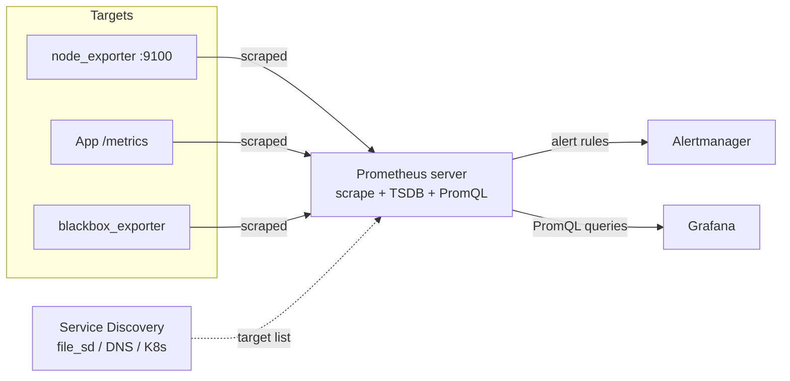

# Metrics with Prometheus

## Overview

Prometheus is an open-source metrics collection and time-series database (TSDB) that **pulls** numeric data from targets over HTTP at regular intervals, storing it locally for querying with PromQL. It underpins the monitoring stack alongside [Dashboards-with-Grafana](Dashboards-with-Grafana.md) for visualization and [Alerting-with-Alertmanager](Alerting-with-Alertmanager.md) for notification routing, and typically pairs with `node_exporter` to expose OS-level host metrics. Understanding the pull model, scrape configuration, and service discovery is prerequisite to running either of those sibling components correctly.

> [!NOTE]
> **Pull vs. Push**
> Prometheus scrapes targets — targets do not push to Prometheus. Short-lived or batch jobs that can't be scraped (cron jobs, CI pipelines) use the separate **Pushgateway** as a workaround, not the default pattern.

## Concepts

| Term | Meaning |
|---|---|
| **Target** | An HTTP endpoint (`/metrics`) Prometheus scrapes on a schedule |
| **Exporter** | A process that translates a system/app's native stats into the Prometheus text exposition format |
| **Scrape** | One HTTP GET of a target's `/metrics` endpoint, on a configured `scrape_interval` |
| **Sample** | A single `(metric_name, labels, value, timestamp)` data point |
| **Time series** | A unique combination of metric name + label set, tracked over time |
| **Metric types** | `counter` (monotonic, resets to 0 on restart), `gauge` (goes up/down), `histogram` (bucketed observations), `summary` (client-side quantiles) |
| **PromQL** | Prometheus's functional query language for slicing and aggregating time series |
| **TSDB** | Prometheus's local, append-only, block-based time-series storage engine |
| **Service discovery (SD)** | Mechanism to auto-populate the target list (file, DNS, Kubernetes, EC2, Consul, etc.) instead of hardcoding IPs |

## Architecture



Data flow: exporters expose current-state metrics in plain text on `/metrics` → Prometheus scrapes each target on `scrape_interval` → samples land in the local TSDB, compacted into 2-hour blocks then merged over time → PromQL reads the TSDB for dashboards (Grafana) and alerting rules (Alertmanager).

## Installation

**Debian/Ubuntu (apt package):**

```bash
sudo apt update
sudo apt install -y prometheus prometheus-node-exporter
sudo systemctl enable --now prometheus prometheus-node-exporter
```

**RHEL/Rocky/Alma (no official repo package — binary install):**

```bash
useradd --no-create-home --shell /usr/sbin/nologin prometheus
mkdir -p /etc/prometheus /var/lib/prometheus

VER=2.53.0
curl -LO https://github.com/prometheus/prometheus/releases/download/v${VER}/prometheus-${VER}.linux-amd64.tar.gz
tar xvf prometheus-${VER}.linux-amd64.tar.gz
cp prometheus-${VER}.linux-amd64/{prometheus,promtool} /usr/local/bin/
cp -r prometheus-${VER}.linux-amd64/{consoles,console_libraries} /etc/prometheus/
chown -R prometheus:prometheus /etc/prometheus /var/lib/prometheus /usr/local/bin/prometheus /usr/local/bin/promtool
```

Create a systemd unit for the binary install:

```ini
# /etc/systemd/system/prometheus.service
[Unit]
Description=Prometheus Monitoring
Wants=network-online.target
After=network-online.target

[Service]
User=prometheus
Group=prometheus
Type=simple
ExecStart=/usr/local/bin/prometheus \
  --config.file=/etc/prometheus/prometheus.yml \
  --storage.tsdb.path=/var/lib/prometheus \
  --storage.tsdb.retention.time=15d \
  --web.listen-address=127.0.0.1:9090

[Install]
WantedBy=multi-user.target
```

```bash
sudo systemctl daemon-reload
sudo systemctl enable --now prometheus
```

node_exporter follows the same binary pattern (`node_exporter` release tarball → `/usr/local/bin/` → systemd unit listening on `:9100`) when not using apt.

## Configuration

Minimal `prometheus.yml` with a static target and a file-based service discovery target:

```yaml
# /etc/prometheus/prometheus.yml
global:
  scrape_interval: 15s       # how often to scrape targets
  evaluation_interval: 15s   # how often to evaluate alerting/recording rules
  external_labels:
    cluster: prod-web
    region: us-east

rule_files:
  - "/etc/prometheus/rules/*.yml"

alerting:
  alertmanagers:
    - static_configs:
        - targets: ["localhost:9093"]

scrape_configs:
  - job_name: "prometheus"
    static_configs:
      - targets: ["localhost:9090"]

  - job_name: "node"
    static_configs:
      - targets: ["web01:9100", "web02:9100", "db01:9100"]
    relabel_configs:
      - source_labels: [__address__]
        regex: '([^:]+):.*'
        target_label: instance

  - job_name: "node-file-sd"
    file_sd_configs:
      - files:
          - "/etc/prometheus/targets/node/*.json"
        refresh_interval: 30s
```

File-based SD target file (lets an external tool — Ansible, Terraform, a CMDB export — drop targets without touching `prometheus.yml`):

```json
[
  {
    "targets": ["app01:9100", "app02:9100"],
    "labels": {
      "env": "production",
      "role": "app-server"
    }
  }
]
```

Validate config and reload without a restart:

```bash
promtool check config /etc/prometheus/prometheus.yml
curl -X POST http://localhost:9090/-/reload   # requires --web.enable-lifecycle
# or
sudo systemctl reload prometheus
```

## Commands

| Command | Purpose |
|---|---|
| `promtool check config prometheus.yml` | Validate main config syntax |
| `promtool check rules alerts.yml` | Validate alerting/recording rule syntax |
| `promtool query instant http://localhost:9090 'up'` | Run a PromQL query from the CLI |
| `curl -s localhost:9090/-/healthy` | Liveness probe |
| `curl -s localhost:9090/-/ready` | Readiness probe (TSDB loaded) |
| `curl -s localhost:9090/api/v1/targets \| jq` | Inspect current scrape target health |
| `curl -s localhost:9100/metrics \| head` | Sanity-check node_exporter is exposing metrics |
| `systemctl status prometheus` | Service status |
| `du -sh /var/lib/prometheus` | Check TSDB disk usage |

## Examples

Common PromQL patterns:

```text
# Is a target up? (1 = up, 0 = down)
up{job="node"}

# CPU busy % per instance (node_exporter)
100 - (avg by (instance) (rate(node_cpu_seconds_total{mode="idle"}[5m])) * 100)

# Memory used %
100 * (1 - (node_memory_MemAvailable_bytes / node_memory_MemTotal_bytes))

# Disk fill rate — predict time to full using linear regression
predict_linear(node_filesystem_avail_bytes{mountpoint="/"}[6h], 4 * 3600) < 0

# HTTP request rate over 5m, per status code
sum by (status) (rate(http_requests_total[5m]))

# 95th percentile request latency from a histogram
histogram_quantile(0.95, sum by (le) (rate(http_request_duration_seconds_bucket[5m])))

# Alert-style expression: instance down for 2+ minutes
up == 0
```

A recording rule to pre-compute an expensive query (referenced by dashboards/alerts as a cheap metric):

```yaml
# /etc/prometheus/rules/recording.yml
groups:
  - name: node_recording_rules
    interval: 30s
    rules:
      - record: instance:node_cpu_utilisation:rate5m
        expr: 100 - (avg by (instance) (rate(node_cpu_seconds_total{mode="idle"}[5m])) * 100)
```

## Best Practices

- Keep `scrape_interval` consistent across similar jobs (15s or 30s is a common default); shorter intervals increase TSDB growth and query cost.
- Set `storage.tsdb.retention.time` (or `.size`) deliberately — local disk is finite; use remote-write to long-term storage (Thanos, Mimir, VictoriaMetrics) if you need retention beyond weeks/months.
- Prefer service discovery (`file_sd`, cloud SD, Consul, Kubernetes SD) over static target lists in anything beyond a handful of hosts — static lists rot.
- Use `external_labels` to disambiguate metrics when federating or remote-writing from multiple Prometheus instances.
- Avoid unbounded label cardinality (no user IDs, request IDs, or raw IPs as label values) — it's the most common cause of TSDB memory blowups.
- Push pre-aggregation into **recording rules** for dashboard panels queried frequently, rather than re-computing heavy PromQL on every Grafana refresh.
- Run Prometheus itself as a scrape target (`job_name: "prometheus"`) so you can monitor the monitor.

## Security Considerations

- Prometheus and exporters have **no built-in authentication** by default — bind `--web.listen-address` to `127.0.0.1` or an internal interface and front with a reverse proxy (nginx/Apache) doing TLS + basic auth or mTLS if exposed beyond localhost, per CIS network-segmentation guidance.
- Use `web.yml` (`--web.config.file`) to enable native TLS and basic-auth on the Prometheus HTTP API/UI directly (available since Prometheus 2.24+) instead of relying solely on a proxy.
- Restrict `node_exporter`'s port (`9100`) with host firewall rules (`firewalld`/`ufw`/`nftables`) to only the Prometheus server's IP — it exposes detailed host telemetry (mounted filesystems, network stats, running process counts) that aids reconnaissance if left open.
- Do not enable `--web.enable-admin-api` in production — it exposes TSDB snapshot/delete endpoints without authentication unless separately protected.
- `--web.enable-lifecycle` (needed for `/-/reload`) should also be access-restricted; an unauthenticated reload/shutdown endpoint is a denial-of-service vector.
- Run the `prometheus` and exporter processes as a dedicated unprivileged system user (never root), consistent with general service-hardening practice covered in [Service-Management-in-Linux](../Process-Service-and-Job-Management/Service-Management-in-Linux.md).
- Audit `external_labels` and scrape target labels for accidental secret leakage (e.g., embedding credentials in a target URL is never appropriate — use `basic_auth`/`bearer_token_file` scrape config fields instead).

> [!WARNING]
> **Retention and Disk**
> Prometheus will not stop scraping just because disk is full — TSDB writes can fail silently or the process can crash. Monitor `/var/lib/prometheus` disk usage itself as a metric.

> [!NOTE]
> **📸 Screenshot**
> _Capture: Prometheus web UI "Status → Targets" page showing multiple scrape targets in the `UP` state with their labels and last-scrape duration._

## References

- Prometheus official docs: https://prometheus.io/docs/introduction/overview/
- PromQL basics: https://prometheus.io/docs/prometheus/latest/querying/basics/
- node_exporter: https://github.com/prometheus/node_exporter
- Configuration reference: https://prometheus.io/docs/prometheus/latest/configuration/configuration/
- CIS Benchmarks (general Linux service hardening principles applied here): https://www.cisecurity.org/cis-benchmarks

## Related Notes

- [Dashboards-with-Grafana](Dashboards-with-Grafana.md) — visualizing Prometheus metrics
- [Alerting-with-Alertmanager](Alerting-with-Alertmanager.md) — routing and notifying on Prometheus alert rules
- [Service-Management-in-Linux](../Process-Service-and-Job-Management/Service-Management-in-Linux.md) — hardening the systemd units that run Prometheus/exporters
- [Linux Administration & Server Hardening](../Readme.md) — course hub and map of content
