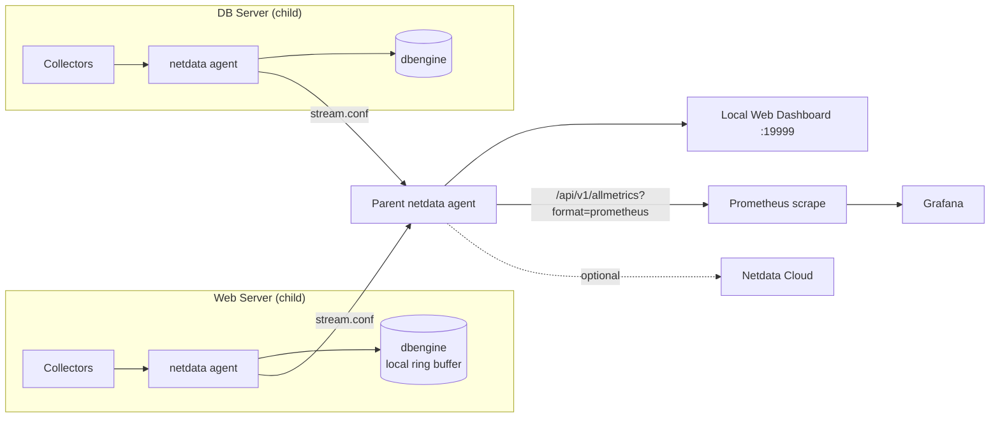

# Real-Time Monitoring with Netdata

## Overview

Netdata is an open-source, per-second monitoring agent that auto-discovers hundreds of metrics on a Linux host — CPU, memory, disks, network, systemd units, containers, and application exporters — with essentially zero configuration and a live, zoomable web dashboard. It complements pull-based tools like [Metrics-with-Prometheus](Metrics-with-Prometheus.md): Netdata excels at high-resolution, real-time troubleshooting on a single box (or fleet, via streaming/Parents), while Prometheus excels at long-term storage, alerting rules-as-code, and cross-service aggregation — the two are commonly wired together, with Netdata exposing a `/api/v1/allmetrics?format=prometheus` endpoint that Prometheus scrapes.

> [!TIP]
> **When to reach for Netdata**
> Use Netdata for "what is happening on this server right now" — diagnosing a spike, a stuck process, an I/O storm — in the seconds it takes to open the dashboard. Use Prometheus/Grafana for historical trends, SLOs, and alerting across a fleet. Running both is normal: Netdata as the per-second local agent, Prometheus as the long-term time-series backend.

## Concepts

| Concept | Description |
|---|---|
| **Collector (plugin)** | A module that gathers metrics from a source (proc filesystem, systemd, nginx, MySQL, Docker, etc.). Netdata ships 800+ collectors, auto-enabled when the corresponding service is detected. |
| **Per-second resolution** | Metrics are sampled and stored every 1 second by default (configurable), vs. the 15-60s scrape intervals typical of Prometheus — critical for catching short-lived spikes. |
| **dbengine** | Netdata's default on-disk, compressed, tiered time-series storage — retains high-resolution data for days/weeks with a small memory footprint. |
| **Health alarms** | Declarative threshold/anomaly rules (`.conf` files) evaluated locally in real time; can notify via email, Slack, PagerDuty, webhook, etc. |
| **Streaming** | A child agent pushes its collected metrics in real time to a Parent agent, which stores and/or re-streams them — used for centralizing many hosts without per-host storage overhead. |
| **Netdata Cloud** | Optional SaaS layer providing a unified multi-node dashboard, alert routing, and long-term views; the local agent works fully standalone without it. |
| **ML anomaly detection** | Built-in unsupervised models flag anomalous metric behavior per dimension, surfaced as an "Anomaly Rate" overlay — no manual threshold tuning required. |

## Architecture



## Installation

> [!WARNING]
> **Kickstart script**
> The official one-line installer (`kickstart.sh`) is convenient but fetches and executes a remote script as root. Review it, or use distro packages/static builds for change-controlled environments.

```bash
# Official kickstart (RHEL-family and Debian-family — auto-detects distro)
wget -O /tmp/netdata-kickstart.sh https://get.netdata.cloud/kickstart.sh
sh /tmp/netdata-kickstart.sh --non-interactive
```

```bash
# Debian/Ubuntu — native repo package (alternative, no curl-pipe-bash)
curl -s https://packagecloud.io/install/repositories/netdata/netdata/script.deb.sh | sudo bash
sudo apt install -y netdata
```

```bash
# RHEL/CentOS/Rocky/Alma — native repo package
curl -s https://packagecloud.io/install/repositories/netdata/netdata/script.rpm.sh | sudo bash
sudo dnf install -y netdata
```

```bash
# Enable and start the service (systemd, both families)
sudo systemctl enable --now netdata
sudo systemctl status netdata
```

## Configuration

Netdata's main config lives at `/etc/netdata/netdata.conf`. Always edit via `edit-config` so you get a versioned stanza-commented template rather than editing the shipped defaults directly.

```bash
cd /etc/netdata
sudo ./edit-config netdata.conf
```

```ini
# /etc/netdata/netdata.conf — key global tuning knobs
[global]
    hostname = webserver01
    update every = 1                 ; per-second sampling
    memory mode = dbengine           ; on-disk compressed retention
    page cache size = 32             ; MiB, in-memory index cache
    dbengine multihost disk space = 2048  ; MiB retained on disk

[web]
    bind to = 127.0.0.1:19999        ; restrict to localhost; front with a reverse proxy for remote access
    allow connections from = localhost 10.0.0.0/8
```

```ini
# /etc/netdata/health_alarm_notify.conf — enable a notification channel (example: Slack)
SEND_SLACK="YES"
SLACK_WEBHOOK_URL="https://hooks.slack.com/services/T000/B000/XXXXXXXXXXXX"
DEFAULT_RECIPIENT_SLACK="#alerts"
```

```ini
# /etc/netdata/stream.conf on the CHILD — where to send metrics
[stream]
    enabled = yes
    destination = 10.0.0.5:19999
    api key = 11111111-2222-3333-4444-555555555555
```

```ini
# /etc/netdata/stream.conf on the PARENT — accept streamed metrics
[11111111-2222-3333-4444-555555555555]
    enabled = yes
    allow from = 10.0.0.0/8
    default memory mode = dbengine
```

After any config change, restart the agent:

```bash
sudo systemctl restart netdata
```

## Commands

| Task | Command |
|---|---|
| Check agent version | `netdata -V` |
| Validate config syntax before restart | `netdata -W set2file /etc/netdata/netdata.conf` |
| Tail the agent's own log | `sudo journalctl -u netdata -f` |
| List active alarms via API | `curl -s http://127.0.0.1:19999/api/v1/alarms?all` |
| Pull raw chart data (JSON) | `curl -s 'http://127.0.0.1:19999/api/v1/data?chart=system.cpu&after=-60'` |
| Export current metrics in Prometheus format | `curl -s http://127.0.0.1:19999/api/v1/allmetrics?format=prometheus` |
| Reload health config without restart | `curl -s http://127.0.0.1:19999/api/v1/health/reload` |
| Test a notification channel | `sudo /usr/libexec/netdata/plugins.d/alarm-notify.sh test` |
| Uninstall cleanly | `sh /tmp/netdata-kickstart.sh --uninstall` |

## Examples

```yaml
# prometheus.yml — scrape a Netdata Parent as a Prometheus target
scrape_configs:
  - job_name: 'netdata'
    metrics_path: '/api/v1/allmetrics'
    params:
      format: ['prometheus']
      source: ['average']   # or 'as-collected' for raw per-second values
    static_configs:
      - targets: ['10.0.0.5:19999']
    scrape_interval: 15s
```

```conf
# /etc/netdata/health.d/custom-cpu.conf — custom health alarm
template: cpu_high_usage
      on: system.cpu
   class: Utilization
    type: System
component: CPU
    calc: 100 - $idle
   units: %
   every: 10s
    warn: $this > 80
    crit: $this > 95
   delay: down 5m multiplier 1.5 max 1h
    info: total CPU utilization
      to: sysadmin
```

## Best Practices

- Bind the web UI to `127.0.0.1` and front it with an authenticated reverse proxy (nginx/Apache Basic Auth or SSO) rather than exposing port 19999 directly to the internet.
- Use the streaming (Parent/child) topology for fleets of more than a handful of hosts — it centralizes retention and avoids per-host disk growth on ephemeral instances.
- Tune `dbengine multihost disk space` and `page cache size` to match available disk/RAM; defaults are conservative but per-second data across many charts adds up on small hosts.
- Disable collectors you don't need (`go.d.conf`, `python.d.conf`) to reduce CPU overhead further on very constrained systems.
- Pair Netdata's real-time alarms (seconds-level detection) with Prometheus/Alertmanager for durable, cross-host alert routing and on-call escalation.
- Version-control your `health.d/*.conf` custom alarms and `stream.conf` API keys the same way you version other infrastructure config.

## Security Considerations

- **Unauthenticated dashboard exposure** (CIS-aligned: minimize exposed services) — the default install listens on all interfaces; restrict `bind to` in `netdata.conf` and require authentication at a reverse proxy, per the principle of least exposure.
- **Streaming API keys** in `stream.conf` are effectively bearer credentials — store with `0640` root:netdata permissions and rotate them like any shared secret; never commit them to a public repo.
- **Registry/Cloud opt-in** — if you don't use Netdata Cloud, set `[registry] enabled = no` to avoid the agent registering with the public Netdata registry service.
- **Least privilege** — the agent runs as the unprivileged `netdata` user by default; avoid running collectors as root unless a specific plugin (e.g., certain eBPF collectors) documents it as required, and audit `/etc/netdata/` file ownership periodically.
- **Patch cadence** — track Netdata release notes for CVEs (the agent has had historical local-privilege and web-server issues); prefer distro packages or the kickstart's `--stable-channel` for predictable upgrade timing over ad-hoc `--nightly-channel` builds in production.
- **Firewall the streaming port** (19999, and any custom stream port) to only known Parent/child IPs, consistent with your host firewall baseline (`firewalld`/`ufw`/`nftables`).

> [!NOTE]
> **📸 Screenshot**
> _Capture: the Netdata local web dashboard (`http://127.0.0.1:19999`) showing the System Overview row (CPU, RAM, Disk I/O, Network) with the per-second graphs actively updating._

## References

- Netdata official documentation: https://learn.netdata.cloud/docs
- Netdata GitHub repository: https://github.com/netdata/netdata
- Netdata Prometheus exporter guide: https://learn.netdata.cloud/docs/exporting/prometheus
- Netdata streaming and replication guide: https://learn.netdata.cloud/docs/streaming

## Related Notes

- [Metrics-with-Prometheus](Metrics-with-Prometheus.md) — long-term time-series storage and alerting to pair with Netdata's per-second agent
- [Linux Administration & Server Hardening](../Readme.md) — course hub and map of content
