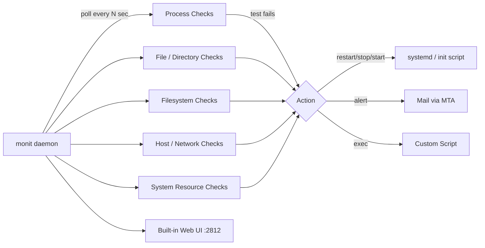

# Service Monitoring with Monit

## Overview

Monit is a lightweight, single-binary process supervision and monitoring tool that watches services, files, filesystems, and hosts, then takes corrective action — usually restarting a failed process — without needing a central server or database. It fills a different niche than [Infrastructure-Monitoring-with-Nagios-and-Zabbix](Infrastructure-Monitoring-with-Nagios-and-Zabbix.md): those tools are built for fleet-wide metrics collection and alerting across many hosts, while Monit is a self-contained watchdog that runs *on* the host it protects and can act autonomously even if the network or a central monitoring server is down. It is commonly paired with systemd or run standalone on small VPS instances, edge nodes, and legacy servers where a full Nagios/Zabbix/Prometheus stack is overkill.

> [!TIP]
> **When to reach for Monit**
> Use Monit when you want simple, host-local "detect and self-heal" behavior (restart a crashed daemon, alert on high CPU, flag a full disk) with almost no operational overhead. Use Nagios/Zabbix/Prometheus when you need centralized dashboards, historical trending, and alerting across a fleet.

## Concepts

| Concept | Description |
|---|---|
| `monitrc` | Monit's single configuration file (`/etc/monitrc` or `/etc/monit/monitrc`), controls global settings and all check definitions |
| Check | A monitored entity: `process`, `file`, `directory`, `filesystem`, `host`, `system`, `program` |
| Test | A condition evaluated during a check cycle (e.g., `if failed port 80`, `if cpu > 80%`) |
| Action | What Monit does when a test fails: `restart`, `stop`, `start`, `exec`, `alert` |
| Cycle | Poll interval set by `set daemon <seconds>`, default checks run every cycle |
| M/Monit | Optional commercial central console for aggregating multiple Monit instances (not required for local use) |
| httpd | Monit's built-in web UI / API server, disabled by default |

## Architecture



## Installation

**RHEL / Rocky / AlmaLinux (EPEL):**

```bash
sudo dnf install -y epel-release
sudo dnf install -y monit
sudo systemctl enable --now monit
```

**Debian / Ubuntu:**

```bash
sudo apt update
sudo apt install -y monit
sudo systemctl enable --now monit
```

Verify installation and syntax:

```bash
monit -V              # version
sudo monit -t         # test monitrc syntax before reloading
```

## Configuration

### monitrc structure

`monitrc` is split logically into global settings, the (optional) web UI, and `include` statements pulling per-service files from a drop-in directory — mirroring Apache/Nginx `conf.d` style for maintainability.

```conf
# /etc/monit/monitrc

# --- Global daemon settings ---
set daemon 60                    # check services every 60 seconds
    with start delay 30          # wait 30s after monit starts before first check
set log /var/log/monit.log

set idfile /var/lib/monit/id
set statefile /var/lib/monit/state

# --- Alerting (requires local MTA or relay) ---
set mailserver smtp.example.com port 587
    username "monit@example.com" password "CHANGE_ME"
    using tlsv12
set alert ops-team@example.com

set mail-format {
    from: monit@$HOST
    subject: [Monit] $EVENT on $HOST at $DATE
    message: $EVENT Service $SERVICE
             $DESCRIPTION
}

# --- Built-in web UI ---
set httpd port 2812 and
    use address 127.0.0.1        # bind localhost only; reverse-proxy for remote access
    allow admin:"CHANGE_ME"
    allow @monit-admins           # allow a PAM/system group

# --- Per-service configs ---
include /etc/monit/conf.d/*.conf
```

> [!WARNING]
> **Never bind the web UI to `0.0.0.0` without TLS**
> The built-in httpd ships with HTTP Basic Auth over plaintext by default. Bind to `127.0.0.1` and front it with an authenticated, TLS-terminating reverse proxy (Nginx/Apache) — see [Binding-with-Type(SSL-TLS)](../Apache-Web-Server/Binding-with-Type(SSL-TLS).md) — or restrict with `allow` host ACLs and `set httpd ... ssl { enable, pemfile }`.

### Process check (with automatic restart)

```conf
# /etc/monit/conf.d/nginx.conf
check process nginx with pidfile /run/nginx.pid
    start program = "/usr/bin/systemctl start nginx" with timeout 60 seconds
    stop program  = "/usr/bin/systemctl stop nginx"
    if failed host 127.0.0.1 port 80 protocol http
        with timeout 10 seconds
        then restart
    if cpu > 80% for 5 cycles then alert
    if children > 250 then restart
    if 5 restarts within 5 cycles then timeout   # circuit breaker: stop flapping
    group webserver
```

### File check (integrity / tamper detection)

```conf
# /etc/monit/conf.d/sudoers.conf
check file sudoers_file path /etc/sudoers
    if changed checksum then alert
    if changed permission then alert
    if changed uid or gid then alert
```

### Host check (reachability of a remote dependency)

```conf
# /etc/monit/conf.d/db-backend.conf
check host db01 with address 10.0.1.50
    if failed
        port 5432 protocol pgsql
        with timeout 5 seconds
        for 3 cycles
    then alert
    if failed ping then alert
```

### Filesystem and system checks

```conf
check filesystem rootfs with path /
    if space usage > 85% for 3 cycles then alert
    if inode usage > 90% then alert

check system $HOST
    if loadavg (5min) > 4 then alert
    if memory usage > 90% for 3 cycles then alert
    if cpu usage (user) > 90% for 3 cycles then alert
```

## Commands

| Command | Purpose |
|---|---|
| `monit -t` | Test `monitrc` syntax without applying |
| `sudo monit reload` | Reload configuration without restarting the daemon |
| `monit status` | Show status of all monitored checks |
| `monit summary` | Compact one-line-per-check overview |
| `monit start <name>` | Start (and begin monitoring) a specific check |
| `monit stop <name>` | Stop monitoring and stop the process |
| `monit restart <name>` | Force a restart of a monitored process |
| `monit monitor <name>` | Re-enable monitoring after `unmonitor` |
| `monit unmonitor <name>` | Suspend monitoring without stopping the service |
| `monit validate` | Force an immediate check cycle |
| `monit quit` | Stop the Monit daemon |

```bash
sudo monit -t && sudo monit reload
monit status
monit summary
sudo monit restart nginx
```

## Examples

Alert-only file watch plus a custom recovery script triggered via `exec`:

```conf
check program disk_cleanup with path "/usr/local/bin/clear-tmp.sh"
    every "0 3 * * *"                # cron-style schedule
    if status != 0 then alert

check filesystem varlog with path /var/log
    if space usage > 90%
        then exec "/usr/local/bin/rotate-and-alert.sh"
```

Web UI access over SSH tunnel for remote admins (no public exposure):

```bash
ssh -L 2812:127.0.0.1:2812 admin@server.example.com
# then browse http://127.0.0.1:2812 locally
```

> [!NOTE]
> **📸 Screenshot**
> _Capture: the Monit web UI (`http://127.0.0.1:2812`) status dashboard showing green/red service indicators for a process, filesystem, and host check._

## Best Practices

- Always run `monit -t` before `monit reload` — a broken `monitrc` silently keeps the old config running (or fails to start).
- Use `for N cycles` on tests to avoid flapping on transient blips (a single slow response shouldn't trigger a restart).
- Add `if N restarts within M cycles then timeout` as a circuit breaker so Monit stops thrashing a service that won't stay up, and alert on that instead.
- Group related checks (`group webserver`) to `start`/`stop`/`monitor` them together.
- Store secrets (SMTP password, web UI password) with `monitrc` permissions locked to `0700` root-only — Monit refuses to run otherwise.
- Prefer `include /etc/monit/conf.d/*.conf` drop-ins over one giant file for maintainability and version control.
- Pair Monit's local self-healing with fleet-level visibility from [Infrastructure-Monitoring-with-Nagios-and-Zabbix](Infrastructure-Monitoring-with-Nagios-and-Zabbix.md) rather than treating it as a replacement.

## Security Considerations

- **File permissions (CIS)**: `monitrc` must be owned by `root:root` with mode `0700`/`0600` — it contains SMTP and web UI credentials in plaintext. Monit enforces this at startup and refuses insecure permissions.

  ```bash
  sudo chown root:root /etc/monit/monitrc
  sudo chmod 700 /etc/monit/monitrc
  ```

- **Web UI exposure**: bind `set httpd` to `127.0.0.1` by default; if remote access is required, enable `ssl { enable, pemfile: /etc/monit/certs/monit.pem }` and restrict with `allow` host/network ACLs — never expose Basic Auth over plaintext HTTP to the internet (aligns with NIST SP 800-53 SC-8, transmission confidentiality).
- **Least privilege actions**: scope `start program`/`stop program` to specific systemd unit calls rather than arbitrary shell — avoid giving Monit (running as root) generic script hooks that could be tampered with via a writable path.
- **Credential rotation**: rotate the web UI and SMTP passwords in `monitrc` on the same cadence as other service-account credentials; don't reuse the root password.
- **Alert integrity**: use TLS (`using tlsv12`) for outbound mail relays so alert content and credentials aren't sent in cleartext over the network.
- **Audit trail**: `set log /var/log/monit.log` and forward it to centralized logging ([Infrastructure-Monitoring-with-Nagios-and-Zabbix](Infrastructure-Monitoring-with-Nagios-and-Zabbix.md) or a SIEM) so restart/alert events aren't lost if the host is compromised or wiped.

## Troubleshooting

| Symptom | Cause | Fix |
|---|---|---|
| `monit: parse error near ...` on start | Syntax error in `monitrc` or drop-in file | Run `monit -t` for the exact line/column, fix, retest |
| `monit reload` has no effect | Reload only re-reads valid syntax; a broken file is ignored | `monit -t` first; check `/var/log/monit.log` for load errors |
| "Permission on monitrc too open" | File mode not `0700`/`0600` or wrong owner | `chown root:root` + `chmod 700 /etc/monit/monitrc` |
| Process check never restarts | Wrong `pidfile` path or PID file stale after crash | Confirm actual PID file path used by the service unit; some daemons don't write one — use `matching` process-name checks instead |
| Web UI unreachable remotely | Bound to `127.0.0.1` (correct, by design) | Use an SSH tunnel or a TLS reverse proxy instead of rebinding to `0.0.0.0` |
| No alert emails sent | `set mailserver` misconfigured or MTA/relay unreachable | Test with `sendmail`/`swaks` directly; check `monit.log` for SMTP errors |
| Service restarts in a loop | Underlying crash cause not fixed; no circuit breaker set | Add `if N restarts within M cycles then timeout` and investigate root cause via service logs |

## References

- Monit official manual: https://mmonit.com/monit/documentation/monit.html
- Monit wiki (example configs): https://bitbucket.org/tildeslash/monit/wiki/Home
- `man monit` / `man monitrc`

## Related Notes

- [Infrastructure-Monitoring-with-Nagios-and-Zabbix](Infrastructure-Monitoring-with-Nagios-and-Zabbix.md) — fleet-wide monitoring vs. Monit's host-local watchdog role
- [Binding-with-Type(SSL-TLS)](../Apache-Web-Server/Binding-with-Type(SSL-TLS).md) — TLS reverse-proxy pattern applicable to securing Monit's web UI
- [Linux Administration & Server Hardening](../Readme.md) — course hub and map of content
