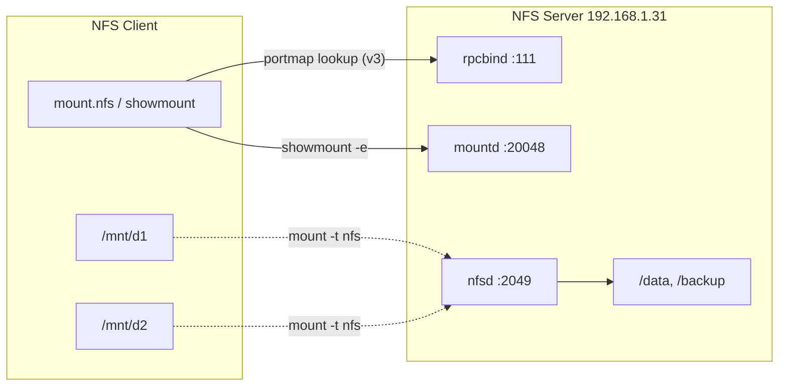

# NFS Client Setup and Mounting

## Overview

This note covers the **client side** of a Network File System deployment: installing the client tooling, discovering the exports a server offers, mounting shares by hand for testing, and wiring up persistent mounts through `/etc/fstab`. It assumes an NFS server is already exporting one or more directories — see [Network-File-System-(NFS)-Server](Network-File-System-(NFS)-Server.md) for the server build and [NFS-Exports-Configuration](NFS-Exports-Configuration.md) for how the export table is defined.

The examples target an NFS server at `192.168.1.31`. Replace that address (and the export paths) with the values from your own environment.

> [!NOTE]
> NFS access is governed by **UID/GID mapping**, not by a login prompt. A client user with UID `1000` is treated on the server as whatever UID `1000` maps to there. Keep this in mind when a file "belongs to the wrong user" after mounting — the numbers matched, the names did not.

## Concepts

| Term | Role on the client |
| --- | --- |
| `rpcbind` | RPC port mapper; NFSv3 clients use it to locate `mountd`/`statd` on the server |
| `nfs-common` / `nfs-utils` | Provides `mount.nfs`, `showmount`, `umount.nfs` and supporting daemons |
| `showmount` | Queries a server's `mountd` to list available exports |
| Mount point | A local, existing empty directory (e.g. `/mnt/d1`) where the remote share is attached |
| `/etc/fstab` | Declarative mount table applied at boot and by `mount -a` |

### How a mount is established

1. The client resolves the server hostname/IP and (for NFSv3) queries `rpcbind` on port `111` to discover the dynamic port of `mountd`.
2. `mount.nfs` sends a mount request to `mountd`, which validates the client against the server's export table.
3. On success, the kernel attaches the remote filesystem at the local mount point and subsequent I/O flows directly to `nfsd` on port `2049`.

> [!NOTE]
> NFSv4 collapses this into a single well-known port (`2049`) and no longer needs `rpcbind`, which is why modern deployments prefer it. NFSv3 still relies on the RPC port-mapper trio.

## Architecture



## Configuration

### Install NFS client utilities

Install the required packages for your distribution.

**Debian/Ubuntu:**

```bash
apt install rpcbind nfs-common
```

> Installs the required RPC service (`rpcbind`) and NFS tools (`nfs-common`).

**RHEL/CentOS:**

```bash
yum install rpcbind nfs-common
```

> Same functionality for RHEL/CentOS systems.

Install `showmount` to view exports from an NFS server (optional):

```bash
yum install nfs-utils
```

## Commands

### Discover available NFS shares

Check available exports from the server:

```bash
showmount -e 192.168.1.31
```

> Lists the directories exported by the NFS server at `192.168.1.31`.

> [!NOTE]
> **📸 Screenshot**
> _Capture: Terminal output of showmount -e listing the /data and /backup exports offered by the server at 192.168.1.31 along with the client subnets allowed to mount them_

### Mount NFS shares manually

Mount the root of the NFS server (not recommended in production):

```bash
mount -t nfs 192.168.1.31:/ /mnt -o nolock
```

Unmount the share:

```bash
umount /mnt
```

Create local directories for mounting multiple shares:

```bash
mkdir /mnt/d1 /mnt/d2
```

Mount specific shares:

```bash
mount -t nfs 192.168.1.31:/data /mnt/d1/
```

```bash
mount -t nfs 192.168.1.31:/backup /mnt/d2/
```

Check disk usage and mounts:

```bash
df -h
```

Unmount the shares:

```bash
umount /mnt/d1
```

```bash
umount /mnt/d2
```

### More mount examples

Various mount syntax variations for NFS:

```bash
mount -t nfs 192.168.1.31:/var/armour_share/ /mnt -o nolock
```

```bash
mount -t nfs -o vers=3,nolock 192.168.1.31:/data /mnt/d1/
```

## Persistent Mounts via `/etc/fstab`

Edit the file to configure persistent NFS mounts:

```bash
vim /etc/fstab
```

Add the following line to mount `/data` on boot:

```text
192.168.1.31:/data/ /mnt/d1 nfs rw,sync,hard,intr 0 0
```

Apply and verify:

```bash
mount -a
```

```bash
df -h
```

The common mount options used above:

| Option | Effect |
| --- | --- |
| `rw` | Mount read-write |
| `sync` | Commit writes to the server before returning to the application |
| `hard` | Retry indefinitely if the server is unreachable (protects data integrity) |
| `intr` | Allow interrupting a hung hard mount (legacy; ignored on modern kernels) |
| `nolock` | Disable NLM file locking (useful when `statd`/`rpcbind` are unavailable) |
| `vers=3` | Force NFS protocol version 3 |

> [!TIP]
> Prefer `hard` over `soft` for anything holding real data — a `soft` mount can return I/O errors and silently corrupt writes when the server blips. Add `_netdev` in `/etc/fstab` so systemd waits for the network before attempting the mount.

## Examples

### Test file access on the client

Navigate to a mounted directory and test copying files:

```bash
cd /mnt
ls
```

Switch user (optional):

```bash
su - armour
```

Create a subdirectory and copy files:

```bash
cd /mnt/data
mkdir d1
cp -v /etc/passwd d1
```

Repeat for another share:

```bash
cd /mnt/backup
mkdir d1
cp -v /etc/passwd d1
```

## Best Practices

- Create and verify the local mount point **before** mounting; mounting over a non-empty directory hides its contents.
- Use `/etc/fstab` (with `_netdev`) or a `systemd` `.mount`/`.automount` unit for anything that must survive a reboot.
- Pin the protocol version (`vers=4.2` where supported) so behavior is deterministic across kernel upgrades.
- Use `autofs` for shares that are only needed occasionally — it mounts on access and unmounts when idle, reducing hung-mount exposure.

## Security Considerations

> [!WARNING]
> Plain NFS (AUTH_SYS) trusts the client's reported UID/GID with **no cryptographic authentication**. Any host allowed to mount can present arbitrary UIDs. Treat an NFS share as trusted only within a trusted network segment.

- Never mount an untrusted server's root export; a hostile server can serve setuid binaries and device nodes. Mount with `nosuid` and `nodev` where the workflow allows.
- For real access control and on-the-wire encryption, use **NFSv4 with Kerberos** (`sec=krb5p`) — see [NFS-with-Kerberos](NFS-with-Kerberos.md).
- Restrict which servers a host will talk to at the firewall; do not leave `rpcbind` (port `111`) reachable from untrusted networks.
- Harden the overall deployment (client and server) against the common NFS abuse paths — see [NFS-Security-Hardening](NFS-Security-Hardening.md).

## Troubleshooting

| Symptom | Likely cause | Check |
| --- | --- | --- |
| `clnt_create: RPC: Program not registered` | `nfs-server`/`rpcbind` down on server | `showmount -e <server>` |
| Mount hangs forever | Firewall dropping `2049`/`111`, or `hard` mount to a dead server | `firewall-cmd --list-all` on server |
| `access denied by server` | Client IP not in the export's client spec | Review `/etc/exports` on server |
| Files owned by `nobody`/`nfsnobody` | ID mapping / `all_squash` in effect | Compare UIDs, check `idmapd` domain |

Re-check that the server is exporting and reachable:

```bash
showmount -e 192.168.1.31
```

Re-apply the `/etc/fstab` entries after fixing a mount:

```bash
mount -a
```

## References

- `man 5 nfs` — NFS mount options and `fstab` semantics.
- `man 8 mount.nfs` — the NFS mount helper.
- Red Hat Enterprise Linux, *Managing File Systems* — Mounting NFS shares.
- CIS Benchmarks — recommendations for `nosuid`/`nodev` on remote mounts.

## Related

- [Network-File-System-(NFS)-Server](Network-File-System-(NFS)-Server.md) — the server side this client mounts
- [NFS-Exports-Configuration](NFS-Exports-Configuration.md) — how the server's export table is defined
- [NFS-Mount-Options](NFS-Mount-Options.md) — full reference for client mount options
- [NFS-Security-Hardening](NFS-Security-Hardening.md) — hardening NFS clients and servers
- [NFS-with-Kerberos](NFS-with-Kerberos.md) — authenticated, encrypted NFSv4 mounts
- NFS-Enumeration — enumerating NFS exports from an attacker's view
- [Linux Administration & Server Hardening](../Readme.md) — Linux administration & server hardening hub
